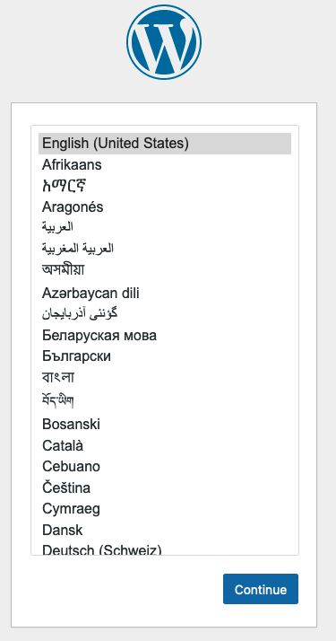

The [Docker](https://www.docker.com/) application makes it easier to develop, build, run, and share integrated applications. It uses virtualization techniques to package applications inside *containers*. The [Docker Compose](https://docs.docker.com/compose/) plug-in expands these capabilities, allowing users to instantaneously deploy multiple containers with a single command. This guide provides some background on Docker Compose and explains how to install and use it.

## What is Docker?

The Docker application allows for the standardization and automation of production-ready computing environments. For this reason, it is a widely used *Infrastructure as a Service* (IaaS) application, especially in cloud computing.

Docker deploys applications inside containers. Each container is based on a Docker image, although an image might contain multiple containers. A container packages a software application, such as a database or web server, inside a virtualized environment. This package includes everything required to run the application, including libraries, configurations, and supporting utilities. The Docker Engine component allows users to host, manage, and run the containers.

Docker containers are lightweight, efficient, and can run on many different operating systems. Containers are isolated from each other and generally only consist of a single application. To deploy a complete system solution containing several applications, multiple containers are typically required. In the original Docker application, each container must be handled separately, making it challenging to coordinate multi-container deployments. For more information on Docker, see the [Linode Introduction to Docker](/docs/guides/introduction-to-docker/).

## What is Docker Compose?

Docker Compose V2 is part of the Docker software suite. The V2 version of Docker streamlines expands and supersedes the original V1 version. It uses configuration files to define and build multi-component applications. A configuration file, written in YAML, typically defines the complete architecture of the system. It specifies the applications to install, along with their configuration and settings. Docker Compose can also provide storage, networking, and configuration settings for the system.

Docker Compose allows users to simultaneously build, deploy, stop, or delete multiple containers. Additional commands provide access to the service logs or the container statuses. Compose commands apply to all containers and cannot be applied to a single container instance. Docker Compose V2 is available either as part of the Docker Desktop GUI suite or as a plug-in for Docker Engine/CLI.

Docker Compose V2 allows users to quickly and easily set up a computing environment from the command line. This means it is highly useful in development and test environments, as well as self-managed single-Linode deployments. Some additional benefits of Docker Compose V2 include the following:

- Each project is isolated from other projects on the same system. This prevents environments from interfering with each other.
- It caches configurations. When a service restarts, Docker Compose only re-creates containers that have changed since the last time the containers were launched.
- It preserves any data inside the volumes. Docker Compose automatically recovers containers from earlier runs and copies the data to the new containers.
- It includes support for variables and for porting a solution to a different environment.

The current version of Docker Compose is Docker Compose V2. Support for Docker Compose V1 ends in June 2023, so V1 users should move to Compose V2 as soon as possible. Docker Compose V2 integrates the `compose` command, which replaces the V1 `docker-compose` feature, directly into the Docker CLI and Docker Engine. The `docker compose` command is designed as a drop-in replacement for `docker-compose`. This means `docker-compose` V1 commands map directly to `docker compose` V2 command without further modifications. However, some redundant commands have been dropped while new commands have been added. Compose V1 was written in Python, but Compose V2 is written in Go.

### What is the Docker Compose Specification?

The [Docker Compose file specification](https://docs.docker.com/compose/compose-file/) explains how to construct a Docker Compose V2 configuration file. This file is written in YAML and includes directives specifying how to build and run a set of Docker containers. A typical Compose file must include at least one service, which maps to a Docker container. However, most Compose V2 configurations include multiple services. The Compose file can also include definitions for storage systems, configurations, networking components, and sensitive system secrets.


The Docker Compose V2 file format differs from the one used in Compose V1. Compose V1 permitted file formats V2 and V3, so Compose V1 configuration files had to specify the file format to use. Confusingly, these file formats have no relation to the Docker Compose version or release number. The file format is now standardized in Docker Compose V2, so V2 configuration files no longer include this information.


The Docker Compose architecture allows a system to host multiple projects. Each project is placed in a separate directory and includes its own `docker-compose.yml` file. This file consists of multiple components, but only the `services` section is required. The other sections are optional. Here is a list of the main parts of a `docker-compose.yml` file.

- **Services**: This mandatory item defines a computing resource. Each item inside the `services` section is an application that can be scaled independently. A service references a Docker image and maps to one or more containers. Some examples of services might include MySQL, NGINX, Redis, and WordPress.
- **Volumes**: A volume defines a path where the application can store data. While `services` often define their own storage space, a volume can allocate shared storage for multiple services.
- **Networks**: Networks allow services to communicate with each other or to external networks. By default, Docker Compose creates a single network for use by all services. This section can be used to define connections to other networks or application-specific networks. A network can be accessed using the same hostname as the container name.
- **Configs**: This defines a permanent storage area for application configurations.
- **Secrets**: Secrets store sensitive configuration attributes more securely. They are typically protected through the use of keys or certificates.

Each component is defined using a set of parameters. For example, each entry in `services` must define an `image` to use. It might also optionally define web parameters, service ports, configuration commands, and environmental variables. For complete information on how to construct a `docker-compose.yml` file, consult the [Docker Compose specification](https://docs.docker.com/compose/compose-file/).

Some applications also require a *Dockerfile*. This file explains how to build an application in a platform-agnostic manner. However, many applications only use pre-built Docker images and do not require a Dockerfile. For more information on building an application using a Dockerfile in conjunction with Docker Compose, see the [Docker Compose documentation](https://docs.docker.com/compose/gettingstarted/#step-2-create-a-dockerfile).

## Before You Begin

1.  If you have not already done so, create a Linode account and Compute Instance. See our [Getting Started with Linode](/docs/guides/getting-started/) and [Creating a Compute Instance](/docs/guides/creating-a-compute-instance/) guides.

1.  Follow our [Setting Up and Securing a Compute Instance](/docs/guides/set-up-and-secure/) guide to update your system. You may also wish to set the timezone, configure your hostname, create a limited user account, and harden SSH access.


The steps in this guide are written for non-root users. Commands that require elevated privileges are prefixed with `sudo`. If you are not familiar with the `sudo` command, see the [Linux Users and Groups](/docs/tools-reference/linux-users-and-groups/) guide.


## How to Install Docker Compose and Docker Engine

There are two methods of installing Docker Compose. Docker Compose is usually installed as a plug-in. The Compose plug-in requires Docker Engine and Docker CLI, and is tightly integrated with these components. The second approach is to install Docker Desktop, an integrated GUI interface that includes Docker Compose. Docker Desktop is beyond the scope of this guide. See the [Docker Desktop documentation](https://docs.docker.com/desktop/install/linux-install/) for more information about this option.

This guide focuses on how to install the Docker Compose plug-in. Docker Engine must be installed alongside Docker Compose before the plug-in can be used. This guide is geared toward Ubuntu 22.04 LTS users but is generally applicable to all Linux distributions. Exact instructions for other supported Platforms can be found on the [Docker Engine installation page](https://docs.docker.com/engine/install/).

To install both Docker Engine and Docker Compose, follow these steps.

1.  Ensure the system is up to date using the below. Reboot the system if necessary.

    ```command
    sudo apt-get update -y && sudo apt-get upgrade -y
    ```

1.  Remove any old versions of Docker or related components. These might not be compatible with Docker Compose V2.

    
    If an earlier version of Docker was previously installed on the system, consult the instructions to [Uninstall Docker](https://docs.docker.com/engine/install/ubuntu/#uninstall-docker-engine). It is important to remove any old containers and volumes to avoid future conflicts.
    

    ```command
    sudo apt-get remove docker docker-engine docker.io containerd runc
    ```

1.  To install Docker Engine, some additional components are required. Install them using `apt`. Some of these packages might already be installed on the system.

    ```command
    sudo apt-get install ca-certificates curl gnupg lsb-release
    ```

1.  Add the official *GNU Privacy Guard* (GPG) Key to validate the installation.

    ```command
    sudo mkdir -m 0755 -p /etc/apt/keyrings
    curl -fsSL https://download.docker.com/linux/ubuntu/gpg | sudo gpg --dearmor -o /etc/apt/keyrings/docker.gpg
    ```

1.  Add the Docker repository to the list of `apt` packages.

    ```command
    echo "deb [arch=$(dpkg --print-architecture) signed-by=/etc/apt/keyrings/docker.gpg] https://download.docker.com/linux/ubuntu \
    $(lsb_release -cs) stable" | sudo tee /etc/apt/sources.list.d/docker.list > /dev/null
    ```

1.  Update the list of `apt` packages.

    ```command
    sudo apt-get update
    ```

1.  Install the latest release of Docker Engine, Docker CLI, `containerd`, and other related components.

    ```command
    sudo apt-get install docker-ce docker-ce-cli containerd.io docker-buildx-plugin docker-compose-plugin
    ```

1.  Run the `hello-world` container to ensure Docker is installed correctly. Docker downloads the appropriate container and runs it.

    ```command
    sudo docker run hello-world
    ```

    If everything is installed correctly, Docker displays the message as as shown in the output below.

    ```output
    Hello from Docker!
    This message shows that your installation appears to be working correctly.
    ```

1.  Ensure the Docker Compose plug-in is working properly. Run the command `docker compose version` and verify the release number. If the release begins with `v2`, Docker Compose V2 is correctly installed.

    ```command
    docker compose version
    ```

    ```output
    Docker Compose version v2.16.0
    ```

## How to Create a Docker Compose YAML File

Docker Compose examines the `docker-compose.yml` file to determine the containers to build and run. Each project must include a `docker-compose.yml` file inside the project directory. It is not possible to run Docker Compose without this file. For extremely complex systems, multiple `docker-compose` files can be combined. Items are overridden or appended depending on the file hierarchy. But for most straightforward applications, a single `docker-compose` file should suffice.

The following example demonstrates how to build a `docker-compose.yml` file for a straightforward WordPress installation. The file includes WordPress and database services along with shared storage directories. To create the Docker Compose YAML file, follow these steps.


This example is taken from the [Docker Sample Projects](https://docs.docker.com/compose/samples-for-compose/). It might be helpful to use one of these sample files as a starting point for your own project.


1.  Create a directory for the new project and change it to the directory. For this example, the directory is named `wordpress`.

    ```command
    mkdir wordpress
    cd wordpress
    ```

1.  Create a file named `docker-compose.yml`.

    ```command
    vi docker-compose.yml
    ```

1.  First, add the `services` section. Add a service named `mariadb`. This service defines the database container.

    ```file {title="~/wordpress/docker-compose.yml"}
    services:
      mariadb:
    ```

1.  Define the parameters for the `mariadb` service. The following parameters are used:

    - The `command` parameter supplies command line arguments for the application.
    - The `image` tells Docker Compose which image to pull and use to build the container. The image must already exist, either locally or on Docker Hub.
    - The `volumes` attribute specifies a directory where the application can store data.
    - The `environment` attribute includes definitions for the database name, user, and user password.
    - The `expose` directive lists the ports the database can use.
    - Setting `restart` to `always` tells Docker to start the container when the system activates.

    Add the following contents to the `mariadb` service. Replace `password` with a secure password for `MYSQL_PASSWORD` and with the root password for `MYSQL_ROOT_PASSWORD`. It is considered acceptable to set the database name and user to `wordpress`.

    ```file {title="~/wordpress/docker-compose.yml"}
    services:
      mariadb:
        image: mariadb:10.11.2-jammy
        command: '--default-authentication-plugin=mysql_native_password'
        volumes:
          - db_data:/var/lib/mysql
        restart: always
        environment:
          - MYSQL_ROOT_PASSWORD=password
          - MYSQL_DATABASE=wordpress
          - MYSQL_USER=wordpress
          - MYSQL_PASSWORD=password
        expose:
          - 3306
          - 33060
    ...
    ```

1.  Add the `wordpress` service. The `WORDPRESS_DB_USER`, `WORDPRESS_DB_PASSWORD`, and `WORDPRESS_DB_NAME` fields must match the corresponding parameters from the `mariadb` section. The `ports` attribute indicates the ports the application should use.

    ```file {title="~/wordpress/docker-compose.yml"}
    services:
    ...
      wordpress:
        image: wordpress:latest
        volumes:
          - wp_data:/var/www/html
        ports:
          - 8000:80
        restart: always
        environment:
          - WORDPRESS_DB_HOST=mariadb
          - WORDPRESS_DB_USER=wordpress
          - WORDPRESS_DB_PASSWORD=password
          - WORDPRESS_DB_NAME=wordpress
    ...
    ```

1.  Finally, add the `volumes` section. Add the directory volumes for the `mariadb` and `wordpress` services.

    ```file {title="~/wordpress/docker-compose.yml"}
    ...
    volumes:
      db_data:
      wp_data:
    ```

1.  The entire file should resemble the following example.

    ```file {title="~/wordpress/docker-compose.yml"}
    services:
      mariadb:
        image: mariadb:10.11.2-jammy
        command: '--default-authentication-plugin=mysql_native_password'
        volumes:
          - db_data:/var/lib/mysql
        restart: always
        environment:
          - MYSQL_ROOT_PASSWORD=password
          - MYSQL_DATABASE=wordpress
          - MYSQL_USER=wordpress
          - MYSQL_PASSWORD=password
        expose:
          - 3306
          - 33060
      wordpress:
        image: wordpress:latest
        volumes:
          - wp_data:/var/www/html
        ports:
          - 8000:80
        restart: always
        environment:
          - WORDPRESS_DB_HOST=mariadb
          - WORDPRESS_DB_USER=wordpress
          - WORDPRESS_DB_PASSWORD=password
          - WORDPRESS_DB_NAME=wordpress
    volumes:
      db_data:
      wp_data:
    ```

## How to Build and Run a Docker Compose Project

Docker Compose makes it easy to launch a project. Use the `docker compose up` command. To launch the Docker Compose WordPress project, follow these steps.

1.  Change to the main project directory containing the `docker-compose.yml` file.

    ```command
    cd wordpress
    ```

1. Use the `docker compose up` command to launch the application. Add the `-d` option to run the containers in background mode. This does not block the current console session and ensures it can be used to test the results. It might take a minute or two to download and start the containers.

    ```command
    sudo docker compose up -d
    ```

    ```output
    [+] Running 31/3
    ⠿ wordpress Pulled                                                       44.6s
    ⠿ mariadb Pulled                                                         35.5s

    [+] Running 5/5
    ⠿ Network wordpress_default        Created                                0.3s
    ⠿ Volume "wordpress_wp_data"       Create...                              0.0s
    ⠿ Volume "wordpress_db_data"       Create...                              0.0s
    ⠿ Container wordpress-mariadb-1    Sta...                                 3.0s
    ⠿ Container wordpress-wordpress-1  S...                                   3.0s
    ```

1. Test the application to ensure the Docker project is running correctly. Navigate to the IP address of the server, and append the port `:8000`, or alternatively use the address `http://ip_address:8000/wp-admin/install.php`. The WordPress installation page should appear. Choose the appropriate language and continue with the installation. Supply the user credentials and database details when prompted. See the Linode Guide on [How to Install WordPress on Ubuntu 22.04](/docs/guides/how-to-install-wordpress-ubuntu-22-04) for more details.

    

1.  To see a list of all Docker containers, run the command `docker compose images`.

    ```command
    sudo docker compose images
    ```

    ```output
    CONTAINER               REPOSITORY          TAG                 IMAGE ID            SIZE
    wordpress-mariadb-1     mariadb             10.11.2-jammy       6e11fcfc66ad        401MB
    wordpress-wordpress-1   wordpress           latest              8fec96b2307f        615MB
    ```

1.  The `docker compose ps` command provides a list of all active processes associated with the containers.

    ```command
    sudo docker compose ps
    ```

    ```output
    NAME                    IMAGE                   COMMAND                  SERVICE             CREATED             STATUS              PORTS
    wordpress-mariadb-1     mariadb:10.11.2-jammy   "docker-entrypoint.s…"   mariadb             2 minutes ago       Up 2 minutes        3306/tcp, 33060/tcp
    wordpress-wordpress-1   wordpress:latest        "docker-entrypoint.s…"   wordpress           2 minutes ago       Up 2 minutes        0.0.0.0:8000->80/tcp, :::8000->80/tcp

    ```

1.  Under normal operating conditions, the WordPress site runs continuously. However, to bring the application down and remove the containers, use the command `docker compose down`. This command leaves the database contents undisturbed. However, the command `docker compose down --volumes` removes the containers, the database, and all data.

    ```command
    sudo docker compose down
    ```

## Conclusion

Docker Compose V2 helps users build, run, and deploy multi-container Docker solutions. It uses a YAML configuration file to define the services, networks, and volumes of the system. Docker Compose V2 and the `docker compose` command replace Compose V1 and the `docker-compose` directive.

To install and use Docker Compose V2, add the Docker repository to the local package manager. Then download and install Docker Engine, Docker CLI, and the Compose plug-in. Construct the `docker-compose.yml` file, adding the services/containers to use, along with any storage space, networking components, and configurations. Then use the `docker compose up` command to build and run the containers. For more information on Docker Compose V2, see the [Docker Compose documentation](https://docs.docker.com/compose/).
