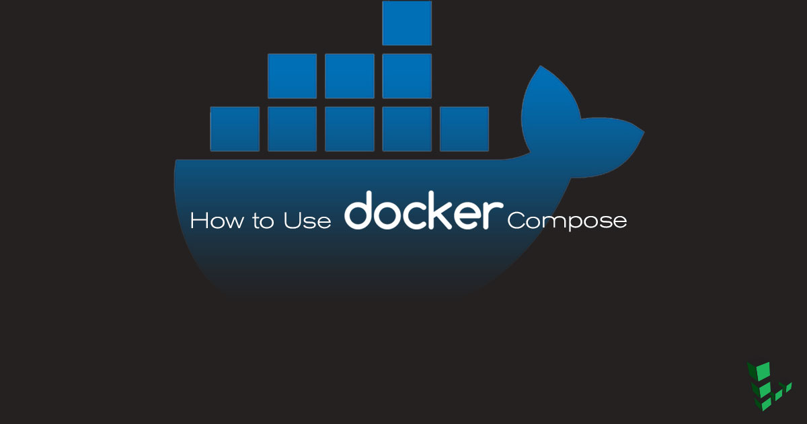

## What is Docker Compose?

If your Docker application includes more than one container (for example, a webserver and database running in separate containers), building, running, and connecting the containers from separate Dockerfiles is cumbersome and time-consuming. Docker Compose solves this problem by allowing you to use a YAML file to [define multi-container apps](https://docs.docker.com/compose/overview/). You can configure as many containers as you want, how they should be built and connected, and where data should be stored. When the YAML file is complete, you can run a single command to build, run, and configure all of the containers.

This guide will explain how the `docker-compose.yml` file is organized, and show how to use it to create several basic app configurations.


Generally the containers in an application built using Docker Compose will all run on the same host. Managing containers running on different hosts usually requires an additional tool, such as [Docker Swarm](https://docs.docker.com/engine/swarm/) or [Kubernetes](https://kubernetes.io/).

## Before You Begin

### Install Docker CE

You will need a Linode with Docker CE installed to follow along with the steps in this guide.



### Install Docker Compose



## Basic Usage

This section will review an example Docker Compose file taken from the [Docker official documentation](https://docs.docker.com/compose/wordpress/#build-the-project).

1.  Open `docker-compose.yml` in a text editor and add the following content:

    
version: '3'

services:
   db:
     image: mysql:5.7
     volumes:
       - db_data:/var/lib/mysql
     restart: always
     environment:
       MYSQL_ROOT_PASSWORD: somewordpress
       MYSQL_DATABASE: wordpress
       MYSQL_USER: wordpress
       MYSQL_PASSWORD: wordpress

   wordpress:
     depends_on:
       - db
     image: wordpress:latest
     ports:
       - "8000:80"
     restart: always
     environment:
       WORDPRESS_DB_HOST: db:3306
       WORDPRESS_DB_USER: wordpress
       WORDPRESS_DB_PASSWORD: wordpress
volumes:
    db_data:



2.  Save the file and run Docker Compose from the same directory:

        docker-compose up -d

    This will build and run the `db` and `wordpress` containers. Just as when running a single container with `docker run`, the `-d` flag starts the containers in detached mode.

3.  You now have a WordPress container and MySQL container running on your host. Navigate to `192.0.8.1:8000/wordpress` in a web browser to see your newly installed WordPress application. You can also use `docker ps` to further explore the resulting configuration:

        docker ps

4.  Stop and remove the containers:

        docker-compose down

## Compose File Syntax

A `docker-compose.yml` file is organized into four sections:

|Directive    | Use
|---|---|
|version  | Specifies the Compose file syntax version. This guide will use Version 3 throughout.  |
|services   |In Docker a service is the name for a ["Container in production"](https://docs.docker.com/get-started/part3/#introduction). This section defines the containers that will be started as a part of the Docker Compose instance.   |
|networks   | This section is used to configure networking for your application. You can change the settings of the default network, connect to an external network, or define app-specific networks.     |
|volumes  | Mounts a linked path on the host machine that can be used by the container. |

Most of this guide will focus on setting up containers using the `services` section. Here are some of the common directives used to set up and configure containers:

|Directive    | Use
|---|---|
|image  | Sets the image that will be used to build the container. Using this directive assumes that the specified image already exists either on the host or on [Docker Hub](https://hub.docker.com/). |
|build   | This directive can be used instead of `image`. Specifies the location of the Dockerfile that will be used to build this container.    |
|db   | In the case of the example Dockercompose file, `db` is a variable for the container you are about to define.    |
|restart   | Tells the container to restart if the system restarts.    |
|volumes  |Mounts a linked path on the host machine that can be used by the container |
|environment      |Define environment variables to be passed in to the Docker run command.      |
|depends_on| Sets a service as a dependency for the current block-defined container |
|port   | Maps a port from the container to the host in the following manner: `host:container`   |
|links   | Link this service to any other services in the Docker Compose file by specifying their names here.  |

Many other configuration directives are available. See the [Compose File reference](https://docs.docker.com/compose/compose-file) for details.


The example `docker-compose.yml` above uses the `environment` directive to store MySQL user passwords directly in the YAML file to be imported into the container as environment variables. This is not recommended for sensitive information in production environments. Instead, sensitive information can be stored in a separate `.env` file (which is not checked into version control or made public) and accessed from within `docker-compose.yml` by using the `env_file` directive.


## Build an Application from Scratch

Create a `docker-compose.yml` file one section at a time to illustrate the steps of building a multi-container application.

### Define a Simple Service:

1.  Create a new `docker-compose.yml` in a text editor and add the following content:

    
version: '3'

services:
  distro:
    image: alpine
    restart: always
    container_name: Alpine_Distro
    entrypoint: tail -f /dev/null


    Each entry in the `services` section will create a separate container when `docker-compose` is run. At this point, the section contains a single container based on the official Alpine distribution:
    * The `restart` directive is used to indicate that the container should always restart (after a crash or system reboot, for example).
    * The `container_name` directive is used to override the randomly generated container name and replace it with a name that is easier to remember and work with.
    * Docker containers exit by default if no process is running on them. `tail -f` is an ongoing process, so it will run indefinitely and prevent the container from stopping. The default `entrypoint` is overridden to keep the container running.

2.  Bring up your container:

        docker-compose up -d

3. Check the status of your container:

        docker ps

    The output should resemble the following:

    
CONTAINER ID        IMAGE               COMMAND               CREATED             STATUS              PORTS               NAMES
967013c36a27        alpine              "tail -f /dev/null"   3 seconds ago       Up 2 seconds                            Alpine_Distro


4. Bring down the container:

        docker-compose down

### Add Additional Services

From here you can begin to build an ecosystem of containers. You can define how they work together and communicate.

1.  Reopen `docker-compos.yml` and add the `database` service below:

    
version: '3'

services:
  distro:
    image: alpine
    container_name: Alpine_Distro
    restart: always
    entrypoint: tail -f /dev/null

  database:
    image: postgres:latest
    container_name: postgres_db
    volumes:
      - ../dumps:/tmp/
    ports:
      - "5432:5432"


    There are now two services defined:

    * Distro
    * Database

    The Distro service is the same as before. The Database server contains the instructions for a postgres container, and the directives: `volumes: - ../dumps:/tmp` and `ports:-"5432:5432"`, the first directive maps the containerd `/dumps` folder to our local `/tmp` folder. The second directive maps the containers ports to the local host's ports.

2.  Check the running containers:

        docker ps

     This command shows the status of the containers, the port mapping, the names, and the last command running on them. It's important to note that the postgres container reads "docker-entrypoint..." under commands. The Postgres [Docker Entrypoint](https://github.com/docker-library/postgres/blob/master/docker-entrypoint.sh) script is the last thing that launches when the container starts.

    
CONTAINER ID        IMAGE               COMMAND                  CREATED              STATUS              PORTS                    NAMES
ecc37246f6ef        postgres:latest     "docker-entrypoint..."   About a minute ago   Up About a minute   0.0.0.0:5432->5432/tcp   postgres_db
35dab3e712d6        alpine              "tail -f /dev/null"      About a minute ago   Up About a minute                            Alpine_Distro


3. Bring down both containers:

        docker-compose down

### Add an nginx Service

1.  Add an nginx container so that your application will be able to serve websites:

    
version: '3'

services:
  distro:
    image: alpine
    container_name: Alpine_Distro
    restart: always
    entrypoint: tail -f /dev/null

  database:
    image: postgres:latest
    container_name: postgres_db
    volumes:
      - ../dumps:/tmp/
    ports:
      - "5432:5432"
  web:
    image: nginx:latest
    container_name: nginx
    volumes:
      - ./mysite.template:/etc/nginx/conf.d/mysite.template
    ports:
      - "8080:80"
    environment:
      - NGINX_HOST=example.com
      - NGINX_port=80
    links:
      - database:db
      - distro



    This `docker-compose` file contains some new directives: *environment* and *links*. The first directive sets runtime level options within the container. `links` creates a dependency network between the containers. The nginx container depends on the other two to execute. In addition, the corresponding containers will be reachable at a hostname indicated by the alias. In this case, pinging `db` from the `web` container will reach the `database` service. While you do not need the `links` directive for the containers to talk with each other, `links` can serve as a failsafe when starting the docker-compose application.

2. Start Docker Compose and check the container status:

        docker-compose up -d
        docker ps

      The output should be similar to:

    
CONTAINER ID        IMAGE               COMMAND                  CREATED             STATUS              PORTS                    NAMES
55d573674e49        nginx:latest        "nginx -g 'daemon ..."   3 minutes ago       Up 3 minutes        0.0.0.0:8080->80/tcp     nginx
ad9e48b2b82a        alpine              "tail -f /dev/null"      3 minutes ago       Up 3 minutes                                 Alpine_Distro
736cf2f2239e        postgres:latest     "docker-entrypoint..."   3 minutes ago       Up 3 minutes        0.0.0.0:5432->5432/tcp   postgres_db


3.  Test nginx by navigating to your Linode's public IP address, port `8080` in a browser (for example `192.0.2.0:8080`). You should see the default nginx landing page displayed.

### Persistent Data Storage

Storing PostgreSQL data directly inside a container is not recommended. Docker containers are intended to be treated as ephemeral: your application's containers are built from scratch when running `docker-compose up` and destroyed when running `docker-compose down`. In addition, any unexpected crash or restart on your system will cause any data stored in a container to be lost.

For these reasons it is important to set up a persistent volume on the host that the database containers will use to store their data.

1.  Add a `volumes` section to `docker-compose.yml` and edit the `database` service to refer to the volume:

    
version: '3'

services:
  distro:
    image: alpine
    container_name: Alpine_Distro
    restart: always
    entrypoint: tail -f /dev/null

  database:
    image: postgres:latest
    container_name: postgres_db
    volumes:
      - data:/var/lib/postgresql
    ports:
      - "5432:5432"
  web:
    image: nginx:latest
    container_name: nginx
    volumes:
      - ./mysite.template:/etc/nginx/conf.d/mysite.template
    ports:
      - "8080:80"
    environment:
      - NGINX_HOST=example.com
      - NGINX_port=80
    links:
      - database:db
      - distro
volumes:
  data:
    external: true


2.  `external: true` tells Docker Compose to use a pre-existing external data volume. If no volume named `data` is present, starting the application will cause an error. Create the volume:

        docker volume create --name=data

3.  Start the application as before:

        docker-compose up -d

## Next Steps

Docker Compose is a powerful tool for orchestrating sets of containers that can work together. Things like an app or a development environment can utilize Docker-compose. The result is a modular and configurable environment that can be deployed anywhere.
