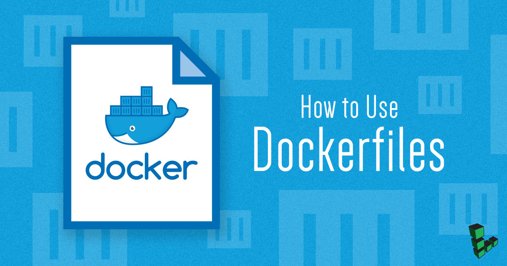

[Docker images](/docs/applications/containers/how-to-install-docker-and-pull-images-for-container-deployment#pull-docker-images) make it easy to deploy multiple containers without having to maintain the same image across multiple virtual machines. You can use a Dockerfile to automate installation and configuration of an image and its dependencies.

## Dockerfile Basics

### How Do Dockerfiles Work?

Dockerfiles are scripts that carry out different commands and actions to create a Docker build image. Dockerfiles automate the image creation process and simplifies your deployment pipeline. A Docker container is created from a Docker image. A [Docker registry](https://docs.docker.com/registry/) is where your public or private Docker images are stored.

Once a Dockerfile is created, the administrator uses the `docker build` command to create an image based on the commands within the file. The commands and information within the `dockerfile` can be configured to use specific software versions and dependencies to ensure consistent and stable deployments.


Do not store the Dockerfile in your root directory.

Create a separate directory for the Dockerfile and place all necessary files within the same directory as the Dockerfile.


A Dockerfile uses the following commands for building the images:

*  **ADD**: Copy files from a source on the host to the container's own filesystem at the set destination.
*  **CMD**: Execute a specific command within the container.
*  **ENTRYPOINT**: Set a default application to be used every time a container is created with the image.
*  **ENV**: Set environment variables.
*  **EXPOSE**: Expose a specific port to enable networking between the container and the outside world.
*  **FROM**: Define the base image used to start the build process.
*  **MAINTAINER**: Define the full name and email address of the image creator.
*  **RUN**: Central executing directive for Dockerfiles.
*  **USER**: Set the UID (the username) that will run the container.
*  **VOLUME**: Enable access from the container to a directory on the host machine.
*  **WORKDIR**: Set the path where the command, defined with CMD, is to be executed.

Not every command must be used. You will create a working Dockerfile example in the following section.

### How Do You Write Dockerfiles?

To create a Dockerfile, create an empty Dockerfile in your desired directory using the `touch` command:

    touch Dockerfile

You now have an empty Dockerfile in your directory. You can add commands to this fill to create your build image, however, it must include the following [Docker build steps](https://www.docker.com/blog/intro-guide-to-dockerfile-best-practices/):

1. FROM
2. MAINTAINER
3. RUN
4. CMD

Review the example Dockerfile included below to see the Docker build steps in action. The Dockerfile runs Ubuntu and installs MongoDB to a Docker container.


# Install a more up to date MongoDB if the current version isn’t the latest one on Ubuntu servers

FROM ubuntu

MAINTAINER Jeff Attwood

RUN apt-key adv --keyserver keyserver.ubuntu.com80 --recv 7F0CEB10

RUN apt-get update

RUN apt-get -y install apt-utils

RUN apt-get -y install mongodb-10gen

CMD [“usr/bin/mongod”, “--config”, “etc/mongodb.conf”]


### Where Should You Store Your Dockerfile?

Dockerfiles should be stored at the root of your project. For example, if you use your Dockerfile to create a container for a Geolocation app, and you develop your app locally in your home directory, your Dockerfile's location may be stored in `~/geolocation-app/Dockerfile`. When building your Docker image, you can specify where Docker should look for your Dockerfile using the `-f` option, for example:

    docker build -f ~/geolocation-app/Dockerfile

Replace `~/geolocation-app/Dockerfile` with the path to your own project's Dockerfile before running the command.

## Get Started Creating a Dockerfile

### Create Your Dockerfile

Dockerfiles require a specific setup and format with no extra spaces. Docker reuses cache from the Dockerfile's previous step. This may result in commands not running properly or not running at all. To avoid this caching issue, combine `apt` commands into a single `RUN` statement. To avoid other caching issues, combine multiple `RUN` statements for commands like `apt-get update/upgrade/install`.

Note that in the example below, multiple packages are installed on separate lines. This optional step is recommended by the [Dockerfile Best Practices](https://docs.docker.com/engine/userguide/eng-image/dockerfile_best-practices/#sort-multi-line-arguments) in order to ease future updates and maintenance.

1.  Create and change to a new directory and create a `Dockerfile` file:

        mkdir ~/mydockerbuild && cd ~/mydockerbuild
        touch Dockerfile

2.  Open `Dockerfile` using a text editor and enter the following example to create a Dockerfile that installs `build-essential`, `curl`, and `make` onto a Ubuntu image:

    
FROM ubuntu
MAINTAINER NAME EMAIL
RUN apt-get update && apt-get install -y \
    build-essential \
    gcc \
    curl \
    make



        In this example:

        *  **NAME**: Full name of the creator.
        *  **EMAIL**: Email address of the creator.

3.  Save and close `Dockerfile`.

### Build a Docker Image from the Dockerfile

Build the `Dockerfile` using the `docker build` command within the same directory. Substitute `NAME` in the following example with the name of the image to be created:

    docker build --tag=“Build-Essential:Dockerfile” /path/to/file .

To build three images using the same Dockerfile, give each image a new name. In this example, `webdev1`, `webdev2`, `webdev3`:

    docker build -t “webdev1:Dockerfile” .
    docker build -t “webdev2:Dockerfile” .
    docker build -t “webdev3:Dockerfile” .

Each image created will be tagged `Dockerfile`. To change the tag during build, change `Dockerfile`:

    docker build -t “debian-webdev3:dev” .

## Running your Docker Images
### Run Your Docker Image as a Container

Continuing from the Docker images you created in the previous section, in this section you deploy a container using the `webdev1` Docker image.

The Docker `run` command is used to run a Docker image as a container. This command takes the following format:

        docker run [OPTIONS] my-image-name [COMMAND] [ARG…]

The `run` command has [many available options](https://docs.docker.com/engine/reference/commandline/run/) to configure your container's runtime resources.

For example, to run the `webdev1` Docker image in a container, execute the following command:

    docker run webdev1


If the `docker run` command is executed and the Docker image is not available in your current working directory, it is pulled from the Docker registry instead.


### Run Your Docker Image as a Container in Detached Mode

When you execute the `docker run my-image-name` command, you launch a Docker container that is tied to your terminal session. This is also referred to as running a process in the *foreground*. When your root process is in the foreground and is tied to a terminal session, your container exits as soon as you close the terminal session. If you want your container to run even after your terminal session is closed, you can run your container in *detached* mode. This runs your container in the *background*.

To run a Docker image as a container in detached mode, use the `-d` argument. You can run the `webdev1` image as a container in the background by executing the following command:

    docker container run -d webdev1

Once you run this command, the root process keeps running in the background even when the terminal session is closed. To view all containers running in the background execute the following command:

    docker ps

The output of this command displays the `webdev1` container running in the background:


CONTAINER ID   IMAGE    COMMAND  CREATED        STATUS       PORTS          NAMES

3a4sak1aday2   webdev1  "bash"   6 minutes ago  Up 29 minutes 2222->3000/tcp webdev1


To remove the container you just started, use the following command:

    docker rm webdev1

To confirm that your container has been removed, run the following command:

    docker ps -all

You should see an output similar to the example below, which does not display any running containers:


CONTAINER ID   IMAGE    COMMAND  CREATED        STATUS       PORTS          NAMES


### Configure your Docker Container's Ports

You can use the `run` command's options to configure different aspects of your container. When your container runs on a remote host and serves its running application, you should configure its ports in order to expose the app to users.

For example, you can configure your `webdev1` container to use host port `20` and container port `22` as displayed in the example command. Notice the `-d` option used in the command to run the container as a detached process.

    docker run --name webdev1 -p 20:22 -d webdev1

The general syntax for this command is the following:

    docker run -–name <container name> -p <network port> <container port> <container image name>

Each parameter is described in the following list:

- `<container name>`: Name of the Docker container
- `<host port>`: Host port that is mapped to the container's open port
- `<container port>`: Port where Docker container listens
- `<container image name>`: Docker image name used for your deployment

To stop and delete your container, run the following command:

    docker rm webdev1

## Just the basics

This guide covered the basics of using Dockerfiles to build images. For more information on Dockerfiles, visit the official [Dockerfile Best Practices](https://docs.docker.com/engine/userguide/eng-image/dockerfile_best-practices/) documentation.
