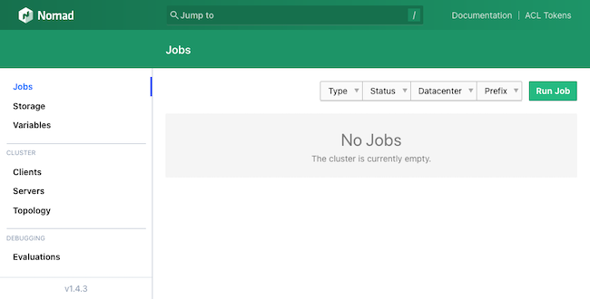
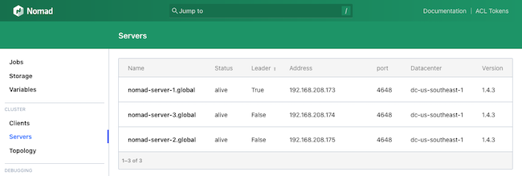
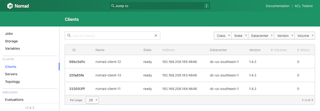
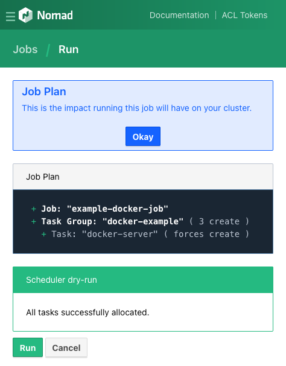
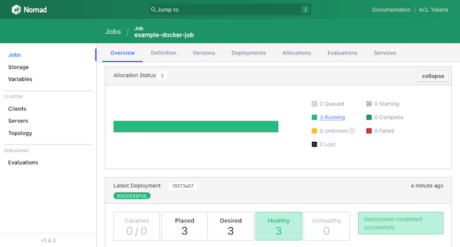

[Nomad](https://www.nomadproject.io/) is an open source workload orchestration and scheduling system that offers a simplified and flexible alternative to Kubernetes. Nomad can deploy and manage both containerized and non-containerized applications across efficient, highly scalable clusters. Nomad is part of the HashiCorp ecosystem, giving it built-in integration with tools like Consul, Terraform, and Vault. Learn more about Nomad and how it compares to Kubernetes in our guide [Kubernetes vs Nomad: Which Is Better?](/docs/guides/kubernetes-vs-nomad/).

In this tutorial, learn how to get started understanding and using Nomad effectively. Begin by installing a single Nomad instance to get a sense of its interface and cluster structure. Then see how to leverage Terraform and Consul to deploy a full Nomad cluster with Docker for containerized applications.

## How to Install Nomad

This section outlines how to install Nomad and access its interface in order to familiarize yourself with Nomad's method of handling jobs.

If, instead, you are ready to start deploying a Nomad cluster now, skip to the [How to Deploy a Cluster with Nomad](/docs/guides/using-nomad-for-orchestration/#how-to-deploy-a-cluster-with-nomad) section.

### Deploying Nomad from the Linode Marketplace

The most approachable solution for setting up a Nomad instance with Linode is through the Linode Marketplace. There, a Linode instance with Nomad already installed and configured can be quickly set up. To do so, take a look at our guide to [Deploy HashiCorp Nomad through the Linode Marketplace](/docs/products/tools/marketplace/guides/hashicorp-nomad/).

First, follow along with that guide to get a Nomad instance ready. Then skip to the section [How Nomad Works](/docs/guides/using-nomad-for-orchestration/#how-nomad-works) to become familiar with the new Nomad instance.

### Manually Installing Nomad

Follow the steps here to install Nomad manually. These walk through everything needed to get a Nomad instance configured and able to access the Nomad interface.

#### Before You Begin

1.  If you have not already done so, create a Linode account and Compute Instance. See our [Getting Started with Linode](/docs/products/platform/get-started/) and [Creating a Compute Instance](/docs/products/compute/compute-instances/guides/create/) guides.

1.  Follow our [Setting Up and Securing a Compute Instance](/docs/products/compute/compute-instances/guides/set-up-and-secure/) guide to update your system. You may also wish to set the timezone, configure your hostname, create a limited user account, and harden SSH access.
A Linode instance is needed to run Nomad on, so follow the linked guides here to start up and configure your own instance:


This guide is written for a non-root user. Commands that require elevated privileges are prefixed with `sudo`. If you’re not familiar with the `sudo` command, see the [Users and Groups](/docs/guides/linux-users-and-groups/) guide.


#### Installing Nomad on Debian and Ubuntu

To install Nomad on Debian or Ubuntu, follow the steps below:

1.  Install the prerequisite packages for adding the HashiCorp repository to the APT package manager:

    ```command
    sudo apt install wget gpg coreutils
    ```

1.  Add the GPG key for the HashiCorp repository:

    ```command
    wget -O- https://apt.releases.hashicorp.com/gpg | gpg --dearmor | sudo tee /usr/share/keyrings/hashicorp-archive-keyring.gpg
    ```

1.  Add the HashiCorp repository to the APT package manager:

    ```command
    echo "deb [signed-by=/usr/share/keyrings/hashicorp-archive-keyring.gpg] https://apt.releases.hashicorp.com $(lsb_release -cs) main" | sudo tee /etc/apt/sources.list.d/hashicorp.list
    ```

1.  Update APT's indices and install Nomad:

    ```command
    sudo apt update
    sudo apt install nomad
    ```

#### Installing Nomad on Alma, CentOS, Fedora, and Rocky

To install Nomad on AlmaLinux, CentOS Stream, Fedora, or Rocky Linux, follow the steps below:

1.  Install the configuration manager for the DNF package manager:

    ```command
    sudo dnf install dnf-plugins-core
    ```

1.  Use the configuration manager to add the HashiCorp repository to DNF:

    -   On AlmaLinux, CentOS Stream, and Rocky Linux, use the RHEL URL:

        ```command
        sudo dnf config-manager --add-repo https://rpm.releases.hashicorp.com/RHEL/hashicorp.repo
        ```

    -   On Fedora, use the Fedora URL:

        ```command
        sudo dnf config-manager --add-repo https://rpm.releases.hashicorp.com/fedora/hashicorp.repo
        ```

1.  Install Nomad:

    ```command
    sudo dnf install nomad
    ```

#### Verifying Your Nomad Installation

Once you have completed the installation steps above, verify the Nomad installation with the following command:

``` command
nomad --version
```

```output
Nomad v1.5.2
```

#### Installing CNI Plugins for Nomad

Nomad uses CNI plugins to support some network features, particularly its bridge mode. The CNI plugins are required when using network namespaces within Nomad clusters.

Completing this part of the setup is optional, but generally recommended.

1.  Install the CNI plugins with the following set of commands:

    ```command
    curl -L -o cni-plugins.tgz "https://github.com/containernetworking/plugins/releases/download/v1.0.0/cni-plugins-linux-$( [ $(uname -m) = aarch64 ] && echo arm64 || echo amd64)"-v1.0.0.tgz
    sudo mkdir -p /opt/cni/bin
    sudo tar -C /opt/cni/bin -xzf cni-plugins.tgz
    ```

1.  To further support network traffic over bridge connections, adjust your system's `iptables`. Nomad provides the configurations implemented below for this purpose. These lines set the necessary `iptables` values, and adding them to a file ensures they persist at system startup. Run the following command to create a `bridge.conf` file within the `/etc/sysctl.d/` directory:

    ```command
    sudo tee /etc/sysctl.d/bridge.conf > /dev/null <<EOF
    net.bridge.bridge-nf-call-arptables = 1
    net.bridge.bridge-nf-call-ip6tables = 1
    net.bridge.bridge-nf-call-iptables = 1
    EOF
    ```

1.  Load the new file into the current `sysctl` configuration:

    ```command
    sudo modprobe br_netfilter
    sudo sysctl -p /etc/sysctl.d/bridge.conf
    ```

## How Nomad Works

With the Nomad instance up and running, it's time to start exploring how Nomad works. This section provides the basics to navigate Nomad's features.

### Using Nomad

1.  First, start up a Nomad development agent:

    ```command
    nomad agent -dev
    ```

    
    Nomad instances created through the Linode Marketplace are already running a Nomad agent at startup, so above command is not needed.
    

1.  The agent makes a Nomad web interface available, serving it on `localhost:4646`. Use an SSH tunnel to access this in a web browser from a remote machine:

    -   On **Windows**, use the PuTTY tool to set up the SSH tunnel. Follow the PuTTY section of our guide on how to [Create an SSH Tunnel for MySQL Remote Access](/docs/guides/create-an-ssh-tunnel-for-mysql-remote-access/#how-to-access-mysql-remotely-by-creating-an-ssh-tunnel-with-putty). Use `4646` as the **Source port** and `127.0.0.1:4646` as the **Destination**.

    -   On **macOS** or **Linux**, use the following command to set up the SSH tunnel. Replace `example-user` with your username on the remote server and `192.0.2.0` with the remote server's IP address:

        ```command
        ssh -L4646:localhost:4646 example-user@192.0.2.0
        ```

1.  Navigate to `localhost:4646` in a web browser to see the Nomad interface.

    [](nomad-local-interface.png)

### Nomad Structure

One of the best ways to get familiar with Nomad is through navigating the options available in its interface. However, Nomad has a set of core concepts that its operations are structured around. Getting familiar with those is essential for using Nomad effectively.

What follows is a brief overview of these key essentials for grasping the Nomad cluster architecture. Find additional details and more particulars in Nomad's [vocabulary documentation](https://developer.hashicorp.com/nomad/tutorials/get-started/get-started-vocab).

-   A Nomad **agent** runs on each Node in the Nomad cluster and can be either a *server* agent or a *client* agent. Agents do all the work behind Nomad, and it is the presence of this agent network that makes up the Nomad cluster.

    -   A Nomad **server** agent manages jobs and clients. Each server node communicates with the other server nodes for high availability and awareness across multiple regions. Servers also manage job schedules and disseminate jobs to appropriate client nodes when jobs need executed.

    -   A Nomad **client** agent watches for jobs from its region's server nodes and executes any tasks within those jobs. Essentially, clients are the units that fulfill jobs, running the necessary tasks, whether batch processes, services, or otherwise.

-   A Nomad **job** is a collection of one or more *tasks* to be handled by a *client*. *Tasks* are collected into **groups** within their *jobs*. Each **task** in turn contains a single unit of work to be executed by a *client agent*.

## How to Deploy a Cluster with Nomad

The above sections should provide a solid foundational understanding of Nomad. However, Nomad is typically deployed in a cluster with an array of server and client nodes to execute jobs.

The rest of this tutorial outlines a straightforward method for deploying a complete Nomad cluster using Terraform for provisioning and Consul for networking.

This setup is meant to serve as a basis for your own specific use case. For that reason, the setup favors a clear and simplified approach. Doing so leaves a few features to be added and enhancements to be pursued. The conclusion to this tutorial provides some suggestions to make this setup best fit your particular needs.

### Overview of Terraform Provisioning

Probably the most effective way to deploy a Nomad cluster is through [Terraform](https://www.terraform.io/), another tool by HashiCorp. With Terraform, you can provision infrastructure as code, automating the deployment process. This is especially convenient with Nomad. Terraform coordinates configuration and deployment between all nodes in a cluster, in addition to saving manual installation and setup time on each node. Learn more about using Terraform, particularly for provisioning Linode instances, in our [Beginner's Guide to Terraform](/docs/guides/beginners-guide-to-terraform/).

This tutorial leverages our custom Terraform script to deploy the Nomad cluster. The Terraform script here emphasizes simplicity and readability, which is helpful for getting started with your own uses.

Here's a rundown of what the Terraform script does:

-   Creates a given number of Nomad server and client nodes. All instances deploy within a single region and leverage [Linode's VLAN](/docs/products/networking/vlans/) feature for virtual private cloud (VPC) communications between nodes.

-   Executes a script on each node to install Nomad, Consul, and Docker.

-   Runs a script on each server node to provide an initial Consul and Nomad server configuration. Repeats the process for each client node, setting the configurations for communication with the server nodes.

-   Starts up Consul and Nomad so that the cluster is up-and-running and accessible by the end of the Terraform process.

### Deploying the Cluster with Terraform

Follow the steps outlined here when ready to deploy your own Nomad cluster. These get Terraform set up, prepares the script, and starts provisioning the cluster.


The configurations and commands used in this guide add multiple Linode instances to your account. Be sure to monitor your account closely in the Linode Cloud Manager to avoid unwanted charges.


1.  Install Terraform by following the [official installation guide](https://learn.hashicorp.com/tutorials/terraform/install-cli). This sets you up with the Terraform command line interface (CLI).

1.  Download a `.zip` archive of [our Terraform script for deploying the Nomad cluster](example-nomad-terraform.zip) and its accompanying files.

    Once downloaded, unzip the archive with the `unzip` program. The set of commands below place the Terraform directory in your current user's home directory:

    ```command
    mv example-nomad-terraform.zip ~/
    cd ~/
    unzip example-nomad-terraform.zip
    ```

    This should result in a `~/example-nomad-terraform/` directory, navigate into it:

    ```command
    cd ~/example-nomad-terraform/
    ```

    
    Any further commands and file references assume you are operating out of this directory.
    

1.  Open the `terraform.tfvars` file, and configure the variables there. Here is a breakdown of the variables and how to set them:

    -   `token` needs your Linode API token. Terraform uses this to provision Linode instances. Follow our [Get an API Access Token](/docs/products/tools/linode-api/guides/get-access-token/) guide to generate a personal access token. Be sure to give the token "Read/Write" permissions.

    -   `ssh_keys` takes a list of SSH public keys. These keys are added to the known hosts on each node, allowing SSH access to the nodes. Enter the full public key for your local machine in one line.

    -   `root_password` is used to set up a root password for each node.

    -   `server_count` and `client_count` dictate the number of Nomad server and client nodes to provision, respectively. Nomad recommends three or five server nodes for each region. This tutorial uses three server nodes and three client nodes.

    -   `region` determines what Linode region the nodes should be created in. The full list of regions and their designations is available via the [Linode regions API](https://api.linode.com/v4/regions). However, this tutorial uses Linode's VLAN feature, which is only available for certain regions. Those regions are listed on the [VLAN Overview](/docs/products/networking/vlans/#availability) page.

    -   `linode_image` points to an image to use for each node. The default for this tutorial is an Ubuntu 20.04 LTS image. Find a list of possible images via the [Linode images API](https://api.linode.com/v4/images). Be aware that changing the image requires accordingly adjusting the scripts for installing Consul, Nomad, and Docker.

    -   `server_type` and `client_type` indicate the Linode instance types to use for the server and client nodes, respectively. The default provides a Dedicated 4GB instance for each Nomad server, as recommended, and a Linode (shared) 4GB instance for each Nomad client. Find a full list of the instance type designations via the [Linode types API](https://api.linode.com/v4/linode/types).

    
Sensitive infrastructure data, such as passwords and tokens, are visible in plain text within the `terraform.tfvars` file. Review [Secrets Management with Terraform](/docs/applications/configuration-management/secrets-management-with-terraform/#how-to-manage-your-state-file) for guidance on how to secure these secrets.
    

1.  Initialize the Terraform script, which installs the required provisioners, then apply the script to start the provisioning process:

    ```command
    terraform init
    terraform apply
    ```

    The process runs for a while as Terraform first sets up the server instances, then the client instances, and then runs the necessary scripts. Once the process has finished, a message like this should appear:

    ```output
    Apply complete! Resources: 12 added, 0 changed, 0 destroyed.
    ```

1.  At this point, access the Nomad interface to check that the cluster is running and connected. In a web browser, navigate to port `4646` on the public IP address for one of the cluster's server nodes. For instance, if `nomad-server-1` has the public IP address `192.0.2.0`, navigate to `192.0.2.0:4646` in your browser.

1.  Use the left-hand menu to navigate to the **Server** page to see a list of the Nomad servers deployed in the cluster:

    [](nomad-cluster-servers.png)

1.  Navigate to the **Clients** page from the same menu to see a list of the deployed Nomad clients:

    [](nomad-cluster-clients.png)

### Creating a Docker Job

To see the Nomad cluster in action, create and execute a simple job on it. This can actually be done right from within the Nomad web interface.

This example uses a simple Docker image to have each client node echo "Hello, world!" via an HTTP server.

1.  Open the Nomad web interface from one of the server nodes, as described in the previous section.

1.  Navigate to the **Jobs** page from the left-hand menu, and select the **Run Job** button from the upper right.

1.  This prompts for a *Job Definition*, where an HCL script can be inserted to define a job. For this example, use the job script provided below:

    ```file {lang="hcl"}
    job "example-docker-job" {
      datacenters = ["dc-us-southeast-1"]
      type = "service"

      group "docker-example" {
        count = 3

        task "docker-server" {
          driver = "docker"

          config {
            image = "hashicorp/http-echo:latest"

            args = [
              "-listen",
              ":3030",
              "-text",
              "Hello, world!",
            ]
          }

          resources {
            network {
              mbits = 10

              port "http" {
                static = "3030"
              }
            }
          }
        }
      }
    }
    ```

    This creates a job named `example-docker-job` and a group of three `docker-server` tasks to start up HashiCorp's `http-echo` Docker image on three client nodes.

1.  Select the **Plan** button at the bottom of the page. If presented with a summary of the job, accept it using the **Run** button at the bottom of the page.

    

1.  This should open the **Jobs** page, with a summary of its execution. The page provides metrics on the job, including breakdowns of the job group and its tasks. The page also provides an option to stop the job.

    [](nomad-cluster-job.png)

1.  To see the results served by Docker, navigate to port `3030` on the public IP address of one of the client nodes. For instance, if one of the clients has the public IP address `192.0.2.12`, navigate to `192.0.2.12:3030` in a web browser.

    ```output
    Hello, world!
    ```

## Conclusion

You now know how to start orchestrating workloads with Nomad. This tutorial contains steps for everything from running a single Nomad instance to deploying an entire Nomad cluster.

The Terraform deployment above is meant as a simple, accessible base. Continue enhancing this to better meet your own specific needs. The following are some initial ideas to start out with:

-   Use Packer to build initial images. This saves deployment time and would replace the steps in the `nomad-installations.sh` script. Learn more about Packer and using it to create Linode images in our guide [Using the Linode Packer Builder to Create Custom Images](/docs/guides/how-to-use-linode-packer-builder/).

-   Leverage Consul's Access Control List (ACL) features to bolster the cluster's security. These features can secure the cluster's access points through ACL policies. Learn more in HashiCorp's [Secure Consul with Access Control Lists](https://developer.hashicorp.com/consul/tutorials/security/access-control-setup-production) documentation.

-   Implement multiple regions in the Nomad cluster. Nomad supports multi-region federation, allowing for reliably configuring clusters to coordinate across data centers in different regions. Learn more about this process in Nomad's [Multi-region Federation](https://developer.hashicorp.com/nomad/tutorials/manage-clusters/federation) documentation.

In addition to the links provided above and throughout this tutorial, refer to HashiCorp's Nomad tutorials linked below. These can help expand your understanding of Nomad and its capabilities to get the most out of your own cluster.