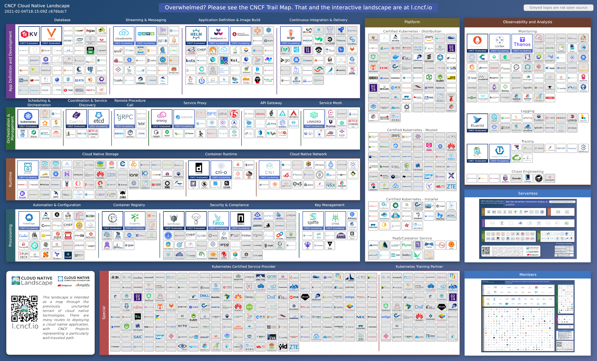

Cloud-native computing is an application development and delivery paradigm. It encompasses several technologies and architectural patterns, including open-source Linux containers, Kubernetes, and microservices. Cloud-native computing emphasizes scalability, automation, efficiency, and simplicity in all domains of the application development and deployment life-cycle —including team organization. With this approach, IT professionals create applications that can be deployed on-demand to the cloud, quickly and easily; saving on your computing resource costs.

## The Cloud-Native Computing Stack

Cloud-native computing requires several modular pieces of code, technology, and systems to work together. The [Cloud Native Computing Foundation's](https://www.cncf.io/) Cloud Native Landscape infographic displays, by category, all the services and technologies available for use.

Although there are many components to the cloud-native computing stack, it is not as complex as it may appear. Cloud native uses an open-source software stack to deploy applications as microservices; package each part into its own container; and dynamically orchestrate those containers to optimize resource utilization.

Cloud-native computing uses containers that run on dynamic clouds. Without containers or the elastic cloud, cloud-native doesn't exist. This on-demand approach enables system administrators and developers to dynamically run applications from components that spring up and fall down as required by application's services.

Cloud-native programs are **loosely coupled**. System components are interconnected in such a way that they depend on each other to the least extent practicable; the elements need little direct knowledge of one another. The code isn't hard-wired to any given infrastructure. In the case of cloud-native software, the elements are connected using APIs, service meshes, and networks.

Cloud-native programs are also **stateless**. They store their data and status in external databases. A cloud-native program doesn't "know" where its data resides. The data could be stored anywhere; it only matters that it can be accessed when it's needed.

As the name suggests, cloud-native programs live and die on clouds. They're developed there; staged and tested there; secured and debugged there; deployed there; and constantly improved via CI and CD.

## Managing Cloud-Native Applications

To manage cloud-computing systems, administrators orchestrate the containers with [Kubernetes](/docs/guides/kubernetes/). Some would argue that Kubernetes is essential to cloud-native computing.

Applications run inside Linux-based containers. They rarely use old-school development languages such as C++ or Java. Instead, cloud-native applications usually are written using web-centric languages, such as Go, Node.js, Rust, and Ruby. There's nothing wrong with the older languages, but cloud-native programming emphasizes flexibility and interoperability.

To further those goals, cloud-native computing also makes use of two other concepts: [serverless computing](/docs/guides/what-is-serverless-computing/) and [micro-services](/docs/guides/deploying-microservices-with-docker/).

In serverless computing, applications don't need to know about the hardware its running on or how it's managed. The software calls on the functions that the serverless platform provides without needing more knowledge of anything else. That means developers can focus on an application's business logic, rather than on architectural issues (for example, whether the server has enough RAM).

Micro-services provides lightweight, loosely coupled services via an API endpoint. These are connected by lightweight protocols such as [Representational State Transfer](https://www.service-architecture.com/articles/web-services/representational_state_transfer_rest.html) (REST) or [gRPC](https://grpc.io/). In cloud-native computing, data tends to be represented by [JavaScript Object Notation](https://www.json.org/) (JSON) or [Protobuf](https://github.com/google/protobuf/). They provide modular and basic services. It may be helpful to think of these as akin to Linux shell programs, which provide single services done well, but for the cloud.
