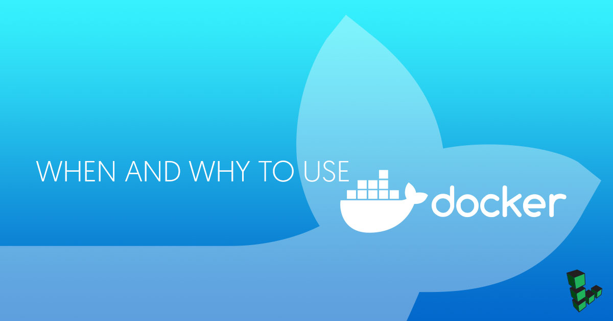

## What is Docker?

Since its release in 2012, [Docker](https://www.docker.com) has become one of the fastest-growing technologies in devops and web development. Like any new technology, however, it is still under development, has some limitations, and is not right for every project. This guide provides an overview of the pros and cons of Docker so that you can decide whether it would be a good addition to your project.

For a more basic introduction to Docker concepts and terminology, see our [An Introduction to Docker](/docs/guides/introduction-to-docker/) guide.

## Benefits of Docker

1.  **Reproducibility**: Similar to a Java application, which will run exactly the same on any device capable of running a Java Virtual Machine, a Docker container is guaranteed to be identical on any system that can run Docker. The exact specifications of a container are stored in a Dockerfile. By distributing this file among team members, an organization can guarantee that all images built from the same Dockerfile will function identically. In addition, having an environment that is constant and well-documented makes it easier to keep track of your application and identify problems.

2.  **Isolation**: Dependencies or settings within a container will not affect any installations or configurations on your computer, or on any other containers that may be running. By using separate containers for each component of an application (for example a web server, front end, and database for hosting a web site), you can avoid conflicting dependencies. You can also have multiple projects on a single server without worrying about creating conflicts on your system.

3.  **Security**: With important caveats (discussed below), separating the different components of a large application into different containers can have security benefits: if one container is compromised the others remain unaffected.

4.  **Docker Hub**: For common or simple use cases, such as a LAMP stack, the ability to save images and push them to Docker Hub means that there are already many well-maintained images available. Being able to quickly pull a premade image or build from an officially-maintained Dockerfile can make this kind of setup process extremely fast and simple.

5.  **Environment Management**: Docker makes it easy to maintain different versions of, for example, a website using nginx. You can have a separate container for testing, development, and production on the same Linode and easily deploy to each one.

6.  **Continuous Integration**: Docker works well as part of continuous integration pipelines with tools like Travis, Jenkins, and Wercker. Every time your source code is updated, these tools can save the new version as a Docker image, tag it with a version number and push to Docker Hub, then deploy it to production.

## When to Use Docker

If your application fits into one or more of the following categories, Docker may be a good fit:

1.  **Learning new technologies**: To get started with a new tool without spending time on installation and configuration, Docker offers an isolated and disposable environment. Many projects maintain Docker images with their applications already installed and configured. For example, if you want to check out a distributed tracing system like [Zipkin](http://zipkin.io), you can have a working setup on localhost simply by running:

        sudo docker run -d -p 9411:9411 openzipkin/zipkin

2.  **Basic use cases**: Pulling images from Docker Hub is also a good solution if your application is basic or standard enough to work with a default Docker image. Cases such as hosting a website using a LAMP stack, using a reverse proxy, or setting up a Minecraft server often have an official or well-supported image available on DockerHub. If the default configuration in these images is acceptable for your needs, then pulling the image can save a lot of time that would otherwise be spent setting up your environment and installing the necessary tools.

3.  **App isolation**: If you want to run multiple applications on one server, keeping the components of each application in separate containers will prevent problems with dependency management.

4.  **Developer teams**: If you have developers working with different setups, Docker provides a convenient way to have local development environments that closely match the production environment, without needing to ssh into a remote box.

## When Not to Use Docker

There are also times when Docker isn't the best solution. Here are some examples:

1.  **Your app is complicated and you are not/do not have a sysadmin.** For large or complicated applications, using a pre-made Dockerfile or pulling an existing image will not be sufficient. Building, editing, and managing communication between multiple containers on multiple servers is a time-consuming task.

2.  **Performance is critical to your application.** Docker shines compared to virtual machines when it comes to performance because containers share the host kernel and do not emulate a full operating system. However, Docker does impose performance costs. Processes running within a container [will not be quite as fast](http://domino.research.ibm.com/library/cyberdig.nsf/papers/0929052195DD819C85257D2300681E7B/$File/rc25482.pdf) as those run on the native OS. If you need to get the best possible performance out of your server, you may want to avoid Docker.

3.  **You don't want upgrade hassles.** Docker is a new technology that is still under development. To get new features you will likely have to update versions frequently, and backward compatibility with previous versions is not guaranteed.

4.  **Security is critical to your application.** As mentioned above, keeping the different components of an application in separate containers provides some security benefits, since a compromise in one container can't easily affect the rest of your system. However, Docker's containerization approach raises its own security challenges, especially for more complicated applications. These issues are solvable, but require attention from an experienced security engineer. (See the More Info section for links to discussions of these issues).

5.  **Multiple operating systems.** Since Docker containers share the host computer's operating system, if you want to run or test the same application on different operating systems, you will need to use virtual machines instead of Docker.

6.  **Clusters.** Docker containers on separate servers can be combined to form a cluster with [Docker Swarm](https://docs.docker.com/engine/swarm/). However, Docker does not take the place of provisioning or automation tools such as Ansible, SaltStack, and Chef. In addition, Docker has recently announced support for Kubernetes, hinting that Docker Swarm may not be sufficient as a stand-alone cluster manager.

## Should you use Docker Containers?

Docker has become an extremely popular way to configure, save, and share server environments using containers. Because of this, installing an application or even a large stack can often be as simple as running `docker pull` or `docker run`. Separating application functions into different containers also offers advantages in security and dependency management.

However, Docker is not a substitute for systems engineering or configuration management, and its approach has drawbacks. Developers should resist the temptation to containerize every application they create, simply because Docker is a popular and user-friendly solution. As with any tool, the requirements of any project should be researched carefully before deciding whether to use Docker.
