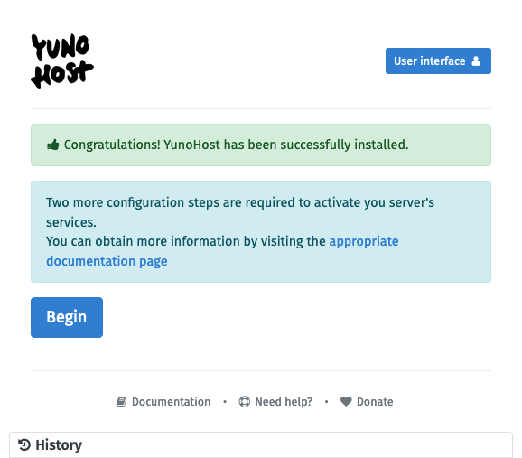
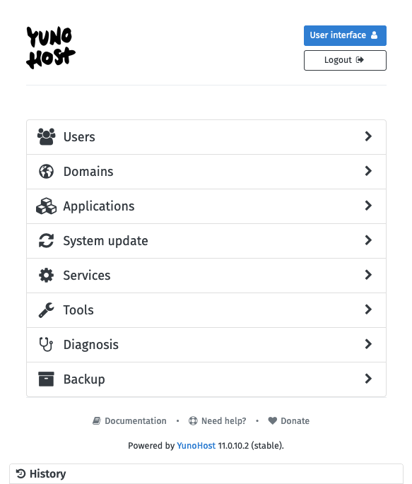
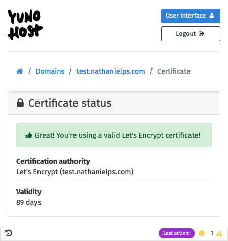
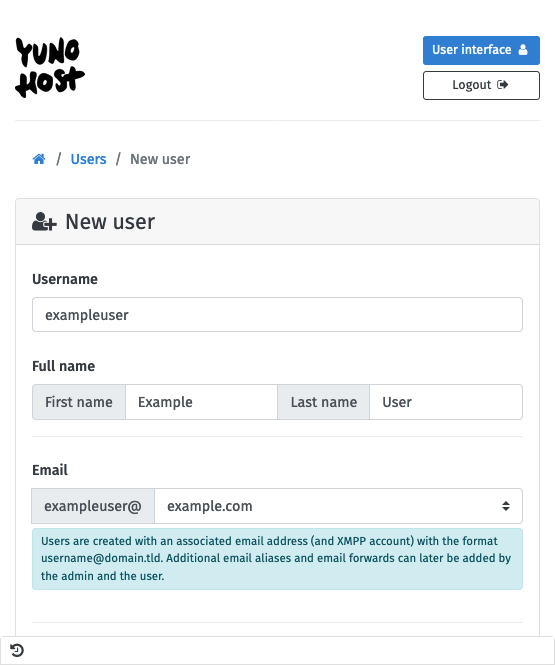
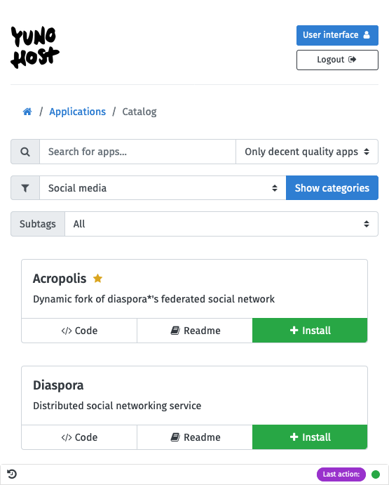
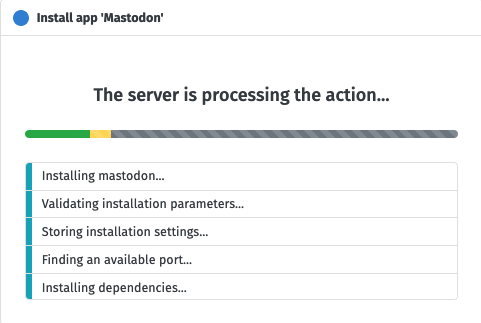
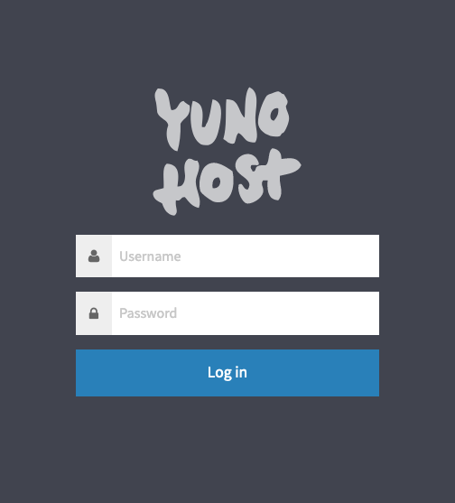
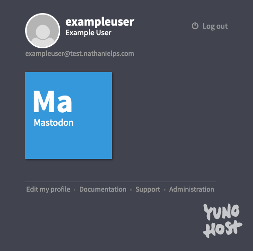
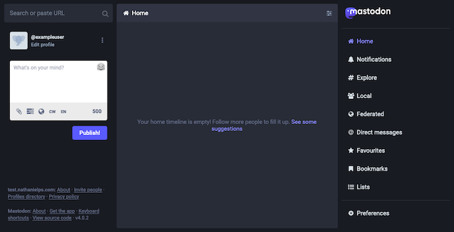

YunoHost is a platform designed to make self-hosting and server administration more accessible and streamlined. YunoHost can set up a server, install applications, administer users, and more, all through a convenient web interface.

This tutorial walks through installing YunoHost on a base Debian server and outlines the steps to start using it.

## Before You Begin

1. If you have not already done so, create a Linode account and Compute Instance running Debian 11 or higher. See our [Getting Started with Linode](/docs/guides/getting-started/) and [Creating a Compute Instance](/docs/guides/creating-a-compute-instance/) guides.

1. Optionally, create a domain name and configure it with the Linode DNS Manager. See our [DNS Manager - Get Started](/docs/products/networking/dns-manager/get-started/) guide for instructions on adding a domain to Linode and using the Linode name servers with the domain registrar.

    Be sure to also add an [A and AAA record](/docs/products/networking/dns-manager/guides/a-record/) pointing to the remote IP address of your Compute Instance.


The steps in this guide require root privileges. Be sure to run the steps below as `root`. For more information on privileges, see our [Users and Groups](/docs/guides/linux-users-and-groups/) guide.


## What Is YunoHost?

[YunoHost](https://yunohost.org/#/) is technically an operating system, based on Debian. The aim of YunoHost is to simplify the process of self-hosting and administering a Linux server.

One of its most notable features for accomplishing this is a marketplace of open source applications. YunoHost provides a way to conveniently install and manage these applications from a centralized web interface. YunoHost also features single-sign on (SSO), so users can easily move between applications.

The applications available in the YunoHost "marketplace" range from system and development tools to social media and publication platforms.

YunoHost has numerous other features for server administration beyond installing applications. YunoHost can manage user accounts and the server's SSL certification. It also includes a full-stack email service, and provides tools to monitor and engage with running services and firewalls through its web interface.

### YunoHost vs Cloudron

YunoHost operates similarly to Cloudron, another tool offering an application marketplace and simplifying system administration. So why choose YunoHost over Cloudron?

Both tools promote an open source ethos, but YunoHost operates on a totally open source model. Cloudron offers both a free and a premium tier. This scheme limits some features (e.g. the number of applications) and restricts others (e.g. email services) to the premium tier. By contrast, YunoHost does not have any feature limits or paid services, operating on a fully open source model.

However, Cloudron provides a more polished and simplified presentation. The setup for YunoHost can be more complicated, and its interface may not be as clear for some users at the outset.

Linode offers a streamlined Cloudron deployment through the Linode Marketplace. Learn more about Cloudron and its deployment process through its [Marketplace page](https://www.linode.com/marketplace/apps/cloudron/cloudron/).

## How to Install YunoHost

YunoHost can be installed on a compute instance running stock Debian 11 (or higher). It is not needed to install any other software or make any other configuration changes. The post-installation script for YunoHost handles everything necessary to configure and secure your server.

1.  Connect to the Debian instance as the `root` user. This can be done either through SSH or the Lish console within the Linode Cloud Manager.

1.  By default, the system's firewall should be disabled. However, if it is enabled, ensure it allows connections on the HTTPS port (`443`).

    With UFW, the standard tool for managing firewalls on Debian, open the port with the following commands:

    ```command
    ufw allow https
    ufw reload
    ```

1.  Use the following commands to install YunoHost. The first command ensures that the prerequisite packages are installed, while the second executes the YunoHost installation script:

    ```command
    apt install curl ca-certificates
    curl https://install.yunohost.org | bash
    ```

    When prompted to overwrite configuration files and allow YunoHost to reconfigure SSH, choose the default options (**Yes** and **No**, respectively).

    ```output
    [...]

    [ OK ] YunoHost installation completed !
    ===========================================================================
    You should now proceed with Yunohost post-installation. This is where you will
    be asked for :
      - the main domain of your server ;
      - the administration password.

    You can perform this step :
      - from the command line, by running 'yunohost tools postinstall' as root
      - or from your web browser, by accessing :
        - https://192.0.2.0/ (global IP, if you're on a VPS)

    If this is your first time with YunoHost, it is strongly recommended to take
    time to read the administator documentation and in particular the sections
    'Finalizing your setup' and 'Getting to know YunoHost'. It is available at
    the following URL : https://yunohost.org/admindoc
    ===========================================================================
    ```

1.  Complete the post-installation setup as instructed by the output from the installation script. This can be done either from the command line or from a browser.

    
    The YunoHost post-installation setup requires a domain name. Purchasing and configuring an actual domain can be bypassed by entering a dummy domain, such as `no.domain`. However, be aware that doing so may affect the behavior of some applications.
    

    -   To complete post-installation via a browser, navigate to the URL indicated in the output of the installation script. This should be an HTTPS address with your system's remote IP address. For example, if your system's remote IP address is `192.0.2.0`, navigate to `https://192.0.2.0/`.

        Follow along with the prompts to configure a domain name and administrator password for the YunoHost instance.

        

    -   To complete post-installation from the command line, issue the following command on the system, still while logged in as the `root` user:

        ```command
        yunohost tools postinstall
        ```

        When prompted, enter a domain name and create an administrator username and password. The post-installation script then runs through its configuration steps.

        ```output
        Main domain: example.com
        New administration password: ********
        Confirm new administration password: ********

        [...]

        Success! YunoHost is now configured
        Warning: The post-install completed! To finalize your setup, please consider:
            - adding a first user through the 'Users' section of the webadmin (or 'yunohost user create <username>' in command-line);
            - diagnose potential issues through the 'Diagnosis' section of the webadmin (or 'yunohost diagnosis run' in command-line);
            - reading the 'Finalizing your setup' and 'Getting to know YunoHost' parts in the admin documentation: https://yunohost.org/admindoc.
        ```


The post-installation setup alters the Linode's SSH configuration. To connect via SSH after the setup, use the `admin` user and password created during the setup process.

For instance, if your Linode's remote IP address is `192.0.2.0`:

```command
ssh admin@192.0.2.0
```

If configured during setup, the domain name can also be used to connect, assuming the DNS is configured for it. For example, using the `example.com` domain from the example above:

``` command
ssh admin@example.com
```


## How to Get Started with YunoHost

With YunoHost installed, log in. YunoHost has two interfaces: one for the administrator and another for users. Each is covered below, giving a sense of what can be done through these interfaces.

To make the server fully operational, start by installing an SSL certificate and adding a user. Find the steps for both of these in the section on the administrator interface below.

### Administrator Interface

The administrator interface is accessible by navigating to the `/yunohost/admin` path of your server's addresses in a web browser. So, with the example above, reach the administrator interface by navigating to either:

-   `https://192.0.2.0/yunohost/admin`
-   `https:/example.com/yunohost/admin`

Log in using the administrator username and password created during the post-installation step above.

Once logged into the administrator interface, tools for managing users, domains, applications, and server processes are accessible.



These next few sections walk through some of the most useful tasks, including deploying an application to the server. The first two tasks covered here, installing an SSL certificate and creating a user, are highly recommended before doing anything else.

#### Installing an SSL Certificate

The YunoHost instance starts with a self-signed certificate. However, most modern web browsers present a security warning to users visiting any website with self-signed certificates. For that reason, start out by retrieving a free certificate signed by Let's Encrypt.

1.  Select the **Domains** option from the YunoHost administrator interface main page.

1.  Select the entry for the domain name added during the post-installation setup. In the example above, this was `example.com`.

1.  Open the **Certificate** tab.

1.  Select **Install Let's Encrypt certificate**, then select **OK** to the prompt to start the installation process.

    
Several warnings may appear, which render the **Install Let's Encrypt certificate** button inoperable. If so, change the **Ingore diagnosis checks** toggle from **No** to **Yes**, which re-enables the **Install Let's Encrypt certificate** button.
    

Once the process completes, a confirmation of the successful installation appears:



#### Create a User

The post-installation setup created administrator credentials for the YunoHost instance. However, YunoHost requires at least one regular user account for many operations, including installing applications.

Users engage with installed applications and each gets an email address automatically. YunoHost also acts as an SSO portal for users to log in once and access multiple applications seamlessly.

1. Select the **Users** option from the YunoHost administrator interface main page.

1. Select **+ New User** from the upper right of the user page.

1. Input a **Username**, **Full Name**, and **Password** for the new user. YunoHost automatically creates an email address for the new user based on the username.

    This example creates a user with the username `exampleuser`. The example setup's domain name is `example.com`, so the user creation automatically generates an email address of `exampleuser@example.com` for the new user.

1. Select **Save** to complete the user creation.




YunoHost includes a full email stack, but be aware that Linode restricts outbound emails for newer Linode accounts. This is in order to prevent spam from being sent from the platform.

Learn more, including how to have the restriction removed, in our blog post [A New Policy to Help Fight Spam](https://www.linode.com/blog/linode/a-new-policy-to-help-fight-spam/).


#### Install an Application

One of the most remarkable functions of YunoHost is its ability to simply install server applications from its web interface. Navigate its marketplace of open source tools, select an application, and within a few clicks have it running on your server.

1.  Select the **Applications** option from the YunoHost administrator interface main page.

1.  Select **+ Install** from the upper right of the applications page.

1.  Navigate the list of applications to find one to install. Applications presented with gold stars by their names are considered well-integrated with YunoHost, and these are probably the best applications to start with.

    This example selects the [Mastodon](https://joinmastodon.org/) application, a microblogging platform that is part of the Fediverse. You can find Mastodon in YunoHost under the **Social media** category.

    

1.  Adjust the parameters in the **Install settings** section to fit your needs. For this example, simply change the language to English and select the standard user created above as an administrator for the new application.

1.  Select **Install** to start the installation process.

    

1.  Once the installation is complete, the application is listed on the **Applications** page of the YunoHost administrator interface.

The application is now ready to use. YunoHost users automatically have the ability to sign in to the new application through the YunoHost user portal. The next section, on the user interface, shows how to use the portal to access the newly installed application.

### User Portal

With a YunoHost user created, access the user portal. The user portal provides an SSO hub for users, where they can sign in and navigate to different installed applications.

There are two main ways of accessing the user portal:

-   The **User interface** button at the upper right of the administrator interface

-   The `/yunohost/sso` path of your server's address, so following the examples above, either `https://192.0.2.0/yunohost/sso` or `https://example.com/yunohost/sso`.

Most users access the interface through the second option, via the server address.

The portal prompts for user credentials to log in. Use the credentials created through the administrator interface (e.g. `exampleuser`).



Once logged in, you can see a gallery of installed applications. Selecting one of these takes you to the application's interface. For applications that support the feature, YunoHost uses SSO to automatically log the user in.



Following the example application installed above, an icon for Mastodon should now be visible. Selecting this opens the Mastodon instance and automatically logs in as the current YunoHost user (e.g. `exampleuser`).

[](mastodon-yunohost.png)

## Conclusion

YunoHost has much to offer as an interface for simplifying self-hosting and server administration. The features covered here provide everything needed for a solid start with YunoHost, and many use cases do not need much more than this.

YunoHost also features a suite of documentation and resources to help build your own setup. The YunoHost documentation, linked below, covers administration, application listing, and links to community resources.