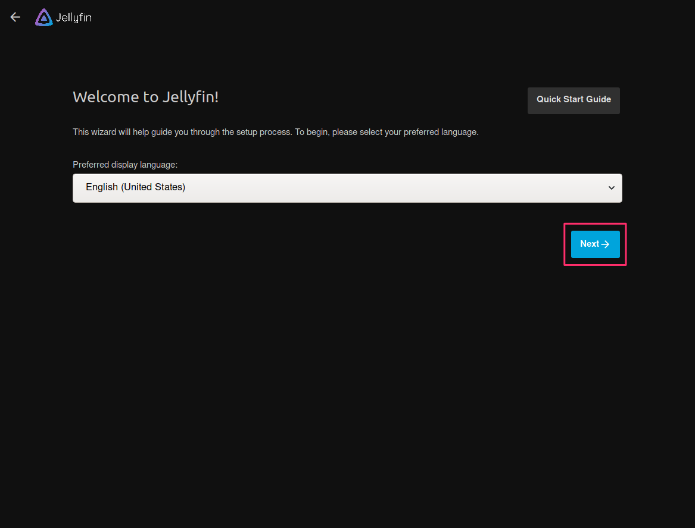
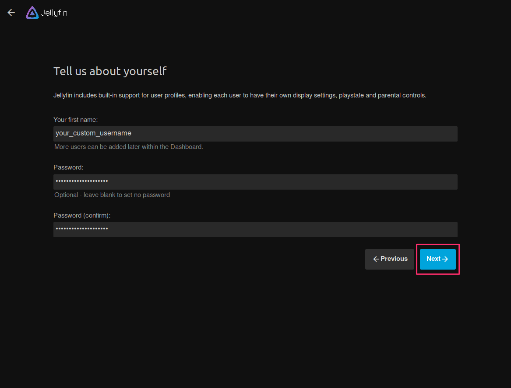
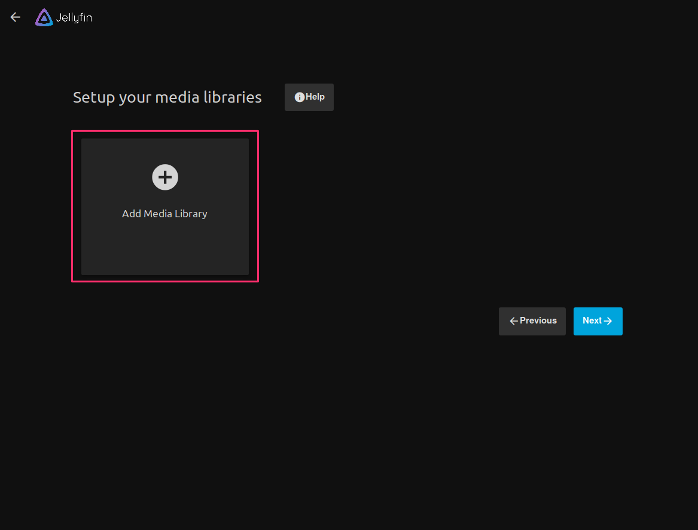
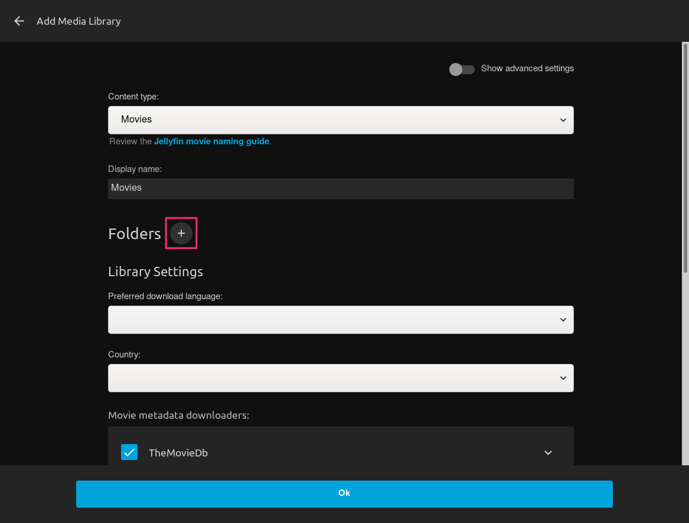
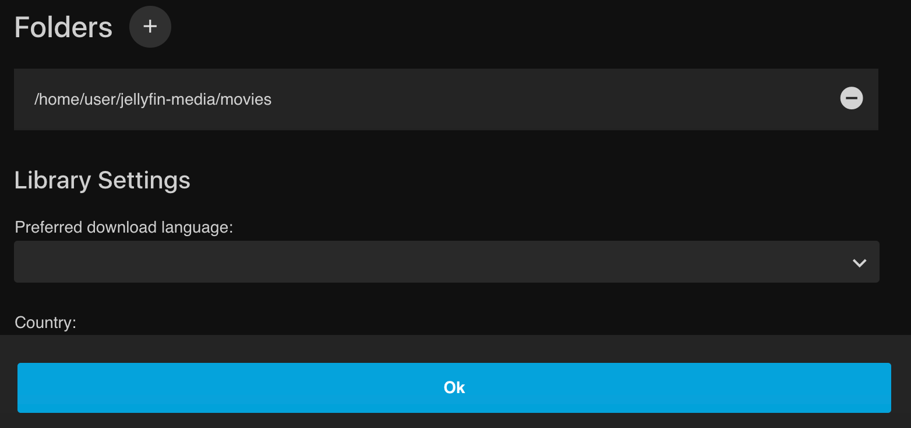
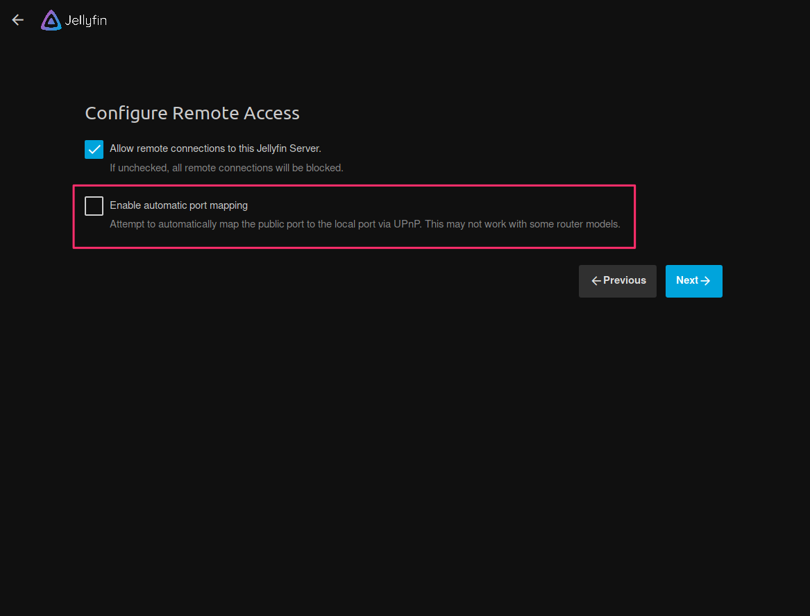
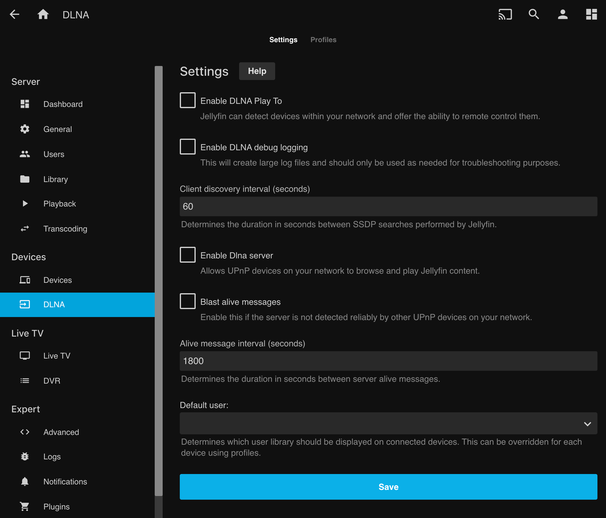
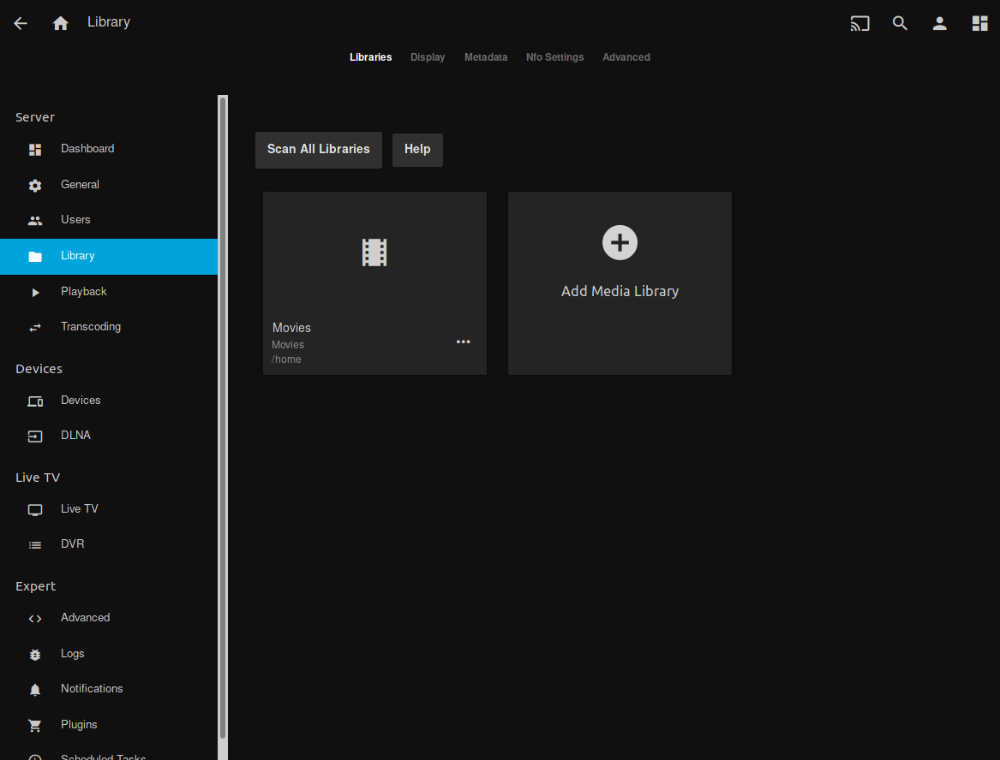
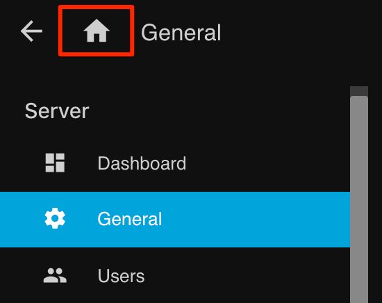

Jellyfin is an open source media library management and streaming platform, similar to [Plex](https://www.plex.tv/). This document guides you through the process of installing and configuring **Jellyfin** on your Linode running Ubuntu 18.04.

In this guide you complete the following:

- [Install and configure Jellyfin on a Linode](#install-jellyfin)
- [Create a Reverse Proxy for Jellyfin](#create-a-reverse-proxy-for-jellyfin)

## Before you Begin

1. If you have not set up your Linode yet, check out our [Getting Started](/docs/products/platform/get-started/) guide and complete the steps for setting your Linode’s hostname and timezone.

2. Follow up with our [Setting Up and Securing a Compute Instance](/docs/products/compute/compute-instances/guides/set-up-and-secure/) guide to create a standard user account with `sudo` privileges.

3. Run the following command to upgrade your packages:

        sudo apt-get update && sudo apt-get upgrade

    
This guide is written for a non-root user. Commands that require elevated privileges are prefixed with `sudo`. If you’re not familiar with the `sudo` command, see the [Users and Groups](/docs/guides/linux-users-and-groups/) guide.
    

## Install Jellyfin

1. Install and enable HTTPS transport for APT:

        sudo apt install apt-transport-https

2. Enable the Universe repository for all of the `ffmpeg` dependencies:

        sudo add-apt-repository universe

3. Import the GPG signing keys from the Jellyfin team:

        wget -O - https://repo.jellyfin.org/ubuntu/jellyfin_team.gpg.key | sudo apt-key add -

4. Create a new file located at `/etc/apt/sources.list.d/jellyfin.list`

        sudo touch /etc/apt/sources.list.d/jellyfin.list

5. Add the Jellyfin `apt` repository to your Linode.

        echo "deb [arch=$( dpkg --print-architecture )] https://repo.jellyfin.org/ubuntu $( lsb_release -c -s ) main" | sudo tee /etc/apt/sources.list.d/jellyfin.list

    
Current supported releases are `Cxenial`, `bionic`, `cosmic`, and `disco`. Since we're using Ubuntu 18.04, `lsb_release` becomes `bionic`.


    The output, and the content of the `/etc/apt/sources.list.d/jellyfin.list`, should look something like this:

    
deb [arch=amd64] https://repo.jellyfin.org/ubuntu bionic main


6. Finally, update your packages and install Jellyfin

        sudo apt update && sudo apt install jellyfin

## Configure Jellyfin

Now that Jellyfin is successfully installed, it needs to be configured and pointed to our media.

### Initial Setup

1. Setting up Jellyfin is done through the web interface. Before you can access the web interface, disconnect from SSH and create a secure tunnel via SSH from your local host to your Linode.

        ssh user@192.0.2.1 -L 8888:localhost:8096

    
Substitute `user` with the `sudo user` on your Linode, and `192.0.2.1` with your Linode's IP address.


1. Open your browser and navigate to `http://localhost:8888/`. You should now see the Jellyfin first-time configuration screen. Start by selecting your preferred language from the drop down menu. Then click the **Next** button to continue.

    

1. Create your user account and password. Then click the **Next** button to continue.

    

1. Now you create the directories to store your media on your Linode. For example, if you want to have music and movies on your server, you would create a directory to store them by using the following command in your terminal:

        cd ~/
        sudo mkdir -p jellyfin-media/music && sudo mkdir jellyfin-media/movies

1. Back in your browser, now that your account is created, we can add your media. Click on the **Add Media Library** button to begin this process.

    

    
Each kind of content type provides a different set of options for you to configure, such as where you would like your metadata retrieved from, etc.


1. Content in Jellyfin is organized into Libraries. Libraries can have multiple directories from which they aggregate their media. You can specify directories using the Folders plus **(+)** button. Click the **(+)** button to add the folder you created earlier.

    

1. In the **Folders**  field, enter the full path to your folder (`/home/username/jellyfin-media/movies`) then click the **Ok** button.

    

1. You can add as many libraries as you'd like both now and [later through your dashboard](#add-and-organize-media)
    Click the blue **Next** button to proceed to the next sections.

1. Select your preferred metadata Language, then click on the **Next** button.

1. Disable port mapping by unchecking the *Enable automatic port mapping* option as this feature can pose a security risk in a cloud environment. Port Mapping is generally enabled in a local environment behind a home router, where you may want your Jellyfin server to be able to seamlessly connect to other devices.

    

1. Click the **Next** button. Your setup is now complete and you are required to sign in as the user with the password you setup earlier.

### Disable Unneeded Features (Recommended)

[DLNA](https://en.wikipedia.org/wiki/Digital_Living_Network_Alliance) is a protocol that incorporates [Universal Plug and Play](https://en.wikipedia.org/wiki/Universal_Plug_and_Play) (or UPnP) standards for digital media sharing across devices. Port `1900` is openly available and any DLNA device or application can have full unrestricted access to your content. Therefore, we recommend disabling DLNA if you are not using it.

Click the "hamburger" menu in the top left corner of Jellyfin and choose *Dashboard*. Then on the left side of the screen choose *DLNA*, then disable and save your DLNA settings.

### Add and Organize Media

- You can add as many libraries as you'd like through the *Dashboard* under *Libraries* at any time.

    

- Media can be added to individual folders from inside your Linode using various [file transfer tools](/docs/guides/tools-reference/file-transfer/) and [download methods](/docs/guides/download-resources-from-the-command-line-with-wget/).
- Once files in a folder are added to your Jellyfin server, they can be accessed from your *Home Menu* by clicking on the Home icon at top left of the page after selecting the hamburger menu.

    

## Create a Reverse Proxy for Jellyfin

Jellyfin primarily works as a web frontend for your media. That means you generally want to proxy the default Jellyfin websocket to requests. Jellyfin supports a [large number of server software solutions](https://jellyfin.org/docs/general/networking/apache.html) for this purpose, though in this guide, the example is [Apache](http://httpd.apache.org/).

1. Install Apache with the following command:

        sudo apt install apache2

1. Enable proxy settings for Apache with the following commands:

        sudo a2enmod proxy
        sudo a2enmod proxy_http

1. Open a new virtual host file for your configuration. Replace `example.com` in this example with the domain name you are using:

        sudo nano /etc/apache2/sites-available/jellyfin.example.com.conf

    
Although nano is used in this example, feel free to use the text editor of your choice.


1. Use the following Apache virtual host configuration to create your reverse proxy. Replace `jellyfin.example.com` with your domain/subdomain.

    
<VirtualHost *:80>
    ServerName jellyfin.example.com
    ErrorLog /var/log/apache2/jellyfin-error.log
    CustomLog /var/log/apache2/jellyfin-access.log combined

    ProxyPreserveHost On

    ProxyPass "/embywebsocket" "ws://127.0.0.1:8096/embywebsocket"
        ProxyPassReverse "/embywebsocket" "ws://127.0.0.1:8096/embywebsocket"

    ProxyPass "/" "http://127.0.0.1:8096/"
        ProxyPassReverse "/" "http://127.0.0.1:8096/"
</VirtualHost>


1. Enable your new website:

        sudo a2ensite jellyfin.example.com.conf

1. Restart Apache to fully enable your settings:

        sudo systemctl restart apache2

You may also want to [set up SSL encryption for this virtual host](/docs/guides/secure-http-traffic-certbot/). For more information regarding this configuration, see Jellyfin's [reverse proxy documentation](https://jellyfin.org/docs/general/networking/index.html#running-jellyfin-behind-a-reverse-proxy)
