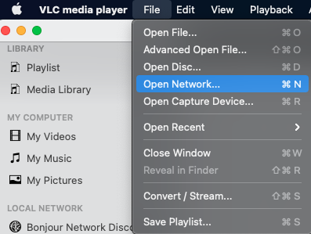

Live streaming has become an important way for creators, gamers, instructors, and media personalities to reach new audiences. Many live streamers are using sites such as Twitch and Facebook Live to stream. However, an *Real-Time Messaging Protocol* (RTMP) Streaming Server is another popular way to distribute live streams. RTMP allows you to send your stream to a central server, which can store it or retransmit it for audience playback. This guide discusses how to configure an RTMP streaming server, and how to use open source software to broadcast, and connect to, a stream. It also explains how to set up multi-streaming to transmit a live stream simultaneously to several social media sites.

## Before You Begin

1.  Familiarize yourself with our [Getting Started](/docs/getting-started/) guide and complete the steps for setting your Linode's hostname and timezone.

2.  This guide will use `sudo` wherever possible. Complete the sections of our [Securing Your Server](/docs/security/securing-your-server/) to create a standard user account, harden SSH access and remove unnecessary network services. Do **not** follow the Configure a Firewall section yet--this guide includes firewall rules specifically for an OpenVPN server.

3.  Update your system:

        sudo apt-get update && sudo apt-get upgrade

<!-- Include one of the following notes if appropriate. --->


This guide is written for a non-root user. Commands that require elevated privileges are prefixed with `sudo`. If you’re not familiar with the `sudo` command, see the [Users and Groups](/docs/tools-reference/linux-users-and-groups/) guide.


## More Information About RTMP

RTMP is a networking protocol, not an application. It uses the *Transmission Control Protocol* (TCP) layer, so most media servers can process it. RTMP was originally a proprietary technology belonging to Adobe and was designed for high-performance transmission of audio, video, and data. However, it is now available for free public use and is currently one of the most popular streaming formats. Most encoders can transmit RTMP, and the large media sites accept it, but browser support can be patchy. We recommend you use a dedicated media player such as the free open source [*VLC Media Player*](https://www.videolan.org/vlc/) to receive streams.

If you want to learn more about the technical details behind RTMP, you can find out more on the [*Adobe development site*](https://www.adobe.com/devnet/rtmp.html). The [*Wikipedia page*](https://en.wikipedia.org/wiki/Real-Time_Messaging_Protocol) also provides a good introduction.

## Advantages of Using a RTMP Streaming Server

RTMP is a robust protocol offering low-latency, persistent connections, and reliable transmission. Streams are split into fragments, with the size negotiated between the client and the streaming server. Different streams can be multiplexed over the same connection. It is fairly easy to set up and use RTMP, but you must use RTMP-compatible software to transmit your stream to the server.

Using an RTMP server also allows you to implement multi-streaming, which reduces the amount of bandwidth used on your local connection. You only transmit one copy of your stream to the server, even if you want to stream to multiple platforms. RTMP takes care of forwarding copies of your stream to as many sites as you want. This makes it easy and convenient to simultaneously live stream to YouTube, Facebook, and Switch at the same time. However, for some sites you must transcode the stream into a particular format. This means you must alter or recompress your stream in some way.

## System Requirements

An RTMP streaming server does not necessarily require much processing power or memory. For a single stream, a [*Linode 1G*](https://www.linode.com/products/dedicated-cpu/) solution should suffice. If you are retransmitting to several sites or have to convert a stream into a different format, you might require a more powerful solution. In this case, we recommend a host with at least 4GB of memory, such as a [*Linode 4GB*](https://www.linode.com/products/dedicated-cpu/) solution.

## A Summary of the RTMP Streaming Server Configuration Process

These installation instructions are geared for Ubuntu 20.04, but the procedure is similar on most Linux distributions. RTMP is a protocol rather than an application, so you do not have to install it. To make use of RTMP, you must install a web server, such as [*NGINX*](https://www.nginx.com/), and perform several other configuration steps. The following sections describe each step in more detail:

1.  Installing NGINX and Related Components.
2.  Configuring NGINX to Support RTMP.
3.  Configuring and Using the Open Broadcaster Software (OBS) Client.
4.  Viewing and Testing the Stream.
5.  Setting Up and Testing Multi-streaming.

## Installing NGINX and Related Components

NGINX features full RTMP support and we recommend it as your RTMP streaming server. Follow these steps to install NGINX.

1.  Upgrade your host with the latest package updates.

        sudo apt update
        sudo apt upgrade
2.  Install the NGINX server, RTMP support, and other related modules.

        apt install build-essential libpcre3 libpcre3-dev libssl-dev nginx-full libnginx-mod-rtmp ffmpeg
3.  Verify the status of the server.

        systemctl status nginx.service
    After installation, `Systemctl` returns a status of `active`.
    
nginx.service - A high performance web server and a reverse proxy server
     Loaded: loaded (/lib/systemd/system/nginx.service; enabled; vendor preset: enabled)
     Active: active (running) since Sun 2021-02-14 15:21:39 UTC; 41s ago
    

## Configuring NGINX to Support RTMP

You can configure NGINX through the `nginx.conf` file. In order to stream, you must configure some server parameters and create a stream application. This section explains how to configure RTMP to accept a stream and make it available for viewing. Multi-streaming is discussed in a later section.

1.  Open the NGINX configuration file, typically located at `/etc/nginx/nginx.conf`, in a text editor.

        sudo vi /etc/nginx/nginx.conf
    
If you cannot find the`nginx.conf` file, run the command `sudo nginx -t`. It displays the file's location and validates its syntax.

2.  Add some RTMP configuration to the end of the `nginx.conf` file as shown in this example.
    *   The `chunk_size` setting configures the fragment size. The optimal size varies depending on the server, but `4096` is a reasonable default value.
    *   The default port for the `listen` variable is `1935`.
    *   Within the server configuration, create an application and give it a name. This example uses `livestream` as the application name, but for security reasons we recommend you choose a more distinctive name. You must set `live` to `on` in order to enable streaming.
    *   If you want to save a copy of your streams, set the `record` variable to `all`. Otherwise, set it to `none`.
    *   If you set `record` to `all`, you must configure a value for `record_path`. This is where the recordings of your streams are saved.
    *   We recommend adding an authentication method so your streams cannot be hijacked. Defining a location for `on_publish` here allows you to enable password validation in a subsequent step.

    
...
rtmp {
        server {
                listen 1935;
                chunk_size 4096;
                notify_method get;

                application livestream {
                            live on;
                            on_publish http://localhost/auth;
                            record all;
                            record_path /var/www/html/streams;
                            record_unique on;
                }
        }
}
    

3.  Create a directory to save your streams. The directory location should match the value of `record_path`.

        sudo mkdir -p /var/www/html/streams
4.  Set the permissions for the new directory so the server can write to it.

        sudo chown -R www-data:www-data /var/www/html/streams/
5.  If you intend to enforce authentication for inbound streams, open the `/etc/nginx/sites-enabled/default` file and add the following information inside the `server` block. Replace `yourpassword` with a more secure password. If the password you provide when you start your stream matches the password in this file, the streaming server returns a HTML code of `200` ("OK"). If the password is incorrect, it returns a code of `401` ("Unauthorized"), and disconnects the session.

    
...
listen 8080;
location /auth {
        if ($arg_pwd = 'yourpassword') {
            return 200;
            }
            return 401;
}
    
6.  Restart the server in order to apply your changes.

        systemctl restart nginx.service
7.  Review the server status to ensure it is still running. Look for a status of `active`.

        systemctl status nginx.service


You can find more detailed examples of NGINX configurations for RTMP on the [*NGINX GitHub page*](https://github.com/arut/nginx-rtmp-module#example-nginxconf).

You can force viewers to authenticate before watching a stream with the `on_play` variable, which works the same way as `on_publish`. For extra security, you can remove the `html` configuration from this file if you are not planning to use NGINX as a web server. Ensure you do not delete the `events` configuration block while doing so.


## Configuring and Using the Open Broadcaster Software (OBS) Client

Streamers typically use either a commercial web-based streaming service or an application on their own computer. To stream to your RTMP server, we recommend the [*Open Broadcaster Software (OBS)*](https://obsproject.com/). OBS is a free open source broadcasting application which is flexible and straightforward to use. It is available for most common operating systems including Ubuntu.

1.  Go to the [*OBS Website*](https://obsproject.com/) and choose the appropriate download for your system. This software should be installed on your own computer and not on the RTMP streaming server.

2.  Open the application and look for the `Controls` menu in the lower right part of the application window. Click the **Settings** button.

    
3.  When the Settings window appears, click **Stream** on the left-hand panel, and enter the following information about your stream:
    *   For `Service`, enter `Custom`.
    *   For `Server`, enter `rtmp://<yourserverIP>/<RTMP_application>`. Replace `yourserverIP` with the actual IP address of your streaming server. Replace `RTMP_application` with the name you chose for your application in the RTMP configuration block. In the earlier example, we used the name`livestream`.
    * For `Stream Key`, enter `<your_stream_name?pwd=yourpassword>`. The stream name can be any name you want to identify the stream, while `yourpassword` is the password you configured in `/etc/nginx/sites-enabled/default`.

    
4.  To begin streaming, click on the **Start Streaming** button in the lower right of the application in the `Controls` section.
    
    
A quick way to test your stream is with a scrolling text message. Click the **+** button under the `sources` menu to create a text object. When you have created the object, right-click on the source and select **filter** to apply a scrolling effect. See the [*OBS Wiki*](https://obsproject.com/wiki/) for more information.
    
5.  If you are recording your streams, you can easily confirm whether the server is accepting the streamed input or not. Navigate to the `record_path` directory (from your RTMP configuration), and list its contents with the `ls` command. If you see a new file, the streaming server is correctly receiving and saving your stream.

        cd /var/www/html/streams
        ls
    
Streaming at too high a rate could cause OBS to disconnect from the server. If your connection bounces, click  **Settings** and then select **Output**. Set the `Video Bitrate` to a lower value. OBS provides some helpful debugging tips on the [*OBS GitHub page*](https://github.com/obsproject/obs-studio/wiki/Dropped-Frames-and-General-Connection-Issues).
    

## Viewing and Testing the Stream

You are now ready to connect to and view your stream in a multimedia player. We recommend the open source [*VLC Video Player*](https://www.videolan.org/vlc/) because it is simple, free, has good performance, and runs on all platforms. These instructions and the associated screenshots are for an Apple desktop, but the process is similar for other operating systems.

1.  Navigate to the [*VideoLAN site*](https://www.videolan.org/vlc/) and download the VLC software for your operating system.
2.  Click on the **File** menu and select **Open Network...**.

    
3.  This displays the "Open Source" dialogue box. In the `URL` field, enter your stream information in the format of `rtmp://<yourserverIP>/<RTMPApplication>/<your_stream_name>`. Replace `yourserverIP` with the actual IP of your streaming server, and `RTMPApplication` with the name of the stream application from the server configuration file. The value for `your_stream_name` must match the stream name from OBS. Finally, check the `Stream output` box.

    


Beyond the basics, VLC can get complicated. If you run into trouble, consult the [*VideoLAN support page*](https://www.videolan.org/support/).
    

## Setting Up and Testing Multi-streaming

RTMP is a particularly good choice for streaming to multiple sites at once because it efficiently saves bandwidth. Instead of having to broadcast a separate stream to each channel, you can send one stream to the RTMP streaming server. The server then handles the redistribution of streams, sending one copy to each endpoint. You can enable multi-streaming in your RTMP configuration with a `push` entry for each destination. To set up multi-streaming, follow this procedure.

1.  Open the `/etc/nginx/nginx.conf` file for editing.

        sudo vi /etc/nginx/nginx.conf
2.  Locate the ingest information for the service you want to stream to. For example, Twitch provides a [*list of all of its ingest points*](https://stream.twitch.tv/ingests/). Find the ingest point closest to you and take note of its ingest URL. For YouTube, you can find the ingest server URL on your YouTube Studio page. Consult the documentation for your streaming service for more detailed information.
3.  Add a push notification for each service to the stream application block within the RTMP configuration. The configuration must be in the format `push rtmp://<streaming_service_ingest_url>/<stream_key>;`. The `streaming_service_ingest_url` is the ingest URL you located in the previous step. Each streaming service provides a way for you to determine your private `stream_key`. In Twitch, you can find your stream key from your dashboard, while in YouTube, it is in the same place you found the ingest server URL. This example illustrates configuration to push to Twitch's London ingest server.
    
...
rtmp {
        server {
...
                application livestream {
...
                            push rtmp://lhr04.contribute.live-video.net/app/<stream_key>;
                }
        }
}
    
4.  Add additional `push` entries for the other sites you are streaming to.
5.  Restart the server in order to apply your changes.

        systemctl restart nginx.service
6.  Start your stream again. You can now view it on the streaming site of your choice.
7.  **(Optional)** For enhanced security and more granular control, you can create an application for each streaming service and call it from the main application. This technique gives you the ability to override the `livestream` settings and turn off recording for some services. Edit each `push` notification in your `livestream` application to push to the new application. In the example above, change the push configuration for Twitch to `push rtmp://localhost/twitch;`. Then add the configuration for `application twitch` as shown below. Restart the server and your stream once you are done to verify your changes are correct.
    
...
rtmp {
        server {
...
                application livestream {
...
                            push rtmp://localhost/twitch;
                }
                 application twitch {
                            live on;
                            record off;
                            allow publish 127.0.0.1;
                            deny publish all;
                            push rtmp://lhr04.contribute.live-video.net/app/<stream_key>;
                }
        }
}
    


Ingest servers can change without notice. We recommend you review the specifications for your streaming service regularly.
Some streaming services, such as Facebook Live, require you to transcode your stream into their particular format. You can accomplish this using the FFmpeg library. See the [*NGINX GitHub page*](https://github.com/arut/nginx-rtmp-module) for a sample configuration.
