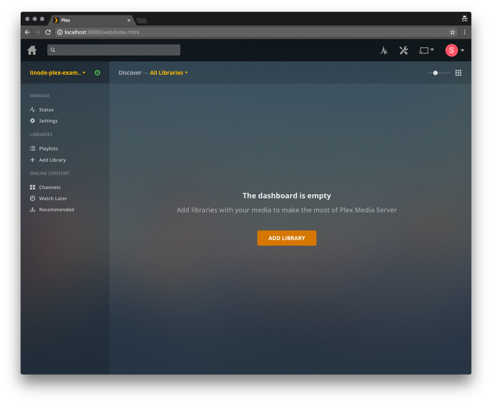
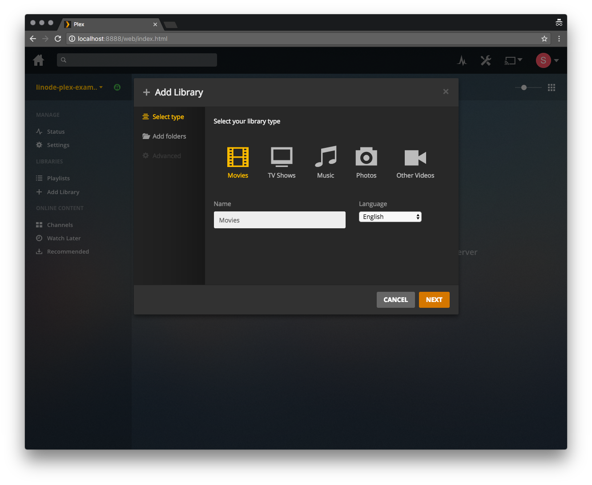

[Plex](https://www.plex.tv/) is a feature-rich media library platform that allows you to organize and stream your digital video and audio from virtually anywhere. Basic Plex features are [free](https://support.plex.tv/articles/202526943-plex-free-vs-paid/), while the paid Plex Pass adds additional features.

This guide demonstrates how to set up **Plex Media Server** on a Linode running CentOS 7, and how to connect client devices. A Plex media server could benefit from large amounts of disk space, so consider using Linode's [Block Storage](/docs/products/storage/block-storage/) service with this setup.

## Before you Begin

- You will need root access to your Linode, or a [limited user account](/docs/products/compute/compute-instances/guides/set-up-and-secure/#add-a-limited-user-account) with `sudo` privilege.

- Set your system's [hostname](/docs/products/compute/compute-instances/guides/set-up-and-secure/#configure-a-custom-hostname) and [time zone](/docs/products/compute/compute-instances/guides/set-up-and-secure/#set-the-timezone).

- Plex requires that you create an [account](https://www.plex.tv/features/) to make use of the service, and provides additional features such as DVR capability and offline viewing if you pay for their premium [Plex Pass](https://www.plex.tv/features/plex-pass/) offering. To complete this guide, you will need a Plex account.

## Install and Configure Plex

1.  Go to [Plex's download page](https://www.plex.tv/media-server-downloads/). Select *Linux*, and then click *Choose Distribution*.

    

2.  In the menu that appears, right-click on *CentOS 64-bit (RPM for CentOS 7 or newer)* and copy the download link. Use `cURL` to download the .rpm package directly to your Linode. The example below uses the current link for CentOS at the time of writing. Be sure you install the most recent version of Plex.

        curl -O https://downloads.plex.tv/plex-media-server/1.14.1.5488-cc260c476/plexmediaserver-1.14.1.5488-cc260c476.x86_64.rpm

3.  Update your system and install Plex:

        sudo yum update
        sudo yum install plexmediaserver*.rpm

4.  Enable Plex Media Server to start on reboot and then start the server:

        sudo systemctl enable plexmediaserver
        sudo systemctl start plexmediaserver

5.  Finally, you'll create the directories that will store your Plex media. In this example we'll create library directories for `movies` and `television` within a `plex-media` directory. These will be located within your user's `/home`:

        cd ~/
        mkdir -p plex-media/movies && mkdir plex-media/television

6.  Administration of the Plex server is performed via its web interface. Before you can connect to the web interface from your workstation, you will first need to create an SSH tunnel to your Linode. Substitute `user` with the `sudo` user on your Linode, and `192.0.2.0` with its IP address.

        ssh user@192.0.2.0 -L 8888:localhost:32400

7.  Go to  `http://localhost:8888/web` in a web browser and log in to Plex.

    

8.  Give your Plex server a name. Be sure to leave the **Allow me to access my media outside my home** box checked, and click **Next**:

    

## Add and Organize Media

1.  Now that you've signed into Plex, you should see the following page. Click the **Add Library** button to start setting up your media libraries.

    

1.  Select your library type, and click **Next**.

    

1.  Navigate to the corresponding media directory that you created previously, then click **Add**.

    

1.  You can add additional libraries by clicking the **+** symbol next to the **Libraries** list on the Plex side bar:

    

1.  Add your media to the appropriate directories. Be sure to review Plex's [naming conventions](https://support.plex.tv/hc/en-us/categories/200028098-Media-Preparation) for media files to ensure that your files are identified correctly.

## Disable DLNA (Recommended)

[DLNA](https://en.wikipedia.org/wiki/Digital_Living_Network_Alliance) is a protocol that incorporates [Universal Plug and Play](https://en.wikipedia.org/wiki/Universal_Plug_and_Play) (or UPnP) standards for digital media sharing across devices. Any DLNA device or application can have full unrestricted access to your Plex content, so disable DLNA if you won't be using it.

From the Plex web interface, click the wrench icon in the upper right corner and then click **DLNA** in the left sidebar. Uncheck **Enable the DLNA server** and click **Save Changes**.

## Connect to your Plex Server

Now that your server is set up, you're ready to connect to it from a Plex client. Plex is supported by a number of different platforms and you can find a full list of client applications [here](https://support.plex.tv/hc/en-us/categories/200006953-Plex-Apps).

The examples provided here will use Plex Media Player for macOS.

1.  [Download](https://www.plex.tv/downloads/) the appropriate media player application or install it via your device's app store.

1.  Sign in to the Plex client app using the same Plex account as your server.

1.  Your Plex client will have a dropdown menu where you can select your server. Once it's selected, you can navigate to the library with the content that you wish to view:

    
