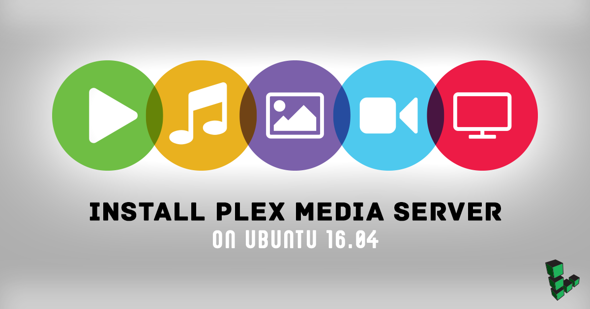
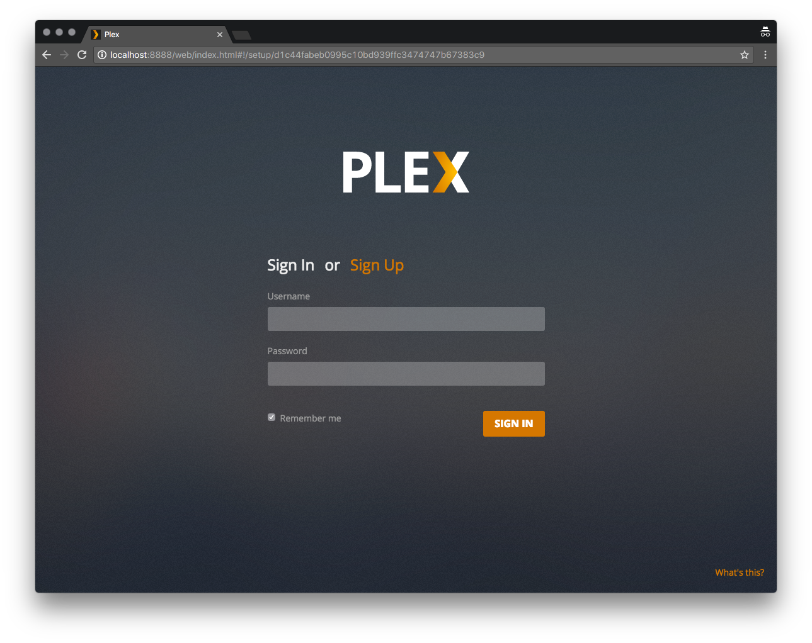
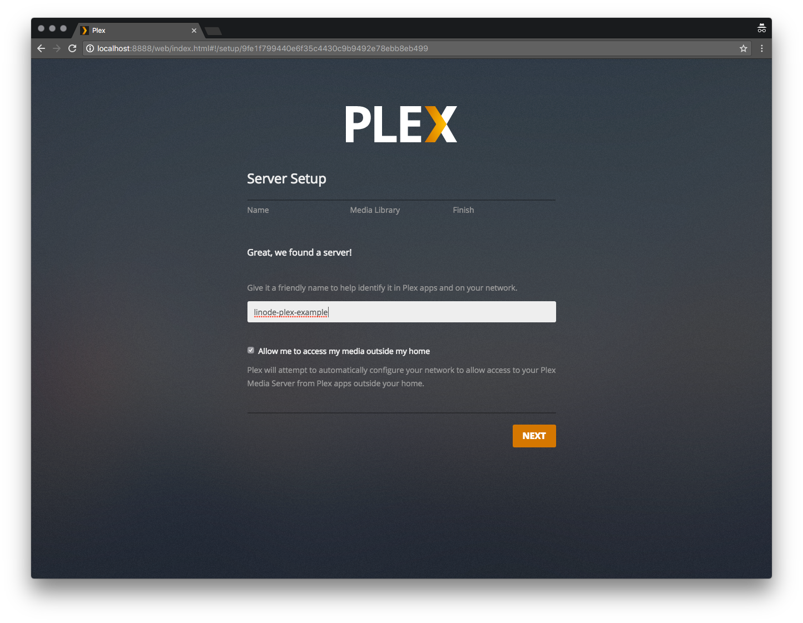
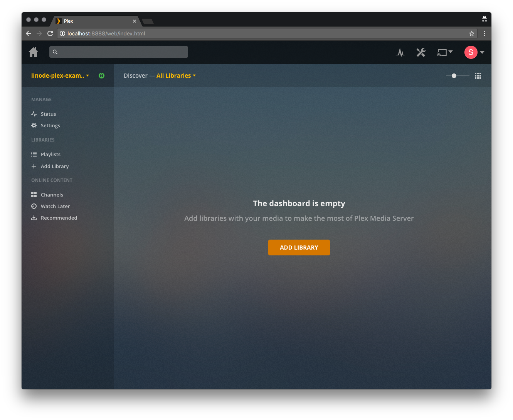
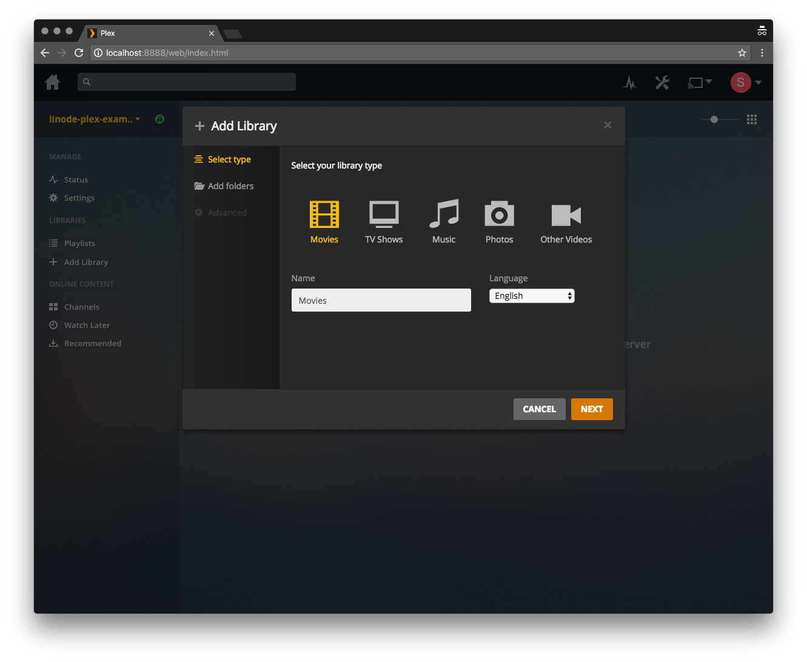
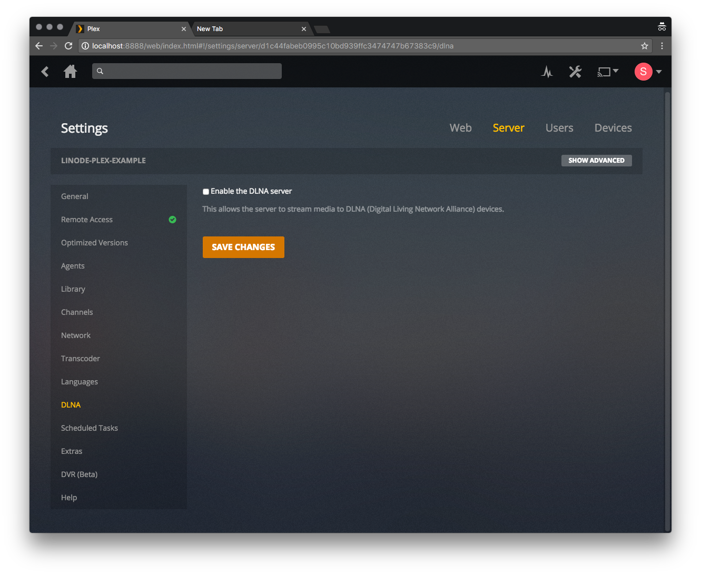

[Plex](https://www.plex.tv/) is a feature-rich media library platform that allows you to organize and stream your digital video and audio from anywhere. This guide shows you how to set up the **Plex Media Server** on your Linode running Ubuntu 18.04 LTS, as well as how to connect to your media server from a [Plex client application](https://www.plex.tv/apps-devices/. A Plex media server could benefit from large amounts of disk space, so consider using our [Block Storage](/docs/products/storage/block-storage/) service with this setup.


This guide is written for a non-root user. Commands that require elevated privileges are prefixed with `sudo`. If you’re not familiar with the `sudo` command, see the [Users and Groups](/docs/guides/linux-users-and-groups/) guide.


## Prerequisites to Install Plex Media Server on Ubuntu 18.04

1.  If you have not already done so, create a Linode account and Compute Instance. See our [Getting Started with Linode](/docs/products/platform/get-started/) and [Creating a Compute Instance](/docs/products/compute/compute-instances/guides/create/) guides.

1.  Follow our [Setting Up and Securing a Compute Instance](/docs/products/compute/compute-instances/guides/set-up-and-secure/) guide to update your system. You may also wish to set the timezone, configure your hostname, create a limited user account, and harden SSH access.

1.  Create a [Plex account](https://www.plex.tv/). This is required to make use of the service, and provides additional features such as DVR capability and offline viewing if you pay for their premium [Plex Pass](https://www.plex.tv/features/plex-pass/). Purchasing a premium Plex Pass is optional.

## Installing Plex Media Server on Ubuntu 18.04

This section shows you how to install the Plex Media Server on your Ubuntu 18.04 Linode.

1.  Go to the [Plex Server Downloads](https://www.plex.tv/media-server-downloads/) page and select **Linux** from the **Plex Media Server** dropdown menu.

1. Click on the **Choose Distribution** button and copy the installation link for Ubuntu. For example, the **Ubuntu (16.04+) / Debian (8+) - Intel/AMD 64-bit** link is compatible with a Linode running Ubuntu 18.04.

    

1. [Connect to your Ubuntu 18.04 Linode via SSH](/docs/products/compute/compute-instances/guides/set-up-and-secure/#connect-to-the-instance) and use `wget` to download the installer via the copied link. Replace the link with your selected distribution as shown in the example below:

        wget https://downloads.plex.tv/plex-media-server/1.14.1.5488-cc260c476/plexmediaserver_1.14.1.5488-cc260c476_amd64.deb

    This example uses the current link for Ubuntu, at the time of writing. Be sure to use the up-to-date version supplied on the Plex website.

1.  Use `dpkg` to install the Plex `.deb` files (Plex distribution) you downloaded using `wget` with the following command:

        sudo dpkg -i plexmediaserver*.deb

1.  To start the Plex Media Server automatically when booting your Ubuntu, run the following commands:

        sudo systemctl enable plexmediaserver.service
        sudo systemctl start plexmediaserver.service

## Configuring Plex Media Server on Ubuntu 18.04

In this section, you complete your server setup and start adding media libraries. Run the commands from this section on your local computer unless otherwise stated.

1.  Setup an SSH tunnel to your Linode. Run the following command by replacing the username with your Linode system's username and `192.0.2.1` with your Linode’s IP address:

        ssh user@192.0.2.1 -L 8888:localhost:32400

1.  Open a browser and navigate to `http://localhost:8888/web` to view the Plex web interface. Input your Plex account username and password to proceed with the setup process:

    

1.  Give your Plex server a name. Be sure to leave the **Allow me to access my media outside my home** box **checked**, and click **Next**:

    

1.  Finally, [connect to your Linode via SSH](/docs/products/compute/compute-instances/guides/set-up-and-secure/#connect-to-the-instance) to create the directories that store your Plex media. In the example, you create library directories for `movies` and `television` within a `plex-media` directory. These are located within your user's home directory (`/home/username/`):

        cd ~/
        mkdir -p plex-media/movies && mkdir plex-media/television

## Organizing Plex Media Server on Ubuntu 18.04

The steps in this section are performed using your Plex Media Server's web interface.

1.  Sign into your Plex Media Server's account using the same credentials you used in the [Configuring Plex Media Server on Ubuntu 18.04](#configuring-plex-media-server-on-ubuntu-1804) section.

1. Once logged in, you should see the example page. Click the **Add Library** button to start setting up your media libraries:

    

1.  Select your library type, and click **Next**:

    

1.  Navigate to the media directory that you created previously (`/home/username/plex-media/movies`), then click **Add**:

    

1.  You can add additional libraries by clicking the **+** symbol next to the **Libraries** list on the Plex side bar:

    

1.  Add your media to the appropriate directories. Be sure to review Plex's [naming conventions](https://support.plex.tv/articles/naming-and-organizing-your-movie-media-files/) for media files to ensure that your files are identified correctly.

### Disabling DLNA (Recommended)

In more recent versions of Plex Media Server, [DLNA](https://en.wikipedia.org/wiki/Digital_Living_Network_Alliance) is usually disabled. However, with certain older distributions, you have to disable it manually. DLNA server uses [Universal Plug and Play](https://en.wikipedia.org/wiki/Universal_Plug_and_Play) Protocol (UPnP) and is not specific to a user account. This means any app or device in a network can access files without restriction if DLNA is enabled. This section shows you how to disable DLNA.

1.  While logged into your Plex Media Server account, click on the **wrench icon** at the top and select **Server**.

1.  Navigate to the **DLNA** section, uncheck **Enable the DLNA server**, and click **Save Changes**:

## Connecting to Your Plex Server

Now that your server is set up, you’re ready to connect to it from a Plex client application. You can connect to your Plex Server from a device, like an Apple device.

1. Navigate to Plex's [list of streaming devices](https://www.plex.tv/apps-devices/).

1. Select the right client for your device and download it.

1. Next, sign-in to your Plex client application and select your server from the dropdown menu. Now, you can browse media files available on your Plex server.

## Configuring Plex Media Server Firewall on Ubuntu 18.04

In this section you set up a firewall on your Plex Media Server using the [Uncomplicated Firewall (UFW)](/docs/guides/configure-firewall-with-ufw/).

1. UFW is usually pre-installed on Ubuntu. If UFW isn’t installed, run the following command to install it on your Ubuntu system:

        sudo  apt-install ufw

1. To confirm that UFW is installed, view its status by running the example command. If the output returns a `Status: active` confirmation, UFW is installed.

        sudo ufw status verbose

1. Using a text editor of your choice, create a new UFW application profile file in the following location `/etc/ufw/applications.d/plexmediaserver`. Copy and past the contents of the example file to your own `plexmediaserver` file:

    
[plexmediaserver]
title=Plex Media Server (Standard)
description=The Plex Media Server
ports=32400/tcp|3005/tcp|5353/udp|8324/tcp|32410:32414/udp

[plexmediaserver-dlna]
title=Plex Media Server (DLNA)
description=The Plex Media Server (additional DLNA capability only)
ports=1900/udp|32469/tcp

[plexmediaserver-all]
title=Plex Media Server (Standard + DLNA)
description=The Plex Media Server (with additional DLNA capability)
ports=32400/tcp|3005/tcp|5353/udp|8324/tcp|32410:32414/udp|1900/udp|32469/tcp


1. Save and update your UFW application profile:

        sudo ufw app update plexmediaserver

1. Apply these UFW rules by running:

        sudo ufw allow plexmediaserver-all

1. You should see a similar output, which confirms that your new firewall rules are in place.

    
To                                    Action      From
--                                    ------      ----
22/tcp                                ALLOW IN    Anywhere
32400/tcp (plexmediaserver-all)       ALLOW IN    Anywhere
3005/tcp (plexmediaserver-all)        ALLOW IN    Anywhere
5353/udp (plexmediaserver-all)        ALLOW IN    Anywhere
8324/tcp (plexmediaserver-all)        ALLOW IN    Anywhere
32410:32414/udp (plexmediaserver-all) ALLOW IN    Anywhere
1900/udp (plexmediaserver-all)        ALLOW IN    Anywhere
32469/tcp (plexmediaserver-all)       ALLOW IN    Anywhere
