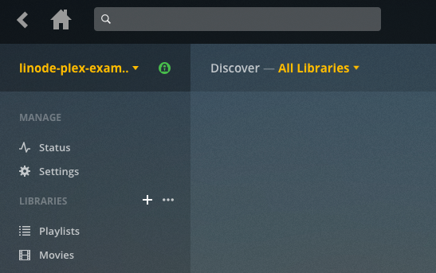

[Plex](https://www.plex.tv/) is a feature-rich media library platform that allows you to organize and stream your digital video and audio from anywhere. This guide will show you how to set up the **Plex Media Server** on your Linode running Ubuntu 18.04 LTS, as well as how to connect to your media server from a [Plex client](https://support.plex.tv/hc/en-us/categories/200006953-Plex-Apps) application. A Plex media server could benefit from large amounts of disk space, so consider using our [Block Storage](/docs/platform/how-to-use-block-storage-with-your-linode) service with this setup.


This guide is written for a non-root user. Commands that require elevated privileges are prefixed with `sudo`. If you’re not familiar with the `sudo` command, see the [Users and Groups](/docs/tools-reference/linux-users-and-groups/) guide.


## Prerequisites to Install Plex Media Server on Ubuntu 18.08

1.  Familiarize yourself with our [Getting Started](/docs/getting-started/) guide and complete the steps for setting your Linode's hostname and timezone.

2.  Complete the sections of our [Securing Your Server](/docs/security/securing-your-server/) to create a standard user account with `sudo` privileges.

3.  Ensure that your system is up to date:

        sudo apt-get update && sudo apt-get upgrade

4.  Create a [Plex account](https://www.plex.tv/), which is required to make use of the service, and provides additional features such as DVR capability and offline viewing if you pay for their premium [Plex Pass](https://www.plex.tv/features/plex-pass/) offering (optional).

All four steps above are required for you to follow the next steps in this guide.

## Install Plex Media Server on Ubuntu 18.04

1.  Go to [Plex Server Downloads](https://www.plex.tv/media-server-downloads/) page and copy the installation link for Ubuntu. 

    

    Use `wget` to download the installer via the copied link. Replace the link with your selected distribution as shown in the example below:

        wget https://downloads.plex.tv/plex-media-server/1.14.1.5488-cc260c476/plexmediaserver_1.14.1.5488-cc260c476_amd64.deb

    This example uses the current link for Ubuntu, at the time of writing. Be sure to use the up-to-date version supplied on the Plex website.

2.  Use `dpkg` to install the Plex .deb files (Plex distribution) you downloaded using `wget` with the following command:

        sudo dpkg -i plexmediaserver*.deb

3.  To start Plex Media Server automatically upon booting your Ubuntu run the following commands:

        sudo systemctl enable plexmediaserver.service
        sudo systemctl start plexmediaserver.service

## Configuring Plex Media Server on Ubuntu 18.04

This section will show you how to complete your server setup and start adding media libraries.

1.  First, setup an SSH tunnel to your Linode. Run the following command by replacing the username with your username and `192.0.2.1` with your Linode’s IP address:

        ssh user@192.0.2.1 -L 8888:localhost:32400

2.  Next, open `http://localhost:8888/web` into your browser to view the Plex web interface, as shown below. Input your Plex account username and password to proceed with the setup process:

    

3.  Give your Plex server a name. Be sure to leave the **Allow me to access my media outside my home** box **checked**, and click **Next**:

    

4.  Finally, you'll create the directories that will store your Plex media. This step is performed on your Linode. In this example we'll create library directories for `movies` and `television` within a `plex-media` directory. These will be located within your user's `/home`:

        cd ~/
        mkdir -p plex-media/movies && mkdir plex-media/television

## Organizing Plex Media Server on Ubuntu 18.04 

1.  Now that you've signed into Plex, you should see the following page. Click the **Add Library** button to start setting up your media libraries:

    

2.  Select your library type, and click **Next**:

    

3.  Navigate to the corresponding media directory that you created previously, (`/home/username/plex-media/movies`) then click **Add**:

    

4.  You can add additional libraries by clicking the **+** symbol next to the **Libraries** list on the Plex side bar:

    

5.  Add your media to the appropriate directories. Be sure to review Plex's [naming conventions](https://support.plex.tv/articles/categories/media-preparation/) for media files, to ensure that your files are identified correctly.

### Disable DLNA (Recommended)

In more recent versions of Plex Media Server, [DLNA](https://en.wikipedia.org/wiki/Digital_Living_Network_Alliance) is usually disabled. But, with certain older distributions, you will have to disable it manually. DLNA server uses [Universal Plug and Play](https://en.wikipedia.org/wiki/Universal_Plug_and_Play) Protocol (UPnP) and is not specific to a user account. This means any app or device in a network can access files without restriction if DLNA is enabled. 

To disable DLNA follow these steps:

1.  Click on wrench icon at the top and select server

2.  Navigate to DLNA and uncheck DLNA server 

3.  Click save

## Connecting to your Plex Server

To connect to your Plex Server from a device (e.g. an Apple device), check the [list of all client applications](https://www.plex.tv/apps-devices/). Select the right client for your device and download it. 

Next, sign-in to your Plex client application and select your server from the dropdown menu. Now, you can browse media files available on your Plex server.

As a precautionary measure:

1.  Disable VPNs on computers and routers

2.  If an app doesn’t support secure connections, don’t ask for it 

3.  Disable proxies on computers and routers

## Configuring Plex Media Server Firewall on Ubuntu 18.04

To set up a firewall on Plex Media Server, we will use the Uncomplicated Firewall(UFW). Usually, it is pre-installed on Ubuntu. If UF isn’t installed, run the following command to install it on your Ubuntu:

    sudo  apt-install ufw 

To confirm if UFW is installed, run the following and see if you get a “Status: active” confirmation: 

    sudo ufw status verbose 

Using a text editor of your choice, create a UFW application profile in `/etc/ufw/applications.d/plexmediaserver` by adding the following:

`[plexmediaserver]`  
`title=Plex Media Server (Standard)`  
`description=The Plex Media Server`  
`ports=32400/tcp|3005/tcp|5353/udp|8324/tcp|32410:32414/udp`  

`[plexmediaserver-dlna]`  
`title=Plex Media Server (DLNA)`  
`description=The Plex Media Server (additional DLNA capability only)`  
`ports=1900/udp|32469/tcp`  

`[plexmediaserver-all]`  
`title=Plex Media Server (Standard + DLNA)`  
`description=The Plex Media Server (with additional DLNA capability)`  
`ports=32400/tcp|3005/tcp|5353/udp|8324/tcp|32410:32414/udp|1900/udp|32469/tcp`  

Save and update UFW application profile with: 

    sudo ufw app update plexmediaserver 

Apply these UFW rules by running:

    sudo ufw allow plexmediaserver-all

    To                                    Action      From
    --                                    ------      ----
    22/tcp                                ALLOW IN    Anywhere
    32400/tcp (plexmediaserver-all)       ALLOW IN    Anywhere
    3005/tcp (plexmediaserver-all)        ALLOW IN    Anywhere
    5353/udp (plexmediaserver-all)        ALLOW IN    Anywhere
    8324/tcp (plexmediaserver-all)        ALLOW IN    Anywhere
    32410:32414/udp (plexmediaserver-all) ALLOW IN    Anywhere
    1900/udp (plexmediaserver-all)        ALLOW IN    Anywhere
    32469/tcp (plexmediaserver-all)       ALLOW IN    Anywhere

If you see output like above it confirms that your new firewall rules are in place.