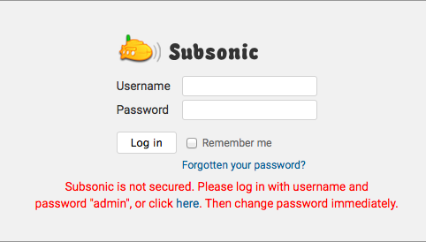
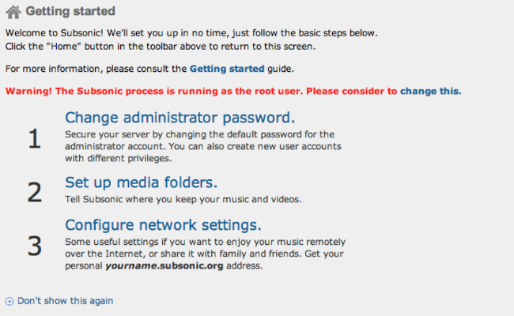
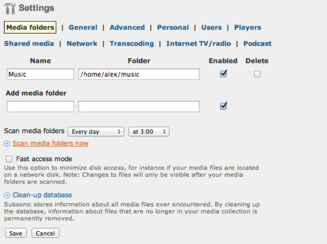
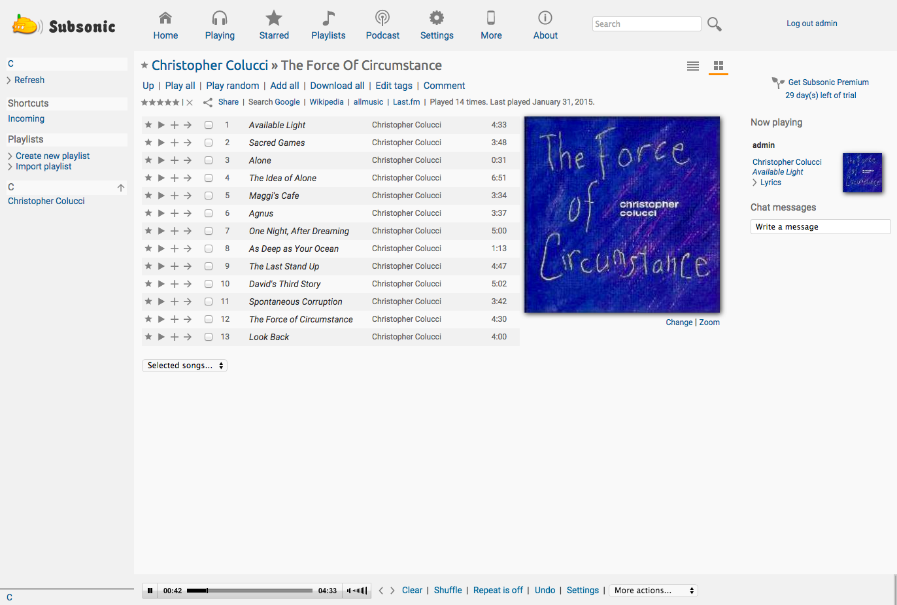

## What is Subsonic?

[Subsonic](http://subsonic.org) is an easy-to-use media streaming service with a user-friendly interface and the ability to share music and video with multiple users. It is highly customizable and includes features such as Chromecast support and file conversion.

This guide shows how to set up Subsonic on a Linode running Debian or Ubuntu. If you have a large music library, consider attaching a [Block Storage Volume](/docs/products/storage/block-storage/) to your Linode to store your music files.

## Install Java

You will need Java installed on your system to run Subsonic.



## Install Subsonic

1.  The latest version of Subsonic (as of publication) is 6.1.3, and the most recent release can always be found on their [download](http://www.subsonic.org/pages/download.jsp) page. Download and install Subsonic onto your Linode:

        wget https://s3-eu-west-1.amazonaws.com/subsonic-public/download/subsonic-6.1.3.deb
        sudo dpkg -i subsonic-6.1.3.deb

2.  Subsonic runs as the root user by default, which is insecure. Create a new system user for subsonic to run as:

        sudo useradd --system subsonic
        sudo gpasswd --add subsonic audio

3. Open `/etc/default/subsonic` in a text editor. In this file you can change the user, the port Subsonic listens on, increase the amount of memory it can use, and encrypt your streaming traffic with SSL. Change the `SUBSONIC_USER` variable to the new `subsonic` user:

    
# Type "subsonic --help" on the command line to read an
# explanation of the different options.
#
# For example, to specify that Subsonic should use port 80 (for http)
# and 443 (for https), and use a Java memory heap size of 200 MB, use
# the following:
#
# SUBSONIC_ARGS="--port=80 --https-port=443 --max-memory=200"

SUBSONIC_ARGS="--max-memory=150"

SUBSONIC_USER=subsonic


    
If you have a firewall set up, allow connections from the port Subsonic is listening on.


3. Restart Subsonic:

        sudo systemctl restart subsonic

## Configuration and Use

1.  By default, Subsonic looks for music files stored in `/var/music`. Create this directory and change its ownership to the `subsonic` user. You can substitute another directory if you would prefer to store your music elsewhere.

        sudo mkdir /var/music
        sudo chown subsonic:subsonic /var/music

2.  Open Subsonic in your browser by navigating to port 4040 on your Linode's public IP address or domain name.

3.  The first time you access your Subsonic server in your browser, you will see the following:

    

4.  Use the default username and password (admin/admin) or the provided link to log in:

    

5. Create a password for your admin account. You can also set up any other accounts at this time.

    
Passwords in the Subsonic database are stored in hex format, but not encrypted.


6.  Click on the **Media folders** link and point Subsonic to where you will store your music. If you used the default directory (`/var/music`) above, you can skip this step. Once you've pointed Subsonic to the correct directory and uploaded your music, you can press **Scan media folders now**. Subsonic will then create a database of music files.

    

&nbsp;

## Next Steps

Subsonic can be [configured to use SSL](http://www.subsonic.org/pages/getting-started.jsp), or you can use an [NGINX reverse proxy](/docs/guides/use-nginx-reverse-proxy/).
