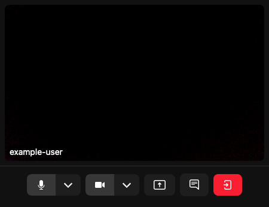
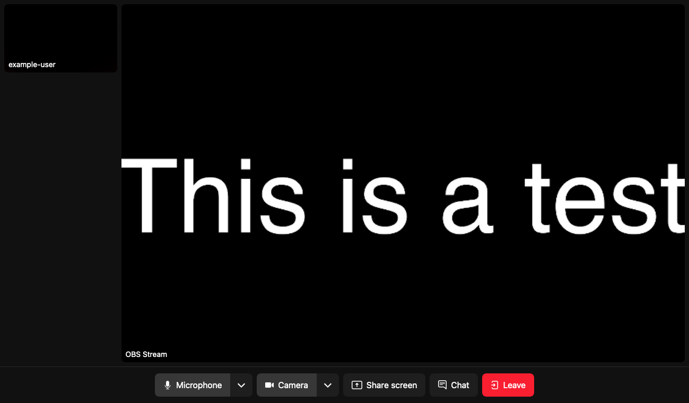

LiveKit is an open source stack for streaming audio and video. With modern APIs, LiveKit can easily integrate into your applications, and it's scalable design ensures the performance you need even as your audience grows.

LiveKit also operates with a range of streaming sources, making it ideal for bringing an audience to your content. An open source streaming tool like OBS Studio pairs perfectly with LiveKit for a full open source streaming solution.

In this tutorial, learn more about LiveKit and how to set up you own instance. Then, to get started streaming, learn how to use OBS Studio together with LiveKit to broadcast your streams out into the world.

## Before You Begin

1.  If you have not already done so, create a Linode account and Compute Instance. See our [Getting Started with Linode](/docs/guides/getting-started/) and [Creating a Compute Instance](/docs/guides/creating-a-compute-instance/) guides.

1.  Follow our [Setting Up and Securing a Compute Instance](/docs/guides/set-up-and-secure/) guide to update your system. You may also wish to set the timezone, configure your hostname, create a limited user account, and harden SSH access.


This guide is written for a non-root user. Commands that require elevated privileges are prefixed with `sudo`. If you’re not familiar with the `sudo` command, see the [Users and Groups](/docs/tools-reference/linux-users-and-groups/) guide.


## What is LiveKit?

[LiveKit](https://livekit.io/) offers an open source WebRTC stack, capable of scalable, multi-user, real-time streaming of audio and video. With a set of modern APIs, accessible through server-side and front-end SDKs, LiveKit's streaming capabilities can integrate with your applications.

Each LiveKit instance consists of three parts:

-   **The LiveKit server** hosts *rooms*, where streamed content becomes available. Each room can have a set of *participants*, which can either subscribe to content or broadcast content on one or more *tracks*.

-   **Ingress** controls the import of audio and video into LiveKit. LiveKit's Ingress can receive content from a WebRTC flow, as well as from RTMP, WHIP, and HTTP servers. You can even create an Ingress stream from one of its supported file types:

    - HTTP Live Streaming (HLS) segments
    - MP4
    - MOV
    - OGG
    - WEBM
    - MP3
    - M4A

-   **Egress** controls the export of audio and video from a given room or track. With LiveKit's Egress, you can make content available as an RTMP or WebSocket stream for a web application or services like Twitch and YouTube Live. You can also export content to one of the supported file types:

    - HLS segments
    - MP4
    - OGG
    - WEBM

### Installation Methods

While LiveKit has a fully managed cloud service, you can also self-host its open source stack. A self-hosted LiveKit server can be set up in several ways. For a high level of control, you can install and configure all of the components manually. For a convenient setup, you can use LiveKit's Docker image to generate a configuration and startup script. For even more scalability, you can leverage LiveKit's Helm chart for a Kubernetes deployment.

This tutorial walks through using the Docker set up method. Not only is this approach convenient, but it provides a ready LiveKit instance for you to start working with. Should your needs grow, armed with this experience and resulting configuration, you can confidently expand into a Kubernetes setup.

## How to Install LiveKit with Docker

The most convenient way to get started with LiveKit is via its Docker setup. A dedicated Docker image runs all the necessary steps to configure and prepare a full LiveKit server on your system.

Follow this segment of the tutorial to install Docker, apply the appropriation settings on your server, and start your own LiveKit instance.

### Configuring the Host

Before deploying the LiveKit server, you need to conduct some initial setup with your Compute Instance:

1.  Configure domain names for the LiveKit server and its associated TURN server, both pointing to the instance's public IP address. This entails creating two DNS A/AAAA records:

    - One for the LiveKit server. The examples in this tutorial use `livekit.example.com`.
    - Another for the TURN server, which is bundled with LiveKit to help manage traffic. The examples in this tutorial use `livekit-turn.example.com`.

    One of the easiest ways to complete this setup is using Akamai's [DNS Manager](/docs/products/networking/dns-manager/get-started/). Follow the linked guide to add your domain (e.g. `example.com`) and create A records for the `livekit` and `livekit-turn` subdomains.

1.   Follow the appropriate section of our [How to Use Docker Compose V2](/docs/guides/how-to-use-docker-compose-v2/#how-to-install-docker-compose-and-docker-engine) guide to install the Docker Engine and Docker Compose.

With the Compute Instance prepared, you can now set up the LiveKit server and install the LiveKit CLI.

### LiveKit Server Setup

1.  Run LiveKit's Docker set up. Once this starts, a series of prompts are presented to configure the LiveKit instance to your needs.

    ```command
    sudo docker run --rm -it -v$PWD:/output livekit/generate
    ```

1.  Complete the LiveKit setup's prompts as follows:

    - Choose either the **with Ingress** or **with both Egress and Ingress** option.
    - Enter the LiveKit server and TURN domains as created further above.
    - Leave the WHIP domain empty.
    - Select **Let's Encrypt (no account required)** for SSL.
    - Choose the **latest** version of LiveKit.
    - Select **no - (we'll bundle Redis)** to have the installation bundle Redis.
    - Choose to create a **Startup Shell Script**.

    The process outputs an API key and an API secret. Keep these safe and secure as they are your primary means of interfacing with the LiveKit server later.

    ```output
    API Key: LIVEKIT_API_KEY
    API Secret: LIVEKIT_API_SECRET
    ```

    The process also outputs a series of ports that need to be opened for the LiveKit server to function. For the set of responses used in this tutorial, the required ports should be:

    ```output
     * 443 - primary HTTPS and TURN/TLS
     * 80 - for TLS issuance
     * 7881 - for WebRTC over TCP
     * 3478/UDP - for TURN/UDP
     * 50000-60000/UDP - for WebRTC over UDP
     * 1935 - for RTMP Ingress
     * 7885/UDP - for WHIP Ingress WebRTC
    ```

1.  Open all of the required ports in your system's firewall. The exact commands to do so vary depending on your distribution and firewall manager. See the appropriate section of our guide on [Setting Up and Securing a Compute Instance](/docs/products/compute/compute-instances/guides/set-up-and-secure/#configure-a-firewall) for links to our guides on common firewall managers.

    As an example, here are a series of commands to open the set of ports shown above using the UFW firewall manager:

    ```command
    sudo ufw allow http
    sudo ufw allow https
    sudo ufw allow 7881/tcp
    sudo ufw allow 3478/udp
    sudo ufw allow 50000:60000/udp
    sudo ufw allow 1935/tcp
    sudo ufw allow 7885/udp
    sudo ufw reload
    ```

1.  Change into the newly created `livekit.example.com` directory:

    ```command
    cd ~/livekit.example.com
    ```

1.  Open the `the init_script.sh` startup shell script file, located at `~/livekit.example.com/init_script.sh`, in a text editor with `sudo` permissions:

    ```command
    sudo nano init_script.sh
    ```

    Now make some modifications to the script. By default, the script attempts to install Docker and Docker Compose, which causes issues as your system should already have these. To solve this, make the changes described below:

    -   First, locate and remove the commands for installing Docker and Docker Compose. The commands shown below have been commented out using `#`:

        ```file {title="livekit.example.com/init_script.sh" lang="sh" hl_lines="11-14"}
        #!/bin/sh
        # This script will write all of your configurations to /opt/livekit.
        # It'll also install LiveKit as a systemd service that will run at startup
        # LiveKit will be started automatically at machine startup.

        # create directories for LiveKit
        mkdir -p /opt/livekit/caddy_data
        mkdir -p /usr/local/bin

        # Docker & Docker Compose will need to be installed on the machine
        #curl -fsSL https://get.docker.com -o /tmp/get-docker.sh
        #sh /tmp/get-docker.sh
        #curl -L "https://github.com/docker/compose/releases/download/v2.20.2/docker-compose-$(uname -s)-$(uname -m)" -o /usr/local/bin/docker-compose
        #chmod 755 /usr/local/bin/docker-compose
        ```

    -   Next, locate the command that creates the LiveKit `systemd` service file. Modify the `Exec` lines to point to your actual Docker location and to use the Docker Compose plugin. In this case, the Docker binary is located at `/usr/bin/docker`. Changing the commands from `docker-compose` to `docker compose` adapts the lines to use the Docker Compose plugin rather than the standalone version. However, leave the `docker-compose.yaml` filename as is.

        ```file {title="livekit.example.com/init_script.sh" lang="sh" linenostart="148" hl_lines="13-15"}
        # systemd file
        cat << EOF > /etc/systemd/system/livekit-docker.service
        [Unit]
        Description=LiveKit Server Container
        After=docker.service
        Requires=docker.service

        [Service]
        LimitNOFILE=500000
        Restart=always
        WorkingDirectory=/opt/livekit
        # Shutdown container (if running) when unit is started
        ExecStartPre=/usr/bin/docker compose -f docker-compose.yaml down
        ExecStart=/usr/bin/docker compose -f docker-compose.yaml up
        ExecStop=/usr/bin/docker compose -f docker-compose.yaml down

        [Install]
        WantedBy=multi-user.target


        EOF
        ```

    When done, press <kbd>CTRL</kbd>+<kbd>X</kbd>, followed by <kbd>Y</kbd> then <kbd>Enter</kbd> to save the file and exit `nano`.

1.  Run the startup script. Doing so requires that you first give the script executable permission.

    ```command
    sudo chmod +x init_script.sh
    sudo ./init_script.sh
    ```

1.  Give the LiveKit service time to start up all of the necessary components. You can check the progress with the following command:

    ```command
    sudo systemctl status livekit-docker
    ```

1.  Once the components are running, verify the LiveKit server with a cURL command:

    ```command
    curl https://livekit.example.com
    ```

    ```output
    OK
    ```

### LiveKit CLI Installation

The LiveKit CLI tool offers the most convenient interface for managing and testing your LiveKit server. Although not strictly required, the tool is almost indispensable when setting up your LiveKit stack, from testing the server to generating Ingress/Egress credentials.

To install the LiveKit CLI, use the installation script:

```command
sudo curl -sSL https://get.livekit.io/cli | sudo bash
```

The LiveKit CLI requires your LiveKit server's address, API key, and API secret. A convenient way to provide these is through environment variables. The steps below show how to do so, and all subsequent CLI commands in this tutorial assume you have followed these steps.

The steps below additionally show how to create a user token with CLI. In a production environment, you are likely to leverage LiveKit's API for generating user tokens. However, when it comes to generating tokens for testing, the CLI makes a convenient solution.

1.  First, store your LiveKit parameters in environment variables. Later sections of the tutorial similarly leverage these stored values.

    In this example, replace the URL with your LiveKit server's actual address. Replace `LIVEKIT_API_KEY` and `LIVEKIT_API_SECRET` with the API key and API secret output during the LiveKit setup above.

    ```command
    export LIVEKIT_URL=https://livekit.example.com
    export LIVEKIT_API_KEY=LIVEKIT_API_KEY
    export LIVEKIT_API_SECRET=LIVEKIT_API_SECRET
    ```

1.  Now generate a token. The token here designates a room (`example-room`) and a user (`example-user`), both of which are created if they do not already exist. The token is valid for 24 hours, after which the user requires another.

    ```command
    livekit-cli create-token \
        --join --room example-room --identity example-user \
        --valid-for 24h
    ```

Further on, the tutorial uses the CLI to create Ingress credentials for streaming from OBS Studio. The [LiveKit CLI documentation](https://github.com/livekit/livekit-cli) provides more information on this and additional uses for the CLI, such as load testing with simulated streams and subscribers.

### Initial Test

With the test token from the LiveKit CLI, you can conduct a full test of your LiveKit server's streaming capabilities. This is done using LiveKit's Meet example application, which essentially provides a frontend for a specified LiveKit server.

1.  Go to the [LiveKit Meet](https://meet.livekit.io/?tab=custom) example application.

1.  Enter your LiveKit server's domain with the WebSocket protocol (e.g. `wss://livekit.example.com`) and the user token generated above.

1.  Click **Connect** and allow access to your camera and microphone when prompted.

    

1.  When done, simply click **Leave** and close the browser tab.

## Configuring OBS for Streaming

Open Broadcaster Software (OBS) Studio offers an open source tool for recording and live-streaming video. Its high-performance, real-time capturing can effectively create custom streams from your device. OBS Studio easily integrates as an Ingress stream with a LiveKit server.

Follow along with this section of the tutorial to configure LiveKit for Ingress and set up streaming from an OBS Studio instance.

### Configuring the LiveKit Ingress

LiveKit first needs an Ingress instance designated for streaming from OBS Studio. The LiveKit CLI includes a command for creating a new Ingress, and the Ingress can be configured with a short JSON file. Learn more from [LiveKit's Ingress Overview documentation](https://docs.livekit.io/egress-ingress/ingress/overview/).

1.  Create a JSON configuration file for the Ingress:

    ```command
    sudo nano ingress.json
    ```

    What follows is a simple Ingress configuration to support an OBS stream. The `"input_type": 0` indicates an RTMP stream, while the remaining parameters name the Ingress, identify the room, and create a participant for content broadcasting.

    ```file {title="ingress.json" lang="json"}
    {
        "input_type": 0,
        "name": "obs-stream",
        "room_name": "example-room",
        "participant_identity": "obs-streamer",
        "participant_name": "OBS Stream"
    }
    ```

    When done, press <kbd>CTRL</kbd>+<kbd>X</kbd>, followed by <kbd>Y</kbd> then <kbd>Enter</kbd> to save the file and exit `nano`.

1.  Once you have a configuration file, you can create the Ingress with a command like the one below. This example assumes you named your configuration file `ingress.json`, and that you have your LiveKit server's information in environment variables, as shown further above.

    ```command
    livekit-cli create-ingress --request ingress.json
    ```

1.  The CLI outputs information about the Ingress. You need to keep track of the `URL` and `Stream Key` from this output in order to configure your OBS Studio stream, for example:

    ```output
    Using url, api-key, api-secret from environment
    IngressID: IN_oQ7SV4GNzdkq Status: ENDPOINT_INACTIVE
    URL: rtmp://livekit.example.com:1935/x Stream Key: 6fBdud6A3NYb
    ```

### Setting Up OBS Studio

You need to install the OBS Studio client on the machine from which you want to stream content (e.g. your local computer).

1.  Navigate to the [OBS website](https://obsproject.com/), and download the OBS Studio installer for your operating system.

1.  Run the installer to get OBS Studio installed on your system. You may wish to refer to the [OBS Studio Quickstart](https://obsproject.com/wiki/OBS-Studio-Quickstart) guide for more on configuring your OBS Studio installation. However, doing so is not necessary for the example in this tutorial.

1.  Start OBS Studio. When prompted, grant permissions for OBS to record your screen and access your camera and microphone, as needed for your streaming goals.

1.  During the setup steps, indicate that you are using OBS for streaming. Then, when prompted for stream information, complete the form as follows:

    - **Service**: *Custom*
    - **Server**: Your LiveKit's Ingress URL (e.g. `rtmp://livekit.example.com:1935/x` from the example output above)
    - **Stream Key**: Your LiveKit's Ingress stream key (e.g. `6fBdud6A3NYb` from the example output above)

When you have completed the setup, you should be taken to the main OBS Studio dashboard.

### Viewing the Stream

The above gives you a setup ready to start streaming from OBS Studio to a LiveKit room. All you need to do is create your stream in OBS and start streaming.

To see what that can look like, follow along with the steps below to put together a complete but simple stream in OBS. Then once again leverage the LiveKit Meet example application to view the stream broadcasting from your LiveKit server.

#### OBS

1.  Add a video source, using the **+** icon in the **Sources** pane. For this example, the tutorial uses the **Text** source with the text `This is a test`. You can, however, use any other source you would like.

1.  Click **Start Streaming** to have OBS begin streaming the source (or sources) to the LiveKit Ingress.

#### LiveKit Meet

The easiest way to test the stream is using LiveKit Meet, the LiveKit example application used further above to verify the LiveKit setup.

Just as above, visit [LiveKit Meet](https://meet.livekit.io/?tab=custom), enter your LiveKit server URL and participant token, then click **Connect**. Make sure that your LiveKit participant token is associated with the same room as the OBS Ingress. This was `example-room` in the examples above.

You should see your participant stream, but also the OBS stream, with video from the source/s you created.

