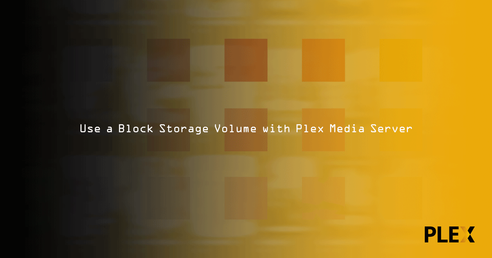
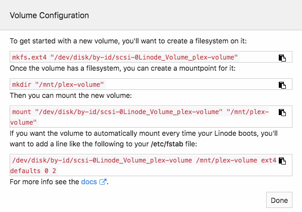
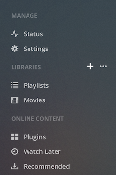
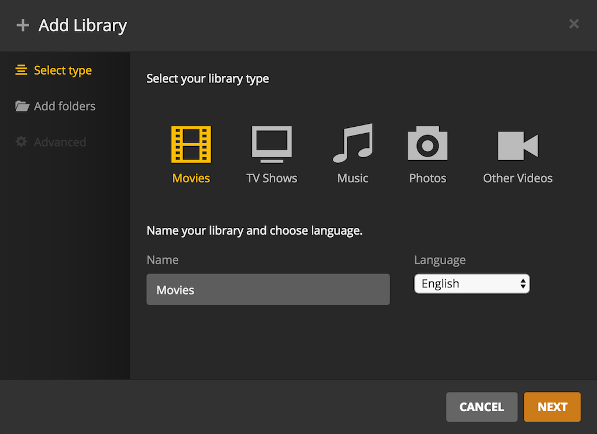
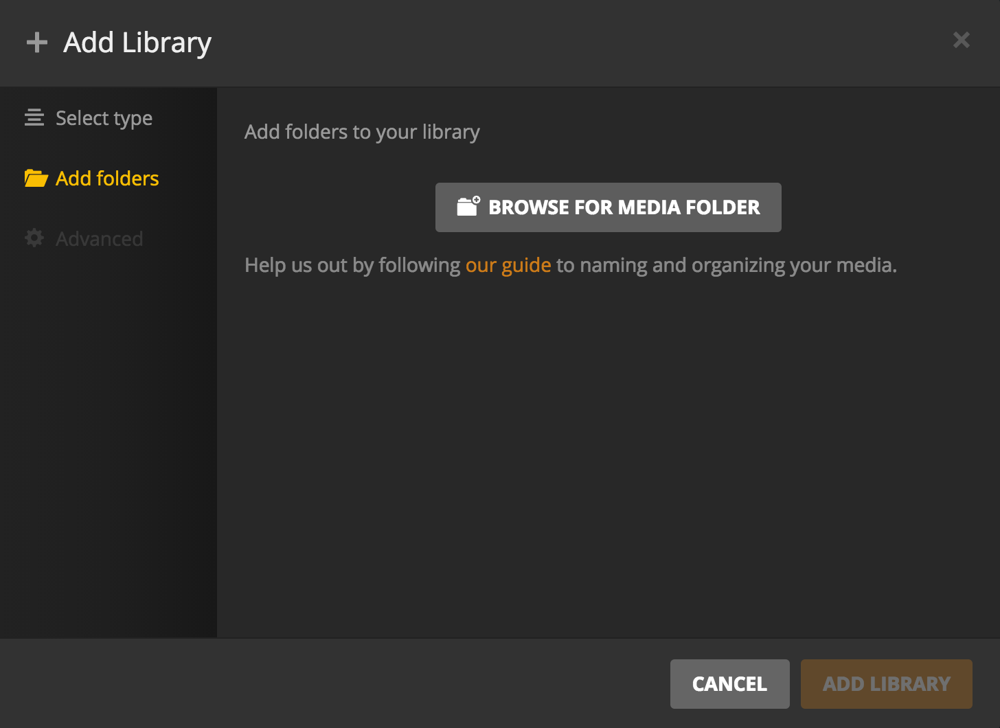
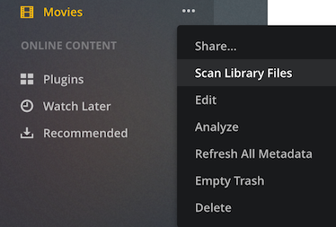

## What is Plex?

Plex is a media server that allows you to store your media on a remote server and stream it to your devices. This guide shows how to attach a Block Storage Volume to an existing Linode in order to meet the demands of a growing media library.

## Before You Begin

The examples in this guide assume the Plex Server is installed and running on a Linode. See how to [Install Plex Media Server on Ubuntu 16.04](/docs/guides/install-plex-media-server-on-ubuntu-18-04/) if it is not already installed. After installation, follow the steps in the [Initial Setup](/docs/guides/install-plex-media-server-on-ubuntu-18-04/#initial-setup) section to create an SSH tunnel to your Linode and configure the Plex server.

This guide also assumes you already have a Plex account since Plex Media Player will require login.

## Attach a Block Storage Volume to a Linode

1.  Create a Block Storage Volume and attach it to the Linode running Plex Media Server. See [View, Create, and Delete Block Storage Volumes](/docs/products/storage/block-storage/guides/manage-volumes/) for instructions on how to do this from the Linode Manager.

    To use the Linode CLI, create a new Volume and attach it to a Linode. The command below creates a 20GB Volume with the label `plex-volume` and attaches to a Linode labeled `plex-linode`. Adjust the command as needed:

        linode-cli volume create plex-volume -l plex-linode -s 20

2.  Create a filesystem on the Block Storage Volume, then create a mountpoint per the instructions from the Linode Manager:

    

3.  Check available disk space. Notice that there is some overhead with the Volume due to the file system:

        df -BG

    
Filesystem     1G-blocks  Used Available Use% Mounted on
/dev/root            20G    3G       17G  13% /
devtmpfs              1G    0G        1G   0% /dev
tmpfs                 1G    1G        1G   1% /dev/shm
tmpfs                 1G    1G        1G   2% /run
tmpfs                 1G    0G        1G   0% /run/lock
tmpfs                 1G    0G        1G   0% /sys/fs/cgroup
/dev/sdc             20G    1G       38G   1% /mnt/plex-volume
tmpfs                 1G    0G        1G   0% /run/user/1000


4.  If you want to use `scp` to transfer your media files directly from a client machine to the Volume (see next section), you will need to change the ownership of the mount point:

        sudo chown username:username /mnt/plex-volume

## Configure a Plex Client

1.  Install Plex Media Player on your device for streaming. Navigate to the [Downloads section on the Plex website](https://www.plex.tv/downloads/) and follow the instructions for your device and operating system.

2.  In the left menu, hover the mouse over **Libraries**. Click the *+* button:

    

3.  Select the library type. **Movies** is selected in this example. Then click next:

    

4.  Click **Browse for Media Folder**.

    

5.  A window will appear. Select the folder corresponding to the Block Storage Volume. In this example, the mountpoint is `/mnt/plex-volume`.

## Transfer Media to the Volume via scp

Moving media to the Volume can be done with `scp` using the following syntax:

    scp example_video.mp4 username@123.456.7.8:/mnt/plex-volume

Depending on the file size(s), this may take a few minutes.


There are other ways to upload files to a remote server. See our section in [Linux System Administration Basics](/docs/tools-reference/linux-system-administration-basics/#upload-files-to-a-remote-server) for more information.


## Scan for New Media on the Volume

After new media is added to the Block Storage Volume, scan for files in the Plex Media Player. In the left menu, hover over the media type and expand the drop down menu. Select **Scan Library Files**.

The media should now be available through Plex Media Player.
