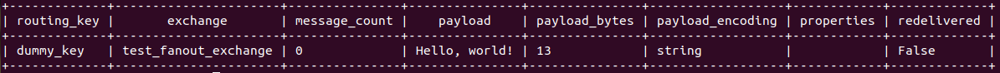
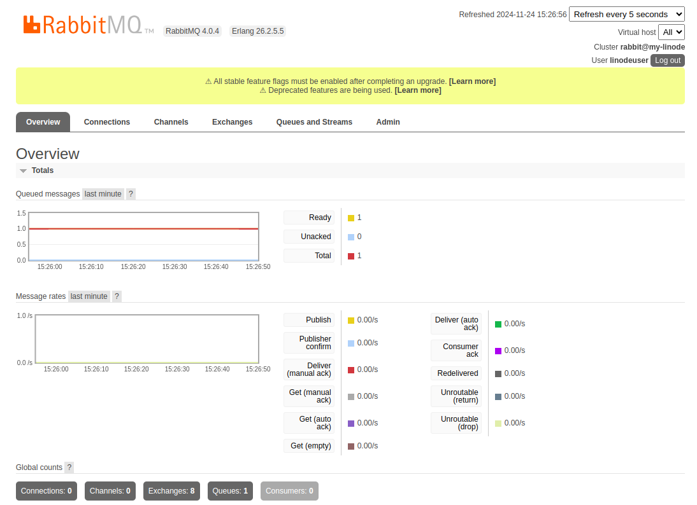

RabbitMQ is an open source message broker that facilitates communication between distributed applications. This guide covers steps for manually installing, configuring, and testing RabbitMQ on a Linode instance running Ubuntu 24.04 LTS.

If you prefer an automated deployment, consider our [RabbitMQ Marketplace app](/docs/marketplace-docs/guides/rabbitmq/).

## Before You Begin

1.  If you do not already have a virtual machine to use, create a Compute Instance with at least 2 GB of memory running Ubuntu 24.04 LTS. For resources and instructions on deploying an instance using Cloud Manager, see our [Get Started](https://techdocs.akamai.com/cloud-computing/docs/getting-started) and [Create a Compute Instance](https://techdocs.akamai.com/cloud-computing/docs/create-a-compute-instance) guides.

    
    Use these steps if you prefer to use the Linode CLI to provision resources.

    The following command creates a Linode 2 GB compute instance (`g6-standard-1`) running Ubuntu 24.04 LTS (`linode/ubuntu24.04`) in the Miami datacenter (`us-mia`):

    ```command
    linode-cli linodes create \
      --image linode/ubuntu24.04 \
      --region us-mia \
      --type g6-standard-1 \
      --root_pass '' \
      --authorized_keys "$(cat ~/.ssh/id_ed25519.pub)" \
      --label rabbitmq-linode
    ```

    Note the following key points:

    -   Replace `region` as desired.
    -   Replace  with a secure alternative for your root password.
    -   This command assumes that an SSH public/private key pair exists, with the public key stored as `id_ed25519.pub` in the user’s `$HOME/.ssh` folder.
    -   The `--label` argument specifies the name of the new server (`rabbitmq-linode`).
    

1.  Follow our [Set Up and Secure a Compute Instance](https://techdocs.akamai.com/cloud-computing/docs/set-up-and-secure-a-compute-instance) guide to update your system and create a limited user account. You may also wish to set the timezone, configure your hostname, and harden SSH access.


This guide is written for a non-root user. Commands that require elevated privileges are prefixed with `sudo`. If you’re not familiar with the `sudo` command, see the [Users and Groups](/docs/guides/linux-users-and-groups/) guide.


## Install RabbitMQ as a Service

RabbitMQ offers an [installation script](https://www.rabbitmq.com/docs/install-debian#apt-quick-start-cloudsmith) for Ubuntu 24.04 LTS. This script uses the latest versions of Erlang supported by RabbitMQ along with the latest version of the server itself.

1.  SSH into your instance as a user with `sudo` privileges:

    ```command
    ssh @
    ```

1.  Using a text editor such as `nano`, create a file called `install-rabbitmq.sh`:

    ```
    nano install-rabbitmq.sh
    ```

    Paste the code snippet for the Ubuntu 24.04 LTS installation script into the file:

    ```file {title="install-rabbitmq.sh"}
    #!/bin/sh

    sudo apt-get install curl gnupg apt-transport-https -y

    ## Team RabbitMQ's main signing key
    curl -1sLf "https://keys.openpgp.org/vks/v1/by-fingerprint/0A9AF2115F4687BD29803A206B73A36E6026DFCA" | sudo gpg --dearmor | sudo tee /usr/share/keyrings/com.rabbitmq.team.gpg > /dev/null
    ## Community mirror of Cloudsmith: modern Erlang repository
    curl -1sLf https://github.com/rabbitmq/signing-keys/releases/download/3.0/cloudsmith.rabbitmq-erlang.E495BB49CC4BBE5B.key | sudo gpg --dearmor | sudo tee /usr/share/keyrings/rabbitmq.E495BB49CC4BBE5B.gpg > /dev/null
    ## Community mirror of Cloudsmith: RabbitMQ repository
    curl -1sLf https://github.com/rabbitmq/signing-keys/releases/download/3.0/cloudsmith.rabbitmq-server.9F4587F226208342.key | sudo gpg --dearmor | sudo tee /usr/share/keyrings/rabbitmq.9F4587F226208342.gpg > /dev/null

    ## Add apt repositories maintained by Team RabbitMQ
    sudo tee /etc/apt/sources.list.d/rabbitmq.list <<EOF
    ## Provides modern Erlang/OTP releases
    ##
    deb [arch=amd64 signed-by=/usr/share/keyrings/rabbitmq.E495BB49CC4BBE5B.gpg] https://ppa1.rabbitmq.com/rabbitmq/rabbitmq-erlang/deb/ubuntu noble main
    deb-src [signed-by=/usr/share/keyrings/rabbitmq.E495BB49CC4BBE5B.gpg] https://ppa1.rabbitmq.com/rabbitmq/rabbitmq-erlang/deb/ubuntu noble main

    # another mirror for redundancy
    deb [arch=amd64 signed-by=/usr/share/keyrings/rabbitmq.E495BB49CC4BBE5B.gpg] https://ppa2.rabbitmq.com/rabbitmq/rabbitmq-erlang/deb/ubuntu noble main
    deb-src [signed-by=/usr/share/keyrings/rabbitmq.E495BB49CC4BBE5B.gpg] https://ppa2.rabbitmq.com/rabbitmq/rabbitmq-erlang/deb/ubuntu noble main

    ## Provides RabbitMQ
    ##
    deb [arch=amd64 signed-by=/usr/share/keyrings/rabbitmq.9F4587F226208342.gpg] https://ppa1.rabbitmq.com/rabbitmq/rabbitmq-server/deb/ubuntu noble main
    deb-src [signed-by=/usr/share/keyrings/rabbitmq.9F4587F226208342.gpg] https://ppa1.rabbitmq.com/rabbitmq/rabbitmq-server/deb/ubuntu noble main

    # another mirror for redundancy
    deb [arch=amd64 signed-by=/usr/share/keyrings/rabbitmq.9F4587F226208342.gpg] https://ppa2.rabbitmq.com/rabbitmq/rabbitmq-server/deb/ubuntu noble main
    deb-src [signed-by=/usr/share/keyrings/rabbitmq.9F4587F226208342.gpg] https://ppa2.rabbitmq.com/rabbitmq/rabbitmq-server/deb/ubuntu noble main
    EOF

    ## Update package indices
    sudo apt-get update -y

    ## Install Erlang packages
    sudo apt-get install -y erlang-base \
                            erlang-asn1 erlang-crypto erlang-eldap erlang-ftp erlang-inets \
                            erlang-mnesia erlang-os-mon erlang-parsetools erlang-public-key \
                            erlang-runtime-tools erlang-snmp erlang-ssl \
                            erlang-syntax-tools erlang-tftp erlang-tools erlang-xmerl

    ## Install rabbitmq-server and its dependencies
    sudo apt-get install rabbitmq-server -y --fix-missing
    ```

    When done, press <kbd>CTRL</kbd>+<kbd>X</kbd>, followed by <kbd>Y</kbd> then <kbd>Enter</kbd> to save the file and exit `nano`.

1.  Run the script:

    ```command
    source ./install-rabbitmq.sh
    ```

1.  Your instance should now have the latest version of the RabbitMQ server running as a systemd service. Verify this with the following command:

    ```command
    systemctl status rabbitmq-server
    ```

    Output containing `active (running)` indicates that the service is enabled and running:

    ```output
    ● rabbitmq-server.service - RabbitMQ broker
         Loaded: loaded (/usr/lib/systemd/system/rabbitmq-server.service; enabled; preset: enabled)
         Active: active (running) since Mon 2025-02-10 13:32:01 EST; 17min ago
       Main PID: 2120 (beam.smp)
          Tasks: 25 (limit: 2276)
         Memory: 74.5M (peak: 88.8M)
            CPU: 3.317s
         CGroup: /system.slice/rabbitmq-server.service
    ```

1.  RabbitMQ supplies a client that allows direct access to the server when connecting from `localhost`. To further verify that the installation was successful and configured as desired, run the following:

    ```command
    sudo rabbitmq-diagnostics status
    ```

    This prints a list of diagnostic information about the server such as CPU and memory usage, as well as locations of the logs and configuration files on the system.

    ```output
    Status of node rabbit@rabbitmq-ubuntu-2404-1 ...
    []
    Runtime

    OS PID: 2120
    OS: Linux
    Uptime (seconds): 1217
    Is under maintenance?: false
    RabbitMQ version: 4.0.5
    ...
    Memory

    Total memory used: 0.0983 gb
    Calculation strategy: rss
    Memory high watermark setting: 0.6 of available memory, computed to: 1.2382 gb
    ...
    Totals

    Connection count: 0
    Queue count: 0
    Virtual host count: 1

    Listeners

    Interface: [::], port: 25672, protocol: clustering, purpose: inter-node and CLI tool communication
    Interface: [::], port: 5672, protocol: amqp, purpose: AMQP 0-9-1 and AMQP 1.0
    ```

### Starting and Stopping RabbitMQ

RabbitMQ requires no additional configuration upon installation. While not required, configuration files can be stored in `/etc/rabbitmq`. See [RabbitMQ's official documentation](https://www.rabbitmq.com/docs/configure) for more information on configuration options.

The RabbitMQ server can be controlled via systemd-managed services. For example:

-   Use `systemctl` to stop the RabbitMQ server:

    ```command
    systemctl stop rabbitmq-server
    ```

-   Use `systemctl` to start the RabbitMQ server:

    ```command
    systemctl start rabbitmq-server
    ```

-   Use `journalctl` to view the server logs:

    ```command
    journalctl -u rabbitmq-server
    ```

## Testing RabbitMQ

1.  To test the RabbitMQ deployment, first enable the RabbitMQ management plugin:

    ```command
    rabbitmq-plugins enable rabbitmq_management
    ```

    ```output
    Enabling plugins on node rabbit@rabbitmq-ubuntu-2404-1:
    rabbitmq_management
    The following plugins have been configured:
      rabbitmq_management
      rabbitmq_management_agent
      rabbitmq_web_dispatch
    Applying plugin configuration to rabbit@rabbitmq-ubuntu-2404-1...
    The following plugins have been enabled:
      rabbitmq_management
      rabbitmq_management_agent
      rabbitmq_web_dispatch

    started 3 plugins.
    ```

1.  Next, download the management script, which is available directly from `localhost` after enabling the plugin:

    ```command
    wget http://localhost:15672/cli/rabbitmqadmin
    ```

    ```output
    Resolving localhost (localhost)... ::1, 127.0.0.1
    Connecting to localhost (localhost)|::1|:15672... failed: Connection refused.
    Connecting to localhost (localhost)|127.0.0.1|:15672... connected.
    HTTP request sent, awaiting response... 200 OK
    Length: 42630 (42K) [application/octet-stream]
    Saving to: ‘rabbitmqadmin’

    rabbitmqadmin       100%[===================>]  41.63K  --.-KB/s    in 0.002s

    2025-02-10 14:14:04 (24.9 MB/s) - ‘rabbitmqadmin’ saved [42630/42630]
    ```

1.  Make the script executable, and move it to a location included in the environment `PATH`:

    ```command
    chmod +x rabbitmqadmin
    sudo mv rabbitmqadmin /usr/local/bin/
    ```

### Create An Exchange and Queue

This guide demonstrates creating a [fanout exchange](https://www.rabbitmq.com/tutorials/amqp-concepts#exchange-fanout), which "routes messages to all of the queues that are bound to it". A fanout closely resembles the pub/sub pattern and is typically used for broadcasting messages.

See RabbitMQ's official documentation for more on exchanges and queues: [RabbitMQ Tutorials](https://www.rabbitmq.com/tutorials)

1.  Create a `fanout` style exchange on the RabbitMQ server with the following:

    ```command
    sudo rabbitmqadmin declare exchange \
      name=test_fanout_exchange \
      type=fanout
    ```

    ```output
    exchange declared
    ```

1.  Create a queue to attach to this exchange to hold messages:

    ```command
    sudo rabbitmqadmin declare queue \
      name=fanout_queue \
      durable=true
    ```

    ```output
    queue declared
    ```

1.  Bind the queue to the exchange:

    ```command
    sudo rabbitmqadmin declare binding \
      source=test_fanout_exchange \
      destination=fanout_queue
    ```

    ```output
    binding declared
    ```

### Test Message Publishing and Retrieval

1.  Publish a message to the exchange (and bound queue):

    ```command
    sudo rabbitmqadmin publish \
      exchange=test_fanout_exchange \
      routing_key=dummy_key \
      payload="Hello, world!"
    ```

    ```output
    Message published
    ```

    
    The routing key is not necessary for a fanout exchange, as each message is routed to each queue regardless of the routing key. However, it is required for the `rabbitmqadmin` tool.
    

1.  Retrieve the messages from the queue:

    ```command
    sudo rabbitmqadmin get queue=fanout_queue
    ```

    ```output
    +-------------+----------------------+---------------+---------------+---------------+------------------+------------+-------------+
    | routing_key |       exchange       | message_count |    payload    | payload_bytes | payload_encoding | properties | redelivered |
    +-------------+----------------------+---------------+---------------+---------------+------------------+------------+-------------+
    | dummy_key   | test_fanout_exchange | 0             | Hello, world! | 13            | string           |            | False       |
    +-------------+----------------------+---------------+---------------+---------------+------------------+------------+-------------+
    ```

    

## The RabbitMQ Web Interface

The RabbitMQ management plugin enables a web interface and API accessible at port `15672`. Assuming this port is not blocked by any firewall rules, you can access the web interface in your browser by visiting the following URL, replacing  with the IP of your Linode instance:

```command
http://:15672
```


By default, RabbitMQ is initiated with a default [virtual host](https://www.rabbitmq.com/docs/vhosts) and a [default administrative user](https://www.rabbitmq.com/docs/access-control#default-state) with username `guest` (and password `guest`). However, this user can only connect to the management interface from `localhost`. To connect to RabbitMQ remotely, a new user must be created.

### Create a New RabbitMQ Management User

1.  Use the `rabbitmqctl add_user` command and provide a username and password:

    ```command
    sudo rabbitmqctl add_user "" ""
    ```

    ```output
    Adding user "" ...
    Done. Don't forget to grant the user permissions to some virtual hosts! See 'rabbitmqctl help set_permissions' to learn more.
    ```

1.  Add the `administrator` tag to the newly created user, giving them management privileges.

    ```command
    sudo rabbitmqctl set_user_tags  administrator
    ```

    ```output
    Setting tags for user "" to [administrator\] ...
    ```

### Set Permissions for the User on the Virtual Host

1.  Verify the name of the existing virtual host:

    ```command
    sudo rabbitmqctl -q --formatter=pretty_table list_vhosts name description
    ```

    The default virtual host is named `/`:

    ```output
    ┌──────┬──────────────────────┐
    │ name │ description          │
    ├──────┼──────────────────────┤
    │ /    │ Default virtual host │
    └──────┴──────────────────────┘
    ```

1.  Grant permissions to the newly created user on this virtual host:

    ```command
    sudo rabbitmqctl set_permissions -p "/" "" ".*" ".*" ".*"
    ```

    ```output
    Setting permissions for user "" in vhost "/" ...
    ```

### Access the RabbitMQ Management Interface Remotely

Return to the management console UI in a web browser, and log in with the credentials of the newly created user:


After logging in, the **Overview** page displays metrics about the currently running RabbitMQ instance:



### Send Test Requests to the RabbitMQ API

1.  Test publishing a message to an exchange using `curl` to send an authenticated request to the RabbitMQ API:

    ```command
    curl \
      -u : \
      -H "Content-Type: application/json" \
      -X POST \
      -d '{"properties":{},"routing_key":"dummy_key","payload":"Hello, curl!","payload_encoding":"string"}' \
      http://:15672/api/exchanges/%2f/test_fanout_exchange/publish
    ```

    ```output
    {"routed":true}
    ```

    
    The `%2f` in the request URL is the URL-encoded value for the name of the exchange (`/`).
    

1.  Now send an authenticated request to retrieve the last two messages from the queue:

    ```command
    curl \
      -u : \
      -H "Content-type:application/json" \
      -X POST \
      -d '{"count":2,"ackmode":"ack_requeue_true","encoding":"auto"}' \
      http://:15672/api/queues/%2f/fanout_queue/get | json_pp
    ```

    ```output
    [
       {
          "exchange" : "test_fanout_exchange",
          "message_count" : 1,
          "payload" : "Hello, world!",
          "payload_bytes" : 13,
          "payload_encoding" : "string",
          "properties" : [],
          "redelivered" : true,
          "routing_key" : "dummy_key"
       },
       {
          "exchange" : "test_fanout_exchange",
          "message_count" : 0,
          "payload" : "Hello, curl!",
          "payload_bytes" : 12,
          "payload_encoding" : "string",
          "properties" : [],
          "redelivered" : false,
          "routing_key" : "dummy_key"
       }
    ]
    ```