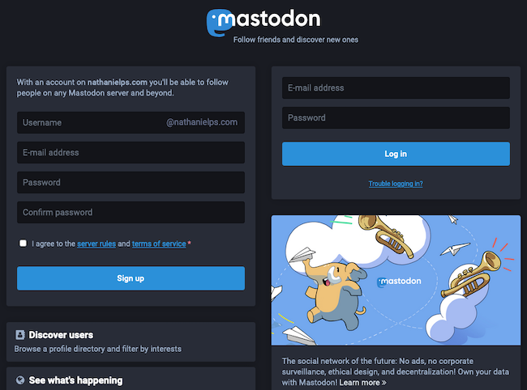
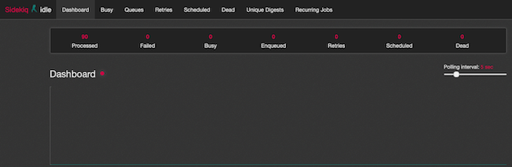
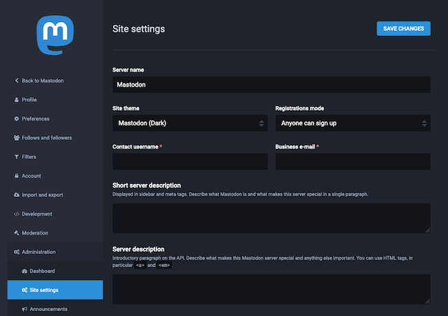



[Mastodon](https://docs.joinmastodon.org/) is an open source and decentralized micro-blogging platform. Like Twitter, it lets users follow other users and post text, photo, and video content. Unlike Twitter, Mastodon is decentralized, meaning that its content is not maintained by a central authority.

What sets the Mastodon platform apart is its federated approach to social networking. Each Mastodon instance operates independently — anyone can create an instance and build their own community. But users from different instances can still follow each other, share content, and communicate.

Mastodon participates in the [Fediverse](https://en.wikipedia.org/wiki/Fediverse), a collection of social networks and other websites that communicate using the [ActivityPub](https://en.wikipedia.org/wiki/ActivityPub) protocol. That allows different Mastodon instances to communicate, and also allows other platforms in the Fediverse to communicate with Mastodon.

Mastodon servers range in size from small private instances to massive public instances, and typically center on specific interests or shared principles. The biggest is [Mastodon.social](https://mastodon.social/about), a general-interest server created by the developers of the Mastodon platform. It has over 540,000 users and boasts a thorough [Code of Conduct](https://mastodon.social/about/more).

## Before You Begin

1.  Familiarize yourself with our [Getting Started](/docs/getting-started/) guide and complete the steps for setting your Linode's hostname and timezone.

2.  This guide uses `sudo` wherever possible. Complete the sections of our [Securing Your Server](/docs/security/securing-your-server/) guide to create a standard user account, harden SSH access, and remove unnecessary network services.

3. Complete the steps in the [Add DNS Records](/docs/guides/set-up-web-server-host-website/#add-dns-records) guide to register a domain name to point to your Mastodon instance.

4. Prepare an SMTP server for Mastodon to send email notifications to users when they register for the site, get a follower, receive a message, and for other Mastodon activity.

    You can create your own SMTP server — and even host it on the same machine as your Mastodon server — by following the [Email with Postfix, Dovecot, and MySQL](/docs/email/postfix/email-with-postfix-dovecot-and-mysql/) guide.

    Alternatively, you can use a third-party SMTP service. This guide provides instructions for using [Mailgun](https://www.mailgun.com/) as your SMTP provider.

3.  Update your system:

        sudo apt update && sudo apt upgrade

4. Replace occurrences of `example.com` in this guide with the domain name you are using for your Mastodon instance.


This guide is written for a non-root user. Commands that require elevated privileges are prefixed with `sudo`. If you’re not familiar with the `sudo` command, see the [Users and Groups](/docs/tools-reference/linux-users-and-groups/) guide.


## Install Docker and Docker Compose

Mastodon can be installed using its included [Docker Compose](https://docs.docker.com/compose/) file. Docker Compose installs and runs all of the requisites for the Mastodon environment in Docker containers. If you have not used Docker before, it is recommended that you review the [Introduction to Docker](/docs/applications/containers/introduction-to-docker/) and [How to Use Docker Compose](/docs/applications/containers/how-to-use-docker-compose/) guides.

### Install Docker



### Install Docker Compose



## Download Mastodon and Configure Docker Compose

1. Clone the Mastodon Git repository into the home directory, and change into the resulting Mastodon directory:

        cd ~/
        git clone https://github.com/tootsuite/mastodon.git
        cd mastodon

1. Using your preferred text editor, open the `docker-compose.yml` file.

1. Comment out the `build` lines (adding `#` in front of each), and append a release number to the end of each `image: tootsuite/mastodon` line as here: `tootsuite/mastodon:v3.3.0`.

    Although you can use `latest` as the release, it is recommended that you select a specific release number. The Mastodon GitHub page provides a chronological [list of Mastodon releases](https://github.com/tootsuite/mastodon/releases).

1. In the `db` section, add the following beneath the `image` line; replace `password` with a password you would like to use for the PostgreSQL database:

        environment:
          POSTGRES_PASSWORD: password
          POSTGRES_DB: mastodon_production
          POSTGRES_USER: mastodon

1. The resulting `docker-compose.yml` file should look something like [this](docker-compose.yml).

1. Copy the `.env.production.sample` file to create a new environment configuration file:

        cp .env.production.sample .env.production

1. Use the following commands to generate secret keys for the `SECRET_KEY_BASE` and `OTP_SECRET` variables and add them to the `.env.production` file:

        SECRET_KEY_BASE=$(docker-compose run --rm web bundle exec rake secret)
        sed -i -e "s/SECRET_KEY_BASE=/&${SECRET_KEY_BASE}/" .env.production
        OTP_SECRET=$(docker-compose run --rm web bundle exec rake secret)
        sed -i -e "s/OTP_SECRET=/&${OTP_SECRET}/" .env.production

1. Generate the `VAPID_PRIVATE_KEY` and `VAPID_PUBLIC_KEY` using the following command.

         docker-compose run --rm web bundle exec rake mastodon:webpush:generate_vapid_key

1. Copy the output, and paste it into the `VAPID_PRIVATE_KEY` and `VAPID_PUBLIC_KEY` lines in the `.env.production` file.

1. Fill out the remainder of the `.env.production` file's fields.

    Enter your Mastodon server's domain name for `LOCAL_DOMAIN`.
    
    Enter `mastodon_db_1` for `DB_HOST` and `mastodon_redis_1` for `REDIS_HOST`. In both of these values, `mastodon` corresponds to the name of the Mastodon base folder.
    
    Fill out the `SMTP` fields with the information from your SMTP provider. If you set up your own SMTP server, use its domain name for `SMTP_SERVER` and add the following lines:

        SMTP_AUTH_METHOD=plain
        SMTP_OPENSSL_VERIFY_MODE=none
        SMTP_FROM_ADDRESS=Mastodon <notifications@example.com>

1. The resulting `.env.production` file should resemble [this](.env.production).

1. Build the Docker Compose environment:

        docker-compose build

1. Give ownership of the Mastodon `public` directory to user `991`. This is the default user ID for Mastodon, and this command ensures that it has the necessary permissions:

        sudo chown -R 991:991 public

1. Run Mastodon's Docker Compose setup script. You are prompted to enter information about the Docker Compose services and the Mastodon instance.

    Many prompts repeat fields you completed in the `.env.production` file. Make sure to enter the same information here as you entered in the file.
    
    When prompted to create a Mastodon admin user, choose to do so (`Y`), and enter the username, password, and email address you would like to use.
    
    For any other prompts, enter the default values by pressing **Enter**.

## Initiate the Docker Compose Services

1. Start the Docker Compose services. The following command assumes that you are in the base Mastodon directory (`~/mastodon` in this guide):

        docker-compose up -d

1. Unless manually stopped, this Docker Compose configuration begins running automatically at system start up. To manually stop the Docker Compose services, run the following command in the Mastodon directory:

        docker-compose down

## Setup an HTTP/HTTPS Proxy

1. Allow HTTP and HTTPS connection on the system's firewall:

        sudo ufw allow http
        sudo ufw allow https
        sudo ufw reload

1. Install NGINX, which proxies requests to your Mastodon server.

        sudo apt install nginx

1. Copy the `nginx.conf` file included with the Mastodon installation to the `sites-available` NGINX folder; use your Mastodon domain name instead of `example.com` in the file name:

        sudo cp ~/mastodon/dist/nginx.conf /etc/nginx/sites-available/example.com.conf

1. Open the `example.com.conf` file with your preferred text editor, and replace all instances of `example.com` with the domain name for your Mastodon site. This domain name must match the one you used to set up Docker Compose for Mastodon.

1. Create a symbolic link of this file in the `sites-enabled` NGINX folder:

        cd /etc/nginx/sites-enabled
        sudo ln -s ../sites-available/example.com.conf

## Get an SSL/TLS Certificate

Mastodon is served over HTTPS, so you need an SSL/TLS certificate. This guide uses [Certbot](https://certbot.eff.org) to request and download a free certificate from [Let's Encrypt](https://letsencrypt.org).

1. Update the [Snap](https://snapcraft.io/docs/getting-started) app store. Snap provides application bundles that work across major Linux distributions and comes by default with all Ubuntu releases since 16.04:

        sudo snap install core && sudo snap refresh core

1. Ensure that any existing Certbot installation is removed:

        sudo apt remove certbot

1. Install Certbot:

        sudo snap install --classic certbot

1. Download a certificate for your site:

        sudo certbot certonly --nginx

    Certbot prompts you to select from the NGINX sites configured on your machine. Select the one with the domain name you set up for your Mastodon instance.

1. Certbot includes a chron job that automatically renews your certificate before it expires. You can test the automatic renewal with the following command:

        sudo certbot renew --dry-run

1. Restart the NGINX server:

        sudo systemctl restart nginx

## Using Mastodon

1. In a web browser, navigate to your Mastodon site's domain. You should see the Mastodon login page, where you can login as the admin user you created earlier or create a new user.

    

1. You can navigate to your instance's administration page by navigating to `example.com/admin/settings/edit`. The administration page allows you to alter the look, feel, and behavior of your instance.

    

1. If your instance is running but having issues, you can troubleshoot them from the Sidekiq dashboard. Either select **Sidekiq** from the administration menu or navigate to `example.com/sidekiq` to see the dashboard.

    

To learn more about Mastodon, check out the [official Mastodon blog](https://blog.joinmastodon.org/) with news and articles related to Mastodon. You can engage with the Mastodon administrative community on [Mastodon's discussion forum](https://discourse.joinmastodon.org/), where you can peruse conversations about technical issues and community governance.

When you are ready to make your instance known to the world, you can add it to the list over at [Instances.social](https://instances.social/admin) by filling out the admin form.