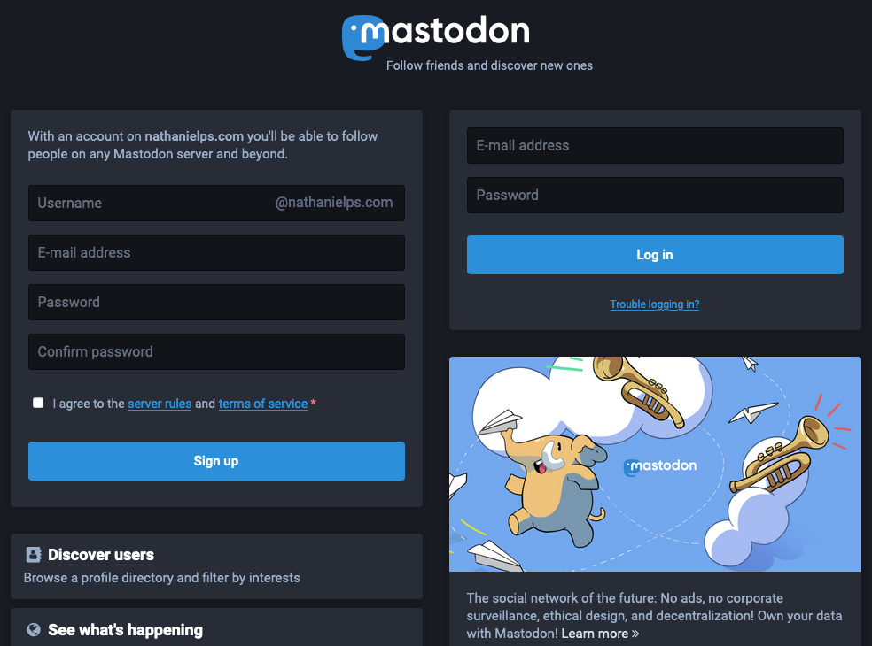
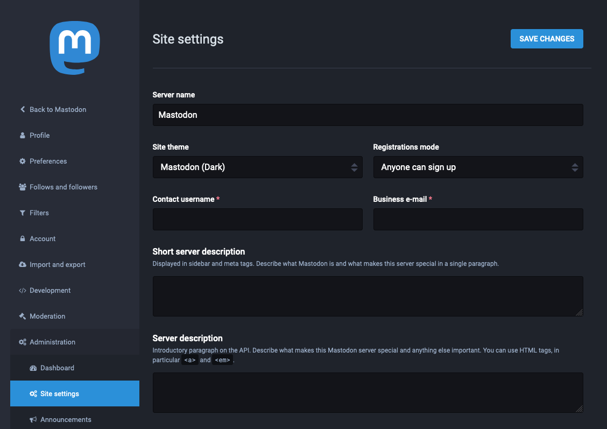



[*Mastodon*](https://docs.joinmastodon.org/) is an open source and self-hosted microblogging platform. It's a social media platform similar to Twitter, allowing users to follow other users and post text, pictures, and video content. Unlike Twitter, Mastodon is decentralized, meaning that its content is not maintained by a central authority.

What sets the Mastodon platform apart is its federated approach to social networking. Each Mastodon server operates independently — anyone can host a server and build their own community. But users from different servers can still follow each other, share content, and communicate.

Mastodon participates in the [Fediverse](https://en.wikipedia.org/wiki/Fediverse), a collection of social networks and other websites that communicate using the [ActivityPub](https://en.wikipedia.org/wiki/ActivityPub) protocol. That allows different Mastodon servers to communicate, and also allows other platforms in the Fediverse to communicate with Mastodon.

Mastodon servers range in size from small private instances to massive public instances, and typically center on special interests or shared principles. The biggest is Mastodon server is [Mastodon.social](https://mastodon.social/about), a general-interest server created by the developers of the Mastodon platform. It has over 540,000 users and boasts a strong [Code of Conduct](https://mastodon.social/about/more).

## Before You Begin

1. If you have not already done so, create a Linode account and Compute Instance. See our [Getting Started with Linode](/docs/products/platform/get-started/) and [Creating a Compute Instance](/docs/products/compute/compute-instances/guides/create/) guides.

1. Follow our [Setting Up and Securing a Compute Instance](/docs/products/compute/compute-instances/guides/set-up-and-secure/) guide to update your system. You may also wish to set the timezone, configure your hostname, create a limited user account, and harden SSH access.

1. Complete the steps in the [Add DNS Records](/docs/guides/set-up-web-server-host-website/#add-dns-records) section to register a domain name to point to your Mastodon instance.

1. Install and configure UFW for managing your machine's firewall rules. Refer to the [How to Configure a Firewall with UFW](/docs/guides/configure-firewall-with-ufw/) guide.

1. Prepare an SMTP server for Mastodon to send email notifications to users when they register for the site, get a follower, receive a message, and for other Mastodon activity.

    - You can create your own SMTP server — and even host it on the same machine as your Mastodon server — by following the [Email with Postfix, Dovecot, and MySQL](/docs/guides/email-with-postfix-dovecot-and-mysql/) guide.

        
This guide uses PostgreSQL database as a backend for Mastodon. You can setup the SMTP server with PostgreSQL database instead of MySQL.


    - Alternatively, you can use a third-party SMTP service. This guide provides instructions for using [Mailgun](https://www.mailgun.com/) as your SMTP provider.

1. Replace occurrences of `example.com` in this guide with the domain name you are using for your Mastodon instance.


This guide is written for a non-root user. Commands that require elevated privileges are prefixed with `sudo`. If you’re not familiar with the `sudo` command, see the [Users and Groups](/docs/guides/linux-users-and-groups/) guide.


## Install Docker and Docker Compose

Mastodon can be installed using its included [Docker Compose](https://docs.docker.com/compose/) file. Docker Compose installs and runs all of the requisites for the Mastodon environment in Docker containers. If you have not used Docker before, it is recommended that you review the following guides:

- [Introduction to Docker](/docs/guides/introduction-to-docker/)
- [How to Use Docker Compose](/docs/guides/how-to-use-docker-compose/)

### Install Docker



### Install Docker Compose



## Download Mastodon

1. Clone the Mastodon Git repository into the home directory, and change into the resulting Mastodon directory.

    ```command
    cd ~/
    git clone https://github.com/mastodon/mastodon.git
    cd mastodon
    ```

    Unless otherwise stated, the remainder of the commands related to Docker Compose should be run in this directory.

## Configure Docker Compose

1. Using your preferred text editor, open the `docker-compose.yml` file located in the `mastodon` directory.

1. Comment out the `build` lines (adding `#` in front of each), and append a release number to the end of each `image: tootsuite/mastodon` line as here: `tootsuite/mastodon:v3.3.0`.

    Although you can use `latest` as the release, it is recommended that you select a specific release number. The Mastodon GitHub page provides a chronological [list of Mastodon releases](https://github.com/mastodon/mastodon/releases).

1. In the `db` section, add the following beneath the `image` line; replace `password` with a password you would like to use for the PostgreSQL database that operates on the Mastodon backend.

    ```file {title="docker-compose.yml"}
    environment:
      POSTGRES_PASSWORD: password
      POSTGRES_DB: mastodon_production
      POSTGRES_USER: mastodon
    ```

1. The resulting `docker-compose.yml` file should look something like [the example Docker file](docker-compose.yml).

1. Copy the `.env.production.sample` file to create a new environment configuration file.

    ```command
    cp .env.production.sample .env.production
    ```

1. Use Docker and Mastodon to generate a new value for the `SECRET_KEY_BASE` setting:

    ```command
    SECRET_KEY_BASE=$(docker-compose run --rm web bundle exec rake secret)
    ```

    This creates a string of random characters. If you encounter an error in the next step, run the command again to generate another string.

1. Insert the `SECRET_KEY_BASE` setting into `.env.production` using the `sed` command:

    ```command
    sed -i -e "s/SECRET_KEY_BASE=/&${SECRET_KEY_BASE}/" .env.production
    ```

1. Combine the previous two actions into one step to set a value for the `OTP_SECRET` setting in `.env.production`:

    ```command
    sed -i "s/OTP_SECRET=$/&$(docker-compose run --rm web bundle exec rake secret)/" .env.production
    ```

1. Generate values for `VAPID_PRIVATE_KEY` and `VAPID_PUBLIC_KEY`settings:

    ```command
    docker-compose run --rm web bundle exec rake mastodon:webpush:generate_vapid_key
    ```

1. Copy the output from the previous command, open `.env.production` in your text editor, and paste the command output into the two lines for `VAPID_PRIVATE_KEY` and `VAPID_PUBLIC_KEY`.

1. Fill out the remainder of the `.env.production` file's fields.

    - `LOCAL_DOMAIN`: Enter your Mastodon server's domain name.

    - `DB_PASS`: Enter the password you set for the database in the `docker-compose.yml` file.

    - Enter `mastodon_db_1` for `DB_HOST` and `mastodon_redis_1` for `REDIS_HOST`. In both of these values, `mastodon` corresponds to the name of the Mastodon base folder.

    - Fill out the `SMTP` fields with the information from your SMTP provider. If you set up your own SMTP server, use its domain name for `SMTP_SERVER` and add the following lines:

        ```file {title=".env.production"}
        SMTP_AUTH_METHOD=plain
        SMTP_OPENSSL_VERIFY_MODE=none
        ```

    - Comment out the sections denoted as "optional" by adding a `#` before each line in the section.

1. The resulting `.env.production` file should resemble [example environment file](env.production).

## Complete the Docker Compose Setup

1. Build the Docker Compose environment.

    ```command
    docker-compose build
    ```

1. Give ownership of the Mastodon `public` directory to user `991`. This is the default user ID for Mastodon, and this command ensures that it has the necessary permissions.

    ```command
    sudo chown -R 991:991 public
    ```

1. Run Mastodon's Docker Compose setup script. You are prompted to enter information about the Docker Compose services and the Mastodon instance.

    ```command
    docker-compose run --rm web bundle exec rake mastodon:setup
    ```

    - Many prompts repeat fields you completed in the `.env.production` file. Make sure to enter the same information here as you entered in the file.

    - When prompted to create a Mastodon administrator user account, choose to do so (`Y`). Enter the username, password, and email address you would like to use to access the account.

    - For any other prompts, enter the default values by pressing **Enter**.

## Initiate the Docker Compose Services

1. Start the Docker Compose services. The following command assumes that you are in the base Mastodon directory (`~/mastodon` in this guide):

    ```command
    docker-compose up -d
    ```

1. Unless manually stopped, the Docker Compose services begin running automatically at system start up. Run the following command to manually stop the Docker Compose services:

    ```command
    docker-compose down
    ```

## Setup an HTTP/HTTPS Proxy

1. Allow HTTP and HTTPS connections on the system's firewall:

    ```command
    sudo ufw allow http
    sudo ufw allow https
    sudo ufw reload
    ```

1. Install NGINX, which proxies requests to your Mastodon server.

    ```command
    sudo apt install nginx
    ```

1. Copy the `nginx.conf` file included with the Mastodon installation to the `sites-available` NGINX folder; use your Mastodon domain name instead of `example.com` in the file name.

    ```command
    sudo cp ~/mastodon/dist/nginx.conf /etc/nginx/sites-available/example.com.conf
    ```

1. Open the `example.com.conf` file with your preferred text editor, and replace all instances of `example.com` with the domain name for your Mastodon site.

1. Create a symbolic link of this file in the `sites-enabled` NGINX folder.

    ```command
    cd /etc/nginx/sites-enabled
    sudo ln -s ../sites-available/example.com.conf
    ```

## Get an SSL/TLS Certificate

Mastodon is served over HTTPS, so you need an SSL/TLS certificate. This guide uses [Certbot](https://certbot.eff.org) to request and download a free certificate from [Let's Encrypt](https://letsencrypt.org).

1. Install the [Snap](https://snapcraft.io/docs/getting-started) app store. Snap provides application bundles that work across major Linux distributions.

    ```command
    sudo apt install snapd
    ```

1. Update and refresh Snap.

    ```command
    sudo snap install core && sudo snap refresh core
    ```

1. Ensure that any existing Certbot installation is removed:

    ```command
    sudo apt remove certbot
    ```

1. Install Certbot.

    ```command
    sudo snap install --classic certbot
    ```

1. Create a symbolic link for Certbot.

    ```command
    sudo ln -s /snap/bin/certbot /usr/bin/certbot
    ```

1. Download a certificate for your site.

    ```command
    sudo certbot certonly --nginx
    ```

    Certbot prompts you to select from the NGINX sites configured on your machine. Select the one with the domain name you set up for your Mastodon instance.

1. Certbot includes a chron job that automatically renews your certificate before it expires. You can test the automatic renewal with the following command:

    ```command
    sudo certbot renew --dry-run
    ```

1. Open the `/etc/nginx/sites-available/example.com.conf` file again, and un-comment the `ssl_certificate` and `ssl_certificate_key` lines.

1. Restart the NGINX server.

    ```command
    sudo systemctl restart nginx
    ```

## Using Mastodon

1. In a web browser, navigate to your Mastodon site's domain. You should see the Mastodon login page, where you can login as the admin user you created earlier or create a new user.

    

1. You can navigate to your instance's administration page by navigating to `example.com/admin/settings/edit`. The administration page allows you to alter the look, feel, and behavior of your instance.

    

1. If your instance is running but having issues, you can troubleshoot them from the Sidekiq dashboard. Either select **Sidekiq** from the administration menu or navigate to `example.com/sidekiq` to see the dashboard.

    

To learn more about Mastodon, check out the [official Mastodon blog](https://blog.joinmastodon.org/) with news and articles related to Mastodon. You can engage with the Mastodon administrator community on [Mastodon's discussion forum](https://discourse.joinmastodon.org/), where you can peruse conversations about technical issues and community governance.

When you are ready to make your instance known to the world, you can add it to the list over at [Instances.social](https://instances.social/admin) by filling out the admin form.