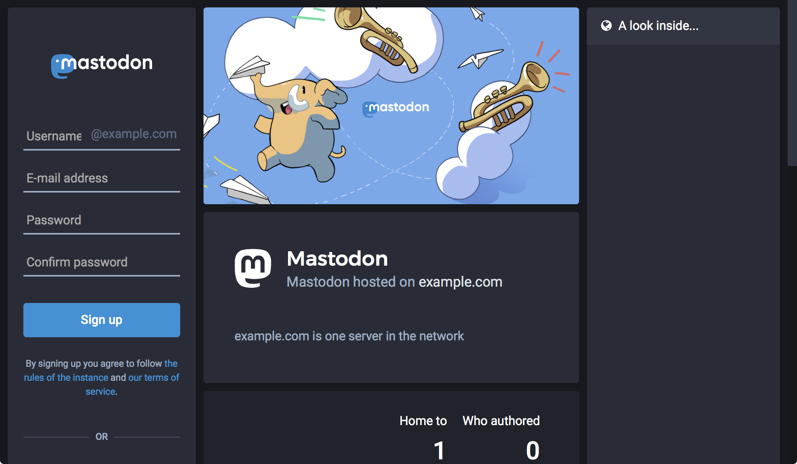
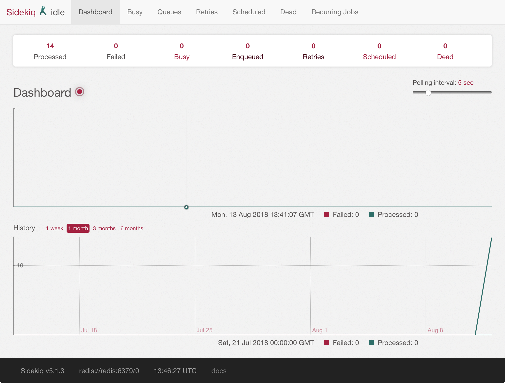

## What is Mastodon?

[**Mastodon**](https://joinmastodon.org/) is a free, decentralized, and open source social network alternative to Twitter. Like Twitter, Mastodon users can follow other users and post messages, images, and videos. Unlike Twitter, there is no single central authority and store for content on the network.

Instead, anyone can create a Mastodon server, invite friends to join it, and build their own communities. In addition, while each Mastodon instance is privately operated, users from different servers can still communicate with and follow each other across instances.



### The Fediverse

The grouping of all the independent social network servers is referred to as the [Fediverse](https://en.wikipedia.org/wiki/Fediverse). Mastodon can communicate with any server implementing the [ActivityPub](https://en.wikipedia.org/wiki/ActivityPub) and/or [OStatus](https://en.wikipedia.org/wiki/OStatus) protocols (one other example is [GNU Social](https://en.wikipedia.org/wiki/GNU_social)), and Mastodon is just one implementation of these protocols.

While Mastodon servers are privately-operated, they are often open to public registration. Some servers are small, and some are very large (for example, [Mastodon.social](https://mastodon.social) has over 180,000 users). Servers are frequently centered on specific interests of their users, or by the principles those users have defined. To enforce those principles, each Mastodon server has the power to moderate and set rules for the content created by the users on that server (for example, see Mastodon.social's [Code of Conduct](https://mastodon.social/about/more)).

## Before You Begin

This guide will create a Mastodon server on a Linode running Ubuntu 16.04. Docker Compose is used to install Mastodon. If you prefer a different Linux distribution, you may be able to use this guide with small changes to the listed commands.

1.  If you have not already done so, create a Linode account and Compute Instance. See our [Getting Started with Linode](/docs/products/platform/get-started/) and [Creating a Compute Instance](/docs/products/compute/compute-instances/guides/create/) guides.

    
Consult Mastodon's [resource usage examples](https://github.com/tootsuite/documentation/blob/master/Running-Mastodon/Resources-needed.md) when considering which Linode plan to deploy on.


1.  Follow our [Setting Up and Securing a Compute Instance](/docs/products/compute/compute-instances/guides/set-up-and-secure/) guide to update your system. You may also wish to set the timezone, configure your hostname, create a limited user account, and harden SSH access. Replace each instance of `example.com` in this guide with your Mastodon site’s domain name.

1. Complete the [Add DNS Records](/docs/guides/set-up-web-server-host-website/#add-dns-records) steps to register a domain name that will point to your Mastodon Linode.

1. Mastodon will serve its content over HTTPS, so you will need to obtain an SSL/TLS certificate. Request and download a free certificate from [Let's Encrypt](https://letsencrypt.org) using [Certbot](https://certbot.eff.org):

        sudo apt install software-properties-common
        sudo add-apt-repository ppa:certbot/certbot
        sudo apt update
        sudo apt install certbot
        sudo certbot certonly --standalone -d example.com

    These commands will download a certificate to `/etc/letsencrypt/live/example.com/` on your Linode.

    
    When Certbot is run, you generally pass a command with the [`--deploy-hook` option](https://certbot.eff.org/docs/api/hooks.html#certbot.hooks.deploy_hook) which reloads your web server. In your deployment, the web server will run in its own container, and the Certbot container would not be able to directly reload it. Another workaround would be needed to enable this architecture.
    

1. Mastodon sends email notifications to users for different events, like when a user first signs up, or when someone else requests to follow them. You will need to supply an SMTP server which will be used to send these messages.

    

    One option is to install your own mail server using the [Email with Postfix, Dovecot, and MySQL](/docs/guides/email-with-postfix-dovecot-and-mysql/) guide. You can install such a mail server on the same Linode as your Mastodon server, or on a different one. If you follow this guide, be sure to create a `notifications@example.com` email address which you will later use for notifications. If you install your mail server on the same Linode as your Mastodon deployment, you can use your Let's Encrypt certificate in `/etc/letsencrypt/live/example.com/` for the mail server too.

    If you would rather not self-host an email server, you can use a third-party SMTP service. The instructions in this guide will also include settings for using [Mailgun](https://www.mailgun.com/) as your SMTP provider.

1. This guide uses Mastodon's Docker Compose deployment method. Before proceeding, [install Docker and Docker Compose](/docs/guides/install-mastodon-on-ubuntu-1604/#install-docker). If you haven't used Docker before, it's recommended that you review the [Introduction to Docker](/docs/guides/introduction-to-docker/) and [How to Use Docker Compose](/docs/guides/how-to-use-docker-compose/) guides.

### Install Docker



### Install Docker Compose



## Set Up Mastodon

Mastodon has a number of components: [PostgreSQL](/docs/guides/configure-postgresql/#what-is-postgresql) and [Redis](https://redis.io/) are used to store data, and three different Ruby on Rails services are used to power the web application. These are all combined in a Docker Compose file that Mastodon provides.

### Download Mastodon and Configure Docker Compose

1. SSH into your Linode and clone Mastodon's Git repository:

        cd ~/
        git clone https://github.com/tootsuite/mastodon
        cd mastodon

1. The Git repository includes an example `docker-compose.yml` which needs some updates to be used in your deployment. The first update you will make is to specify a release of the Mastodon Docker image. The Mastodon GitHub page maintains a chronological [list of releases](https://github.com/tootsuite/mastodon/releases), and you should generally choose the latest version available.

    Open `docker-compose.yml` in your favorite text editor, comment-out the `build` lines, and add a version number to the `image` lines for the `web`, `streaming`, and `sidekiq` services:

    
version: '3'

services:
  # [...]

  web:
#    build: .
    image: tootsuite/mastodon:v2.4.2
    # [...]

  streaming:
#    build: .
    image: tootsuite/mastodon:v2.4.2
    # [...]

  sidekiq:
#    build: .
    image: tootsuite/mastodon:v2.4.2
    # [...]



    
This guide uses Mastodon [v2.4.2](https://github.com/tootsuite/mastodon/releases/tag/v2.4.2). At the time of writing, there was a [known issue](https://github.com/tootsuite/mastodon/issues/8001) with [v2.4.3](https://github.com/tootsuite/mastodon/releases/tag/v2.4.3) during installation.


1.  For the `db`, `redis`, `web`, and `sidekiq` services, set the volumes listed in this snippet:

    
version: '3'

services:
  db:
    # [...]
    volumes:
      - ./postgres:/var/lib/postgresql/data

  redis:
    # [...]
    volumes:
      - ./redis:/data

  web:
    # [...]
    volumes:
      - ./public/system:/mastodon/public/system
      - ./public/assets:/mastodon/public/assets
      - ./public/packs:/mastodon/public/packs

  sidekiq:
    # [...]
    volumes:
      - ./public/system:/mastodon/public/system
      - ./public/packs:/mastodon/public/packs


1. After the `sidekiq` service and before the final `networks` section, add a new `nginx` service. NGINX will be used to proxy requests on HTTP and HTTPS to the Mastodon Ruby on Rails application:

    
version: '3'

services:
  # [...]

  sidekiq:
    # [...]

  nginx:
    build:
      context: ./nginx
      dockerfile: Dockerfile
    ports:
      - "80:80"
      - "443:443"
    volumes:
       - /etc/letsencrypt/:/etc/letsencrypt/
       - ./public/:/home/mastodon/live/public
       - /usr/share/nginx/html:/usr/share/nginx/html
    restart: always
    depends_on:
      - web
      - streaming
    networks:
      - external_network
      - internal_network

networks:
  # [...]
  st


1. Compare your edited `docker-compose.yml` with this [copy of the complete file](docker-compose.yml) and make sure all the necessary changes were included.

1. Create a new `nginx` directory within the Mastodon Git repository:

        mkdir nginx

1. Create a file named `Dockerfile` in the `nginx` directory and paste in the following contents:

    
FROM nginx:latest

COPY default.conf /etc/nginx/conf.d


1. Create a file named `default.conf` in the `nginx` directory and paste in the following contents. Change each instance of `example.com`:

    ```file {title="nginx/default.conf" lang="nginx"}
    map $http_upgrade $connection_upgrade {
      default upgrade;
      ''      close;
    }

    server {
      listen 80;
      listen [::]:80;
      server_name example.com;
      # Useful for Let's Encrypt
      location /.well-known/acme-challenge/ { root /usr/share/nginx/html; allow all; }
      location / { return 301 https://$host$request_uri; }
    }

    server {
      listen 443 ssl http2;
      listen [::]:443 ssl http2;
      server_name example.com;

      ssl_protocols TLSv1.2;
      ssl_ciphers HIGH:!MEDIUM:!LOW:!aNULL:!NULL:!SHA;
      ssl_prefer_server_ciphers on;
      ssl_session_cache shared:SSL:10m;

      ssl_certificate     /etc/letsencrypt/live/example.com/fullchain.pem;
      ssl_certificate_key /etc/letsencrypt/live/example.com/privkey.pem;

      keepalive_timeout    70;
      sendfile             on;
      client_max_body_size 0;

      root /home/mastodon/live/public;

      gzip on;
      gzip_disable "msie6";
      gzip_vary on;
      gzip_proxied any;
      gzip_comp_level 6;
      gzip_buffers 16 8k;
      gzip_http_version 1.1;
      gzip_types text/plain text/css application/json application/javascript text/xml application/xml application/xml+rss text/javascript;

      add_header Strict-Transport-Security "max-age=31536000";

      location / {
        try_files $uri @proxy;
      }

      location ~ ^/(packs|system/media_attachments/files|system/accounts/avatars) {
        add_header Cache-Control "public, max-age=31536000, immutable";
        try_files $uri @proxy;
      }

      location @proxy {
        proxy_set_header Host $host;
        proxy_set_header X-Real-IP $remote_addr;
        proxy_set_header X-Forwarded-For $proxy_add_x_forwarded_for;
        proxy_set_header X-Forwarded-Proto https;
        proxy_set_header Proxy "";
        proxy_pass_header Server;

        proxy_pass http://web:3000;
        proxy_buffering off;
        proxy_redirect off;
        proxy_http_version 1.1;
        proxy_set_header Upgrade $http_upgrade;
        proxy_set_header Connection $connection_upgrade;

        tcp_nodelay on;
      }

      location /api/v1/streaming {
        proxy_set_header Host $host;
        proxy_set_header X-Real-IP $remote_addr;
        proxy_set_header X-Forwarded-For $proxy_add_x_forwarded_for;
        proxy_set_header X-Forwarded-Proto https;
        proxy_set_header Proxy "";

        proxy_pass http://streaming:4000;
        proxy_buffering off;
        proxy_redirect off;
        proxy_http_version 1.1;
        proxy_set_header Upgrade $http_upgrade;
        proxy_set_header Connection $connection_upgrade;

        tcp_nodelay on;
      }

      error_page 500 501 502 503 504 /500.html;
    }
    ```

### Configure Mastodon

The configuration settings for Mastodon are held in the `.env.production` file at the root of the Mastodon Git repository.

1. Create the `.env.production` file and copy in the following contents. Replace all instances of `example.com` with your domain name. Fill in the `SMTP_SERVER` and `SMTP_PASSWORD` fields with the domain and credentials from your mail server:

    
LOCAL_DOMAIN=example.com
SINGLE_USER_MODE=false
SECRET_KEY_BASE=
OTP_SECRET=
VAPID_PRIVATE_KEY=
VAPID_PUBLIC_KEY=

# Database settings
DB_HOST=db
DB_PORT=5432
DB_NAME=postgres
DB_USER=postgres
DB_PASS=

# Redis settings
REDIS_HOST=redis
REDIS_PORT=6379
REDIS_PASSWORD=

# Mail settings
SMTP_SERVER=your_smtp_server_domain_name
SMTP_PORT=587
SMTP_LOGIN=notifications@example.com
SMTP_PASSWORD=your_smtp_password
SMTP_AUTH_METHOD=plain
SMTP_OPENSSL_VERIFY_MODE=none
SMTP_FROM_ADDRESS=Mastodon <notifications@example.com>


    If you're using Mailgun for your mail service, remove all the lines from the `Mail settings` section and enter the following options:

    
SMTP_SERVER=smtp.mailgun.org
SMTP_PORT=587
SMTP_LOGIN=your_mailgun_email
SMTP_PASSWORD=your_mailgun_email_password


1. Use Docker and Mastodon to generate a new value for the `SECRET_KEY_BASE` setting:

        SECRET_KEY_BASE=$(docker-compose run --rm web bundle exec rake secret)

    This creates a string of random characters. If you encounter an error in the next step, run the command again to generate another string.

1. Insert the `SECRET_KEY_BASE` setting into `.env.production` using the `sed` command:

        sed -i -e "s/SECRET_KEY_BASE=/&${SECRET_KEY_BASE}/" .env.production

1. Combine the previous two actions into one step to set a value for the `OTP_SECRET` setting in `.env.production`:

        sed -i "s/OTP_SECRET=$/&$(docker-compose run --rm web bundle exec rake secret)/" .env.production

1. Generate values for `VAPID_PRIVATE_KEY` and `VAPID_PUBLIC_KEY`settings:

        docker-compose run --rm web bundle exec rake mastodon:webpush:generate_vapid_key

1. Copy the output from the previous command, open `.env.production` in your text editor, and paste the command output into the two lines for `VAPID_PRIVATE_KEY` and `VAPID_PUBLIC_KEY`.

1. Build the Docker Compose file:

        docker-compose build

### Complete the Mastodon Setup

1. Set Mastodon as the owner of the `public` directory inside the Mastodon Git repository:

        sudo chown -R 991:991 public

    
The UID that Mastodon will run under is `991`, but there is no `mastodon` user created on your system.


1. Create a directory which will hold [Let's Encrypt challenge files](https://letsencrypt.org/how-it-works/) for future certificate renewals:

        sudo mkdir -p /usr/share/nginx/html

1. Set up the database:

        docker-compose run --rm web bundle exec rake db:migrate

1. Pre-compile Mastodon's assets:

        docker-compose run --rm web bundle exec rake assets:precompile

    This command will take a while to complete.

1. Start Mastodon:

        docker-compose up -d

### Create your Mastodon User

1. Visit your domain in a web browser:

    

1. Enter a new username, email address, and password to create a new user on your Mastodon instance. When communicating with users of other Mastodon servers, your full username is `@your_username@example.com`.

1. Mastodon will attempt to send you a confirmation email. Check your email and click the provided link to confirm your registration.

    If you did not set up email notifications, you can manually confirm the new user by running the `confirm_email` task on the Docker container:

        docker-compose run web bundle exec rake mastodon:confirm_email USER_EMAIL=your_email_address

1. Run the `make_admin` task on your Docker container to make this new user an admin for the Mastodon instance:

        docker-compose run web bundle exec rake mastodon:make_admin USERNAME=your_mastodon_instance_user

## Troubleshooting

If your Mastodon site doesn't load in your browser, try reviewing the logs generated by Docker for more information. To see these errors:

1. Shut down your containers:

        cd mastodon
        docker-compose down

1. Run Docker Compose in an attached state so that you can view the logs generated by each container:

        docker-compose up

1. To shut down Docker Compose and return to the command prompt again, enter `CTRL-C`.

If your Mastodon site appears, but some specific site functions are not working, use the tools available in Mastodon's administrative settings, found through `example.com/admin/settings/edit`. The Sidekiq dashboard displays the status of jobs issued by Mastodon:



## Maintenance

To update your Mastodon version, review the instructions from the Mastodon GitHub's [Docker Guide](https://github.com/tootsuite/documentation/blob/master/Running-Mastodon/Docker-Guide.md#updating). You should also review the [Mastodon release notes](https://github.com/tootsuite/mastodon/releases).

### Renew your Let's Encrypt Certificate

1. Open your Crontab in your editor:

        sudo crontab -e

1. Add a line which will invoke Certbot at 11PM every day. Replace `example.com` with your domain:

        0 23 * * *   certbot certonly -n --webroot -w /usr/share/nginx/html -d example.com --deploy-hook='docker exec mastodon_nginx_1 nginx -s reload'

1. You can test your new job with the `--dry-run` option:

        sudo bash -c "certbot certonly -n --webroot -w /usr/share/nginx/html -d example.com --deploy-hook='docker exec mastodon_nginx_1 nginx -s reload' --dry-run"

## Using your New Mastodon Instance
Now that your new instance is running, you can start participating in the Mastodon network. The official [Mastodon User's Guide](https://github.com/tootsuite/documentation/blob/master/Using-Mastodon/User-guide.md) describes the mechanics of the application and network. Mastodon's founder, Eugen Rochko, has also written a non-technical blog post that outlines his best practices for building a new community: [How to start a Mastodon server](https://medium.com/tootsuite/how-to-start-a-mastodon-server-dea0dec56028).

[Mastodon's discussion forum](https://discourse.joinmastodon.org) hosts conversations about technical issues and governance/community concerns. [Mastodon's official blog](https://blog.joinmastodon.org) highlights new releases and features articles on the philosophy of Mastodon's design.

To add your new instance to the list at [joinmastodon.org](https://joinmastodon.org), submit it through [instances.social](https://instances.social/admin).
