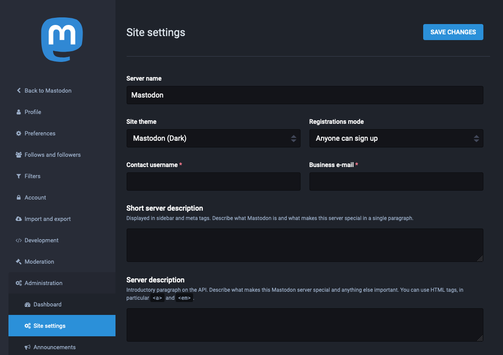
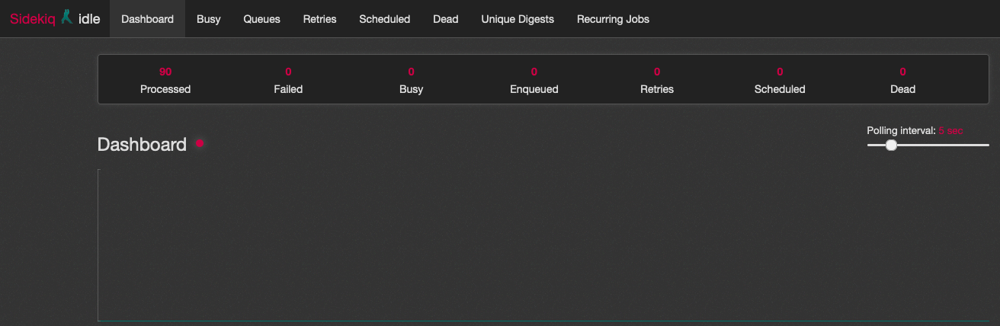



[*Mastodon*](https://docs.joinmastodon.org/) is an open-source and self-hosted social media platform for microblogging. It is similar to Twitter, allowing users to follow other users and post text, pictures, and video content. But unlike Twitter, Mastodon is decentralized, meaning that its content is not maintained by a central authority.

What sets the Mastodon platform apart is its federated approach to social networking. Each Mastodon instance operates independently — anyone can host an instance and build their community. But users from different instances can still follow each other, share content, and communicate.

Mastodon servers range in size from small private instances to massive public instances and typically center on special interests or shared principles. The biggest Mastodon server is [Mastodon.social](https://mastodon.social/about), a general-interest server created by the developers of the Mastodon platform. It has over 540,000 users and boasts a strong [Code of Conduct](https://mastodon.social/about/more).

## Before You Begin

1. If you have not already done so, create a Linode account and Compute Instance. See our [Getting Started with Linode](/docs/products/platform/get-started/) and [Creating a Compute Instance](/docs/products/compute/compute-instances/guides/create/) guides.

1. Follow our [Setting Up and Securing a Compute Instance](/docs/products/compute/compute-instances/guides/set-up-and-secure/) guide to update your system. You may also wish to set the timezone, configure your hostname, create a limited user account, and harden SSH access.

1. Complete the steps in the [Add DNS Records](/docs/guides/set-up-web-server-host-website/#add-dns-records) section to register a domain name to point to your Mastodon instance.

1. Enable FirewallD for managing your machine's firewall rules. Refer to the [firewall cmd list](/docs/guides/introduction-to-firewalld-on-centos/).

1. Prepare an SMTP server for Mastodon to send email notifications to users when they register for the site, get a follower, receive a message, and for other Mastodon activities.

    - You can create your SMTP server — and even host it on the same machine as your Mastodon server — by following the [Email with Postfix, Dovecot, and MySQL](/docs/guides/email-with-postfix-dovecot-and-mysql/) guide.

        
This guide uses PostgreSQL database as a backend for Mastodon. You can setup the SMTP server with PostgreSQL database instead of MySQL.


    - Alternatively, you can use a third-party SMTP service. This guide provides instructions for using [Mailgun](https://www.mailgun.com/) as your SMTP provider.

1. Replace occurrences of `example.com` in this guide with the domain name you are using for your Mastodon instance.


This guide is written for non-root user. Commands that require elevated privileges are prefixed with `sudo`. If you are not familiar with the `sudo` command, see the [Users and Groups](/docs/guides/linux-users-and-groups/) guide.


## Install Docker and Docker Compose

Mastodon can be installed using its included [Docker Compose](https://docs.docker.com/compose/) file. Docker Compose installs and runs all of the requisites for the Mastodon environment in Docker containers. If you have not used Docker before, it is recommended that you review the following guides:

- [Introduction to Docker](/docs/guides/introduction-to-docker/)

- [How to Use Docker Compose](/docs/guides/how-to-use-docker-compose/)

### Install Docker

These steps install Docker Community Edition (CE). See the official [installation page](https://docs.docker.com/install/) for more information.

1. Remove any older installations of Docker that may be on your machine.

        sudo yum remove docker docker-client docker-client-latest docker-common docker-latest docker-latest-logrotate docker-logrotate docker-engine

1. Install `yum-utils`.

        sudo yum install yum-utils

1. Add the stable Docker repository.

        sudo yum-config-manager --add-repo https://download.docker.com/linux/centos/docker-ce.repo

1. Update the package index, and install Docker CE.

        sudo yum update
        sudo yum install docker-ce docker-ce-cli containerd.io

    If prompted to accept the GPG key, do so after verifying that the fingerprint matches the following:

    
060A 61C5 1B55 8A7F 742B 77AA C52F EB6B 621E 9F35
    

1. Start Docker, and set it to begin running at system start up.

        sudo systemctl start docker
        sudo systemctl enable docker

1. Add your limited Linux user account to the `docker` group. You need to log out and log back in after running the following command for the change to take effect:

        sudo usermod -aG docker $USER

Mastodon participates in the [*Fediverse*](https://en.wikipedia.org/wiki/Fediverse), a collection of social networks and other websites that communicate using the [*ActivityPub*](https://en.wikipedia.org/wiki/ActivityPub) protocol. That allows different Mastodon servers to communicate, and also allows other platforms in the Fediverse to communicate with Mastodon.

1. Check that the installation was successful by running the built-in “Hello World” program.

        docker run hello-world

### Install Docker Compose



## Download Mastodon

1. Install Git.

        sudo yum install git

1. Clone the Mastodon Git repository into the home directory, and change into the resulting Mastodon directory.

        cd ~/
        git clone https://github.com/mastodon/mastodon.git
        cd mastodon

    Unless otherwise stated, the remainder of the commands related to Docker Compose should be run in this directory.

## Configure Docker Compose

1. Using your preferred text editor, open the `docker-compose.yml` file.

1. Comment out the `build` lines (adding `#` in front of each), and append a release number to the end of each `image: tootsuite/mastodon` line as here: `tootsuite/mastodon:v4.0.2`.

    Although you can use `latest` as the release, it is recommended that you select a specific release number. The Mastodon GitHub page provides a chronological [list of Mastodon releases](https://github.com/mastodon/mastodon/releases).

1. The resulting `docker-compose.yml` file should look something like [the example Docker file](docker-compose.yml).

1. Copy the `.env.production.sample` file to create a new environment configuration file.

        cp .env.production.sample .env.production

1. Use the following commands to generate a `SECRET_KEY_BASE` and `OTP_SECRET`. Copy the output, and paste in the `SECRET_KEY_BASE` and `OTP_SECRET` lines in the `.env.production` file.

        echo SECRET_KEY_BASE=$(docker compose run --rm web bundle exec rake secret)
        sed -i -e "s/SECRET_KEY_BASE=/&${SECRET_KEY_BASE}/" .env.production
        echo OTP_SECRET=$(docker compose run --rm web bundle exec rake secret)
        sed -i -e "s/OTP_SECRET=/&${OTP_SECRET}/" .env.production

    If either of the `sed` commands fails, repeat the previous command and try the `sed` command again.

1. Generate the `VAPID_PRIVATE_KEY` and `VAPID_PUBLIC_KEY` using the following command, copy the output, and paste it over the `VAPID_PRIVATE_KEY` and `VAPID_PUBLIC_KEY` lines in the `.env.production` file.

        docker compose run --rm web bundle exec rake mastodon:webpush:generate_vapid_key

1. Fill out the remainder of the `.env.production` file's fields:

    - `LOCAL_DOMAIN`: Enter your Mastodon server's domain name.

    - `DB_USER`: Change this to `postgres`, and leave the `DB_PASS` field empty.

    - Enter `mastodon-db-1` for `DB_HOST` and `mastodon-redis-1` for `REDIS_HOST`. In both of these values, `mastodon` corresponds to the name of the Mastodon base folder.

    - Fill out the `SMTP` fields with the information from your SMTP provider. If you set up your own SMTP server, use its domain name for `SMTP_SERVER` and add the following lines:

            SMTP_AUTH_METHOD=plain
            SMTP_OPENSSL_VERIFY_MODE=none

    - Comment out the sections denoted as "optional" by adding a `#` before each line in the section.

1. The resulting `.env.production` file should resemble [the example environment file](env.production).

## Complete the Docker Compose Setup

1. Build the Docker Compose environment.

        docker compose build

1. Give ownership of the Mastodon `public` directory to user `991`. This is the default user ID for Mastodon, and this command ensures that it has the necessary permissions.

        sudo chown -R 991:991 public

1. Configure the firewall to allow connections from between localhost into the database Docker container.

        sudo firewall-cmd --zone=public --add-masquerade --permanent
        sudo firewall-cmd --permanent --zone=public --change-interface=docker0
        sudo firewall-cmd --permanent --zone=public --add-port=5432/tcp
        sudo firewall-cmd --reload

1. Run Mastodon's Docker Compose setup script. You are prompted to enter information about the Docker Compose services and the Mastodon instance.

        docker compose run --rm web bundle exec rake mastodon:setup

    - Many prompts repeat fields you completed in the `.env.production` file. Make sure to enter the same information here as you entered in the file.

    - When prompted to create a Mastodon administrator user account, choose to do so (`Y`). Enter the username, password, and email address you would like to use to access the account.

    - For any other prompts, enter the default values by pressing **Enter**.

## Initiate the Docker Compose Services

1. Start the Docker Compose services.

        docker compose up -d

1. Unless manually stopped, the Docker Compose services begin running automatically at system start up. Run the following command to manually stop the Docker Compose services.

        docker compose down

## Setup an HTTP/HTTPS Proxy

1. Allow HTTP and HTTPS connections on the system's firewall.

        sudo firewall-cmd --permanent --zone=public --add-service=http --add-service=https
        sudo firewall-cmd --reload

1. Install NGINX, which proxies requests to your Mastodon server.

        sudo yum install nginx

1. Create `sites-available` and `sites-enabled` directories in the NGINX directory. The first of these holds your NGINX server-block files and the second holds symbolic links to the server blocks you want to make public.

        sudo mkdir /etc/nginx/sites-available
        sudo mkdir /etc/nginx/sites-enabled

1. Open the `/etc/nginx/nginx.conf` file in your preferred text editor, and add the following lines to the `http` section. This ensures that NGINX looks for your server-block files in the `sites-enabled` directory.

        include /etc/nginx/sites-enabled/*.conf;
        server_names_hash_bucket_size 64;

    Comment out the `server` section by adding a `#` to the start of each line that makes up the section. This ensures that the default NGINX welcome page does not display.

1. Copy the `nginx.conf` file included with the Mastodon installation to the `sites-available` NGINX folder; use your Mastodon domain name instead of `example.com` in the file name.

        sudo cp ~/mastodon/dist/nginx.conf /etc/nginx/sites-available/example.com.conf

1. Open the `example.com.conf` file with your preferred text editor, and replace all instances of `example.com` with the domain name for your Mastodon site.

1. Create a symbolic link of this file in the `sites-enabled` NGINX folder.

        cd /etc/nginx/sites-enabled
        sudo ln -s ../sites-available/example.com.conf

## Get an SSL/TLS Certificate

Mastodon is served over HTTPS, so you need an SSL/TLS certificate. This guide uses [Certbot](https://certbot.eff.org) to request and download a free certificate from [Let's Encrypt](https://letsencrypt.org). Certbot is installed via the [Snap](https://snapcraft.io/docs/getting-started) app store, which provides application bundles that work across major Linux distributions.

1. Add the *Extra Packages for Enterprise Linux* (EPEL) repository.

        sudo dnf install epel-release
        sudo dnf upgrade

1. Install Snap, and create the symbolic links needed for Snap to run properly and to enable Snap classic. After running these commands, log out and log back in to make sure the changes take effect.

        sudo yum install snapd
        sudo systemctl enable --now snapd.socket
        sudo ln -s /var/lib/snapd/snap /snap

1. Update and refresh Snap.

        sudo snap install core && sudo snap refresh core

1. Ensure that any existing Certbot installation is removed.

        sudo yum remove certbot

1. Install Certbot, and create a symbolic link for it.

        sudo snap install --classic certbot
        sudo ln -s /snap/bin/certbot /usr/bin/certbot

1. Download a certificate for your site.

        sudo certbot certonly --nginx

    Certbot prompts you to select from the NGINX sites configured on your machine. Select the one with the domain name you set up for your Mastodon instance.

1. Certbot includes a chron job that automatically renews your certificate before it expires. You can test the automatic renewal with the following command:

        sudo certbot renew --dry-run

1. Open the `/etc/nginx/sites-available/example.com.conf` file again, and un-comment the `ssl_certificate` and `ssl_certificate_key` lines.

1. Restart the NGINX server.

        sudo systemctl restart nginx

1. Run the following command for SELinux to allow NGINX to make network connections:

        sudo setsebool -P httpd_can_network_connect 1

## Using Mastodon

1. In a web browser, navigate to your Mastodon site's domain. You should see the Mastodon login page, where you can login as the administrator user you created earlier or create a new user.

    

1. You can navigate to your instance's administration page by navigating to `example.com/admin/settings/edit`. The administration page allows you to alter the look, feel, and behavior of your instance.

    

1. If your instance is running but having issues, you can troubleshoot them from the Sidekiq dashboard. Either select **Sidekiq** from the administration menu or navigate to `example.com/sidekiq` to see the dashboard.

    

To learn more about Mastodon, check out the [official Mastodon blog](https://blog.joinmastodon.org/) with news and articles related to Mastodon. You can engage with the Mastodon administrator community on [Mastodon's discussion forum](https://discourse.joinmastodon.org/), where you can peruse conversations about technical issues and community governance.

When you are ready to make your instance known to the world, you can add it to the list over at [Instances.social](https://instances.social/admin) by filling out the admin form.
