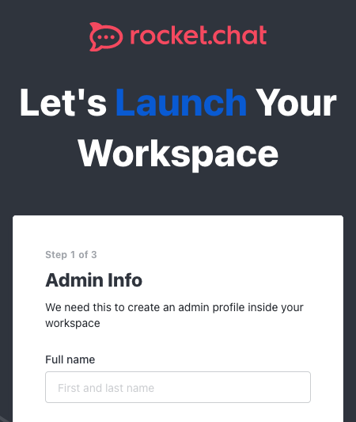
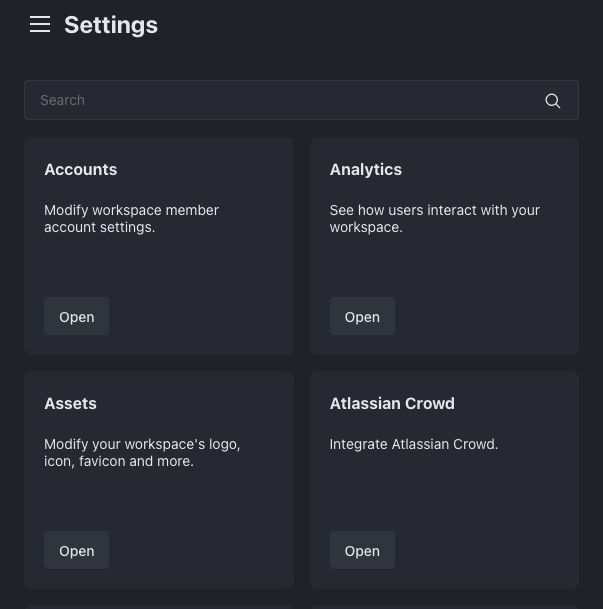

## What Is Rocket.Chat?

[Rocket.Chat](https://www.rocket.chat/) is a secure, customizable, open-source communications platform with enterprise-grade features that make it a viable solution for help desk and support operations. In addition to managing conversations across your organization, Rocket.Chat also supports federation, allowing you to communicate with other companies and a wider customer base.

This guide compares Rocket.Chat to other SaaS applications, provides steps for multiple deployment and setup options, and reviews how to get started after deployment.

## Comparing Rocket.Chat to Other Hosted SaaS Applications

Rocket.Chat competes with tools like Slack and Microsoft Teams, with one of the major differences being that Rocket.Chat can be self-hosted and the latter are software-as-a-service (SaaS) applications.

Below are some example features offered by Rocket.Chat:

-   Rocket.Chat Community Edition is free and can be self-hosted. This provides both accessibility and a high degree of control around your collaboration platform.

-   Rocket.Chat prioritizes security. Rocket.Chat uses end-to-end encryption for communications and provides fine-grained, role-based permission control.

-   Rocket.Chat's Omnichannel feature expands the reach of your collaboration beyond the platform itself. Features of Omnichannel include a live chat pop-up on your website and integration with third-party messaging services like SMS, email, and WhatsApp, allowing you to engage with external clients.

-   Rocket.Chat's Omnichannel support makes it an effective help desk, offering comparisons to services like Zendesk and Freshdesk. Live chat and cross-channel messaging give you the ability to integrate external customer support into an internal collaboration platform.

-   Rocket.Chat is open-source, making the code accessible and customizable. Its wide adoption and popularity as a platform means it benefits from open-source community support and ongoing development.

## Choosing Between Rocket.Chat Plans

Rocket.Chat offers Community, Pro, and Enterprise editions, with this guide reviewing the steps for deploying the free Community edition. You can upgrade the Community Edition to a Pro or Enterprise Edition at any time.

For a comprehensive comparison between plan types, including features and limitations, see Rocket.Chat's [Plan documentation](https://docs.rocket.chat/readme/our-plans).

## Deploying Rocket.Chat

There are multiple methods for deploying Rocket.Chat. This guide reviews manual deployment on a single Compute Instance, as well as deploying to a Kubernetes cluster:

-   Deploy using our [Rocket.Chat Marketplace app](/docs/products/tools/marketplace/guides/rocketchat/). This installs and configures all necessary software and is the fastest deployment method.
-   Manually deploy to a [Compute Instance](#deploying-to-a-compute-instance).
-   Deploy to a [Kubernetes cluster](#deploying-to-a-kubernetes-cluster) with Linode Kubernetes Engine (LKE).
-   Use Rocket.Chat's instructions for deploying via [Docker and Docker Compose](https://docs.rocket.chat/deploy/deploy-rocket.chat/deploy-with-docker-and-docker-compose) using Rocket.Chat's Docker image.

### Hardware Requirements

The Compute plan you choose for your deployment may vary and depends on your business needs. Rocket.Chat's system recommendations are listed below, and more details can be found in their official documentation here: [Requirements for Rocket.Chat Deployment](https://docs.rocket.chat/deploy/deploy-rocket.chat/system-requirements)

For deployments up to 200 users and 50 concurrent users:

-   Single-core (2 GHz)
-   1 GB RAM
-   30 GB of SSD

For deployments up to 500 users and 100 concurrent users:

-   Dual-core (2 GHz)
-   2 GB RAM
-   40 GB of SSD

See our [Pricing page](https://www.linode.com/pricing/) for plan details and specifications.

### Deploying to a Compute Instance

Manually deploying Rocket.Chat to a Compute Instance uses the [snap](https://snapcraft.io) package manager, which bundles applications for Linux systems. The steps below include the installation of Rocket.Chat, as well as the configuration of a reverse proxy server with optional SSL certification.

#### Installing the Rocket.Chat Server

1.  Snap comes preinstalled on most Ubuntu 18.04 systems and above. If you are using a different distribution, you may need to install snap on your system first. See the [official snap documentation](https://snapcraft.io/docs/installing-snapd) for a list of additional supported distributions and installation instructions.

    Run the command below to check the snap version on your system:

    ```command
    snap --version
    ```

1.  Install the Rocket.Chat package using snap:

    ```command
    sudo snap install rocketchat-server
    ```

    Once the installation is finished, the Rocket.Chat server starts up automatically, typically running on `localhost:3000` by default.

#### Setting Up a Reverse Proxy Server

You can access the Rocket.Chat instance once installation is complete, but it is a good practice to set up a reverse proxy server for access. This lets you forward the default port to the HTTP and HTTPS ports to more easily and securely use a domain name. The reverse proxy also provides a basis for setting up SSL encryption.

The instructions below require you to be logged into your instance as a user with root permissions.

1.  Install NGINX using the instructions in our [Installing and Using NGINX](/docs/guides/how-to-install-and-use-nginx-on-ubuntu-20-04/) guide. NGINX will act as your reverse proxy server.

1.  Create the `sites-available` and `sites-enabled` directories in `/etc/nginx/` if they do not already exist:

    ```command
    sudo mkdir -p /etc/nginx/{sites-available,sites-enabled}
    ```

1.  Using a text editor, open the main NGINX configuration file located at `/etc/nginx/nginx.conf`. The command below uses the nano text editor:

    ```command
    sudo nano /etc/nginx/nginx.conf
    ```

1.  Ensure the file contains a line to include configurations from the `sites-enabled` directory: `include /etc/nginx/sites-enabled/*;`. If not, add it directly below the `include /etc/nginx/conf.d/*.conf;` line in the `http` section like so:

    ```file {title="/etc/nginx/nginx.conf" lang="conf" hl_lines="5"}
    ...
    http {
        ...
        include /etc/nginx/conf.d/*.conf;
        include /etc/nginx/sites-enabled/*;
        ...
    }
    ```
    Once complete, save your changes.

1.  Create a new NGINX site configuration file in the `/etc/nginx/sites-available` directory. This example names the file .

    ```command
    sudo nano /etc/nginx/sites-available/
    ```

1.  Add the contents shown below to your `sites-available` file. Replace  with the domain name you intend to associate with the server, if any:

    ```file {title="/etc/nginx/sites-available/rocketchat.conf" lang="conf" hl_lines="8"}
    upstream backend {
        server 127.0.0.1:3000;
    }

    server {
        listen 80;

        server_name ;

        error_log /var/log/nginx/rocketchat.access.log;

        location / {
            proxy_pass http://backend;

            proxy_http_version 1.1;
            proxy_set_header Host $host;
            proxy_set_header X-Real-IP $remote_addr;
            proxy_set_header X-Forwarded-For $proxy_add_x_forwarded_for;
            proxy_set_header X-Forwarded-Proto http;
            proxy_set_header X-Nginx-Proxy true;
            proxy_redirect http:// $scheme://;
        }
    }
    ```
    Save your changes when you are done.

1.  Enable the site configuration by creating a symbolic link in the `/etc/nginx/sites-enabled` directory. Replace  with the name of your configuration file:

    ```command
    sudo ln -s /etc/nginx/sites-available/ /etc/nginx/sites-enabled/
    ```

1.  Verify that the new NGINX configuration passes NGINX's tests:

    ```command
    sudo nginx -t
    ```

    ```output
    nginx: the configuration file /etc/nginx/nginx.conf syntax is ok
    nginx: configuration file /etc/nginx/nginx.conf test is successful
    ```

    
    If you are on a system that uses SELinux, such as CentOS, allow server network connections:

    ```command
    sudo setsebool -P httpd_can_network_connect 1
    ```
    

1.  Restart the NGINX server once the configuration is verified:

    ```command
    sudo systemctl restart nginx
    ```

#### Optional: Get an SSL Certificate

With a reverse proxy in place, you can enable SSL encryption and secure the web traffic for your Rocket.Chat instance using [Certbot](https://certbot.eff.org/).


Completing these steps require your system's public IP address to be associated with a domain name. For information on managing and setting up domains with your Compute Instance, see our [DNS Manager](/docs/products/networking/dns-manager/get-started/) guide.


1.  Follow the instructions in our [Use Certbot to Enable HTTPS with NGINX](/docs/guides/enabling-https-using-certbot-with-nginx-on-ubuntu/) guide to install Certbot and obtain an SSL certificate.

1.  Using a text editor, open the site's NGINX configuration in the `rocketchat.conf` file created earlier. Replace  with the name of your file:

    ```command
    sudo nano /etc/nginx/sites-available/
    ```

1.  Certbot adds SSL configuration and a second server block, but you'll need to adjust some settings for Rocket.Chat.

    Retain the `ssl_certificate` and `ssl_certificate_key` values and second `server` section. This means you should replace the `server` block you added earlier with the modified version shown below that includes the `ssl_certificate` and `ssl_certificate_key` lines. Replace the three instances of  with your domain name.

    ```file {title="/etc/nginx/sites-available/rocketchat.conf" lang="conf" linenostart="5" hl_lines="2,9,10"}
    server {
        server_name ;

        listen 443 ssl;

        ssl on;
        ssl_protocols TLSv1 TLSv1.1 TLSv1.2;

        ssl_certificate /etc/letsencrypt/live//fullchain.pem;
        ssl_certificate_key /etc/letsencrypt/live//privkey.pem;

        error_log /var/log/nginx/rocketchat.access.log;

        location / {
            proxy_pass http://backend;

            proxy_http_version 1.1;
            proxy_set_header Upgrade $http_upgrade;
            proxy_set_header Connection "upgrade";
            proxy_set_header Host $http_host;
            proxy_set_header X-Real-IP $remote_addr;
            proxy_set_header X-Forwarded-For $proxy_add_x_forwarded_for;
            proxy_set_header X-Forwarded-Proto https;
            proxy_set_header X-Nginx-Proxy true;
            proxy_redirect off;
        }
    }
    ```
    Save your changes when complete.

1.  Verify that the modified NGINX configuration passes NGINX's tests:

    ```command
    sudo nginx -t
    ```

    ```output
    nginx: the configuration file /etc/nginx/nginx.conf syntax is ok
    nginx: configuration file /etc/nginx/nginx.conf test is successful
    ```

1.  Once verified, restart the NGINX server:

    ```command
    sudo systemctl restart nginx
    ```
### Deploying to a Kubernetes Cluster

For a scalable solution, Rocket.Chat supports Kubernetes deployments. The steps below use Linode Kubernetes Engine (LKE) and [Helm](https://helm.sh/) to deploy Rocket.Chat to a Kubernetes cluster.

This requires the following prerequisites:

-   An active LKE cluster with the `kubectl` tool configured. See [Linode Kubernetes Engine - Get Started](/docs/products/compute/kubernetes/get-started/).
-   Helm installed and configured on your local machine. See [Installing Apps on Kubernetes with Helm 3](/docs/guides/how-to-install-apps-on-kubernetes-with-helm-3/#install-the-helm-client).

1.  Once your LKE cluster is running and `kubectl` is configured, use the following `kubectl` command to view the cluster's context name:

    ```command
    kubectl config get-contexts
    ```

    The context name appears as output in the `NAME` column:

    ```output
    CURRENT   NAME            CLUSTER     AUTHINFO          NAMESPACE
    *         lke123456-ctx   lke123456   lke123456-admin   default
    ```

1.  Set `kubectl` to use the LKE cluster context, replacing  below with the cluster's context name:

    ```command
    kubectl config use-context 
    ```

    ```output
    Switched to context "lke123456-ctx".
    ```

1.  Add the Rocket.Chat chart to your Helm instance:

    ```command
    helm repo add rocketchat https://rocketchat.github.io/helm-charts
    ```

1.  Create a Helm chart configuration file (e.g. ) for the Rocket.Chat deployment:

    ```command
    nano 
    ```

1.  In your configuration file, use the below baseline settings. A full range of options can be found in Rocket.Chat's [official Kubernetes documentation](https://docs.rocket.chat/deploy/prepare-for-your-deployment/rapid-deployment-methods/helm#configuration). Replace the example passwords with the passwords you intend to use to secure Rocket.Chat's database:

    ```file {title="rocketchat-values.yaml" lang="yaml" hl_lines="4,5"}
    mongodb:
      auth:
        passwords:
          - rocketchatpass
        rootPassword: rocketchatrootpass
    ```
    When complete, save the changes to your configuration.

1.  Deploy the Helm chart for Rocket.Chat. Replace  with the name of your Helm chart configuration file.

    ```command
    helm install rocketchat -f  rocketchat/rocketchat
    ```

#### Forwarding to the Rocket.Chat Cluster

There are multiple options for accessing the Rocket.Chat instance from the Kubernetes cluster. Two options for getting started include **port forwarding** and **ingress deployment**.

-   **Port Forwarding**: This option on its own is *only viable for testing* and uses `kubectl` to forward the Kubernetes service to a local port.

    ```command
    kubectl port-forward --namespace default $(kubectl get pods --namespace default -l "app.kubernetes.io/name=rocketchat,app.kubernetes.io/instance=rocketchat" -o jsonpath='{ .items[0].metadata.name }') 8888:3000
    ```

    Once the command above runs, the Rocket.Chat instance is accessible on `localhost:8888` after which you can set up a reverse proxy (as shown above). However, the next option is preferable for production usage.

-   **Ingress Deployment**: NGINX Ingress can be deployed to a Kubernetes cluster to provide routing. Using this method, it can act as a kind of reverse proxy on the Kubernetes cluster.

    For more on this method, and steps for implementing it, follow our guide on [Deploying NGINX Ingress on Linode Kubernetes Engine](/docs/guides/deploy-nginx-ingress-on-lke/#install-the-nginx-ingress-controller) starting with the **Install the NGINX Ingress Controller** section.

    To enable TLS for the Ingress, follow [Getting Started with Load Balancing on an LKE Cluster](/docs/products/compute/kubernetes/guides/load-balancing/#configuring-linode-nodebalancers-for-tls-encryption) starting with the **Configuring NodeBalancers for TLS Encryption** section.

## Getting Started With Rocket.Chat After Deployment

Once your Rocket.Chat instance is running and accessible, there are a few more steps to complete the setup. The steps below review setting up your workspace, registering your instance, accessing and navigating the web interface, and accessing the mobile app.

### Completing the Rocket.Chat Setup

The first time you access your instance, you are prompted to complete the setup. This includes creating an administrator user, entering some information about your organization, and registering your instance.

1.  Open a Web browser and navigate to the Rocket.Chat instance's address. Your address is the domain name you used when setting up your SSL certificate (e.g. `https://example.com`).

1.  Follow along with the prompts to complete your instance setup. Keep track of the credentials you use to create the administrator user. When prompted, enter your email, and use the provided code to verify the email address.

    

1.  You may see a warning indicating that the site is configured for `localhost:3000` but has been visited via another domain. Accept the proposed configuration change.

    Afterward, you are taken to the dashboard for your Rocket.Chat workspace.

### Overview of the Rocket.Chat Web Interface

Each time you log in after the initial setup, you should see the dashboard for your Rocket.Chat workspace. The left pane displays the workspace channels where workspace users can start collaborating. The central area provides quick access for administrator tools that allow admins to add users, create channels, and more.

[](rocketchat-dashboard.png)

At the top of the left pane, admins also have access to an **Administration** menu found within the more options ellipsis.

From there, navigate to the **Workspace** option, and select **Settings** from the next menu. The resulting **Settings** screen provides various options for customizing and fine-tuning your workspace, including modifying accounts and implementing analytics.



### Accessing Rocket.Chat via Mobile App

Rocket.Chat has an official mobile application for both iOS and Android devices. With the workspace address and provisioned user account, users can sign in and communicate via the mobile app.

1.  On the mobile device, download the Rocket.Chat application via the Apple App Store or Google Play Store.

1.  Open the application and enter your Rocket.Chat instance's domain as the workspace (e.g. `example.com`) when prompted.

1.  Use your Rocket.Chat user credentials to log in just as you would in the web browser.

Learn more about the Rocket.Chat mobile application and how to use it in the [official mobile app documentation](https://docs.rocket.chat/use-rocket.chat/rocket.chat-mobile).

### Customize the Workspace

Using the **Layout** page, you have the ability to customize your workspace by adding organizational branding and styling. Rocket.Chat refers to this process as *white-labeling*.

There are two ways to get to the **Layout** page:

-   Click the **Customize** button in the upper right corner of the **Home** page.

-   Click the more options ellipsis at the top of the left pane, and navigate to **Administration** > **Workspace** > **Settings** > **Layout**.

For more on customizing your workspace, see the [Basic White-labeling](https://docs.rocket.chat/setup-and-configure/accessing-your-workspace/basic-white-labeling) page within Rocket.Chat's official documentation.

### Adding Users

In order for conversations to start in your workspace, Rocket.Chat requires users. To begin adding users, access the **Users** page from the **Administration** menu or by clicking the **Add User** button on the dashboard.

From the **Users** page, you have two options for adding new users:

-   **Manual Entry**: Use the **New** button, and enter the details of a new user you want to create. The form includes a **Require password change** option that makes new users change their temporary passwords when they first log in.

-   **Invitations**: Use the **Invite** button, and enter the email addresses for prospective users. See Rocket.Chat's [Email configuration page](https://docs.rocket.chat/use-rocket.chat/workspace-administration/settings/email/email-configuration) for additional email and SMTP setup steps.

    

See Rocket.Chat's [Users documentation](https://docs.rocket.chat/use-rocket.chat/workspace-administration/users) for more about user-related administration.

## Enable Omnichannel for Customer Service and Help Desk Functionality

Rocket.Chat's Omnichannel feature lets you communicate with outside visitors, allowing you to use the platform for customer support and help desk purposes. With Omnichannel, you can connect your workspace to your other media and communication platforms, including website live chat, WhatsApp, SMS, and more.

### Enabling Omnichannel

1.  Access the **Settings** page via **Administration** > **Workspace** > **Settings** and open the **Omnichannel** option.

1.  Ensure that **Omnichannel enabled** is toggled on, and save the changes.

### Managing Omnichannel Features

Once Omnichannel is enabled, you can manage your instance's Omnichannel setup from the **Omnichannel** settings page at **Administration** > **Workspace** > **Settings** > **Omnichannel**.

Below are two Omnichannel features to get you started:

-   **SMS Communications**: Rocket.Chat uses Twilio integration to allow external users to communicate with your workspace. See Rocket.Chat's [documentation for SMS](https://docs.rocket.chat/extend-rocket.chat-capabilities/rocket.chat-marketplace/rocket.chat-public-apps-guides/omnichannel-apps/sms).

-   **Email Messaging**: Omnichannel also supports email communications, allowing you to field and manage client emails through your Rocket.Chat workspace. The official documentation has both an Omnichannel administrator guide for [setting up an Email Inbox](https://docs.rocket.chat/use-rocket.chat/workspace-administration/email-inboxes) and an Omnichannel agent guide for [using Email Inboxes](https://docs.rocket.chat/use-rocket.chat/omnichannel-agents-guides/email-inboxes).

To learn more about how to configure your workspace's Omnichannel support for your needs, see the [official documentation for Omnichannel](https://docs.rocket.chat/use-rocket.chat/omnichannel).