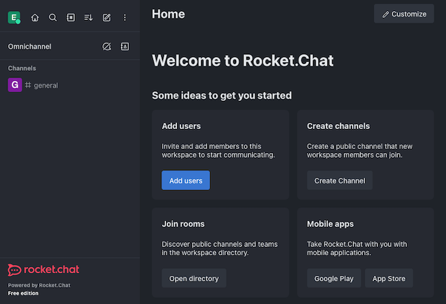

## What is Rocket.Chat?

[Rocket.Chat](https://www.rocket.chat/) offers an open-source communications platform with enterprise-grade features. Rocket.Chat combines a robust platform for communication and collaboration with a toolset for help desk and support operations.

At its center Rocket.Chat is a platform for real-time communications with an emphasis on security. Similar to platforms like Slack and Microsoft Teams, Rocket.Chat can manage conversations across your organization. But Rocket.Chat also supports federation, letting you talk with other companies and with your wider customer base.

It is Rocket.Chat's omnichannel features — for integration and cross-channel communications — that reach effectively into help desk and custom support use cases. In this way, you can also compare Rocket.Chat to services like Zendesk and Freshdesk.

## Why Choose Rocket.Chat Over Hosted SaaS Applications?

Rocket.Chat competes with tools like Slack and Microsoft Teams, with one of the major differences being that Rocket.Chat can be self-hosted and the latter are software-as-a-service (SaaS).

What does this mean for you, and why would you choose Rocket.Chat over alternatives like Slack and Microsoft Teams?

-   Rocket.Chat Community Edition is free and can be readily self-hosted. That makes it both accessible and gives you an option for a high degree of control around your collaboration platform.

-   Rocket.Chat prioritizes security, implementing some of the highest standards in the field. Rocket.Chat uses end-to-end encryption for communications and provides fine-grained, role-based permission control.

-   Rocket.Chat comes with omnichannel support, expanding the reach of your collaboration beyond the platform itself. Integrate a Rocket.Chat live-chat pop-up on your website. Or connect your workspace with other messaging services, like SMS, email, and WhatsApp to engage with external clients.

-   Rocket.Chat's omnichannel support also opens it up as an effective help-desk. Using live-chat integration and cross-channel messaging, you can integrate external customer support into the same platform you collaborate on internally.

-   Rocket.Chat is open source, so you can ultimately access the code and make of the platform what you want. Moreover, open-source software gets the benefits of community support and ongoing development.

## Choosing Between Rocket.Chat Community and Enterprise Editions

Rocket.Chat offers both a Community Edition and an Enterprise Edition. For this tutorial, the steps concern the Community Edition. But at any time you can upgrade your Community Edition to a self-hosted Enterprise Edition.

So then ultimately sets the Community and Enterprise Editions apart? Why might you, now or later, want to consider adopting Enterprise's premium features?

-   Support. Rocket.Chat's Enterprise includes access to Rocket.Chat's official support web portal, bringing professional assistance to managing your instance. Community is not without support, but that support is peer-to-peer, from the open-source community.

-   Limitations. Community instances are limited in both scaling and integration. For instance, a Community instance can only make 10,000 push notifications per month and has access to only five marketplace applications at a time.

-   Channel support. Enterprise includes access to a wider range of channels by default. Those channels include services like WhatsApp Business and Twitter. Community only comes packaged with support for live chat, SMS, and email channels.

-   Hosting options. Community supports self-hosting, which is what this tutorial demonstrates. However, with Enterprise you have access to Rocket.Chat's cloud-hosted deployment. That can be useful when getting started, though it does limit your control of the platform.

Along with these, the Enterprise Edition brings a range of other features and enhancements to Rocket.Chat's range of tools. You can learn more from the Rocket.Chat [Enterprise page](https://www.rocket.chat/enterprise).

## Deploy Rocket.Chat on the Akamai Cloud Computing Platform

When you are ready to deploy your own Rocket.Chat instance, you have several options to do so within Akamai Cloud. Read on to see each and choose the approach that is best for your needs.

### Deploying via Marketplace

By far the quickest way to get started is to deploy Rocket.Chat through the Linode Marketplace. This approach does almost all of the work for you, creating a fresh Compute Instance and installing and configuring all of the software.

Learn more, and see the steps for the Marketplace deployment, in our guide on how to [Deploy Rocket.Chat through the Linode Marketplace](/docs/products/tools/marketplace/guides/rocketchat/).

### Deploying to a Compute Instance

Rocket.Chat can be deployed manually to an Akamai Cloud Compute Instance. The process uses the [Snap](https://snapcraft.io) package manager, which bundles applications for Linux systems.

Follow the steps here to deploy Rocket.Chat to a fresh Compute Instance. The steps include not only installation of Rocket.Chat, but also the configuration of a reverse proxy server with optional SSL certification.

#### Before You Begin

1.  If you have not already done so, create a Linode account and Compute Instance. See our [Getting Started with Linode](/docs/guides/getting-started/) and [Creating a Compute Instance](/docs/guides/creating-a-compute-instance/) guides.

1.  Follow our [Setting Up and Securing a Compute Instance](/docs/guides/set-up-and-secure/) guide to update your system. You may also wish to set the timezone, configure your hostname, create a limited user account, and harden SSH access.


This guide is written for a non-root user. Commands that require elevated privileges are prefixed with `sudo`. If you’re not familiar with the `sudo` command, see the [Users and Groups](/docs/guides/linux-users-and-groups/) guide.


#### Installing the Rocket.Chat Server

1.  Ensure that Snap is installed on your system. To see if it is, and for installation steps for your system, you can refer to the official Snap [installation instructions](https://snapcraft.io/docs/installing-snapd).

1.  Install the Rocket.Chat package from Snapcraft.

    ```command
    sudo snap install rocketchat-server
    ```

Once the installation has finished, the Rocket.Chat server starts up on your system, typically running by default on `localhost:3000`.

#### Setting Up a Reverse Proxy Server

You can access your Rocket.Chat instance right after installation, but usually it is better practice to set up a reverse proxy server for access. This lets you forward the default port to the HTTP and HTTPS ports and more easily and securely leverage a domain name.

Should you want SSL encryption for your instance, the reverse proxy also provides a basis for setting that up. The steps in the next section show you how.

1.  Install NGINX to act as the reverse proxy server. You can install NGINX by following the appropriate section in our guide [Installing and Using NGINX](/docs/guides/how-to-install-and-use-nginx-on-ubuntu-20-04/). Select your system's distribution from the drop down at the top of the page.

1.  Create `sites-available/` and `sites-enabled/` directories in `/etc/nginx/` if the directories do not exist already.

    ```command
    sudo mkdir -p /etc/nginx/{sites-available,sites-enabled}
    ```

1.  Modify the main NGINX configuration file — located at `/etc/nginx/nginx.conf` — by adding a line to include configurations from the `sites-enabled/` directory.

    The added `include` line, shown below, needs to be added

    - Within the `http` block

    - After the existing `include /etc/nginx/conf.d/*.conf;` within that block

    - Replacing the existing `server` block

    ```file {title="/etc/nginx/nginx.conf"}
    ...

    http {
        ...

        include /etc/nginx/conf.d/*.conf;

        include /etc/nginx/sites-enabled/*;

        ...
    }
    ```

1.  Create a new NGINX site configuration file in the `/etc/nginx/sites-available/` directory. This tutorial names the file `rocketchat.conf`. Give the file the contents shown here.

    Replace `example.com` in this snippet with the domain name you actually intend to associate with the server, if any.

    ```file {title="/etc/nginx/sites-available/rocketchat.conf"}
    upstream backend {
        server 127.0.0.1:3000;
    }

    server {
        listen 80;

        server_name example.com;

        error_log /var/log/nginx/rocketchat.access.log;

        location / {
            proxy_pass http://backend;

            proxy_http_version 1.1;
            proxy_set_header Host $host;
            proxy_set_header X-Real-IP $remote_addr;
            proxy_set_header X-Forwarded-For $proxy_add_x_forwarded_for;
            proxy_set_header X-Forwarded-Proto http;
            proxy_set_header X-Nginx-Proxy true;
            proxy_redirect http:// $scheme://;
        }
    }
    ```

1.  Enable the site configuration by creating a symbolic link in the `sites-enabled/` directory.

    ```command
    sudo ln -s /etc/nginx/sites-available/rocketchat.conf /etc/nginx/sites-enabled/
    ```

1.  Verify that the new NGINX configuration passes NGINX's tests.

    ```command
    sudo nginx -t
    ```

1.  If you are on a system that uses SELinux, such as CentOS, allow server network connections.

    ```command
    sudo setsebool -P httpd_can_network_connect 1
    ```

1.  Restart the NGINX server once the configuration has been verified.

    ```command
    sudo systemctl restart nginx
    ```

#### (Optional) Get an SSL Certificate

With a reverse proxy in place, you can readily enable SSL encryption for your Rocket.Chat instance using [Certbot](https://certbot.eff.org/). Enabling SSL encryption further secures the traffic on your server and plays better with modern browsers.

1.  Install Cerbot and use it to procure an SSL certificate for NGINX. Follow along with our guide [Use Certbot to Enable HTTPS with NGINX](/docs/guides/enabling-https-using-certbot-with-nginx-on-ubuntu/), selecting your system's distribution from the drop down menu at the top of the page.

    
    Completing these steps requires your system's public IP address to be associated with a domain name. The guide linked above includes a link with more information on this requirement.
    

1.  Adjust the site's NGINX configuration, in the `rocketchat.conf` file created earlier. Certbot adds SSL configuration, but the Rocket.Chat server requires some different settings.

    Retain the `ssl_certificate` and `ssl_certificate_key` values added to the configuration file by your Certbot installation. But otherwise replace the whole `server` block with the one shown below.

    ```file {title="/etc/nginx/sites-available/rocketchat.conf"}
    ...

    server {
        server_name example.com;

        listen 443 ssl;

        ssl on;
        ssl_protocols TLSv1 TLSv1.1 TLSv1.2;

        ssl_certificate /etc/letsencrypt/live/example.com/fullchain.pem;
        ssl_certificate_key /etc/letsencrypt/live/example.com/privkey.pem;

        error_log /var/log/nginx/rocketchat.access.log;

        location / {
            proxy_pass http://backend;

            proxy_http_version 1.1;
            proxy_set_header Upgrade $http_upgrade;
            proxy_set_header Connection "upgrade";
            proxy_set_header Host $http_host;
            proxy_set_header X-Real-IP $remote_addr;
            proxy_set_header X-Forwarded-For $proxy_add_x_forwarded_for;
            proxy_set_header X-Forwarded-Proto https;
            proxy_set_header X-Nginx-Proxy true;
            proxy_redirect off;
        }
    }

    ...
    ```

### Deploying to a Kubernetes Cluster

For a more scalable solution, Rocket.Chat supports Kubernetes deployments. With a Linode Kubernetes Engine (LKE) cluster on Akamai cloud and using [Helm](https://helm.sh/), you can have a distributed Rocket.Chat instance running in only a few steps.

1.  Create an LKE cluster, and add its configuration to a local kubectl tool. All the steps for doing so are covered in our guide  [Linode Kubernetes Engine - Get Started](/docs/products/compute/kubernetes/get-started/).

1.  Set kubectl to be using the LKE cluster context. Replace `lke-example-ctx` below with the cluster's context name provided from the output of the `get-contexts` command.

    ```command
    kubectl config get-contexts
    kubectl config use-context lke-example-ctx
    ```

1.  Install Helm, a tool for installing applications onto Kubernetes clusters. Follow along with our guide on [Installing Apps on Kubernetes with Helm 3](/docs/guides/how-to-install-apps-on-kubernetes-with-helm-3/) for all the necessary steps.

1.  Add the Rocket.Chat chart to your Helm instance.

    ```command
    helm repo add rocketchat https://rocketchat.github.io/helm-charts
    ```

1.  Create a Helm chart configuration for the Rocket.Chat deployment. The example that follows provides the minimum necessary settings. You can reference the full range of options in the [official documentation](https://docs.rocket.chat/deploy/prepare-for-your-deployment/rapid-deployment-methods/helm#configuration).

    Replace the passwords here with actual passwords you intend to use to secure Rocket.Chat's database.

    ```file {title="rocketchat-values.yaml" lang="yaml"}
    mongodb:
      auth:
        passwords:
          - rocketchatpass
        rootPassword: rocketchatrootpass
    ```

1.  Deploy the Helm chart for Rocket.Chat. The command here assumes you named the Helm chart configuration `rocketchat-values.yaml`.

    ```command
    helm install rocketchat -f rocketchat-values.yaml rocketchat/rocketchat
    ```

#### Forwarding to the Rocket.Chat Cluster

To access the Rocket.Chat instance from the Kubernetes cluster, you have a few options. Below you can see two useful options for getting started.

-   Forward the port. This option on its own is only viable for testing. It uses kubectl to forward the Kubernetes service to a local port.

    ```command
    kubectl port-forward --namespace default $(kubectl get pods --namespace default -l "app.kubernetes.io/name=rocketchat,app.kubernetes.io/instance=rocketchat" -o jsonpath='{ .items[0].metadata.name }') 8888:3000
    ```

    After the command above, you would be able to access the Rocket.Chat instance on `localhost:8888`. You could then set up a reverse proxy, as shown further above, but the next option is preferable for production usage.

-   Ingress deployment. NGINX Ingress can be deployed to a Kubernetes cluster to provide routing. In this way, it can act as a kind of reverse proxy on the Kubernetes cluster.

    For more on this method, and for steps for implementing it, you can follow our guide on [Deploying NGINX Ingress on Linode Kubernetes Engine](/docs/guides/deploy-nginx-ingress-on-lke/).

## Access Rocket.Chat After Deployment

With your own Rocket.Chat instance up and running, you can now access the workspace and begin setting it up to meet your needs. These next sections show you how to start using your instance, from completing the set up, to navigating the interface, to using the mobile application.

### Completing the Rocket.Chat Setup

On first accessing your instance, you are prompted to complete the setup. That means creating an administrator user, entering some information about your organization, and registering your instance.

1.  Navigate in a web browser to the Rocket.Chat instance's address. For example, assuming your domain name is `example.com` and that you set up SSL: `https://example.com`.

1.  Follow along with the prompts to complete your instance setup. Keep track of the credentials you use to create the administrator user. When prompted, enter your email, and use the provided code to verify the email address.

    

1.  You may see a warning indicating that the site is configured for `localhost:3000` but has been visited via another domain. Accept the proposed configuration change.

Afterward, you are taken to the dashboard for your Rocket.Chat workspace.

### Overview of the Rocket.Chat Web Interface

Each time you log in after the initial setup, you should see the dashboard for your Rocket.Chat workspace. The left pane shows the workspace channels, where the workspace users can start collaborating, and the middle gives quick access for administrator tools.

[](rocketchat-dashboard.png)

In addition to these quick tools, administrator users have access to the **Administration** menu. Access this from the top of the left pane, using the three dots.

Most useful from there, navigate to the **Workspace** option, and select **Settings** from the next menu. The resulting **Settings** menu provides a wide range of options for customizing and fine-tuning your workspace.


For more on that, keep on further into the tutorial, where you can get some ideas for starting to make the workspace your own.

### Accessing Rocket.Chat via Mobile App

Rocket.Chat has an official mobile application for both iOS and Android devices. With the workspace address and provisioned user account, your users can converse and collaborate from the convenience of their phones.

Learn more about the Rocket.Chat mobile application and how to use it in the [official documentation](https://docs.rocket.chat/use-rocket.chat/rocket.chat-mobile).

For now, here are the general steps for getting started on a mobile device.

1.  Download the Rocket.Chat application to the mobile device. You can get the application from the Apple App Store or from the Google Play Store.

1.  Open the application, and, when prompted, enter your Rocket.Chat instance's domain as the workspace. For instance: `example.com`.

1.  Use your Rocket.Chat user credentials to log in when prompted, just as you would in the web browser.

## Configure Rocket.Chat as a Business Communication and Collaboration Tool

Already your Rocket.Chat workspace is ready for all the communication and collaboration you would expect. Use the existing *#general* channel, or create a channel of your own, and start talking.

But beyond that, here are some additional things you can do to make sure your Rocket.Chat workspace has a stronger foundation for effective and engaging collaboration.

### Customize the Workspace

Make your Rocket.Chat workspace stand out as your own by adding organizational branding and styling. Within the Rocket.Chat documentation, this process is known as **white-labeling**.

Most of these customizations are handled from the **Layout** page, which you can reach from your Rocket.Chat dashboard using one of these methods.

- Click the **Customize** button in the upper right of the **Home** page.

- Access **Administration** > **Workspace** > **Settings** > **Layout** starting from the three dots at the top of the channel pane.

For more on customizing your workspace, see the [Basic White-labeling](https://docs.rocket.chat/setup-and-configure/accessing-your-workspace/basic-white-labeling) page within Rocket.Chat's official documentation.

### Inviting Users

The Rocket.Chat workspace needs users to start conversations. Use either the **Administration** menu or the **Add User** button on the dashboard to access the **Users** page, where you can add and manage users.

From there, you have two options for adding new users.

-   Invitations. Use the **Invite** button, and enter the email addresses for prospective users. But first you need to have SMTP functions enabled on your instance. Follow the [official documentation](https://docs.rocket.chat/use-rocket.chat/workspace-administration/settings/email/email-configuration) for the appropriate steps.

    

-   Manual entry. Use the **New** button, and enter the details of a new user you want to create. The form includes a *Require password change* option that can be useful for forcing new users to change temporary passwords when they first log in.

Find out more about user-related administration in Rocket.Chat from the [official documentation](https://docs.rocket.chat/use-rocket.chat/workspace-administration/users).

## Configure Rocket.Chat as a Customer Service Helpdesk Platform

One of Rocket.Chat's advantages over other collaboration solutions is its ability to operate as a customer support and help desk platform as well. With Rocket.Chat's omnichannel feature, your workspace opens up to the wider world, allowing you to communicate with other companies and with your customers.

Using Rocket.Chat's omnichannel support, you can connect your workspace to your other media and to other communication platforms. For instance, embed a Rocket.Chat live-chat pop-up for customer support on your website. Or enable SMS communications to support clients via text messaging.

### Enabling Omnichannel in Rocket.Chat

1.  Access the **Settings** page, via **Administration** > **Workspace** > **Settings**, and open the **Omnichannel** option.

1.  Ensure that **Omnichannel enabled** is toggled on, and save the changes.

### Managing Omnichannel Features in Rocket.Chat

Once Omnichannel has been enabled, you can manage your instance's omnichannel setup from within the same omnichannel settings page — **Administration** > **Workspace** > **Settings** > **Omnichannel**.

To learn more about how you can start configuring your workspace's omnichannel support for your needs, take a look through the [official documentation for omnichannel support](https://docs.rocket.chat/use-rocket.chat/omnichannel).

But to hone your search more for getting started, here are a couple of Rocket.Chat's omnichannel features you may want to set up first.

-   SMS communications. Rocket.Chat uses Twilio integration to allow external users to communicate with your workspace. Follow along with the [official documentation for SMS](https://docs.rocket.chat/extend-rocket.chat-capabilities/rocket.chat-marketplace/rocket.chat-public-apps-guides/omnichannel-apps/sms) to get everything you need.

-   Email messaging. Omnichannel also supports email communications, allowing you to field and manage client emails through your Rocket.Chat workspace. The official documentation has both an Omnichannel administrator guide for [setting up an Email Inbox](https://docs.rocket.chat/use-rocket.chat/workspace-administration/email-inboxes) and an Omnichannel agent guide for [using Email Inboxes](https://docs.rocket.chat/use-rocket.chat/omnichannel-agents-guides/email-inboxes).
