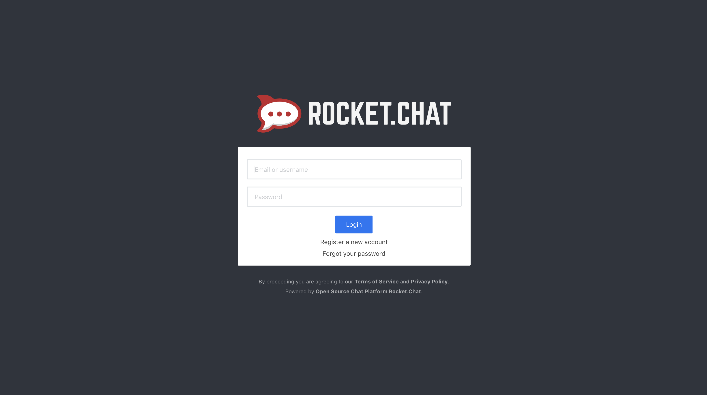

**Rocket.Chat** is an open source chat software alternative to Slack that ships with the feature rich components users have come to expect for team productivity. Chat with team members, make video and audio calls with screen sharing, create channels and private groups, upload files and more. With Rocket.Chat's source code hosted on GitHub, you can develop new features and contribute back to the project.

This guide provides the steps to deploy Rocket.Chat on a Linode running Ubuntu 16.04 LTS, using NGINX as a reverse proxy with SSL.

## Before You Begin

1.  If you have not already done so, create a Linode account and Compute Instance. See our [Getting Started with Linode](/docs/guides/getting-started/) and [Creating a Compute Instance](/docs/guides/creating-a-compute-instance/) guides.

1.  Follow our [Setting Up and Securing a Compute Instance](/docs/guides/set-up-and-secure/) guide to update your system. You may also wish to set the timezone, configure your hostname, create a limited user account, and harden SSH access.

1. Complete the [Add DNS Records](/docs/websites/set-up-web-server-host-website/#add-dns-records) steps to register a domain name that will point to your Rocket.Chat server instance.

## Install Rocket.Chat

The quickest way to install Rocket.Chat is to use its *Snap*. Snaps are containerized software packages that run on all major Linux systems. *Snapd* is the service that runs and manages snaps. Snapd is installed by default on Ubuntu 16.04 LTS.

1.  Install Rocket.Chat

        sudo snap install rocketchat-server

1.  Once installed, the Rocket.Chat service starts automatically. To check if Rocket.Chat is running:

        sudo service snap.rocketchat-server.rocketchat-server status

    Visit the [Rocket.Chat snaps documentation](https://rocket.chat/docs/installation/manual-installation/ubuntu/snaps/) to view a list of other useful commands.

## Install and Configure NGINX to use Reverse Proxy and SSL

A reverse proxy is a server that sits between internal applications and external clients, forwarding client requests to the appropriate server. While many common applications are able to function as servers on their own, NGINX has a number of advanced load balancing, security, and acceleration features that most specialized applications lack. Using NGINX as a reverse proxy enables you to add these features to any application.  We will use NGINX as a reverse proxy for Rocket.Chat.

### Install NGINX

1.  Download NGINX from the package manager:

        sudo apt install nginx

1.  Ensure NGINX is running and enabled to start automatically on reboot:

        sudo systemctl start nginx
        sudo systemctl enable nginx

### Set up NGINX Reverse Proxy

1.  Disable the default *Welcome to NGINX* page. The default page is configured within `/etc/nginx/sites-enabled/default`. This is actually a link to a file within `/etc/nginx/sites-available/`:

        sudo ls -l /etc/nginx/sites-enabled

    
total 0
lrwxrwxrwx 1 root root 34 Aug 16 14:59 default -> /etc/nginx/sites-available/default


1.  Remove this link to disable the default site:

        sudo rm /etc/nginx/sites-enabled/default

1.  Create `/etc/nginx/sites-available/rocketchat.conf` and add the necessary values to point to your domain name and to add the reverse proxy. Replace `example.com` with your domain name:

    
server {
    listen 80;

    server_name example.com;

    location / {
        proxy_pass http://localhost:3000/;
    }
}


1.  Enable the new configuration by creating a link to it from `/etc/nginx/sites-available/`:

        sudo ln -s /etc/nginx/sites-available/rocketchat.conf /etc/nginx/sites-enabled/

1.  Test the configuration:

        sudo nginx -t

1.  If no errors are reported, reload the new configuration:

        sudo nginx -s reload

### Generate SSL certificates using Certbot

Your Rocket.Chat site will use an SSL certificate from [Let's Encrypt](https://letsencrypt.org), which is a free certificate provider trusted by common web browsers. A popular tool called [Certbot](https://certbot.eff.org) makes getting and using a Let's Encrypt certificate easy:



## View Your Rocket.Chat Site

1.  Certbot updated your NGINX configuration. Test the new configuration to make sure it works:

        sudo nginx -t

1.  If no errors are reported, reload the new configuration:

        sudo nginx -s reload

1.  In a browser, navigate to your domain address. Follow the Rocket.Chat setup wizard steps.

    
