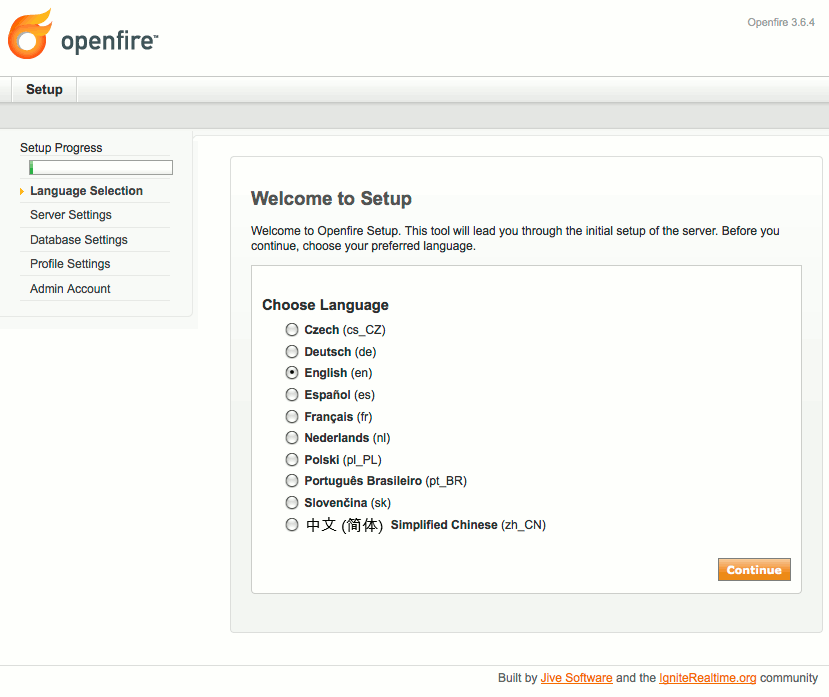
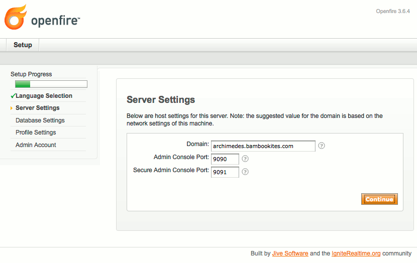
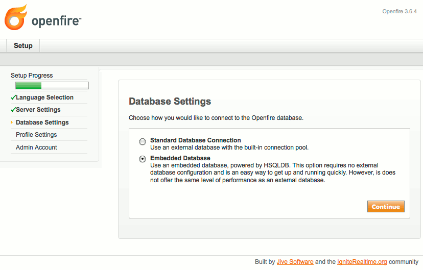
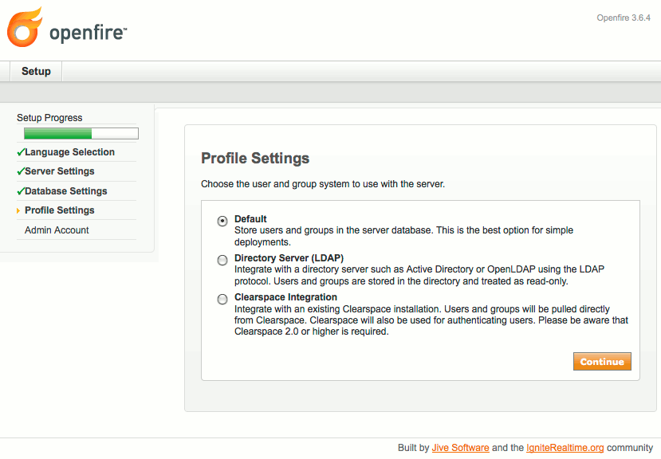
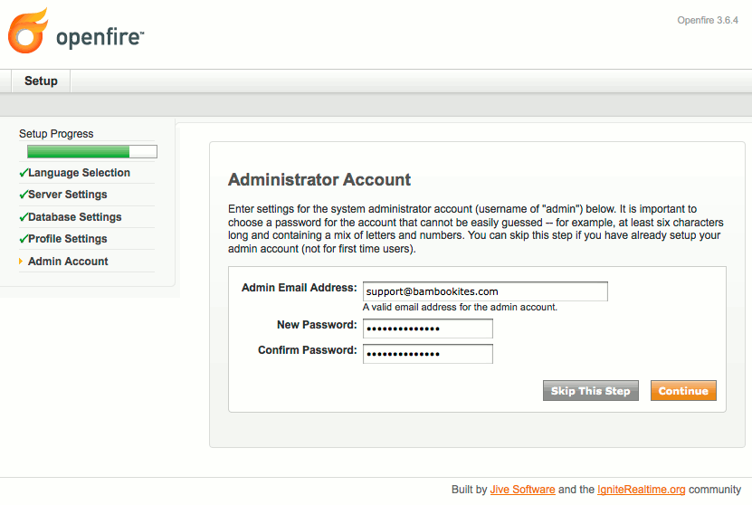

[Openfire](http://www.igniterealtime.org/projects/openfire/) is an open source real-time collaboration (instant messaging) server, built on the [XMPP protocol](http://en.wikipedia.org/wiki/Extensible_Messaging_and_Presence_Protocol) and available for multiple platforms. This guide will help you get started with Openfire on your Ubuntu 10.04 LTS (Lucid) Linode.

If you haven't done so already, please follow the steps outlined in our [Setting Up and Securing a Compute Instance](/docs/guides/set-up-and-secure/) guide before following these instructions, and make sure your system is fully updated. Initial configuration steps will be performed through the terminal; please make sure you're logged into your Linode as root via SSH.

## Install Prerequisites

Openfire requires a Java runtime engine (JRE). This tutorial uses the version provided by Sun Microsystems. Please note that although alternate Java runtime engines are available, Openfire may not work well with them. Add the `partner` package repository to your `/etc/apt/sources.list` file, as shown below:


# Partner repository
deb http://archive.canonical.com/ lucid partner



If you had to add the `partner` repository to your sources, issue the following command to update your package database:

    apt-get update
    apt-get upgrade

Issue the following command to install prerequisite packages on your server:

    apt-get install sun-java6-jre

The Sun Java6 JRE will be installed, along with a series of dependencies it requires. You will be prompted to accept the licensing agreement for Sun Java before proceeding.

## Adjust Firewall Settings

If you employ a firewall to specify what ports can be accessed on your Linode, please make sure you have the following ports open:

-   3478 - STUN Service (NAT connectivity)
-   3479 - STUN Service (NAT connectivity)
-   5222 - Client to Server (standard and encrypted)
-   5223 - Client to Server (legacy SSL support)
-   5229 - Flash Cross Domain (Flash client support)
-   7070 - HTTP Binding (unsecured HTTP connections)
-   7443 - HTTP Binding (secured HTTP connections)
-   7777 - File Transfer Proxy (XMPP file transfers)
-   9090 - Admin Console (unsecured)
-   9091 - Admin Console (secured)

Additional ports may need to be opened later to support more advanced XMPP services, but these are the ports that Openfire will use by default.

## Install Openfire

Visit the download page for the [Openfire RTC server](http://www.igniterealtime.org/downloads/index.jsp#openfire) and click the link for the "deb" package. You will be taken to another page, which will start the download to your workstation. You may cancel this download, as a manual download link will be presented that you may copy to your clipboard. Use `wget` on your Linode to retrieve the package (substitute the link for the current version in the command below).

    wget http://www.igniterealtime.org/downloadServlet?filename=openfire/openfire_3.6.4_all.deb
    mv downloadServlet\?filename\=openfire%2Fopenfire_3.6.4_all.deb openfire_3.6.4_all.deb

Install the software using `dpkg` as follows:

    dpkg -i openfire_3.6.4_all.deb

Next, edit the configuration file `/etc/openfire/openfire.xml`, inserting your Linode's public IP address in the `<interface>` section, and removing the `<!-- -->` comment markers that surround this section.


<interface>12.34.56.78</interface>



Restart Openfire with the following command:

    /etc/init.d/openfire restart

This completes the initial installation steps for Openfire. Next, we'll continue with configuration through a web browser.

## Configure Openfire

Direct your browser to your Linode's IP address or FQDN (fully qualified domain name, if an entry in DNS points to your Linode's IP) on port 9090. As an example, if your Linode's IP address were "12.34.56.78", you would visit `http://12.34.56.78:9090` in your web browser. You will be presented with a language selection screen similar to this:

Next, you'll be asked to configure your domain and ports for administration. Use the fully qualified domain name you have assigned to your Linode in DNS (more information: [configuring DNS with the Linode Manager](/docs/guides/dns-manager/)).

You may choose to use Openfire's internal database for account management, or you may connect to an external database. Most users will want to choose the built-in option.

User profiles may be stored in the server database, or they may be pulled from LDAP or Clearspace. Most users will want to choose the default option.

Enter the email address of the default administrative user and select a strong password.

After the initial web-based configuration is complete, restart the Openfire server before attempting to log in with the default "**admin**" user account.

    /etc/init.d/openfire restart

If you're experiencing difficulty using the credentials you just created to log in, please use "admin/admin" as the username/password. You'll need to update your credentials immediately afterward for security purposes. Congratulations! You've successfully installed the Openfire RTC server on Ubuntu 10.04 LTS.

## More Information

You may wish to consult the following resources for additional information on this topic. While these are provided in the hope that they will be useful, please note that we cannot vouch for the accuracy or timeliness of externally hosted materials.

- [Openfire Documentation](http://www.igniterealtime.org/projects/openfire/documentation.jsp)
- [XMPP Standards Foundation](http://xmpp.org/)
- [XMPP Software Clients](http://xmpp.org/software/clients.shtml)
