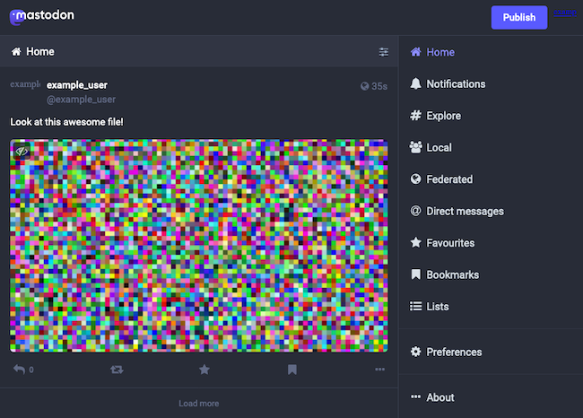
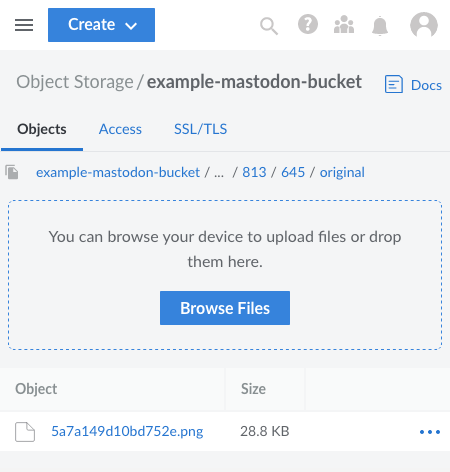

Mastodon is a decentralized microblogging platform that participates in the Fediverse network. But if you have a Mastodon instance or are planning to deploy one, you may be concerned with its media storage demands and efficiency.

One of the best ways to make your Mastodon instance more scalable is to leverage object storage for user uploaded media. Mastodon includes a feature to store all media attachments on a given object storage bucket, which can provide a much more scalable and efficient solution.

This guide walks you through configuring a new or existing Mastodon instance to use object storage via Linode's Object Storage service.

## Before You Begin

1. If you have not already done so, create a Linode account and Compute Instance. See our [Getting Started with Linode](/docs/guides/getting-started/) and [Creating a Compute Instance](/docs/guides/creating-a-compute-instance/) guides.

1. Follow our [Setting Up and Securing a Compute Instance](/docs/guides/set-up-and-secure/) guide to update your system. You may also wish to set the timezone, configure your hostname, create a limited user account, and harden SSH access.


The steps in this guide are written for non-root users. Commands that require elevated privileges are prefixed with `sudo`. If you’re not familiar with the `sudo` command, see the [Linux Users and Groups](/docs/guides/linux-users-and-groups/) guide.


## Why Use Linode Object Storage with Mastodon?

Mastodon by default stores its media attachments locally. Every upload is saved at original size, and where relevant, a thumbnail file is saved on the Mastodon server.

If your Mastodon instance stays below a certain size and traffic level, these image uploads might not cause issues. But as your Mastodon instance grows, the local storage approach can cause difficulties. Media stored in this way is often difficult to manage and a burden on your server.

But object storage, by contrast, excels when it comes to storing static files — like Mastodon's media attachments. An S3-compatible object storage bucket can more readily store a large number of static files and scale appropriately.

To learn more about the features of object storage generally and Linode Object Storage more particularly, take a look at our [Linode Object Storage overview](/docs/products/storage/object-storage/).

## How to Use Linode Object Storage with Mastodon

The rest of this guide walks you through setting up a Mastodon instance to use Linode Object Storage for storing its media attachments. Although the guide uses Linode Object Storage, the steps should also provide an effective model for using other S3-compatible object storage buckets with Mastodon.

The tutorial gives instructions for creating a new Mastodon instance, but the instructions should also work for most existing Mastodon instances regardless of whether it was installed on Docker or from source. Additionally, the tutorial includes steps for migrating existing, locally-stored Mastodon media to the object storage instance.

### Creating the Linode Object Storage Bucket

To get started, your Mastodon instance needs its own access key and bucket on your Linode Object Storage instance. Follow our [Object Storage - Get Started](/docs/products/storage/object-storage/get-started/) guide to generate the access key and create a bucket for Mastodon.

The access keys you generate will be used later within your Mastodon configuration, so keep them somewhere safe. The secret key generated at this time cannot be viewed later — you have to regenerate the keys if you lose them.

This tutorial uses the name `example-mastodon-bucket` for the Linode Object Storage bucket created for Mastodon. Replace this throughout the rest of the tutorial with the name you gave your bucket.

Additionally, this guide places the bucket in the Atlanta region, which has the region designation `us-southeast-1`. Likewise, replace this throughout the rest of the guide with your bucket's actual region designation. You can determine your bucket's region designation through the bucket's URL. The region designation is given between the bucket name and `linodeobjects.com`, as in `example-mastodon-bucket.us-southeast-1.linodeobjects.com`.

You can learn more about creating and managing Linode Object Storage buckets through our guide [Create and Manage Buckets](/docs/products/storage/object-storage/guides/manage-buckets/).

### Installing Mastodon

You can configure object storage on either a new or existing Mastodon instance, and in either case, the process is the same. This section helps you stand up and Mastodon instance if you do not already have one.

If you are implementing Linode Object Storage on an existing Mastodon instance, skip ahead to the next section, on configuring an NGINX proxy.

The rest of this guide assumes that you have a complete Mastodon setup running through an NGINX proxy. The examples throughout this guide use the same example domain name in the guide linked below, `example.com`.

To create a new Mastodon instance, follow our guide [How to Install a Mastodon Server](/docs/guides/install-mastodon-on-ubuntu-2004/). A link in the upper right of the guide allows you to select a Linux distribution for the installation. The beginning of the guide also includes links for creating and configuring a new Linode Compute Instance for running the Mastodon server.

You may, alternatively, choose to deploy a new Linode with Mastodon via the Linode Marketplace. Take a look at our guide on how to [Deploy Mastodon through the Linode Marketplace](/docs/products/tools/marketplace/guides/mastodon/) to learn more and for instructions.

### Configuring an NGINX Proxy

By default, Mastodon's object storage configuration fetches content from the storage bucket for each content request. That can lead to significant bandwidth usage. For that reason, it is best practice to use caching and an alias for fetching content on your Mastodon instance.

This involves configuring an additional NGINX proxy to the Linode Object Storage bucket. This proxy provides an alias that Mastodon uses for fetching media. The proxy fetches content from a local cache when it is available and from the object storage bucket otherwise. The local cache expires after a certain period, ensuring efficient storage on your Mastodon server.

The steps below implement such an NGINX proxy. These steps add another `server` block to the default NGINX configuration for Mastodon that was implemented in the guide linked above.

1. Decide on an alias hostname for your object storage proxy. Your Mastodon instance uses this alias for fetching content, rather than the direct URL of your object storage bucket. An NGINX proxy listens for requests on this hostname and fetches from cached content when it is available.

    Most often implementations use a subdomain of their Mastodon domain. For instance, using the `example.com` domain for your Mastodon instance, you may use `media.example.com` for your object storage alias.

1. Open the NGINX configuration file for your Mastodon instance. Following the example used in the guide on installing Mastodon, as linked above, that file would be `/etc/nginx/sites-available/example.com.conf`.

1. Add the following `server` block above the existing `server` block for the Mastodon instance. Replace `example.com` with your Mastodon domain and `media.example.com` with your chosen object storage alias. Similarly, replace `example-mastodon-bucket` with the name of your object storage bucket and `us-southeast-1` with its region designation.

    ```file {title="/etc/nginx/sites-available/example.com.conf"}
    server {
      listen 443 ssl http2;
      listen [::]:443 ssl http2;
      server_name media.example.com;
      root /var/www/html;

      ssl_certificate /etc/letsencrypt/live/example.com/fullchain.pem;
      ssl_certificate_key /etc/letsencrypt/live/example.com/privkey.pem;

      keepalive_timeout 30;

      location = / {
        index index.html;
      }

      location / {
        try_files $uri @s3;
      }

      set $s3_backend 'https://example-mastodon-bucket.us-southeast-1.linodeobjects.com';

      location @s3 {
        limit_except GET {
          deny all;
        }

        resolver 8.8.8.8;
        proxy_set_header Host us-southeast-1.linodeobjects.com;
        proxy_set_header Connection '';
        proxy_set_header Authorization '';
        proxy_hide_header Set-Cookie;
        proxy_hide_header 'Access-Control-Allow-Origin';
        proxy_hide_header 'Access-Control-Allow-Methods';
        proxy_hide_header 'Access-Control-Allow-Headers';
        proxy_hide_header x-amz-id-2;
        proxy_hide_header x-amz-request-id;
        proxy_hide_header x-amz-meta-server-side-encryption;
        proxy_hide_header x-amz-server-side-encryption;
        proxy_hide_header x-amz-bucket-region;
        proxy_hide_header x-amzn-requestid;
        proxy_ignore_headers Set-Cookie;
        proxy_pass $s3_backend$uri;
        proxy_intercept_errors off;

        proxy_cache CACHE;
        proxy_cache_valid 200 48h;
        proxy_cache_use_stale error timeout updating http_500 http_502 http_503 http_504;
        proxy_cache_lock on;

        expires 1y;
        add_header Cache-Control public;
        add_header 'Access-Control-Allow-Origin' '*';
        add_header X-Cache-Status $upstream_cache_status;
      }
    }
    ```

1. Use Certbot to request an SSL certificate for the alias domain. You can follow the steps in the guide on installing Mastodon linked above to set up Certbot. Then, use the following command to request the certificate.

    ```command
    sudo certbot certonly --nginx
    ```

    Certbot prompts you to select a domain, which should include both your Mastodon domain (`example.com`) and the alias domain (`media.example.com`). Select both, and accept Certbot's prompt to extend your existing certificate.

1. Restart the NGINX service to have the configuration changes take effect.

    ```command
    sudo systemctl restart nginx
    ```

### Configuring Mastodon for Object Storage

The process for adding object storage support to your Mastodon instance requires opening and editing its environment file. The changes to the file tell Mastodon to enable S3 storage, where the storage bucket is located, and what the credentials for the bucket are.

1. Log into the server that hosts your Mastodon instance, navigate to the Mastodon instance's base directory, and use your preferred text editor to open the `.env.production` file located there.

    Following the guide on installing Mastodon linked above, your Mastodon base directory would be `~/mastodon` and the file's location would be `~/mastodon/.env.production`

1. Find the `File storage` section of the `.env.production` file, and change the lines in that section to the lines shown below.

    Replace `example-mastodon-bucket` with your object storage bucket name and `us-southeast-1` with your bucket's region designation. Replace `<STORAGE_ACCESS_KEY>` and `<STORAGE_SECRET_KEY>` with the access key and secret key, respectively, for your object storage instance.

    ```file {title="live/.env.production"}
    # File storage (optional)
    # -----------------------
    S3_ENABLED=true
    S3_PROTOCOL=https
    S3_BUCKET=example-mastodon-bucket
    S3_REGION=us-southeast-1
    S3_HOSTNAME=example-mastodon-bucket.us-southeast-1.linodeobjects.com
    S3_ENDPOINT=https://us-southeast-1.linodeobjects.com/
    AWS_ACCESS_KEY_ID=<STORAGE_ACCESS_KEY>
    AWS_SECRET_ACCESS_KEY=<STORAGE_SECRET_KEY>
    S3_ALIAS_HOST=media.example.com
    ```

1. Restart your Mastodon instance using the following command from within the Mastodon base directory.

    ```command
    docker compose restart
    ```

At this point, your Mastodon instance is ready to start storing media on your Linode Object Storage bucket. Unless you are working on an existing Mastodon instance, you can skip to the [Verifying the Results](/docs/guides/linode-object-storage-with-mastodon/#verifying-the-results) section further to test your configuration.

### Syncing Existing Data

If you are adding object storage to an existing Mastodon instance, likely already have content stored locally. And likely you want to migrate that content to your new Linode Object Storage bucket.

To do so, you can use a tool for managing S3 storage to copy local contents to your remote object storage bucket. For instance, AWS has a command-line S3 tool that should be configurable for Linode Object Storage.

However, this guide uses the powerful and flexible [rclone](https://rclone.org/s3/). `rclone` operates on a wide range of storage devices and platforms, not just S3, and it is exceptional for syncing across storage mediums.

1. Follow our guide on [How to Use Rclone to Sync Files to Linode Object Storage](/docs/guides/rclone-object-storage-file-sync/) to install and configure `rclone` on your system. During the configuration process, make the following adjustments.

    - For `region`, enter the region designation for your Linode Object Storage bucket. This guide has been using `us-southeast-1` as an example.

    - For `endpoint`, enter the HTTPS URL associated with your bucket's region designation. Again using the `us-southeast-1` example, that URL would look like: `https://us-southeast-1.linodeobjects.com`.

1. Execute the following command from within the Mastodon base directory. This command has `rclone` copy the local Mastodon media to your object storage bucket.

    Replace `linodes3` with the label you used for your Linode Object Storage configuration in `rclone`. Replace `example-mastodon-bucket` with the name of the Linode Object Storage bucket you are using for your Mastodon instance.

    ```command
    rclone move public/system linodes3:example-mastodon-bucket
    ```

1. Verify that the contents have been migrated to your object storage bucket. You can do so by navigating to the *Object Storage* section of the Linode Cloud Manager, selecting your bucket, and verifying that you have a `media_attachments` folder there. You can also navigate this folder further to verify that the expected contents are within.

    

1. Once you have verified successful migration, delete the contents of the local `public/system` directory. This directory may have many subdirectories, so it may be easiest to use a single command like the following to remove them all at once:

    ```command
    sudo rm -rf public/system/*
    ```

### Verifying the Results

Perhaps the simplest way to verify your Mastodon configuration is by making a post ("toot") with an attached file on your Mastodon instance. With this, you want to check that the attachment shows up in two places.

- The attachment should display as expected on your post. A `500` or similar error during the upload likely indicates an issue with Mastodon connecting to the object storage instance. A blurry image or broken-link image, on the other hand, likely indicates a problem with Mastodon connecting to the object storage instance through the NGINX proxy.

    [](mastodon-media-toot.png)

- The attachment should be visible within the Linode Cloud Manager. Navigate to the Mastodon bucket within the *Object Storage* section, then navigate the sub-folders of the `media_attachemnts` folder to find the file. You can identify the appropriate sub-folders for your file by hovering over the file's link within the Mastodon interface and following the path that gives.

    

## Conclusion

You Mastodon instance now has its media storage needs being handled by object storage. And with that your server has become more scalable and prepared for an expanding user base.

The links below provide additional information on how the setup between Mastodon and an S3-compatible storage works.

To keep learning about Mastodon, be sure to take a look at the official [Mastodon blog](https://blog.joinmastodon.org/) and the [Mastodon discussion board](https://discourse.joinmastodon.org/).
