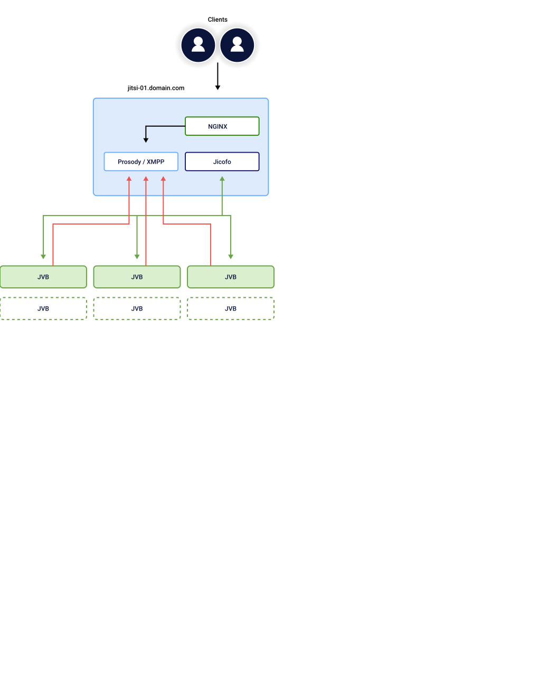
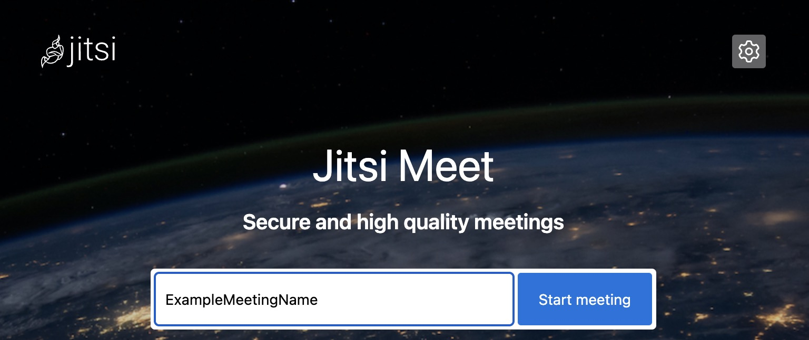

[Jitsi](https://jitsi.org/) is a free, open source video conferencing and communication platform that provides a secure, stable, and free alternative to other popular video conferencing services. With Jitsi, you can use built-in features to limit meeting access with passwords or stream on YouTube so anyone can attend.

This guide walks through creating a scalable Jitsi Meet cluster using [Ansible](https://www.ansible.com/). The provided Ansible playbook creates an initial deployment that can then be scaled up or down as needed.

If you wish to deploy Jitsi automatically rather than manually, consider either our single-instance [Jitsi Marketplace deployment](/docs/products/tools/marketplace/guides/jitsi/) or our [Jitsi Cluster Marketplace deployment](/docs/products/tools/marketplace/guides/jitsi-cluster/).

## Architecture Diagram

1.  The manual deployment in this guide provisions a Jitsi cluster where the Jitsi Videobridges (JVB) are scalable components.

1.  Each JVB connects to the singular Jitsi Meet instance running XMPP via Prosody on port 5222.

1.  Jicofo (Jitsi Conference Focus) runs on the Jitsi meet instance and is configured to split load balanced traffic between each JVB instance.

1.  NGINX runs on the meet instance and serves client requests and communicate with internal Jitsi components.



### Architecture Components

-   **[Jitsi Videobridge](https://jitsi.org/jitsi-videobridge/) (JVB):** An open source Selective Forwarding Unit (SFU) that runs up to thousands of video streams from a single server.

-   **Jitsi Meet Instance:** A Compute Instance running Prosody for XMPP protocol, Jicofo, and NGINX.

    -   **[Extensible Messaging and Presence Protocol](https://xmpp.org/) (XMPP):** Standard open communication protocol. XMPP uses default ports 5222 and 5269.

    -   **[Prosody](https://prosody.im/):** An XMPP server written in Lua. Uses port 5222 in this architecture.

    -   **[Jitsi Conference Focus](https://github.com/jitsi/jicofo) (Jicofo):** Splits traffic between all JVBs and manages the media sessions for each participant. Directs traffic with Octo (a load balancing routing utility) using round robin protocol.

    -   **[NGINX](https://nginx.org/en/):** The web server used in this architecture.

## Prerequisites and Supported Distributions

### Prerequisites

The following software and components must be installed and configured on your local system in order for the playbooks in this guide to function:

-   [Python](https://www.python.org/downloads/) version: > v3.8

-   The [virtualenv](https://virtualenv.pypa.io/en/latest/installation.html) Python library

-   A [Linode API access token](/docs/products/tools/api/get-started/#get-an-access-token)

-   A configured [SSH key pair](/docs/guides/use-public-key-authentication-with-ssh/) along with your public key

-   The [Git](https://git-scm.com/) utility

### Supported Deployment Distribution

-   Ubuntu 22.04 LTS

## Clone the docs-cloud-projects Github Repository

In order to run the Jitsi deployment in this guide, the docs-cloud-projects Github repository must be cloned to your local machine. This includes all playbooks, configurations, and files for all project directories in the repository, including those needed to successfully deploy and scale the Jitsi cluster.

1.  Using git, clone the docs-cloud-projects repository. This clones the repository to the current working directory on your local machine:

    ```command
    git clone https://github.com/linode/docs-cloud-projects.git
    ```

1.  Navigate to the manual-jitsi-cluster directory within your local cloned repository:

    ```command
    cd docs-cloud-projects/apps/manual-jitsi-cluster
    ```

1.  Confirm the manual-jitsi-cluster directory contents on your system:

    ```command
    ls
    ```

    The following contents should be visible:

    ```output
    ansible.cfg  collections.yml  group_vars  hosts  images  LICENSE  provision.yml
    README.md  requirements.txt  resize.yml  roles  site.yml
    ```

## Installation

1.  Using python, create a virtual environment with the virtualenv utility. This isolates dependencies from other packages on your system:

    ```command
    python3 -m virtualenv env
    source env/bin/activate
    pip install -U pip
    ```

1.  Install all packages in the `requirements.txt` file. This includes Ansible collections and required Python packages:

    ```command
    pip install -r requirements.txt
    ansible-galaxy collection install -r collections.yml
    ```

1.  Confirm Ansible is installed:

    ```command
    ansible --version
    ```

    Sample output:

    ```output
    ansible [core 2.13.13]
    (...)
    python version = 3.12.4 (main, Jun 18 2024, 08:58:27) [Clang 15.0.0 (clang-1500.0.40.1)]
    jinja version = 3.1.4
    libyaml = True
    ```

    
    Some ansible-core package versions may contain older parameters. Should you experience any errors related to out-of-date or deprecated parameters, you can update the ansible-core version with the below command:
    ```command
    python -m pip install --upgrade ansible-core
    ```
    

## Setup

All secrets are encrypted with the Ansible Vault utility as a best practice.

1.  Export `VAULT_PASSWORD`, replacing  with a password of your choosing. This password acts as a key for decrypting encrypted secrets. Save this password for future use:

    ```command
    export VAULT_PASSWORD=
    ```

1.  Encrypt a root password, sudo user password, and your Linode APIv4 token using the ansible-vault utility. Replace  with a root password,  with a sudo user password, and  with your Linode APIv4 token.

    The command below also assigns values to the variables `root_password`, `sudo_password`, and `api_token` for Ansible to reference later, as well as generates encrypted output:

    ```command
    ansible-vault encrypt_string '' --name 'root_password'
    ansible-vault encrypt_string '' --name 'sudo_password'
    ansible-vault encrypt_string '' --name 'api_token'
    ```

    
    When making root and sudo user passwords, it is a best practice to use a random password generator for security purposes. Save these passwords in a safe place for future reference.
    

1.  Copy the generated outputs for `root_password`, `sudo_password`, and `api_token`, and save them in the `secret_vars` file located in `group_vars/jitsi/secret_vars`. Sample output:

    ```output
    root_password: !vault |
          $ANSIBLE_VAULT;1.1;AES256
          38306438386334663834633634363930343233373066353234616363356534653033346232333538
          3163313031373138383965383739356339663831613061660a666332636564356236656331323361
          61383134663166613462363633646330678356561386230383332313564643135343538383161383236
          6432396332643232620a393630633132336134613039666336326337376566383531393464303864
          34306435376534653961653739653232383262613336383837343962633565356546
    sudo_password: !vault |
          $ANSIBLE_VAULT;1.1;AES256
          38306438386334663834633634363930343233373066353234616363356534653033346232333538
          3163313031373138383965383739356339663831613061660a666332636564356236656331323361
          61383134663166613462363633646330356561386230383332313564643135343538383161383236
          6432396332643232620a393630633sdf32336134613039666336326337376566383531393464303864
          34306435376534653961653739653232383262613336383837343962633565356546
    api_token: !vault |
          $ANSIBLE_VAULT;1.1;AES256
          38306438386334663834633634363930343233373066353234616363356534653033346232333538
          3163313031373138383965383739356339663831613061660a666332636564356236656331323361
          6138313466316661346236363364567330356561386230383332313564643135343538383161383236
          6432396332643232620a393630633132336134613039666336326337376566383531393464303864
          34306435376534653961653739653232383262613336383837343962633565356546
    ```

1.  Using a text editor, open and edit the Linode instance parameters in the `group_vars/jitsi/vars` file. Replace the values for the following variables with your preferred deployment specifications:

    - `ssh_keys`: Your SSH public key(s); replace the example keys with your own and remove any unused keys.
    - `jitsi_type`: Compute Instance type and plan for the Jitsi Meet instance
    - `jvb_type`: Compute Instance type and plan for each JVB instance
    - `region`: The data center region for the cluster
    - `group` and `linode_tags` (optional): Any [groups or tags](/docs/guides/tags-and-groups/) you wish to apply to your cluster's instances for organizational purposes
    - `soa_email_address`: An SOA administrator email for DNS records
    - `jvb_cluster_size`: The number of JVB instances in the cluster deployment
    - `sudo_username`: A sudo username for each cluster instance
    - `subdomain` and `subdomain` (optional): If you have a FQDN, you can use these optional values to customize your Jitsi meet URL. If you choose to leave these blank, you can navigate to your Jitsi meet using the Jitsi meet instance's default rDNS value once the cluster is provisioned. See our guide on [Managing IP Addresses](/docs/products/compute/compute-instances/guides/manage-ip-addresses/#viewing-ip-addresses) for how to find an instance's rDNS value.

    ```file {title="group_vars/jitsi/vars"}
    ssh_keys:
        - ssh-ed25519: 
        - ssh-rsa: 
    jitsi_prefix: jitsi
    jitsi_type: g6-dedicated-2
    jvb_prefix: jvb
    jvb_type: g6-dedicated-2
    region: us-southeast
    image: linode/ubuntu22.04
    group:
    linode_tags:
    soa_email_address: 
    jitsi_cluster_size: 1
    # jvb_cluster_size: 2
    sudo_username: 

    # domain vars
    # subdomain: 
    # domain: 
    ```

    The `jvb_cluster_size` variable dynamically scales the cluster size. This variable determines how many Jitsi Videobridge instances are created in the initial deployment. This variable can be left commented out along with the `subdomain` and `domain` variables. These values are passed along using the `ansible-playbook` CLI during cluster provisioning.

    See [Linode API: List Types](https://techdocs.akamai.com/linode-api/reference/get-linode-types) for information on Linode API parameters.

## Provision Your Cluster

1.  Using the `ansible-playbook` utility, run the `provision.yml` playbook with verbose options to keep track of the deployment process. This creates Linode instances and dynamically writes the Ansible inventory to the hosts file. The playbook is complete when SSH is available on all deployed instances.

    The command below uses the `jvb_cluster_size` variable to define the number of Jitsi Videobridge instances deployed in the cluster. Replace  with the number of instances you wish to include in your deployment. Replace  and  with your subdomain and FQDN:

    ```command
    ansible-playbook -vvv provision.yml --extra-vars "jvb_cluster_size=2 subdomain= domain="
    ```

    If you are not using your own domain and wish to use the Jitsi meet instance's default rDNS value, remove the `subdomain` and `domain` variables from the command:

    ```command
    ansible-playbook -vvv provision.yml --extra-vars "jvb_cluster_size=2"
    ```

1.  Run the `site.yml` playbook with the hosts inventory file. This playbook configures and installs all required dependencies in the cluster.

    ```command
    ansible-playbook -vvv -i hosts site.yml --extra-vars "jvb_cluster_size=2 subdomain= domain="
    ```

    Likewise, if you are not using your own domain, remove the `subdomain` and `domain` variables:

    ```command
    ansible-playbook -vvv -i hosts site.yml --extra-vars "jvb_cluster_size=2"
    ```

1.  Once installation completes, visit the Jitsi meet application using your custom domain or the rDNS entry written to the `group_vars/jitsi/vars` file represented by the `default_dns` variable.

    -   **Example custom domain:** `https://`

    -   **Example rDNS entry:** `https://.ip.linodeusercontent.com`

    

## Scaling options

Depending on your needs, you may wish to scale your Jitsi cluster up or down. To do this, use the `jvb_cluster_size` variable to manually add or remove JVB instances from the Jitsi cluster. Scaling your cluster up or down uses the same `ansible-playbook` command as when initially provisioning the cluster.

### Horizontal Up Scaling

To scale up your cluster size, use the `ansible-playbook` command and the `provision.yml` playbook with the new total number of JVB instances you want in the cluster. For example, if your initial cluster started with 2 instances and you would like to add 2 additional instances, edit the `jvb_cluster_size` variable to read :

```command
ansible-playbook -vvv provision.yml --extra-vars "jvb_cluster_size=4 subdomain= domain="
ansible-playbook -vvv -i hosts site.yml --extra-vars "jvb_cluster_size=4 subdomain= domain="
```

Once again, if you are not using a custom domain, remove the `subdomain` and `domain` variables from the above command:

```command
ansible-playbook -vvv provision.yml --extra-vars "jvb_cluster_size=4"
ansible-playbook -vvv -i hosts site.yml --extra-vars "jvb_cluster_size=4"
```

### Down Scaling

Down scaling your cluster works similarly to scaling up. To scale down your cluster size, use the `ansible-playbook` command with the `resize.yml` playbook and the new number of JVB instances you wish to be in the cluster. For example, if your cluster has 4 instances and you would like scale down to 2 instances, edit the `jvb_cluster_size` variable to read .

Note that the `resize.yml` playbook does not require a defined subdomain or domain:

```command
ansible-playbook -vvv resize.yml --extra-vars "jvb_cluster_size=2"
ansible-playbook -vvv -i hosts site.yml --extra-vars "jvb_cluster_size=2 subdomain= domain="
```

If you are not using your own domain, remove the `subdomain` and `domain` variables from the second command above:

```command
ansible-playbook -vvv resize.yml --extra-vars "jvb_cluster_size=2"
ansible-playbook -vvv -i hosts site.yml --extra-vars "jvb_cluster_size=2"
```

## Benchmarking Your Cluster With WebRTC Perf

[webrtcperf](https://github.com/vpalmisano/webrtcperf) is an open source utility used to evaluate the performance and quality for WebRTC-based services. To benchmark your Jitsi cluster's performance, WebRTC Perf can run from a Docker container. Note that Docker must be loaded and configured prior to running the below `docker run` command.

Replace  with the domain or URL of your Jitsi meet instance (see: [Provision Your Cluster](#provision-your-cluster)), and replace  with your meeting room name.

Edit the `sessions` and `tabs-per-session` values depending on the desired benchmarking criteria:

```command
docker run -it --rm \
    -v /dev/shm:/dev/shm \
    ghcr.io/vpalmisano/webrtcperf \
    --url="https://192.0.2.3.ip.linodeusercontent.com/#config.prejoinPageEnabled=false" \
    --show-page-log=false \
    --sessions=6 \
    --tabs-per-session=1
```

Press <kbd>q</kbd> to stop the WebRTC Perf benchmarking test.
