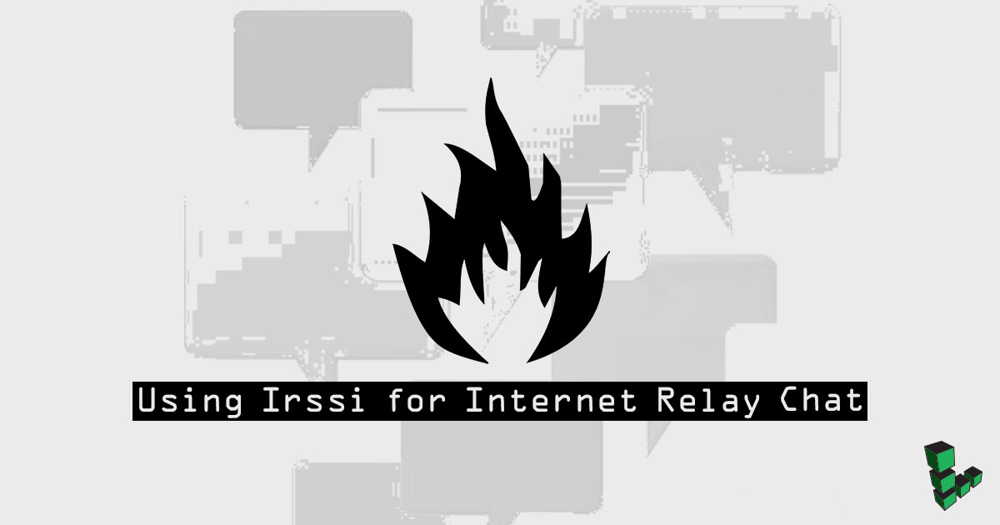
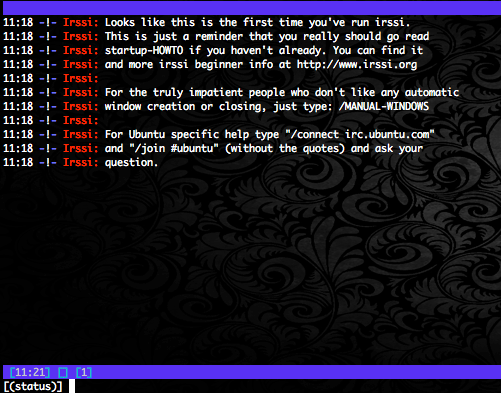

**Irssi** is a terminal-based chat client for real-time conversations over Internet Relay Chat (**IRC**). IRC is the common meeting ground for Linode users to exchange knowledge and troubleshoot issues in our public channel, **#linode** on **OFTC**.

Irssi can run on Linux or MAC OS X, either from your local workstation or your Linode. If you are unfamiliar with using a Linux terminal, you may want to review the Linode guides [Using the Terminal](/docs/networking/ssh/using-the-terminal/) and [Introduction to Linux Concepts](/docs/tools-reference/introduction-to-linux-concepts/). Additionally, it is assumed that you have followed our [Setting Up and Securing a Compute Instance](/docs/guides/set-up-and-secure/) if you intend to run Irssi on your Linode.

## Prerequisites

Complete these tasks before you start:

-   Follow our [Setting Up and Securing a Compute Instance](/docs/guides/set-up-and-secure/) guide to update your system. You may also wish to set the timezone, configure your hostname, create a limited user account, and harden SSH access.
-   Make sure **GNU Screen** is installed. It should be by default. See our [Screen Guide](/docs/networking/ssh/using-gnu-screen-to-manage-persistent-terminal-sessions/) for information.

## Installing Irssi

To install Irssi, issue the command for the appropriate system:

Debian or Ubuntu:

    apt-get install irssi

CentOS or Fedora:

    yum install irssi

Arch:

    pacman -S irssi

Mac OS X with MacPorts:

    port install irssi

Mac OS X with HomeBrew; check for new Brew formulas **before** you install Irssi. The following commands will update Brew and install Irssi:

    brew update
    brew install irssi

## Starting Irssi

To start Irssi, follow the steps below.

1.  Start a new Screen session called **chat** so Irssi will keep running when you close your terminal session:

        screen -S chat

2.  Start Irssi:

        irssi

    You should see the Irssi startup screen on the default chat interface:

    

To rejoin Irssi later, just rejoin your Screen session.

## Configuring Irssi

Now you can start configuring Irssi to use your preferred networks, join channels, and set your nick (nickname). These examples will show you how to connect to the Linode IRC channel, **#linode**.

### Joining IRC Networks

The Linode channel is hosted on the OFTC network. An IRC network is made up one or more connected IRC servers with the same channels and people. Linode's channel is on **irc.oftc.net**. Join the OFTC network with the following command, from within Irssi:

    /connect irc.oftc.net

To disconnect from a channel, run:

    /disconnect irc.oftc.net

 
You can join additional networks by replacing **irc.oftc.net** with a different network.


### Joining Channels

A channel is a chatroom. Linode's channel is called **#linode**. Use the following command to join:

    /join #linode

Once you've joined the channel, you can start typing messages to everyone in the channel.

To join a channel that has a password, use this command, replacing **#channel** with the channel name, and **password** with the channel password:

    /join #channel password

To leave or part an IRC window use the following command:

    /part #linode

### Configuring Default Nickname (Nick)

To set your default nick use the command, replacing **user** with your desired nickname:

    /set nick user

If the nickname (or nick) is already being used on the servers you're connected to, Irssi will alert you.

### Managing IRC Nicknames

Changing your IRC nickname is easy with the `/nick` command. Replace **user** with your new nickname:

    /nick user

If the nickname (or nick) is already being used on the servers you're connected to, Irssi will alert you.

When you change nicknames, every channel that you are joined to will receive (and display) a message alerting the participants of those channels that you have changed nicks.

If you want to gather more information about an IRC user, use the command below:

    /whois new_user

Sample output of the `whois` command:

    11:45 -!-  new_user [for@example.com]
    11:45 -!-  ircname  : Cecil Sharp
    11:45 -!-  channels : #linode
    11:45 -!-  server   : sample.oftc.net [Galloway, NJ, US]
    11:45 -!-           : user has identified to services

The information provided via this command includes the ircname, channels, and name of the user.

### Sending Messages

To send a private message to just one person on your network, use the `/msg` command. You should replace **friendnick** with the other user's nick, and **Hello there!** with your message:

    /msg friendnick Hello there!

 
Please note that if you are in a channel, you can use tab to autocomplete nicks within that channel.


Messages are **not** encrypted and should not be considered secure communications. Also, there is no spellcheck feature in Irssi.

### Basic Window Navigation

Every channel and private message has its own numbered window. To move between windows, use the command:

    /win number

For example, if you joined the **#linode** channel on Window 2, you can get back to it with the command:

    /win 2

### Managing and Manipulating Windows

Use the `Alt` key and the window number to change to a different window. Window numbers 1 through 10 are 1 through 0 on the keyboard, and can be accessed by using the keybindings `M-1` through `M-0`. Windows numbered 11 through 19 are accessed by using the key bindings `M-q` through `M-o`. Irssi does support more than 19 windows. Windows 20 and up are not accessible by key bindings. Issue the command below to navigate between windows:

    /win number


If the `Alt` + `num` command does not switch windows, use `esc` followed by the window number.


Below are more commands for navigating between windows:

-   `/win list` - generates a list in detail of all the windows. Sample output is below.

    

-   `Alt+A` (/window goto active) - changes the focus of the current window to the window with the highest amount of activity and the lowest identifier.
-   `Ctrl-n` (/window next) - moves the current focus to the next window in sequence.
-   `Ctrl-p` (/window previous) - moves the current focus to the previous window in sequence.
-   `/wc` (/window close) - closes the currently selected window.

### Adding Default Networks

To automatically join a network when Irssi starts, run:

    /server add -auto -network OFTC irc.oftc.net 6667

There are several options in this command. Let's go over them briefly:

- The `-auto` flag tells Irssi to connect to the server on startup.
- The `-network` flag associates the server with a specific network. This is useful if you want to add multiple servers on the same network. Here I've associated `irc.oftc.net` with the network name **OFTC**
- Next we provide the server address we're connecting to, `irc.oftc.net`
- Finally we specify a port to connect to the server on. You can leave this blank to use the default port, but if there's an encrypted option we suggest using it.

Note that you may add as many channels as you like.

## Irssi Commands and Usage

All Irssi commands are preceded by a slash (**/**). Each channel you join as well as any private messages you receive will appear in their own window. A prompt down on the left-hand side will display the name of the active window.

If you expect output from a command but don't see it, you may need to return to your **(status)** channel.

Irssi commands are provided in the table below:

| Command | Description                                                                      |
|:---------------|:--------------------------------------------------------------------------|
| /ban           | Sets or lists bans for a channel                                          |
| /clear         | Clears a channel buffer                                                   |
| /disconnect    | Disconnects from the network that has focus                               |
| /exit          | Disconnects your client from all networks and returns to the shell prompt |
| /join          | Joins a channel                                                           |
| /kick          | Kicks a user out                                                          |
| /kickban       | Kickbans a user                                                           |
| /msg           | Sends a private message to a user                                         |
| /names         | Lists the users in the current channel                                    |
| /query         | Opens a query window with a user or closes a current query window         |
| /topic         | Displays/edits the current topic                                          |
| /unban         | Unbans everyone                                                           |
| /whois         | Displays user information                                                 |
| /window close  | Forces closure of a window                                                |
|---------------------------------

## Disconnecting and Exiting Irssi

Disconnect from an IRC network by using this command, replacing **freenode** with your network:

    /disconnect freenode

Exit the Irssi program using the command:

    /exit

## Configuring Hilights

The `hilight` command will highlight certain words used in the channels you have joined. If there are particular words or topics that you want to keep track of, add them with this command :

    /hilight word

To remove a `hilight`, use the command:

    /dehilight word

## User-friendly Plugins

Enhance your Irssi experience with user-friendly plugins! Add a full list of open windows to the bottom of the screen, colored nicks, and more. Check out the [Using Plugins](/docs/communications/irc/advanced-irssi/#using-plugins) section of the [Advanced Irssi Usage](/docs/applications/messaging/advanced-irssi-usage/) guide.
