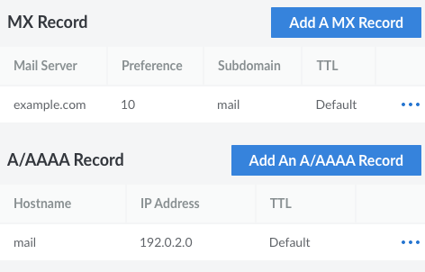
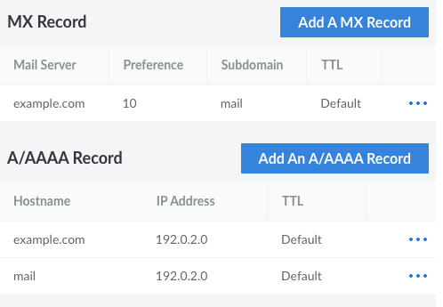
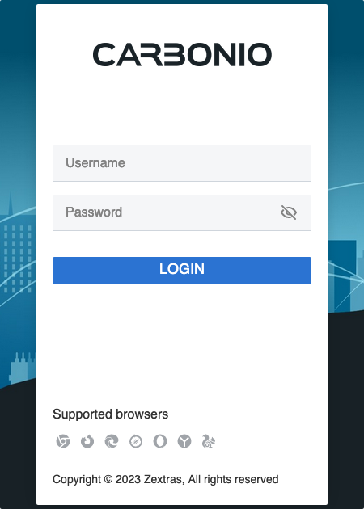
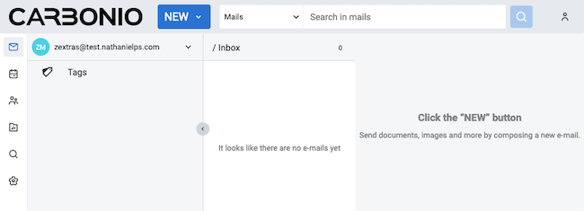
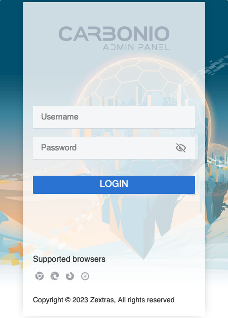
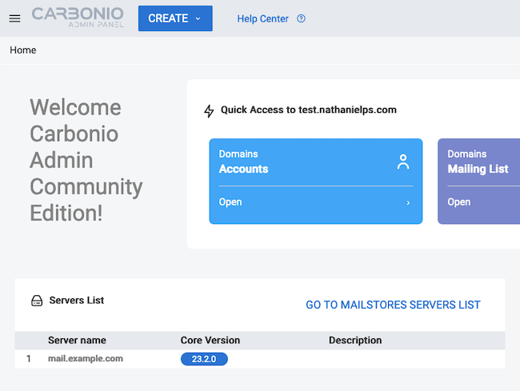

Carbonio Community Edition (CE) offers an open-source collaboration solution, complete with email, contacts, calendar, and even a collaborative file management system. Most collaboration platforms' proprietary design leaves them difficult and/or inflexible to implement. Zextras's Carbonio brings the freedom of open source along with the wide array of features you would expect from other collaboration platforms.

Learn through this guide how to get started using Carbonio. The guide covers installing your own Carbonio CE instance and accessing the instance for day-to-day use and administration.

## Before You Begin

1. If you have not already done so, create a Linode account and Compute Instance. See our [Getting Started with Linode](/docs/guides/getting-started/) and [Creating a Compute Instance](/docs/guides/creating-a-compute-instance/) guides.

1. Follow our [Setting Up and Securing a Compute Instance](/docs/guides/set-up-and-secure/) guide to update your system. You may also wish to set the timezone, configure your hostname, create a limited user account, and harden SSH access.


The steps in this guide are written for non-root users. Commands that require elevated privileges are prefixed with `sudo`. If you’re not familiar with the `sudo` command, see the [Linux Users and Groups](/docs/guides/linux-users-and-groups/) guide.


## How to Install Carbonio CE

Carbonio CE comes free and open source. You only need a server instance — or several — to run it on. Follow along here to set up your server instance for running Carbonio, including deploying an SSL certificate through Let's Encrypt.


In order to prevent spam from being sent from the platform, Linode restricts outbound emails for newer Linode accounts. Learn more, including how to have the restriction removed, in our blog post [A New Policy to Help Fight Spam](https://www.linode.com/blog/linode/a-new-policy-to-help-fight-spam/).


### Preparing Prerequisites

Before installing Carbonio, you need to prepare your server. Most of these preparations involve setting up DNS records, configuring a hostname, and aligning your network settings with Carbonio's communication needs.

1. Set up a domain name and DNS records for your machine. Carbonio requires a domain name along with a corresponding **A/AAAA** record and **MX** record.

    Refer to our [DNS Manager - Get Started](/docs/products/networking/dns-manager/get-started/) guide for information on setting up a domain and DNS records. You have numerous options for setting these up, but with Linode, you can do so readily with the Linode DNS Manager.

    Whatever your approach, this guide assumes you have the following.

    - A domain name.

    - An **A/AAAA** record pointing your domain or a subdomain to your system's public IP address.

    - An **MX** record pointing to your A-record domain or a subdomain. If a subdomain, you need a matching A record for that.

    This guide uses some example values throughout. It uses `example.com` as its domain and `192.0.2.0` as the public IP address for the Carbonio system. For the A/AAAA record, the guide directs the `mail.example.com` host to that IP address. The MX record then points to the domain name, `example.com`, and the subdomain, `mail`.

    Here is an example of what that setup might look like in the Linode DNS Manager.

    

    And here is a common alternative setup. This one has an additional **A** record pointing to the base domain, giving you access to Carbonio from there as well.

    

1. Create a hostname entry with the fully-qualified domain name (FQDN) for the mail server.

    This assumes that your FQDN is `mail.example.com`, as created in the example above. Match the value to your actual **MX** record. Replace `192.0.2.0` with your system's public IP address.

    ```command
    sudo hostnamectl set-hostname mail.example.com
    echo "192.0.2.0 mail.example.com mail" | sudo tee -a /etc/hosts
    ```

1. Disable IPv6. This is a requirement for running Carbonio CE.

    ```command
    sudo sysctl -w net.ipv6.conf.all.disable_ipv6=1
    sudo sysctl -w net.ipv6.conf.default.disable_ipv6=1
    sudo sed -i '/::[1-9]/d' /etc/hosts
    ```

    You can verify that IPv6 is disabled with the `ip` command. Ensure that no `inet6` entries are listed in the output.

    ```command
    ip a
    ```

    ```output
    1: lo: <LOOPBACK,UP,LOWER_UP> mtu 65536 qdisc noqueue state UNKNOWN group default qlen 1000
        link/loopback 00:00:00:00:00:00 brd 00:00:00:00:00:00
        inet 127.0.0.1/8 scope host lo
           valid_lft forever preferred_lft forever
    2: eth0: <BROADCAST,MULTICAST,UP,LOWER_UP> mtu 1500 qdisc mq state UP group default qlen 1000
        link/ether f2:3c:93:bf:e7:51 brd ff:ff:ff:ff:ff:ff
        inet 192.0.2.0/24 brd 192.0.2.255 scope global eth0
           valid_lft forever preferred_lft forever
    ```

    You may also want to check the `/etc/hosts` file to ensure no other IPv6 addresses are used there.

1. Install Python 3 and Perl. Both should be installed by default, but you can run the following command to grab the latest available version of each.

    ```command
    sudo apt upgrade python3 perl
    ```

1. Carbonio uses several ports for external network communications. You can review them on the Carbonio [requirements page](https://docs.zextras.com/carbonio-ce/html/requirements.html#firewall-ports).

    By default, Ubuntu uses UFW for managing the system's firewall. You can learn more in our [How to Configure a Firewall with UFW](/docs/guides/configure-firewall-with-ufw/) guide.

    For this guide, only the Postfix, HTTP, HTTPS, and Carbonio administrator (`6071`) ports are leveraged. Assuming you have enabled the firewall via UFW, you can open these ports with the commands here. Open other ports as needed.

    ```command
    sudo ufw allow http
    sudo ufw allow https
    sudo ufw allow 25/tcp
    sudo ufw allow 6071/tcp
    sudo ufw reload
    ```

### Installing Carbonio

With the above in place, you are ready to install Carbonio CE. These steps walk you through everything you need to do. By the end, you should have a Carbonio instance ready for you to start exploring.

1. Request access to the Carbonio CE repository. You can do this by completing the form on the [Carbonio Community Edition](https://www.zextras.com/carbonio-community-edition/#discoverproduct) page.

    After completing the form, you should receive an email with instructions for adding the repository. Follow the instructions provided for Ubuntu.

    You may need to download and run a script, and this may first require giving the downloaded script executable permissions. For example, assuming the downloaded script's filename is `inst_repo_ubuntu.sh`:

    ```command
    sudo chmod +x inst_repo_ubuntu.sh
    sudo ./inst_repo_ubuntu.sh
    ```

1. Update the APT package manager, and install Carbonio and its requirements.

    ```command
    sudo apt update
    sudo apt install service-discover-server carbonio-directory-server \
        carbonio-proxy carbonio-webui carbonio-files-ui \
        carbonio-mta carbonio-appserver carbonio-logger \
        carbonio-user-management carbonio-files-ce carbonio-files-db \
        carbonio-storages-ce carbonio-preview-ce carbonio-docs-connector-ce \
        carbonio-docs-editor carbonio-admin-ui carbonio-admin-console-ui \
        carbonio-admin-login-ui postgresql-12
    ```

1. Run the bootstrap process to complete the Carbonio setup.

    ```command
    sudo carbonio-bootstrap
    ```

    The process prepares the default configurations and prompts you when they are ready. You can accept the prompt and proceed with the setup by inputting `y`. From there, the setup may take several minutes to complete as it installs necessary resources for Carbonio and enables required services.

### Creating an Administrator User

Carbonio is now installed, but you need an initial user before you can start using the platform. These steps walk you through configuring credentials for your administrative user, which can also act as your initial user within the Carbonio interface.

1. Change into the `zextras` user, created during the Carbonio setup. To do so, you first need to switch to the root user and then switch to the `zextras` user.

    ```command
    su -
    su - zextras
    ```

1. Run the following command to set the password for your administrator user.  Replace `example.com` with your relevant domain name, and replace `examplepass` with a password for your administrator user.

    ```command
    carbonio prov setpassword zextras@example.com examplepass
    ```

With the above steps completed, you can now access Carbonio using your newly created administrator user. Proceed to the [How to Use Carbonio CE](/docs/guides/getting-started-with-carbonio/#how-to-use-carbonio-ce) section below for further instructions on using Carbonio with this user.

### Setting Up SSL

While the Carbonio instance is ready to use after the installation, its SSL certificates are self-signed. This means that you are likely to get disturbing and obtrusive warning messages when accessing your Carbonio instance from a web browser.

To remedy this, follow along here. These steps show you how to install [Certbot](https://certbot.eff.org/) and use it to procure SSL certificates for Carbonio from [Let's Encrypt](https://letsencrypt.org/).

1. Ensure that `snapd`(the [Snap](https://snapcraft.io/docs/getting-started) application store) is installed and up to date. Snap provides application bundles that work across major Linux distributions, and it comes by default on Ubuntu releases since 16.04.

    ```command
    sudo apt install snapd
    sudo snap install core && sudo snap refresh core
    ```

1. Remove any existing Certbot installation.

    ```command
    sudo apt remove certbot
    ```

1. Install Certbot.

    ```command
    sudo snap install --classic certbot
    ```

1. Download the SSL certificate. Enter your FQDN for the Carbonio system as the domain name for the certificate.

    ```command
    sudo certbot certonly --standalone --key-type rsa --preferred-chain "ISRG Root X1" -d mail.example.com
    ```

1. Copy your `privkey.pem` file to the Carbonio SSL directory as `commercial.key`.

    ```command
    sudo cp /etc/letsencrypt/live/mail.example.com/privkey.pem /opt/zextras/ssl/carbonio/commercial/commercial.key
    ```

1. Similarly, copy the `cert.pem` and `chain.pem` files to that same directory.

    ```command
    sudo cp /etc/letsencrypt/live/mail.example.com/cert.pem /opt/zextras/ssl/carbonio/commercial/
    sudo cp /etc/letsencrypt/live/mail.example.com/chain.pem /opt/zextras/ssl/carbonio/commercial/
    ```

1. Fetch the ISRG Root X1 chain file, and append its contents to the end of the `chain.pem` file using the following command:

    ```command
    sudo wget -O /opt/zextras/ssl/carbonio/commercial/ISRG-X1.pem https://letsencrypt.org/certs/isrgrootx1.pem.txt
    sudo cat /opt/zextras/ssl/carbonio/commercial/ISRG-X1.pem | sudo tee -a /opt/zextras/ssl/carbonio/commercial/chain.pem
    ```

1. Give the `zextras` user ownership of the `commercial.key` file.

    ```command
    sudo chown -R zextras:zextras /opt/zextras/ssl/carbonio/commercial/
    ```

1. Change to the `zextras` user, by way of the root user, and change into the Carbonio directory with the SSL certificates.

    ```command
    su -
    su - zextras
    cd /opt/zextras/ssl/carbonio/commercial/
    ```

1. Verify the certificates for Carbonio.

    ```command
    zmcertmgr verifycrt comm commercial.key cert.pem chain.pem
    ```

    ```output
    ** Verifying 'cert.pem' against 'commercial.key'
    Certificate 'cert.pem' and private key 'commercial.key' match.
    ** Verifying 'cert.pem' against 'chain.pem'
    Valid certificate chain: cert.pem: OK
    ```

1. Deploy the certificates to Carbonio.

    ```command
    zmcertmgr deploycrt comm cert.pem chain.pem
    ```

1. Finally, restart the Carbonio instance to have the changes take effect.

    ```command
    zmcontrol restart
    ```

## How to Use Carbonio CE

With your own Carbonio CE instance running, you can log in and start navigating the interface. Actually, Carbonio has two interfaces: one for users and one for administration.

Below, check out the coverage of each of these interfaces. This includes steps to access and log into each interface and an overview of what you can expect to find and do in each.

### User Interface

Carbonio's user interface covers the day-to-day usage of Carbonio. This is where users go to check email, access their contacts, manage calendar schedules, and collaborate on documents.

To access the user interface, navigate to the HTTPS address for your Carbonio instance. Follow the example domain setup covered further above, this would be `https://mail.example.com`. Doing so takes you to the Carbonio login page.



From there, you can log into the Carbonio instance using the `zextras` user credentials created at the end of the installation setup. Specifically, the default username would be `zextras@example.com` with the example domain setup, and the password configured in the example above is `examplepass`.

Logging in directs you to the Carbonio user dashboard, where you can see the user's emails, calendars, contacts, and files. All of these are accessible from the menu on the left.

[](carbonio-user-dashboard.png)

### Administrator Interface

Carbonio includes an administrator interface. It is from this interface that you can manage resources and settings on your Carbonio instance.

To access the administrator interface, navigate to port `6071` of your Carbonio domain using HTTPS. For instance, using the domain setup given further above would mean navigating to the address `https://mail.example.com:6071`. This takes you to the administrator login page.



Log in using the credentials you configured at the end of the installation setup as covered further above. Following the example domain setup, the default username would be `zextras@example.com`, and the example password given above is `examplepass`.

You are taken to the Carbonio administrator dashboard, with all of the options for configuring your instance.

[](carbonio-admin-dashboard.png)

The administrator interface divides largely into four menu categories, all accessible from the menu on the left. What follows provides an overview of each of these categories.

- **Domains**. Access each domain associated with your Carbonio instance and control features and settings related to it. This includes everything from general instance settings to authentication requirements to user creation and management.

- **Mailstores**. View mail servers on your instance. This option is mostly used for viewing and managing data storage volumes for each mail server.

- **Class of Service (COS)**. Manage COSs, each defining particular access and usage settings. A default COS is included to manage default user abilities, but you can also create additional COSs. When creating or modifying a user via Domains, you can associate the user with a particular COS.

- **Privacy**. Toggle a small set of privacy settings determining what data your instance shares with Zextras.

## Conclusion

With that, the guide has walked you through everything you need to get started using Carbonio for collaboration. Even without further fine-tuning, the Carbonio instance created above is ready to add users and let them start working.

Of course, Carbonio offers more features and customization to fit your particular needs. Be sure to review the links included below, particularly the Zextras documentation for Carbonio Community Edition, to continue learning.
