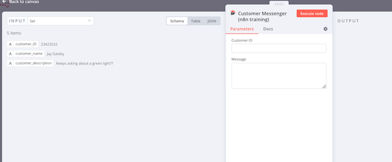

[n8n](https://n8n.io/) is a versatile workflow automation tool. It simplifies multi-step pipelines with the help of a rich library of templates, including support for many popular applications, services, and tools. n8n features a powerful and intuitive GUI, allowing users to construct a complete *no-code* pipeline. This guide introduces n8n and explains how to run it as a Docker container. It also demonstrates how to use n8n to build a simple three-step workflow.

## What is n8n?

n8n is a [fair code](https://faircode.io/) open-source application that allows users to automate and streamline custom multi-stage workflows. Each workflow consists of a series of steps or modules, which n8n refers to as *nodes*. The output from one step transitions as the input for the subsequent stage. Each workflow starts with a trigger, such as a timer, that launches the sequence.

The wide-ranging n8n library makes it easy to interact with popular services like Facebook and Gmail. n8n includes support for common tasks including accessing a database, sending an email, logging into social media services, and building a webpage. For scenarios demanding greater complexity and flexibility, users can integrate segments of JavaScript code. An n8n workflow can integrate several different applications and services, allowing for increased efficiency.

n8n is considered a *low-code* tool. Low-code or no-code applications hide the complexity of low-level details and API integration. This allows users to interact with the tool at a higher level of abstraction. n8n includes an easy-to-use GUI canvas that simplifies workflow creation and allows users to build and connect nodes visually. It also features a library of *integrations*, providing built-in support for a large number of common applications and services. Consequently, it's feasible to integrate numerous commonplace websites and tools within a singular pipeline.

To develop an n8n workflow, users first select and connect a node. Each node encompasses a visual interface for configuring application-specific parameters. For example, to retrieve data from a JSON file, users must specify the names of the required table columns. In many cases, a node can be built using drag-and-drop actions and point-and-click interactions. Users can add additional nodes to depict subsequent stages of the workflow. The GUI and visual canvas indicate the operational flow of the nodes and triggers. It also displays the inputs and outputs of each stage.

n8n is designed for technically-minded people who want to focus on high-level tasks rather than APIs and scripts. It is fast, scalable, and secure, and includes authentication capabilities. n8n can be installed using either npm or Docker. n8n has the following advantages:

-   It permits a combination of code-based and UI-derived logic, with an easy-to-use interface.
-   It provides support for hundreds of integrations, including common applications, tools, protocols, and websites.
-   It can interlink multiple tools within a single pipeline, facilitating the exchange of information.
-   It has a large community and a library of third-party extensions.
-   It includes a built-in SQLite database.
-   It permits rapid prototyping and iterative development.
-   Each workflow permits multiple triggers, including Webhooks. It can synchronize data and applications in real-time.
-   It allows users to branch and merge workflows. Workflows can be imported, modified, and exported.
-   Users can add customized error handling.
-   It can be self-hosted or run on the n8n cloud, allowing for horizontal scaling to increase capacity.

n8n is most commonly used in the following scenarios. However, its flexibility is useful in almost any automated setting.

-   Customer Relationship Management (CRM)
-   Data analysis/data mining
-   Mailing lists
-   E-commerce
-   Sales and marketing
-   Product analytics
-   Prototyping
-   Incident reporting and monitoring

The free version on n8n places some caps on the number of workflows and users. In addition, the documentation is somewhat limited, and the application requires a technical mindset.

## How does n8n work?

n8n is organized around three main concepts, *workflows*, nodes, and *connections*.

-   **Workflow**: A workflow contains the entire sequence of events in a pipeline. It includes multiple nodes bound together using internal logic.
-   **Node**: A node is a specific task or action within a larger workflow. Each node represents a modular and self-contained task, such as retrieving data or running a script. Users can base the nodes upon a library of *Core nodes* or *Actions*. Core nodes contain basic widely-used functionality, while Actions interact with external applications and services. Users can also create custom nodes.
-   **Connection**: A connection links two nodes together, forming an execution chain within the workflow. Typically, the outputs of one node comprise the inputs to the next node.

*Execution* refers to an instance of running a workflow. Each execution is associated with a trigger. A trigger begins the workflow when it receives a qualifying event or condition. In manual mode, a user must deliberately execute a workflow using a manual trigger. Inactive workflows can only be launched manually. In production mode, an internal or external event or condition can automatically trigger a workflow. For example, a timer can launch a workflow according to a predetermined schedule. n8n contains a core [library of built-in triggers](https://docs.n8n.io/integrations/builtin/trigger-nodes/).

To implement the sequence of nodes, users can choose from a large n8n library of built-in [integrations](https://docs.n8n.io/integrations/). An integration is a template for a certain type of task. Users customize each node with application-specific details to integrate it into the workflow.

The integrations library contains a large number of built-in [Core Nodes](https://docs.n8n.io/integrations/builtin/core-nodes/) and [Actions](https://docs.n8n.io/integrations/builtin/app-nodes/). Core Nodes implement basic tasks such as shell script execution, conditional logic, and file/database access. This collection also supports popular protocols and standards including FTP, GraphQL, Git, HTML, LDAP, Markdown, SSH, and XML. Nodes designated as Actions can incorporate external applications, services, and tools. The Actions library includes support for a variety of platforms, including Facebook, Eventbrite, GitHub, Jira, Gmail, Shopify, Trello, Twitter, and many more. For example, the Bitly node allows the workflow to automate Bitly tasks, for example, creating, retrieving, or updating Bitly links.

As an additional resource, community nodes and third-party integrations are available. Users can also create their own nodes to incorporate custom functionality or integrate with internal systems. For information on how to create a custom node, see the [n8n custom node documentation](https://docs.n8n.io/integrations/creating-nodes/).

## Before You Begin

1.  If you have not already done so, create a Linode account and Compute Instance. See our [Getting Started with Linode](/docs/guides/getting-started/) and [Creating a Compute Instance](/docs/guides/creating-a-compute-instance/) guides.

1.  Follow our [Setting Up and Securing a Compute Instance](/docs/guides/set-up-and-secure/) guide to update your system. You may also wish to set the timezone, configure your hostname, create a limited user account, and harden SSH access.

1.  **Optional**. To access n8n using a domain name, create a DNS `A` record for the subdomain `n8n.example.com`, replacing `example.com` with the actual domain name. Point the record at the IP address of the system hosting n8n.


The steps in this guide are written for non-root users. Commands that require elevated privileges are prefixed with `sudo`. If you are not familiar with the `sudo` command, see the [Linux Users and Groups](/docs/tools-reference/linux-users-and-groups/) guide.


## How to Install, Configure, and Run n8n

n8n typically runs as a Docker container. Docker and Docker Compose must be installed before n8n can be downloaded. To install Docker and download the n8n container, follow the steps explained in the sections below.


Users can also use npm to install n8n. For information on this method, consult the [n8n npm installation guide](https://docs.n8n.io/hosting/installation/npm/).


### How to Install Docker

1.  Ensure the system is up to date. Reboot the node if necessary.

    ```command
    sudo apt-get update -y && sudo apt-get upgrade -y
    ```

1.  Before installing Docker v2, remove any older releases of the application. Add some additional components.

    ```command
    sudo apt-get remove docker docker-engine docker.io containerd runc
    sudo apt-get install ca-certificates curl gnupg lsb-release
    ```

1.  Add the official Docker GPG key to the key storage. The key helps validate the installation.

    ```command
    sudo mkdir -m 0755 -p /etc/apt/keyrings
    curl -fsSL https://download.docker.com/linux/ubuntu/gpg | sudo gpg --dearmor -o /etc/apt/keyrings/docker.gpg
    ```

1.  Add the Docker repository to `apt`. Update the package list.

    ```command
    echo "deb [arch=$(dpkg --print-architecture) signed-by=/etc/apt/keyrings/docker.gpg] https://download.docker.com/linux/ubuntu \
    $(lsb_release -cs) stable" | sudo tee /etc/apt/sources.list.d/docker.list > /dev/null
    sudo apt-get update
    ```

1.  Install the latest release of Docker Engine and CLI, along with Docker Compose.

    ```command
    sudo apt-get install docker-ce docker-ce-cli containerd.io docker-buildx-plugin docker-compose-plugin
    ```

1.  To ensure Docker is operating correctly, run the `hello-world` container. This should prompt the container to display the message `Hello from Docker!`.

    ```command
    sudo docker run hello-world
    ```

    ```output
    Hello from Docker!
    This message shows that your installation appears to be working correctly.
    ```

1.  (**Optional**) To avoid potential permissions conflicts with other applications, add the current user to the `docker` group. This allows the user to run Docker without `sudo` privileges.

    ```command
    sudo usermod -aG docker userid
    ```

### How to Download and Run the n8n Container

Users can activate the n8n Docker container using one of two methods. One alternative is to use the `docker run` command from the command line, supplying parameters and environmental variables as part of the command. The other approach is to use Docker Compose in conjunction with a `docker-compose.yml` file and a `.env` configuration. This guide uses `docker run` to launch the n8n container.


The Docker Compose method is generally more flexible and is the best choice for a production environment. To use `docker compose` command, see the [n8n Docker Compose guidelines](https://docs.n8n.io/hosting/installation/server-setups/docker-compose/). Create a `docker-compose.yml` file to store the Docker configuration and a `.env` file for the environmental variables.


Unless otherwise specified, n8n uses SQLite as its database. However, it can also use PostgresDB. See the [n8n PostgresDB guidelines](https://docs.n8n.io/hosting/installation/docker/#using-alternate-databases) for more information on this configuration. The PostgreDB container must be pulled beforehand.


In initial Beta releases, n8n allowed the use of MySQL and MariaDB. However, support for these databases has been deprecated and is intended for removal in future releases.


1.  Use the `docker run` command to download and launch the n8n container. Supply the following parameters with the command.

    - For the `--name` parameter, use `n8n`.
    - The `-p` option indicates the port number for n8n. Add `-p 5678:5678` to run n8n on port `5678`.
    - Append `-v ~/.n8n:/home/node/.n8n` to define the storage volume for the n8n data.
    - Environmental variables begin with the `-e` flag. All environmental variables in this command are optional. This example uses `Europe/London` for the `GENERIC_TIMEZONE` and `TZ` variables.
    - n8n can run without password credentials, but it is much more secure to append a username and password. Add the lines `-e N8N_BASIC_AUTH_USER=admin` and `N8N_BASIC_AUTH_PASSWORD=password` to the command. Replace the `password` with a more secure password.
    - The final argument specifies the name of the container. For the latest version of n8n, use `docker.n8n.io/n8nio/n8n`. It is also possible to pull the container beforehand using the command `docker pull docker.n8n.io/n8nio/n8n`.

    ```command
    docker run -it --rm \
     --name n8n \
     -p 5678:5678 \
     -v ~/.n8n:/home/node/.n8n \
     -e GENERIC_TIMEZONE="Europe/London" \
     -e TZ="Europe/London" \
     -e N8N_BASIC_AUTH_USER=admin \
     -e N8N_BASIC_AUTH_PASSWORD=password \
     docker.n8n.io/n8nio/n8n
    ```

    ```output
    latest: Pulling from n8nio/n8n
    ...
    Status: Downloaded newer image for docker.n8n.io/n8nio/n8n:latest
    License manager not initialized
    UserSettings were generated and saved to: /home/node/.n8n/config
    n8n ready on 0.0.0.0, port 5678
    Migrations in progress, please do NOT stop the process.
    Initializing n8n process
    Migrations finished.
    Version: 0.231.3

    Editor is now accessible via:
    http://localhost:5678/
    ```

1.  After Docker downloads and activates all containers, the application is made available on port `5678`. To access the n8n web interface, visit `http://ip_address:5678/setup`, substituting the actual IP address of the system in place of `ip_address`. Register an account using a valid email address, or skip the registration process using the `Skip setup for now` button. Click `Next` to continue.

    

1.  After registration, Docker displays the default workflow page.

    

## How to Create an n8n Workflow

The n8n interface can be somewhat overwhelming at first glance, so n8n provides a quick-start application to help users get started. The accompanying tutorial allows users to modify and execute a workflow using a pre-populated data set. This guide uses the sample workflow to demonstrate how to use n8n. To build the demo application, follow these steps.

1.  From the default page, select the **Templates** icon from the row of icons on the left-hand side.

    

1.  In the search bar near the top of the page, enter the text `very quick` to locate the `Very quick quickstart` workflow. Click on the template to continue.

    

1.  A preview of the workflow appears in the canvas. Click the **Use this workflow** button to proceed.

    

1.  The `very quick quickstart` workflow now appears in the editor canvas. The editor indicates the various nodes within the workflow. In this example, the **Execute** button triggers the workflow. The first node reads the sample data from the `Customer Datastore` and passes the data to the second "Set node" for further processing.

    

1.  The Set node extracts the customer name, ID, and description from the records, and assigns these values to local variables. Double-click a node to see more details. For example, the **id** field in the JSON file is assigned to the `customer_ID` variable. To return to the main workflow, click **Back to Canvas** in the upper-left-hand corner.

    

1.  To see what the workflow does in its current state, select the **Execute Workflow** button at the bottom of the editor. The editor illustrates the nodes that are traversed and the number of entries produced.

    

1.  Currently, nothing happens with the database information after it is extracted. To complete the workflow, add a new node. Click the **+** button at the right-hand side of the last node to add a new node and connect it to the Set node.

    

1.  After clicking the **+** button, a search panel appears on the right-hand side of the screen. Enter `Customer messenger` to search for the `Customer messenger (n8n training)` node. Select this entry to add the node to the workflow.

    

1.  n8n automatically displays the node editor window. On the left, it displays the possible inputs to the message. These inputs are the same as the outputs of the Set node. It also includes the UI for the "Customer Messenger" node in the center of the page. The interface currently displays fields for the **Customer ID** and **Message**.

    

1.  Define the contents of each field. Drag the `customer_ID` variable on the left side of the screen into the **Customer ID** box in the "Customer Messenger" node. n8n expands the variable to the formula `fx {{ $json.customer_ID }}`.

    

1.  Hover over the **Message** text box and select the **Expression** tab to add an expression.

    

1.  Inside the **Message** text box, add the expression `Hi {{$json.customer_name}}, Your description is {{$json.customer_description}}`. If necessary, expand the **Message** text box using the "expand" widget on the lower right of the text box. In the `Result for Item 1` display, n8n indicates the output that would result from the first input.

    

1.  Click outside the **Message** text box to close the expression editor. Then select **Back to Canvas** to return to the main editor. The main workflow editor canvas now includes the new node within the workflow.

    

1.  Launch the revised workflow using the **Execute Workflow** button. The editor canvas displays the results of the operation. The "Customer Messenger" node generates five statements as output.

    

1.  To review the workflow output, click on the "Customer Messenger" node in the editor canvas. The **Output** panel on the right side of the screen displays the list of messages from the node.

    

At this point, try adding more nodes to the workflow or create an entirely new workflow and a new set of nodes. For more information, see the [n8n documentation](https://docs.n8n.io/).

## Conclusion

n8n is an application for automating detailed workflows. It includes libraries that allow users to build and link workflow nodes using an intuitive GUI canvas. n8n provides templates for many common tasks and includes bindings for common web applications and services. It can be installed using npm or run as a Docker container. For more information on n8n, see the [user documentation](https://docs.n8n.io/).