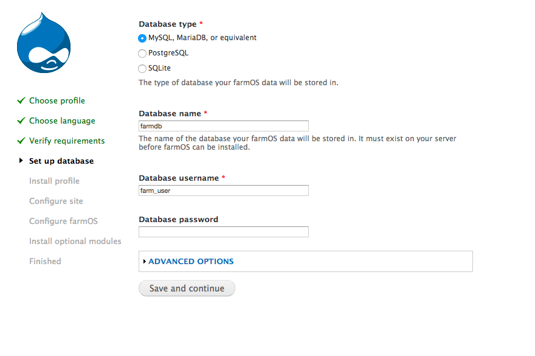

## What is farmOS?

[farmOS](http://farmos.org/) is a one-of-a-kind web application that enables farmers to manage and track all aspects of their farm. Built atop Drupal and licensed under [GPL V.3](https://www.gnu.org/licenses/gpl-3.0.en.html), farmOS is a great free-software solution for farms to explore.

This guide explains how to install, setup and host your own farmOS web app on a Linode using Ubuntu 20.04.

## Before You Begin

1.  Familiarize yourself with our [Getting Started](/docs/products/platform/get-started/) guide and complete the steps for [setting your Linode's hostname](/docs/products/compute/compute-instances/guides/set-up-and-secure/#configure-a-custom-hostname) and [timezone](/docs/products/compute/compute-instances/guides/set-up-and-secure/#set-the-timezone).

1.  Follow our [Securing Your Server](/docs/products/compute/compute-instances/guides/set-up-and-secure/) guide to [create a standard user account](/docs/products/compute/compute-instances/guides/set-up-and-secure/#add-a-limited-user-account), [harden SSH access](/docs/products/compute/compute-instances/guides/set-up-and-secure/#harden-ssh-access), [remove unnecessary network services](/docs/products/compute/compute-instances/guides/set-up-and-secure/#remove-unused-network-facing-services) and [create firewall rules](/docs/products/compute/compute-instances/guides/set-up-and-secure/#configure-a-firewall) for your web server; you may need to make additional firewall exceptions for your specific application.

    

1.  Install and configure a [LAMP stack on Ubuntu 20.04](/docs/guides/how-to-install-a-lamp-stack-on-ubuntu-20-04/). Skip the configuration steps for setting up MySQL and use the steps outlined in this guide instead.

## MySQL Setup

1.  Configure your database for PHP. When prompted, choose the `apache2` web server for automatic configuration, `Yes` to automatically configure a database, then enter and confirm your database root password:

        sudo apt install php-mysql phpmyadmin

1.  Log in to MariaDB with your database root password:

        mysql -u root -p

1.  Create a database and a database user with necessary privileges, replacing `secure_password` with a password of your choice:

        CREATE DATABASE farmdb;
        CREATE USER 'farm_user'@'localhost' IDENTIFIED BY 'secure_password';
        GRANT ALL PRIVILEGES ON farmdb.* TO 'farm_user'@'localhost';
        FLUSH PRIVILEGES;

1.  Exit MariaDB:

        quit

## Download and Install farmOS

1.  Navigate to your site's document root. If you installed and configured your Apache server using our [LAMP stack on Ubuntu 20.04](/docs/guides/how-to-install-a-lamp-stack-on-ubuntu-20-04/) guide, your document root should be located in the `/var/www/html/example.com/public_html/` directory. Replace `example.com` with your own document root path's name.

        cd /var/www/html/example.com

1.  Download the farmOS tarball. As of writing this guide, farmOS 7.x-1.7 is the latest version. See [Drupal's download page](https://www.drupal.org/project/farm) for their latest core tarball.

        sudo wget https://ftp.drupal.org/files/projects/farm-7.x-1.7-core.tar.gz

    
Ensure that the version number matches the farmOS version you wish to download.


1.  Extract the downloaded tarball's contents into your site's document root:

        sudo tar -zxvf farm-7.x-1.7-core.tar.gz -C public_html --strip-components=1

1.  farmOS depends on a PHP graphics library called GD. Install GD and other dependencies:

        sudo apt install php-gd php-xml php-xmlrpc

## Configure Apache 2.4

1.  Enable Apache's [rewrite module](https://httpd.apache.org/docs/current/mod/mod_rewrite.html). This module is necessary since farmOS enables [Clean URLs](https://www.drupal.org/getting-started/clean-urls) by default.

        sudo a2enmod rewrite

1.  Specify the rewrite conditions for your farmOS site's document root in Apache's configuration file using the text editor of your choice. If you installed and configured your Apache server using [LAMP stack on Ubuntu 20.04](/docs/guides/how-to-install-a-lamp-stack-on-ubuntu-20-04/) guide, the configuration file for your site is located at `/etc/apache2/sites-available/example.com.conf`.

    
<Directory /var/www/html/example.com/public_html>
    Options Indexes FollowSymLinks
    AllowOverride All
    Require all granted
      RewriteEngine on
      RewriteBase /
      RewriteCond %{REQUEST_FILENAME} !-f
      RewriteCond %{REQUEST_FILENAME} !-d
      RewriteRule ^(.*)$ index.php?q=$1 [L,QSA]
</Directory>


1.  Change the ownership of your site's document root from `root` to `www-data`. This allows you to install modules and themes, and to update Drupal, without being prompted for FTP credentials.

        sudo chown -R www-data:www-data /var/www/html/example.com

1.  Restart Apache so all changes are applied.

        sudo systemctl restart apache2

## Configure farmOS

1.  Go to your Linode's domain or [IP address](/docs/guides/find-your-linodes-ip-address) in a web browser. This shows you the first step of the farmOS/Drupal web configuration.

1.  The first screen you encounter asks you to choose a profile and a language:

    

1.  Drupal checks if the installation is correct in the **Verify requirements** section. Then, it will move to configuring the database. In this section you should input the information from the database built earlier in this tutorial:

    

1.  Once farmOS hooks into the database, configure your farmOS site. This is where you define the name and the main user account:

    

1.  The next section asks you what modules you want to install. You can install and uninstall modules at any time, but this is a chance to install personalized modules that work for your specific type of farm.

    

1.  Finally, after installing the modules, you are dropped into the farmOS dashboard:

    

1.  After the installation has finished, you may want to reset your file permissions to avoid security vulnerabilities from your site's document root. If you installed and configured your Apache server using our [LAMP stack on Ubuntu 20.04](/docs/guides/how-to-install-a-lamp-stack-on-ubuntu-20-04/) guide, your document root should be located in the `/var/www/html/example.com/public_html/` directory:

        sudo chmod 644 sites/default
        sudo chmod 644 ./sites/default/settings.php

## Add Users

To add users to your farmOS distribution, you can do so from the **People** tab under **Manage**.

  

After each user is created, use the **People** tab to verify success:

  

## Next Steps

### Registering a Domain Name for farmOS

To register a domain name (e.g., `yourfarm.com`), check out our guide on the [DNS Manager](/docs/products/networking/dns-manager/) and add your FQDN (e.g., `farmos.yourfarm.com`) to the Linode Manager. A FQDN provides you, and the people who plan on using farmOS, the ability to navigate to a URL instead of your Linode's public IP address. If you plan on using farmOS internally, you can skip this step.

### Generate a Google API Key

farmOS can interface with GoogleMaps. You need a GoogleAPI key to use this feature. The farmOS official documentation has a section about using GoogleMaps in its [docs](https://farmos.org/hosting/apikeys/). Interfacing with GoogleMaps allows you to save certain geographical areas into farmOS. When creating farmOS projects and tasks, you can use the Google Maps API to pinpoint where the task takes place.
