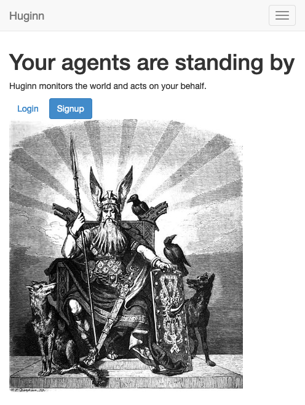
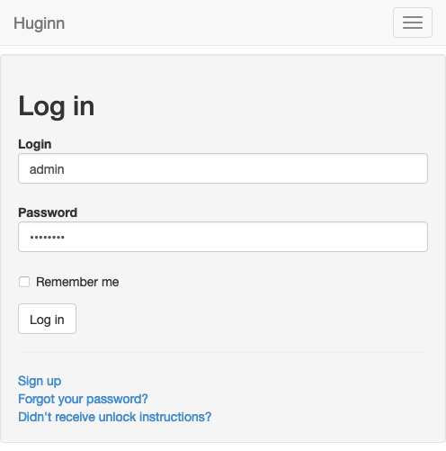
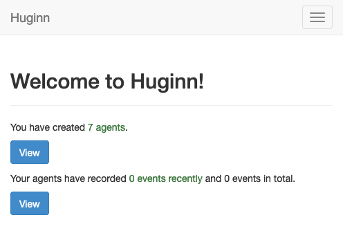
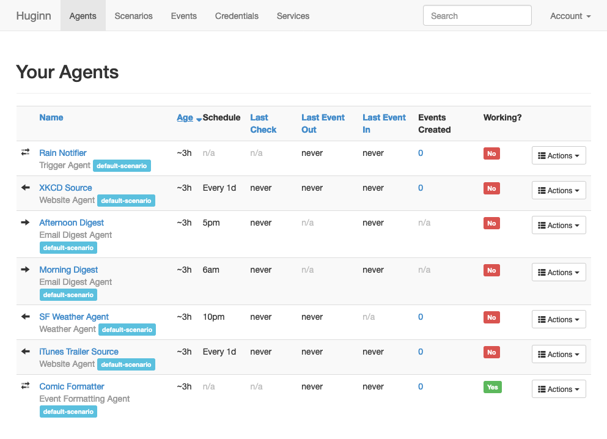
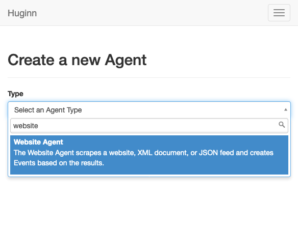
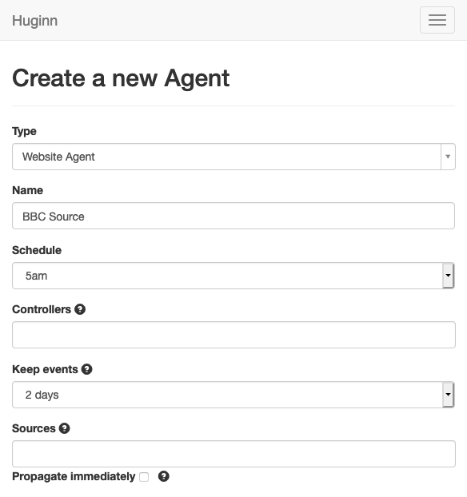
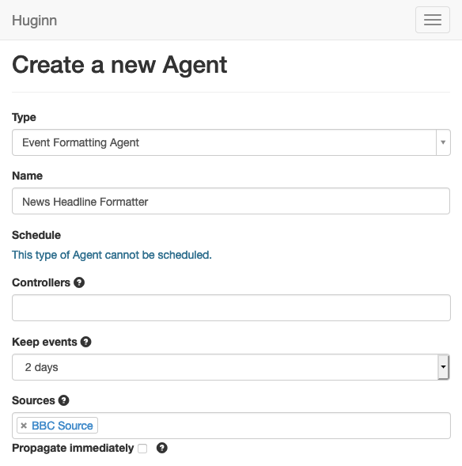
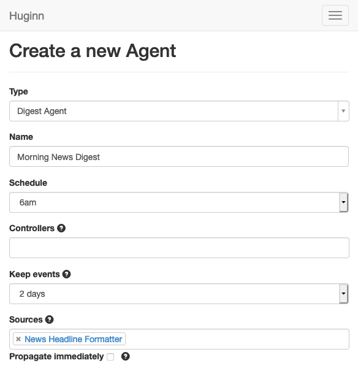
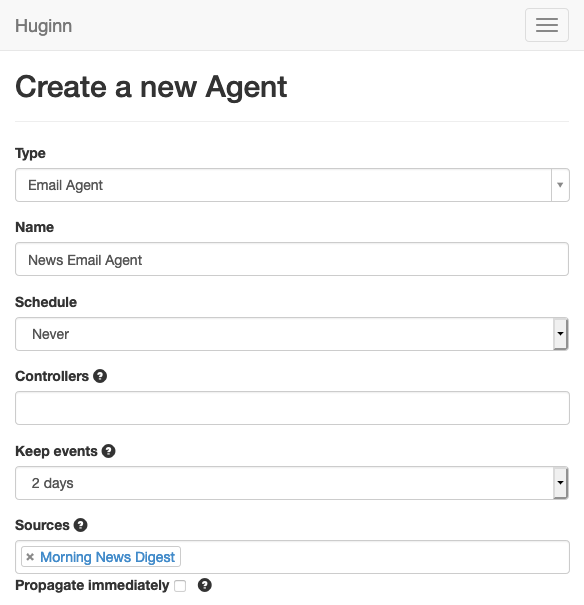

[Huginn](https://github.com/huginn/huginn) provides an open-source and self-hosted system for automating online tasks. It is similar to tools like IFTTT and Zapier, but is more customizable. Huginn also gives you greater control by being hosted on your own server. This guide shows you how to set up your own Huginn instance and then provides a deep dive into configuring agents to send you notifications.

## Before You Begin

1.  If you have not already done so, create a Linode account and Compute Instance. See our [Getting Started with Linode](/docs/products/platform/get-started/) and [Creating a Compute Instance](/docs/products/compute/compute-instances/guides/create/) guides.

1.  Follow our [Setting Up and Securing a Compute Instance](/docs/products/compute/compute-instances/guides/set-up-and-secure/) guide to update your system. You may also wish to set the timezone, configure your hostname, create a limited user account, and harden SSH access.

1. Huginn supports Debian and Ubuntu Linux distributions, and this guide's instructions are intended for these distributions as well.


This guide is written for non-root users. Commands that require elevated privileges are prefixed with `sudo`. If you are not familiar with the `sudo` command, see the [Linux Users and Groups](/docs/guides/linux-users-and-groups/) guide.


## Install Docker and Docker Compose

This guide uses [Docker](https://www.docker.com/) to run Huginn. Huginn maintains an [official Docker setup](https://github.com/huginn/huginn/blob/master/doc/docker/install.md), to help you get your instance up and running. If you are new to using Docker, it is recommended that you review the [Introduction to Docker](/docs/guides/introduction-to-docker/) guide.

It is possible to manually install Huginn. However, the Docker method is used in this guide since Huginn does not support the manual installation method for the latest Debian and Ubuntu releases. However, Huginn maintains [manual installation instructions](https://github.com/huginn/huginn/tree/master/doc/manual) if you prefer that installation path.

## Try Out Huginn

Once you have Docker installed, you can quickly run an instance of Huginn to try it out. Running Huginn in this way does not create any persistent data storage, so any changes you make are not saved after you stop the instance.

1. Run the Huginn Docker container.

        docker run -it -p 3000:3000 huginn/huginn

1. Navigate to `localhost:3000` in a web browser. You can use an SSH tunnel to visit the Huginn instance remotely.

    - On Windows, you can use the PuTTY tool to set up your SSH tunnel. Follow the appropriate section of the [Using SSH on Windows](/docs/guides/connect-to-server-over-ssh-on-windows/#ssh-tunnelingport-forwarding) guide, replacing the example port number there with **3000**.
    - On OS X or Linux, use the following command to set up the SSH tunnel. Replace `example-user` with your username on the application server and `192.0.2.0` with the server's IP address.

            ssh -L3000:localhost:3000 example-user@192.0.2.0

1. Use the default credentials to log into your Huginn instance. The credentials are **Login** `admin` and **Password** `password`.

    

    

## Deploy Huginn

Docker can also be used to set up a full-fledged and persistent instance of Huginn as well. This guide uses Huginn's default database configuration — a MySQL database — which provides the most straightforward path to using Huginn.

1. Create a `.env.huginn` file with the example file's contents. This dictates the SMTP credentials for Huginn to use and allows it to send emails. In this example, replace `example-smpt-domain.com`, `example-smtp-username`, `example-smtp-password`, and `example-smtp-host` with the appropriate credentials for your SMTP.

        RAILS_ENV=production

        SMTP_DOMAIN=example-smtp-domain.com
        SMTP_USER_NAME=example-smtp-username
        SMTP_PASSWORD=example-smtp-password
        SMTP_SERVER=example-smtp-host.com
        SMTP_PORT=587
        SMTP_AUTHENTICATION=plain
        SMTP_ENABLE_STARTTLS_AUTO=true

        EMAIL_FROM_ADDRESS=huginn@example-smtp-domain.com

    You can create your own SMTP server by following the [Email with Postfix, Dovecot, and MySQL/MariaDB](/docs/guides/email-with-postfix-dovecot-and-mysql/) guide.

    Alternatively, you can use a third-party SMTP service, like [Mailgun](https://www.mailgun.com/). The following is an example of the above configuration for a Mailgun SMTP account.

        RAILS_ENV=production

        SMTP_DOMAIN=example-domain.mailgun.org
        SMTP_USER_NAME=postmaster@example-domain.mailgun.org
        SMTP_PASSWORD=example-mailgun-password
        SMTP_SERVER=smtp.mailgun.org
        SMTP_PORT=587
        SMTP_AUTHENTICATION=plain
        SMTP_ENABLE_STARTTLS_AUTO=true

        EMAIL_FROM_ADDRESS=huginn@example-domain.mailgun.org

    

1. Create a Docker volume for Huginn's database.

        docker volume huginn-data

1. Run the Huginn Docker container with the database volume. Here, the Docker port **3000** gets mapped to the server's port **80**, the standard port for HTTP connections.

        docker run -d -p 80:3000 --restart=always --env-file .env.huginn -v huginn-data:/var/lib/mysql huginn/huginn

    The `--restart=always` option tells Docker to restart the application whenever the server comes on. This works as long as you do not directly stop the Docker container, as in: `docker stop example-container-id`. For reference, you can get the container ID through the `docker ps` command.

1. Navigate to the URL for your server. This can be either your server's domain name or your server's IP address.

1. Login with the default credentials — `admin` as the username and `password` as the password.

    You can then change the account credentials via the **Account** option from the menu on the upper right. Be sure to enter an email address for your account as well if you want Huginn to send you notifications or account recovery via email.

    

## Manage Huginn Agents

Huginn comes with a set of example agents to get you started. It is a good idea to look over each of these to get an idea of how Huginn agents are set up.

Agents come in a few different roles. Broadly, agents are either event sources, event receivers, or a combination of both.

- An example of an event source is a **Weather Agent**, which fetches the weather report for a specific location and creates an event out of it. Another example is a **Website Agent**, which scrapes a website and creates one or more events based on the results.

- Events from a source might be received by an agent that processes the events in some way. This could be a **Trigger Agent**, which checks incoming events for certain criteria and sends them on only when they meet the criteria. It could also be an **Event Formatting Agent**, taking incoming events and reshaping them before passing them on.

- Any of the kinds of agents above can be a source for an agent that sends events out. You can send events via email with the **Email Agent** and via SMS text message with the **Twilio Agent**. You can even post events to social media with agents like the **Twitter Publish Agent** and the **Tumblr Publish Agent**.

The sections that follow walk you through putting your own agents into action. They have you set up a series of agents that work together to fetch news headlines and send them out each morning.

### Source Agent

1. Select the **New Agent** option from either the **Agent** menu item drop down or from the bottom of the page listing your agents.

    

1. Select **Website Agent** as the type. Once you do so, more options appear.

    - This agent can scrape a website and create events out of the results. In the steps that follow, the agent gets configured to identify headlines on the [BBC](https://www.bbc.com) news website and create a series of events out of them every morning.

    - Once you select an agent type, you can see that Huginn provides reference information in a pane on the right. This can be useful in learning about new agent types and in deciding what options to choose for your use case.

1. Enter the name of the agent — "BBC Source" in this example . Schedule a time for the agent to run. In the example, "5 am" is used. Under **Scenarios**, select the **default-scenario** option.

    

1. For **Options**, select **Toggle View** to allow you to enter JSON manually. Then, enter the following in the text box.

        {
          "expected_update_period_in_days": "1",
          "url": "https://www.bbc.com/",
          "type": "html",
          "mode": "on_change",
          "extract": {
            "url": {
              "css": ".media__link",
              "value": "@href"
            },
            "title": {
              "css": ".media__link",
              "value": "normalize-space(./node())"
            }
          }
        }

1. Use the **Dry Run** option to test the agent. You should see a prompt. Selecting **Dry Run** on the prompt should generate your agent's results.

1. Select **Save**, and Huginn directs you back to the list of your agents. There, you see your new agent listed.

### Format Agent

1. Select **New Agent** again, and select **Event Formatting Agent** as the type this time. Enter a name for the agent — "News Headline Formatter" in this example.

    This type of agent can reshape incoming events. The events scraped by the **Website Agent** are not in an ideal format, so this agent allows you to restructure the events as needed.

1. For **Source**, select the **Website Agent** you created above ("BBC Source"), and select "default-scenario" under **Scenarios**.

    

1. Use **Toggle View** under **Options** to edit the JSON, and enter the following in the text box.

        {
          "instructions": {
            "message": "<a href='https://www.bbc.com/{{url}}'>{{title}}</a>",
            "subject": "News Headline, {{created_at | date:'%m/%d'}}: {{title}}"
          },
          "matchers": [],
          "mode": "clean"
        }

    Here and in the JSON examples that follow, you can see that Huginn enables some templating, allowing you to work with variable data, and functions. Huginn uses the Liquid template engine for this and maintains some [documentation](https://github.com/huginn/huginn/wiki/Formatting-Events-using-Liquid) on formatting and default variables.

1. You can again use the **Dry Run** option to test the agent.

1. Select **Save** to complete the agent and be redirected back to the agent list.

### Digest Agent

1. Select **New Agent** again, and select **Digest Agent** as its type. Enter a name for the agent — "Morning News Digest" is used here.

    A **Digest Agent** collects a series of events and makes a single event out of them. This is useful since it allows Huginn to send out a single email with all of the headlines rather than an email for each headline.

1. Select a time for the agent to run — "6 am" works for this scenario. Under **Sources**, select the **Event Formatting Agent** you created above ("News Headline Formatter"). Select "default-scenario" under **Scenarios**.

    

1. Fill the **Message** text box with the following:

        Here are your news headlines for {{ 'now' | date: '%m/%d' }}:
        {{ events | map: 'message' | join: ',' }}

1. Select **Save** to complete the agent.

### Delivery Agent

1. Select **New Agent** once again. Select **Email Agent** as the type, and enter a name for the agent — here, "News Email Agent".

    This agent does just what you would guess — delivers events as emails. In this case, it receives an event from the **Digest Agent** and then sends it immediately.

1. Under **Sources**, select the **Digest Agent** you created above ("Morning News Digest"), and choose "default-scenario" for **Scenarios**.

    

1. Fill the **Options** text box with the following:

        {
          "subject": "Your News Headlines for {{ 'now' | date: '%m/%d' }}",
          "expected_receive_period_in_days": "2"
        }

1. Choose **Save** to complete the agent setup.

### Complete the Agent Setup

1. Make sure that the necessary users have valid emails entered.

1. On the page listing your agents, use the **Actions** menu for the **Website Agent** ("BBC Source") to select **Run**. Do the same for the **Digest Agent** ("Morning News Digest") and **Email Agent** ("News Email Agent").

1. Reap the benefits of receiving news headlines in your email inbox every morning.

## Conclusion

You now have some active Huginn agents. Huginn is capable of many more kinds of notifications. A wide array of sources are possible, and you have delivery options ranging from email and text (via Twilio), to Twitter and Tumblr.

There are two great resources for learning more about how to get the most out of Huginn. First, Huginn itself has a lot of information baked in, which you can tap into by exploring the different types of agents. Second, the [Huginn wiki](https://github.com/huginn/huginn/wiki) links to numerous helpful articles and examples to give you ideas for how you might use your Huginn instance.
