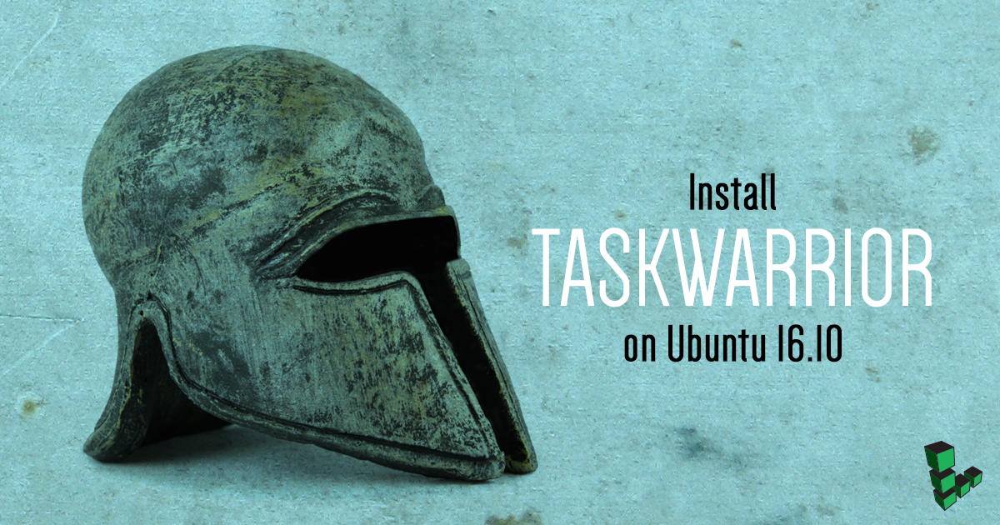
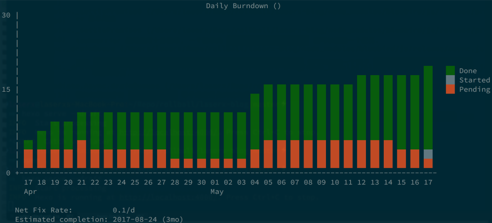
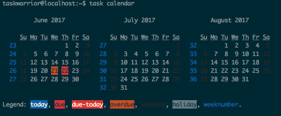

[Taskwarrior](https://taskwarrior.org/) is an open source tool that manages tasks from the command line. Taskwarrior is blazing fast, written in C, updated frequently and available on practically every platform. This guide shows you how to install Taskwarrior on a Linode running Ubuntu 16.10.

## Before You Begin

1.  If you have not already done so, create a Linode account and Compute Instance. See our [Getting Started with Linode](/docs/products/platform/get-started/) and [Creating a Compute Instance](/docs/products/compute/compute-instances/guides/create/) guides.

1.  Follow our [Setting Up and Securing a Compute Instance](/docs/products/compute/compute-instances/guides/set-up-and-secure/) guide to update your system. You may also wish to set the timezone, configure your hostname, create a limited user account, and harden SSH access.

## Install Taskwarrior

Install Taskwarrior with the command:

    sudo apt install task

After the packages are installed, run the command, `task`.

The system will ask if you want to create a configuration file for your user.

Answer `yes`.

You'll find the sample configuration file at `~/.taskrc`. To learn more about configuring `task.rc`, see the [official documentation](https://taskwarrior.org/docs/configuration.html).

## Manage Tasks with Taskwarrior

You can manage your tasks and effectively use Taskwarrior with a handful of simple commands. Taskwarrior recommends spending time prioritizing your analog task list before applying the following commands to automate it.

### Add a Task

To add a task, run the command, [task add](https://taskwarrior.org/docs/commands/add.html).

For example:

    task add Add block storage volume to my Linode

will return:

    Created task 1.

If you then run `task` again, you'll see the job information. Taskwarrior assigns the newly added task an ID, and tracks the time elapsed since you ran the command.

    taskwarrior@localhost:~$ task
    [task next]

    ID Age Description                             Urg
     1 14s Add block storage volume to my Linode    0

    1 task

You can add as many tasks as you want.

    task add Attend Linux Users Group
    Created task 2.

    task add buy groceries
    Created task 3.

### Complete a Task

After you complete a task, you can mark it "done" using the [done] command (https://taskwarrior.org/docs/commands/done.html). The syntax is `task <task_number> done`.

    taskwarrior@localhost:~$ task 1 done
    Completed task 1 'Add block storage volume to my Linode'.
    Completed 1 task.

### Remove a Task

To remove a task you can run the `task <task_number> delete` command.

    taskwarrior@localhost:~$ task 2 delete
    Permanently delete task 2 'Attend Linux Users group'? (yes/no) yes
    Deleting task 2 'Attend Linux Users group'.
    Deleted 1 task.

### Assign Tasks a Due Date

Using the `due` argument, you can assign a due date for a task:

    task add write Taskwarrior guide for the Linode community due:tomorrow

    taskwarrior@localhost:~$ task
    [task next]

    ID Age   Due Description                                      Urg
      2 11s    7h write Taskwarrior guide for the Linode community 8.65
      1 16min     buy groceries                                       0

    2 tasks

The `due` [argument](https://taskwarrior.org/docs/dates.html#due) allows a significant breadth for input. Read more about what's possible with the `due` argument at [the official documentation.](https://taskwarrior.org/docs/dates.html)

Taskwarrior supports [recurring tasks](https://taskwarrior.org/docs/recurrence.html) by using the `recur` argument. The example below creates a daily task, the first of which is due 23 hours from the time of creation:

    task add update ubuntu recur:daily due:daily

    taskwarrior@localhost:~$ task
    [task next]

    ID Age   Recur Due Description                                      Urg
     2 11min        7h write Taskwarrior guide for the Linode community 8.65
     4         P1D 23h update ubuntu                                    8.34
     1 28min           buy groceries                                       0

    3 tasks
    Creating recurring task instance 'update ubuntu'

### Visualization

Taskwarrior does much more than just list the tasks you've added on the command line. The [burndown](https://taskwarrior.org/docs/commands/burndown.html) feature outputs graphical representations of your Taskwarrior workflow.

The `calendar` feature shows a calendar that contains all your tasks and due dates.

### Next Steps with Taskwarrior

The next step to incorporate a Taskwarrior workflow into your life is to install `task server` on your Linode. Because Taskwarrior can be used across all your devices, including your phone, a central server in which to sync the data is needed. Taskwarrior offers do-it-yourself documentation on setting up such a task server: [Installing Taskserver](https://taskwarrior.org/docs/taskserver/setup.html).
