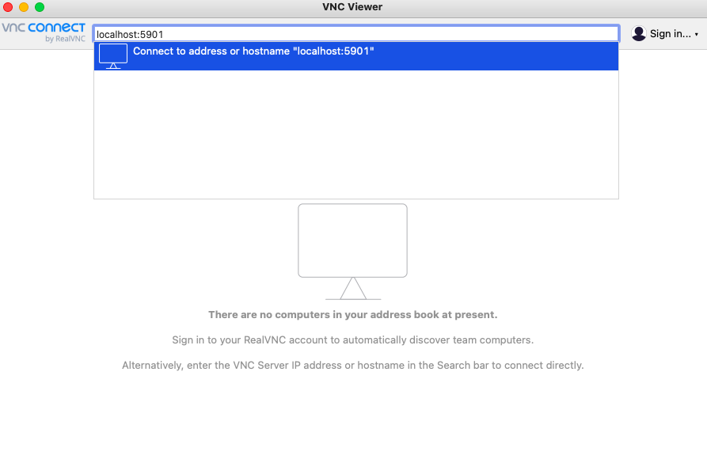
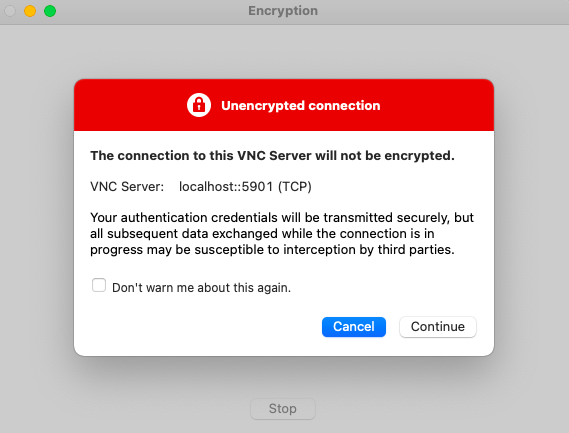
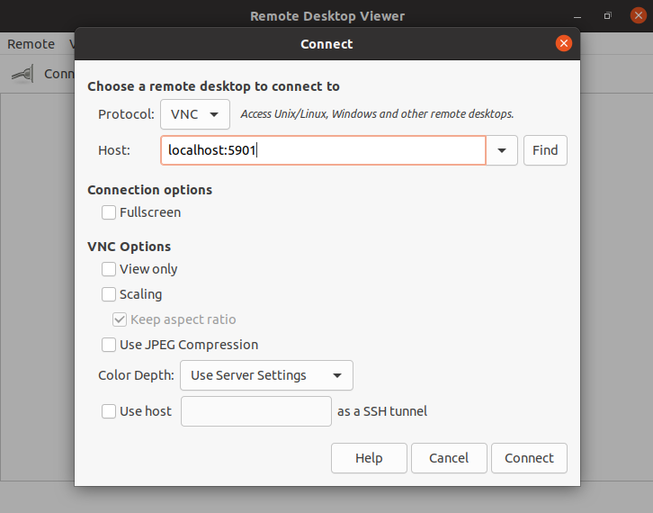

*Virtual Network Computing* (VNC) allows you to connect to and control a remote desktop environment. It is common to use VNC to operate your server with a full desktop experience. This guide walks you through the steps to install, configure, and use VNC on CentOS 8.

## Before You Begin

1.  If you have not already done so, create a Linode account and Compute Instance. See our [Getting Started with Linode](/docs/products/platform/get-started/) and [Creating a Compute Instance](/docs/products/compute/compute-instances/guides/create/) guides.

1.  Follow our [Setting Up and Securing a Compute Instance](/docs/products/compute/compute-instances/guides/set-up-and-secure/) guide to update your system. You may also wish to set the timezone, configure your hostname, create a limited user account, and harden SSH access.

1. In the examples that follow, change `192.0.2.0` to the IP address for your CentOS 8 machine.


This guide is written for a non-root user. Commands that require elevated privileges are prefixed with `sudo`. If you are not familiar with the `sudo` command, see the [Linux Users and Groups](/docs/guides/linux-users-and-groups/) guide.


## Install a Desktop GUI

These steps walk you through installing a desktop environment. If you already have a desktop environment installed on your CentOS machine, skip to the next section.

GNOME is CentOS 8's default desktop environment and the one used in this guide.

- Install the GNOME package group.

        sudo yum group install "GNOME"

  - Alternatively, you can install the "Server with GUI" group to get the GNOME packages along with additional server packages.

        sudo yum group install "Server with GUI"

  - To get a list of packages installed by each group, use the command `sudo yum groupinfo` followed by the group name in quotes as shown below:

        sudo yum groupinfo "Server with GUI"

## Install and Configure the VNC Server

Several VNC options are available for CentOS. This guide uses the open-source TigerVNC software, a popular option and one that can be found in CentOS's default repositories.

1. Install the TigerVNC server software.

        sudo yum install tigervnc-server

1. Using your preferred text editor, add a line to the `/etc/tigervnc/vncserver.users` file for each user for whom a remote desktop is being configured. In the following example, one user — `userA` — is configured for display port number `1`.

        :1=userA

    The remainder of this guide uses the above example user and display port.

    
Display port numbers determine the port numbers on which VNC servers are made available. VNC server ports are `5900` plus the display port number — thus, `5901` for the example above. The resulting port numbers need to be available. However, display port numbers are otherwise arbitrary and do not need to be consecutive.
    

1. Set a VNC password for each user by logging in as that user, executing the following command, and creating a password.

        vncpasswd

    You are asked whether you would like to set a view-only password as well. Doing so is optional and not necessary for this guide.

1. Create a VNC configuration file for each user. Log in as that user, create a `~/.vnc/config` using root permissions (`sudo`), and add parameters for the VNC server to that file. The following are some example parameters. In this guide, the `session` and `localhost` parameters are assumed, but the rest are optional.

        session=gnome
        geometry=1280x1024
        localhost
        alwaysshared

    Alternatively, you can configure global default parameters in the `/etc/tigervnc/vncserver-config-defaults` file. Parameters in that file are applied for any user unless otherwise overridden by a user's `~/.vnc/config` file.

    
The [TigerVNC documentation](https://tigervnc.org/doc/Xvnc.html) provides a comprehensive list and descriptions of possible configuration parameters for the VNC server.
    

## Start the VNC Server

1. Start the TigerVNC Server for each user. The `1` in the following example is the display port number configured for the user.

        sudo systemctl start vncserver@:1.service

    - If desired, you can also set the VNC server to begin running at system startup.

          sudo systemctl enable vncserver@:1.service

    - You can verify that the server is running with the following command:

          sudo systemctl status vncserver@:1.service

1. Verify the port being used by the VNC server. The following command returns a list of active servers. TigerVNC servers should be listed with "Xvnc" as their program name.

        sudo netstat -tlnp

    
The remainder of this guide assumes the VNC server is on port `5901`. This number is derived from the VNC servers operating on port `5900` plus the display port number that is used.


## Secure Your VNC Connection

VNC connections are, by default, unencrypted. Therefore, you should use *SSH tunneling* to secure your connection. To do so, you need to tunnel traffic through an SSH connection to a local port. For convenience, this guide uses the same local port number as the VNC server (`5901`).

The steps for SSH tunneling vary based on the operating system of the machine you are using to connect to the VNC server.

See [Setting up an SSH Tunnel with Your Linode for Safe Browsing](/docs/guides/setting-up-an-ssh-tunnel-with-your-linode-for-safe-browsing/) guide for more details and information on using SSH tunneling.

### Linux and macOS

1. Create an SSH tunnel for the VNC server port. The SSH connection is made to the user on whom the VNC server was configured — `userA` in the examples above.

        ssh -f userA@192.0.2.0 -L 5901:localhost:5901 -N

1. The above command runs the SSH tunnel in the background. When you are finished with the VNC connection, you can stop the SSH tunneling with the following command, which kills all SSH connections.

        pkill ssh

### Windows

1. Open PuTTY, and enter "userA@192.0.2.0" as the **Host name**, with "userA" being the user on whom the VNC server was configured.

1. Open the **Connections** menu, and select **Tunnels** from under the **SSH** section.

1. Enter "5901" as the **Source port** and "userA@192.0.2.0" as the **Destination**. Beneath **Desination**, select **Local** and **Auto**.

1. Click **Add**, and the SSH tunnel begins running.

## Connect to the VNC Server

With the VNC server running and secure, you can connect to it using a VNC client. The steps below vary depending on the operating system of the machine you are using to connect to the VNC server.

### macOS and Windows

Of the VNC client options for macOS and Windows, [RealVNC Viewer](https://www.realvnc.com/en/connect/download/viewer/) is perhaps the most popular, free, and easy to use.

1. Open RealVNC Viewer, and enter "localhost:5901" in the top bar.

    

1. You are notified that the connection is unencrypted. However, the steps in the [Secure Your VNC Connection](/docs/guides/centos-install-and-configure-vnc-server/#secure-your-vnc-connection) section above ensure that your connection is securely tunneled. Click **Continue**.

    

1. When prompted, enter the password configured for the VNC server user, following which the CentOS desktop opens.

### Linux

Since this guide uses GNOME for the desktop environment, [Vinagre](https://pkgs.org/download/vinagre), designed specifically for GNOME, is a strong VNC client option for Linux.

1. Open Vinagre.

1. Set **Protocol** to **VNC**, and enter "localhost:5901" as the **Host**. Click **Connect**.

    

1. When prompted, enter the password configured for the VNC server user. The CentOS desktop should then open.
