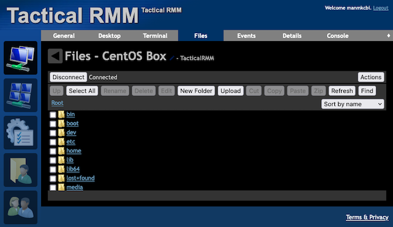

MeshCentral offers an open-source solution for remote monitoring and management. Through MeshCentral's web interface, you can work with devices remotely with features like remote desktop, shell, and file browser.

Find out more in this tutorial. Learn how to install your own MeshCentral server and how to start using it to remotely administer Windows and Linux machines.

## Before You Begin

1. If you have not already done so, create a Linode account and Compute Instance. See our [Getting Started with Linode](/docs/guides/getting-started/) and [Creating a Compute Instance](/docs/guides/creating-a-compute-instance/) guides.

1. Follow our [Setting Up and Securing a Compute Instance](/docs/guides/set-up-and-secure/) guide to update your system. You may also wish to set the timezone, configure your hostname, create a limited user account, and harden SSH access.


This guide is written for a non-root user. Commands that require elevated privileges are prefixed with `sudo`. If you’re not familiar with the `sudo` command, see the [Users and Groups](/docs/guides/linux-users-and-groups/) guide.


## What Is MeshCentral?

[MeshCentral](https://github.com/Ylianst/MeshCentral) is a remote monitoring and management (RMM) system. What is an RMM? An RMM provides remote access to client systems. This makes RMMs helpful for system administrators, technical support, and others.

MeshCentral operates out of a self-hosted web interface, making its features accessible and adaptable. Deploy a self-hosted MeshCentral server, and use your browser to connect to devices MeshCentral's a robust set of administration tools.

Specifically, MeshCentral gives access to remote desktop, shell, and file browsing on connected devices. And MeshCentral can additionally execute general actions on its connected computers, like wake ups, restarts, and shut downs.

What does an RMM like MeshCentral offer vs TeamViewer? TeamViewer is likewise an RMM, and similarly focuses on remote accessibility. But MeshCentral has the advantage of being open source. This makes MeshCentral free, more adaptable, and more in your control.

## How to Install MeshCentral

MeshCentral's web interface runs on a self-hosted server instance, which also manages device connections. So before getting started using MeshCentral to monitor and manage your remote systems, you need to have a server to run it on.

Below you can see two main paths for setting up your own MeshCentral server. By the end of either approach, you should have a fully-operational MeshCentral instance, accessible through you browser, with an administrator user configured.

### To Use with Tactical RMM

Tactical RMM provides remote monitoring and management similar to MeshCentral. Tactical sets itself apart from MeshCentral, however, in its additional handling of features like automated alerts and bulk remote commands/scripts.

At the same time as adding such features, a Tactical RMM installation includes its own installation of MeshCentral. Tactical leverages MeshCentral's real-time remote features, and at the same time gives full access to its included MeshCentral instance.

For this reason, one of the best options for installing MeshCentral is actually installing Tactical RMM. You get MeshCentral alongside the wider RMM features of Tactical.

To install Tactical RMM, and learn more generally about it, refer to our guide [How to Install Tactical RMM](/docs/guides/installing-tactical-rmm/). For more on using MeshCentral and Tactical RMM alongside each other, see our guide [How to Integrate Tactical RMM with MeshCentral](/docs/guides/integrating-tactical-rmm-with-meshcentral/).

#### Accessing MeshCentral with Tactical RMM

Tactical RMM installations typically run MeshCentral on a `mesh` subdomain. So, if the base domain for your Tactical server is `example.com`, you would find your MeshCentral instance at `https://mesh.example.com`.

The Tactical installation script automatically deploys both Tactical and MeshCentral with a reverse proxy and SSL certificate. Doing so saves you the trouble of manually configuring these features and makes both services easier to access from the start.

To access the MeshCentral interface, navigate to your Tactical server's MeshCentral address in a web browser. Then, use the credentials given at the end of the Tactical installation script to log in.


After logging in, you should be directed to the MeshCentral dashboard. Any devices you have configured with agents in Tactical RMM should also appear on the MeshCentral dashboard, providing ready access to those machines.

[](meshcentral-tactical-dashboard.png)

### To Use Independently

You may just want the MeshCentral features, or you may want to keep MeshCentral and Tactical RMM separate for greater control. For those and similar cases, MeshCentral can also be installed without Tactical RMM.

MeshCentral is built on Node.js, and you can install it using the Node Package Manager. The steps below show you how to create a new NPM project for MeshCentral and how to run the server from there.

#### Setting Up the Project

1.  Install Node.js. You can do so using the Node Version Manager (NVM). Follow the steps in our guide [Installing and Using NVM](/docs/guides/how-to-install-use-node-version-manager-nvm/) to install NVM and then use NVM to install Node.js.

1.  Create a directory for the MeshCentral project, and change into that directory.

    ```command
    mkdir ~/meshcentral/
    cd ~/meshcentral/
    ```

1.  Install MeshCentral to the project directory using NPM.

    ```command
    npm install meshcentral
    ```

#### Running MeshCentral

1.  Run the MeshCentral module to start up a MeshCentral server. A script runs to set up prerequisites, and afterward the output should indicate that the server is running.

    For this example, the port is designated as `8080`. You can choose another port, but specifying one is helpful for consistency.

    ```command
    node node_modules/meshcentral --port 8080
    ```

    ```output
    [...]
    Server has no users, next new account will be site administrator.
    MeshCentral HTTPS server running on port 8080.
    ```

1.  Navigate to the MeshCentral interface in a web browser. Following the example above, you would navigate to `https://localhost:8080`.

    To navigate to the interface remotely at this stage, you can use an SSH tunnel. Find steps for doing so in our guide on [accessing Futon over SSH](/docs/guides/access-futon-over-ssh-using-putty-on-windows/#establish-an-ssh-connection). Replace the port number in that guide (`5984`) with your MeshCentral port number — `8080` in the example above.

    
    Your browser may give you a warning message when visiting the MeshCentral instance. At this stage, the instance is using self-signed SSL certificates. You need to bypass the warning in order to access the instance.

    The next section gives you some options for subsequently setting up your MeshCentral instance for wider accessibility, including properly signed SSL certificates.
    

1.  From the login page, choose the **Create Account** option, and enter credentials for a new administrator user.

    

1.  You should be directed to the MeshCentral dashboard.

    [](meshcentral-dashboard.png)

#### Completing the MeshCentral Server

The above installation process starts running a MeshCentral server. However, the server is relatively difficult to access remotely, and it uses self-signed certificates that cause browser warnings.

To remedy these issues, you can set up a reverse proxy to the MeshCentral server, and configure that proxy with signed SSL certificates.

NGINX is a frequently-used solution for setting up a reverse proxy server. Alongside that, Certbot provides a relatively easy way to obtain SSL certificates signed by Let's Encrypt.

Our guide [Use NGINX as a Reverse Proxy](/docs/guides/use-nginx-reverse-proxy/) covers a full process for setting up a reverse proxy and deploying Let's Encrypt certificates.

The guide builds the reverse proxy around a simple Node.js application, and the setup should be easily adaptable to MeshCentral. Just replace the application's port `3000` with your MeshCentral port (`8080` in the preceding example).

## How to Use MeshCentral

With your MeshCentral server running, you are now in a position to start using it for remotely monitoring and managing some systems. The next step in accomplishing that goal is deploying MeshCentral agents on remote devices, which you can see the steps for just below.

Once you have your agents deployed, keep following along to get an overview of how MeshCentral gives you access to connected devices. Being familiar with MeshCentral's features can help you get started using it effectively for monitoring and managing your remote systems.

### Deploying an Agent

A MeshCentral agent needs to be installed on each device you intend to connect to using MeshCentral. The agent essentially facilitates the connection, running the necessary processes on the connected machine.

1.  On the target device, navigate to your MeshCentral URL. With the Tactical RMM example, that URL would be `https://mesh.example.com`. With an independent MeshCentral installation, the default is a localhost instance, using SSH tunneling as discussed above.

1.  Login using your MeshCentral credentials.

1.  Select the **Add Agent** option from the MeshCentral dashboard.

1.  Complete the form, selecting your operating system type and the kind of agent installation you want. Then, download and run the installation executable.

    
    

    

    1.  Download the executable that matches your system's CPU, then run that executable.

    1.  Complete the setup prompts to install and then connect your agent.

    1.  Close out the installation interface once you have connected the agent.

    
    Windows may require you to verify that you want to run the executable. Select *More Info*, and select the **Run Anyway** option.
    

    
    

    

    1.  Choose the Linux **Binary Installation** option, and download the binary.

    1.  Open a terminal, change into the directory with the binary, and run the commands here. These give the binary executable permission and then run the installation process.

        ```command
        chmod +x meshagent
        sudo ./meshagent -install
        ```

    
    MeshCentral requires Xorg, rather than Wayland, for the GNOME desktop server. Open the `/etc/gdm/custom.conf` file, and uncomment the `WaylandEnable=false` line to make the change if necessary.
    

    
    

1.  Review the MeshCentral dashboard again, and you should instantly see the new device listed.

    [](meshcentral-tactical-dashboard-new.png)

### Accessing a Device

Selecting a device from the MeshCentral dashboard takes you to a summary page, providing information about the device and its connection. The page also gives you access to a range of options for interacting with the device.

To start, the **Actions** button provides you with basic functions like *Wake Up*, *Power Off*, and even *Uninstall Agent*.

From there, the range of MeshCentral remote functions become available from the tabs at the top of the page. Each of the first several of these tabs corresponds to a different kind of remote connection.

Below you can see a summary of each. Within each tab, select the **Connect** option to start the remote connection, and afterward the **Disconnect** option to end the connection.

- **Desktop**. Gives you access to a remote desktop on the device.

    

- **Terminal**. Starts a terminal as the root user on the remote device.

    [](meshcentral-tactical-shell.png)

- **Files**. Accesses the remote file system to browse the files.

    [](meshcentral-tactical-files.png)

## Conclusion

MeshCentral provides a powerful open-source tool for real-time remote monitoring and management. Whether for system administrators, technical support, or otherwise, these features can bring significant efficiency.

For even more remote monitoring and management features, be sure to look at our related guides: [How to Install Tactical RMM](/docs/guides/installing-tactical-rmm/) and [How to Integrate Tactical RMM with MeshCentral](/docs/guides/integrating-tactical-rmm-with-meshcentral/).
