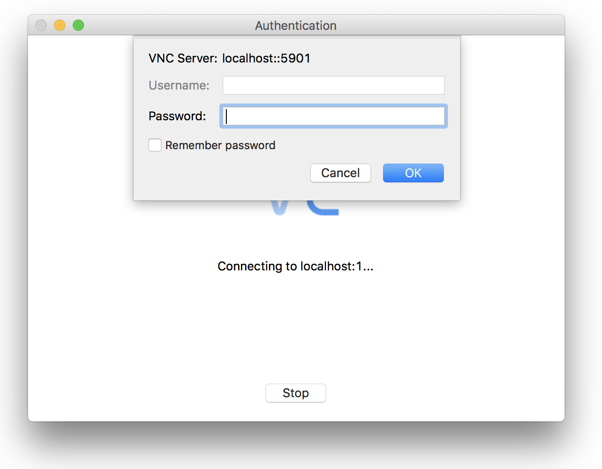
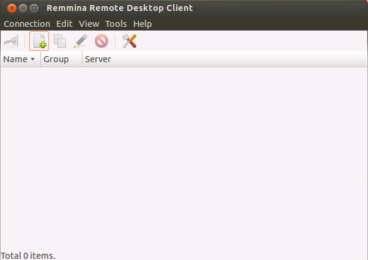

*Virtual network computing*, or VNC, is a graphical desktop sharing system that allows you to control one computer remotely from another. A VNC server transfers keyboard and mouse events, and displays the remote host's screen via a network connection, which allows you to operate a full desktop environment on your Linode.

This guide explains how to install a graphic desktop environment on your Linode running Ubuntu 18.04 and how to connect to it from your local computer using VNC.

## Before You Begin

1.  Familiarize yourself with our [Getting Started](/docs/getting-started/) guide and complete the steps for setting your Linode's hostname and timezone.

2.  Complete the sections of our [Securing Your Server](/docs/security/securing-your-server/) guide to create a standard user account, harden SSH access and remove unnecessary network services.

3.  Update your system.

        sudo apt-get update && sudo apt-get upgrade


This guide is written for a non-root user. Commands that require elevated privileges are prefixed with `sudo`. If you’re not familiar with the `sudo` command, you can check our [Users and Groups](/docs/tools-reference/linux-users-and-groups/) guide.


## Install a Desktop and VNC Server on your Linode

1.  Ubuntu has several desktop environments available in its repositories. The following command installs the default desktop, [Unity](https://unity.ubuntu.com/), as well as the dependencies that are required for the graphical interface to work properly:

        sudo apt-get install ubuntu-desktop gnome-panel gnome-settings-daemon metacity nautilus gnome-terminal

    
This will install the full Ubuntu desktop environment, including office and web browsing tools. To install the desktop without these packages, run:

    sudo apt-get install --no-install-recommends ubuntu-desktop gnome-panel gnome-settings-daemon metacity nautilus gnome-terminal


    During the install process, you will be asked whether or not to change a system file to the new version:

        Configuration file '/etc/init/tty1.conf'
         ==> File on system created by you or by a script.
         ==> File also in package provided by package maintainer.
           What would you like to do about it ?  Your options are:
            Y or I  : install the package maintainer's version
            N or O  : keep your currently-installed version
              D     : show the differences between the versions
              Z     : start a shell to examine the situation
         The default action is to keep your current version.
        *** tty1.conf (Y/I/N/O/D/Z) [default=N] ?

    Type **y** then **enter** to use the updated version.

2.  Install the VNC server:

        sudo apt-get 4server

## Secure your VNC connection

The VNC server generates a *display*, or graphical output, identified by a number that is defined when the server starts. If no display number is defined, the server will use the lowest one available. VNC connections take place on port `5900 + display`. This guide will use a display number of 1; therefore, you will connect to remote port 5901.

The default VNC connection is unencrypted. In order to secure your passwords and data, you will need to tunnel the traffic through an SSH connection to a local port. You can use the same local port for consistency.

### Mac OS X and Linux

1.  From your desktop, connect to your Linode with the following command. Be sure to replace `user@example.com` with your username and your Linode's hostname or IP address:

        ssh -L 5901:127.0.0.1:5901 user@example.com

2.  From your Linode, launch the VNC server to test your connection. You will be prompted to set a password:

        vncserver :1

3.  Initiate your connection as per the steps in the [Connect to VNC from your Desktop](#connect-to-vnc-from-your-desktop) section.

### Windows

1.  Open [PuTTY](/docs/networking/using-putty/) and navigate to `Tunnels` under the `SSH` section in the menu. Add a new forwarded port as shown below, replacing `example.com` with your Linode's IP address or hostname:

    

2.  Click **Add**, then return to the 'Session' screen. Enter your Linode's hostname or IP address and a title for your session. Click save to save your settings for future use, and then click open to initiate your SSH tunnel.

3.  Launch the VNC server to test your connection. You will be prompted to set a password:

        vncserver :1

4.  Initiate your connection as per the steps in the [Connect to VNC from your Desktop](#connect-to-vnc-from-your-desktop) section.

## Connect to VNC from your Desktop

In this section, you will use a VNC client, or *viewer*, to connect to the remote server. A viewer is the  software that draws the graphical display generated by the server and creates the output on your local computer.

### Mac OS X and Windows

While there are many options for OS X and Windows, this guide will use [RealVNC Viewer](http://www.realvnc.com/download/viewer/).

1.  After installing and opening the viewer, connect to the localhost through your VNC client. The format is `localhost:#`, where `#` is the display number we used in the [Secure your VNC connection](#secure-your-vnc-connection) section:

    

2.  You will be warned that the connection is unencrypted, but if you have followed the steps above for securing your VNC connection, your session will be securely tunneled to your Linode. To proceed, press **Continue**.

    

3.  You will be prompted to enter the password you specified when first launching the VNC Server. See [Secure your VNC Connection](#secure-your-vnc-connection) if you have not yet started a VNC server on your Linode.

    

After connecting, you will see a blank gray screen since the desktop processes have not yet been started. In the next section we will configure your Linode to launch a full desktop.

### Linux

There are a variety of VNC clients available for Ubuntu desktops. You can find the list [here](https://help.ubuntu.com/community/VNC/Clients). This guide will use Remmina, which is installed by default.

1.  Open Remmina.

    

2.  Click the button to `Create a new remote desktop profile`. Name your profile, specify the VNC protocol, and enter `localhost:1` in the server field. The `:1` in the server field corresponds to the display number. In the password section fill in the password you specified in [Secure your VNC Connection](#secure-your-vnc-connection):

    

3.  Press **Connect**.

You'll see a blank gray screen since the desktop processes have not yet started. In the next section, we will configure your Linode to launch a full desktop.

## Configure VNC for a Full Desktop

This section will configure VNC to launch the full Unity desktop when it starts.

1.  Once you've successfully connected, exit the connection. Close the VNC server:

        vncserver -kill :1

2.  Edit the end of your `~/.vnc/xstartup` file to match the following configuration. This starts the desktop dependencies as background processes upon starting the VNC server:

    
#!/bin/sh

# Uncomment the following two lines for normal desktop:
# unset SESSION_MANAGER
# exec /etc/X11/xinit/xinitrc

[ -x /etc/vnc/xstartup ] && exec /etc/vnc/xstartup
[ -r $HOME/.Xresources ] && xrdb $HOME/.Xresources
xsetroot -solid grey
vncconfig -iconic &
x-terminal-emulator -geometry 80x24+10+10 -ls -title "$VNCDESKTOP Desktop" &
x-window-manager &

gnome-panel &
gnome-settings-daemon &
metacity &
nautilus &



3.  Save and exit the file. Begin another VNC session:

        vncserver :1

4.  Connect from your local VNC client using the same steps from the [previous section](#connect-to-vnc-from-your-desktop). You should now see the full Ubuntu Desktop:

    

## How To Install VNC Server On Ubuntu 18.04 With Unity

To make VNC work with full Ubuntu Unity Desktop, you can run the following command:

        sudo apt-get install lightdm synaptic

Synaptic is a package manager from APT and pretty much has the same functionalities as apt-get.

## Starting VNC Server on Boot

This section is optional. Follow these steps to configure the VNC server to start automatically after reboot.

1.  Open your crontab. If you've never edited it before, you may be prompted to choose a text editor:

        crontab -e
        no crontab for user - using an empty one

        Select an editor.  To change later, run 'select-editor'.
          1. /bin/ed
          2. /bin/nano        <---- easiest
          3. /usr/bin/vim.basic
          4. /usr/bin/vim.tiny

        Choose 1-4 [2]:

2.  Add `@reboot /usr/bin/vncserver :1` to the bottom of the file. Your crontab should look like this:

    
# Edit this file to introduce tasks to be run by cron.
#
# Each task to run has to be defined through a single line
# indicating with different fields when the task will be run
# and what command to run for the task
#
# To define the time you can provide concrete values for
# minute (m), hour (h), day of month (dom), month (mon),
# and day of week (dow) or use '*' in these fields (for 'any').
#
# Notice that tasks will be started based on the cron's system
# daemon's notion of time and timezones.
#
# Output of the crontab jobs (including errors) is sent through
# email to the user the crontab file belongs to (unless redirected).
#
# For example, you can run a backup of all your user accounts
# at 5 a.m every week with:
# 0 5 * * 1 tar -zcf /var/backups/home.tgz /home/
#
# For more information see the manual pages of crontab(5) and cron(8)
#
# m h dom mon dow command

@reboot /usr/bin/vncserver :1



3.  Save and exit the file. You can test by rebooting your Linode and connecting to the VNC server.

## How To Install VNC Server With Gnome Display On Ubuntu 18.04?

To install a VNC server with Gnome display on Ubuntu 18.04 we first need to install Gnome.

### Installing Gnome on Ubuntu 18.04

To install Gnome desktop to work with our VNC server, we need to run the following command:

        sudo apt install ubuntu-gnome-desktop

Once the installation is complete and you see a confirmation message, check that your Gnome desktop is properly running. To do so, we can run `start gdm` and then `enable gdm` commands as shown below:

        sudo systemctl start gdm
        sudo systemctl enable gdm

If everything works as intended, we can create a configuration to work as our startup script whenever our VNC server is instantiated. To do so go to your xstartup configuration file by running the following command:

        sudo nano ~/.vnc/xstartup

And add the following lines to your configuration file for gnome desktop

#!/bin/sh
[ -x /etc/vnc/xstartup ] && exec /etc/vnc/xstartup
[ -r $HOME/.Xresources ] && xrdb $HOME/.Xresources
vncconfig -iconic &
dbus-launch --exit-with-session gnome-session &


We can now launch our VNC server using the command:

        vncserver -1 no -geometry 800x600

This launches a session of 800x600 resolution. But to simplify the process that starts VNC server, we can write a `.service` file under our `/etc/systemd/system` directory as well. Let's create a `.service` file called `vnc_server_handling.service`. To create this .service file, run the following command:

        sudo nano /etc/systemd/system/vnc_server_handling@.service

Now, edit your vnc_server_handling@.service file and add the following parameters in it:

[Unit]
Description=VNC Server Handling .service file
After=syslog.target network.target

[Service]
Type=forking
User=away

# Remove files that exist in the /tmp/ directory
ExecStartPre=/usr/bin/vncserver -kill :%i > /dev/null 2>&1 || :
ExecStart=/usr/bin/vncserver -geometry 800x600 -1
ExecStop=/usr/bin/vncserver -kill :%i

[Install]
WantedBy=multi-user.target


To apply our new settings, we need to do two things:
1. Stop all VNC related sessions on your system
2. Restart your VNC server to load new settings

To kill all VNC sessions active on your system run the following command:

        vncserver -kill :*

To enable our new settings, run the following command:

        sudo systemctl enable vnc_server_handling@1

Now, start VNC server with new configuration:

        sudo systemctl start vnc_server_handling@1

In the last two commands, notice the `1`. This `1` followed by `@` helps in mapping which display number this service should appear with.

Whereas, the `@` symbol at the end of our `vnc_server_handling` allows us to pass an argument to use with our service configuration.

### Checking status of VNC services

To ensure that our VNC setup is working as intended after running `sudo systemctl start vnc_server_handling@1` we can run the following command:

        sudo systemctl status vnc_server_handling@1

If our new service worked perfectly, you should see the following output on your terminal:

● vnc_server_handling@1 - Start VNC server at startup
    Loaded: loaded (/etc/systemd/system/vnc_server_handling@.service; indirect; vendor preset: enabled)
    Active: active (running) since Mon 2018-07-09 18:13:53 UTC; 2min 14s ago
  Process: 22322 ExecStart=/usr/bin/vncserver -depth 24 -geometry 800x640 :1 (code=exited, status=0/SUCCESS)
  Process: 22316 ExecStartPre=/usr/bin/vncserver -kill :1 > /dev/null 2>&1 (code=exited, status=0/SUCCESS)
 Main PID: 22330 (Xtightvnc)


Our VNC server with Gnome display is now enabled on Ubuntu 18.04.

## How To Solve The VNC Ubuntu 18.04 Grey Screen?
This is one of the most commonly noticed errors we see with VNC servers on Ubuntu 18.04. To solve this issue, the first thing you should check on is system dependencies. If your dependencies are not running properly that can trigger a grey screen with your VNC setup.

If dependencies are running properly the next space for us to diagnose is your system itself. It’s common for your `xstartup` files to get modified and configured in the wrong way. Go to your ~/.vnc/xstartup and make sure that everything is set properly with the right parameters. You can also use our xstartup configuration from the sections above as a reference.

If you are still finding it hard to figure out the underlying issue, consider opening up a thread on [our community](/community/).
