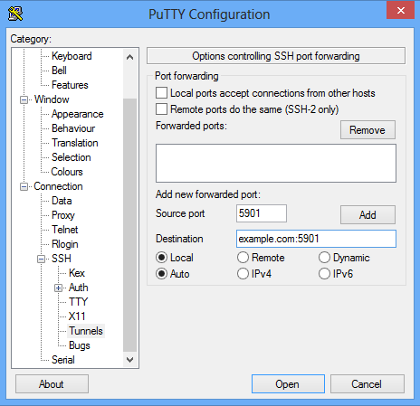
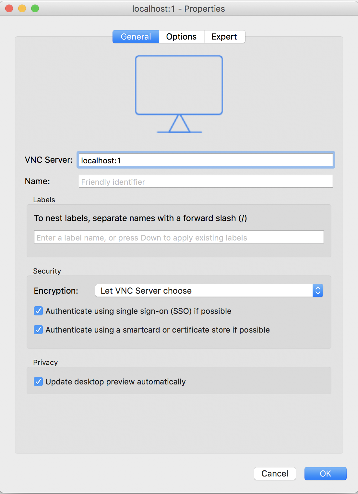
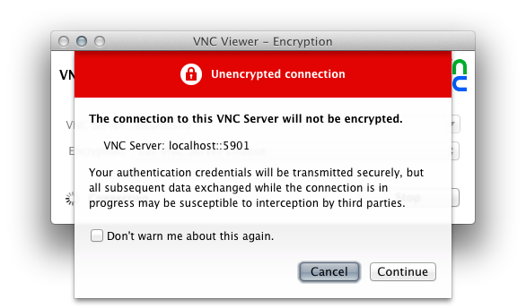
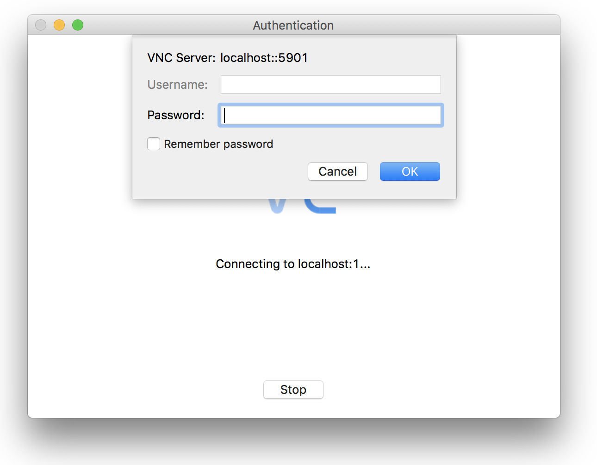
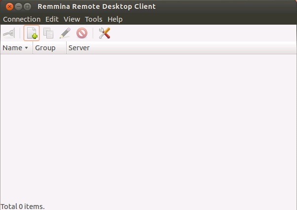
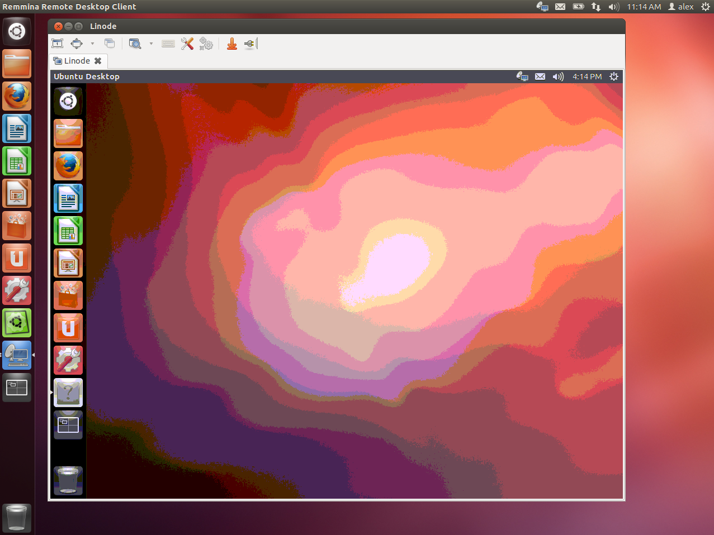

*Virtual network computing*, or VNC, is a graphical desktop sharing system that allows you to control one computer remotely from another. A VNC server transfers keyboard and mouse events, and displays the remote host's screen via a network connection, which allows you to operate a full desktop environment on your Linode.

This guide explains how to install a graphic desktop environment on your Linode running Ubuntu 20.04 and how to connect to it from your local computer using VNC.

## Before You Begin

1.  If you have not already done so, create a Linode account and Compute Instance. See our [Getting Started with Linode](/docs/products/platform/get-started/) and [Creating a Compute Instance](/docs/products/compute/compute-instances/guides/create/) guides.

1.  Follow our [Setting Up and Securing a Compute Instance](/docs/products/compute/compute-instances/guides/set-up-and-secure/) guide to update your system. You may also wish to set the timezone, configure your hostname, create a limited user account, and harden SSH access.


This guide is written for a non-root user. Commands that require elevated privileges are prefixed with `sudo`. If you’re not familiar with the `sudo` command, you can check our [Users and Groups](/docs/guides/linux-users-and-groups/) guide.


## Install a Desktop and VNC Server on your Linode

1.  Ubuntu has several desktop environments available in its repositories. The following command installs the default desktop, [Unity](https://unity.ubuntu.com/), as well as the dependencies that are required for the graphical interface to work properly:

    ```command
    sudo apt install ubuntu-desktop gnome-panel gnome-settings-daemon metacity nautilus gnome-terminal
    ```

    
    This will install the full Ubuntu desktop environment, including office and web browsing tools. To install the desktop without these packages, run:

    ```command
    sudo apt install --no-install-recommends ubuntu-desktop gnome-panel gnome-settings-daemon metacity nautilus gnome-terminal
    ```
    

    During the install process, reply with the defaults to any prompts.

1.  Install the VNC server:

    ```command
    sudo apt install tigervnc-standalone-server
    ```

## Secure your VNC connection

The VNC server generates a *display*, or graphical output, identified by a number that is defined when the server starts. If no display number is defined, the server will use the lowest one available. VNC connections take place on port `5900 + display`. This guide will use a display number of 1; therefore, you will connect to remote port 5901.

The default VNC connection is unencrypted. In order to secure your passwords and data, you will need to tunnel the traffic through an SSH connection to a local port. You can use the same local port for consistency.

### Mac OS X and Linux

1.  From your desktop, connect to your Linode with the following command. Be sure to replace `user@example.com` with your username and your Linode's hostname or IP address:

    ```command
    ssh -L 5901:127.0.0.1:5901 user@example.com
    ```

1.  From your Linode, launch the VNC server to test your connection. You will be prompted to set a password:

    ```command
    vncserver :1
    ```

1.  Initiate your connection as per the steps in the [Connect to VNC from your Desktop](#connect-to-vnc-from-your-desktop) section.

### Windows

1.  Open [PuTTY](/docs/guides/connect-to-server-over-ssh-using-putty/) and navigate to `Tunnels` under the `SSH` section in the menu. Add a new forwarded port as shown below, replacing `example.com` with your Linode's IP address or hostname:

    

1.  Click **Add**, then return to the 'Session' screen. Enter your Linode's hostname or IP address and a title for your session. Click save to save your settings for future use, and then click open to initiate your SSH tunnel.

1.  Launch the VNC server to test your connection. You will be prompted to set a password:

    ```command
    vncserver :1
    ```

1.  Initiate your connection as per the steps in the [Connect to VNC from your Desktop](#connect-to-vnc-from-your-desktop) section.

## Connect to VNC from your Desktop

In this section, you will use a VNC client, or *viewer*, to connect to the remote server. A viewer is the  software that draws the graphical display generated by the server and creates the output on your local computer.

### Mac OS X and Windows

While there are many options for OS X and Windows, this guide will use [RealVNC Viewer](http://www.realvnc.com/download/viewer/).

1.  After installing and opening the viewer, connect to the localhost through your VNC client. The format is `localhost:#`, where `#` is the display number we used in the [Secure your VNC connection](#secure-your-vnc-connection) section:

    

1.  You will be warned that the connection is unencrypted, but if you have followed the steps above for securing your VNC connection, your session will be securely tunneled to your Linode. To proceed, press **Continue**.

    

1.  You will be prompted to enter the password you specified when first launching the VNC Server. See [Secure your VNC Connection](#secure-your-vnc-connection) if you have not yet started a VNC server on your Linode.

    

After connecting, you will see a blank gray screen since the desktop processes have not yet been started. In the next section we will configure your Linode to launch a full desktop.

### Linux

There are a variety of VNC clients available for Ubuntu desktops. You can find the list [here](https://help.ubuntu.com/community/VNC/Clients). This guide will use Remmina, which is installed by default.

1.  Open Remmina.

    

1.  Click the button to `Create a new remote desktop profile`. Name your profile, specify the VNC protocol, and enter `localhost:1` in the server field. The `:1` in the server field corresponds to the display number. In the password section fill in the password you specified in [Secure your VNC Connection](#secure-your-vnc-connection):

    

1.  Press **Connect**.

You'll see a blank gray screen since the desktop processes have not yet started. In the next section, we will configure your Linode to launch a full desktop.

## Configure VNC for a Full Desktop

This section will configure VNC to launch the full Unity desktop when it starts.

1.  After you've successfully connected, exit the connection. Close the VNC server:

    ```command
    vncserver -kill :1
    ```

1.  Create a new file `~/.vnc/xstartup`:

    ```command
    sudo nano ~/.vnc/xstartup
    ```

1.  Add the following configuration. This starts the desktop dependencies as background processes upon starting the VNC server:

    ```file {title="~/.vnc/xstartup"}
    #!/bin/sh

    # Uncomment the following two lines for normal desktop:
    # unset SESSION_MANAGER
    # exec /etc/X11/xinit/xinitrc

    [ -x /etc/vnc/xstartup ] && exec /etc/vnc/xstartup
    [ -r $HOME/.Xresources ] && xrdb $HOME/.Xresources
    xsetroot -solid grey
    vncconfig -iconic &
    x-terminal-emulator -geometry 80x24+10+10 -ls -title "$VNCDESKTOP Desktop" &
    x-window-manager &

    gnome-panel &
    gnome-settings-daemon &
    metacity &
    nautilus &
    ```

1.  Save and exit the file.

1.  Make the file executable:

    ```command
    sudo chmod +x ~/.vnc/xstartup
    ```

1.  Begin another VNC session:

    ```command
    vncserver :1
    ```

1.  Connect from your local VNC client using the same steps from the [previous section](#connect-to-vnc-from-your-desktop). You should now see the full Ubuntu Desktop:

    

## Starting VNC Server on Boot

This section is optional. Follow these steps to configure the VNC server to start automatically after reboot.

1.  Open your crontab. If you've never edited it before, you may be prompted to choose a text editor:

    ```command
    crontab -e
    ```

    ```output
    no crontab for user - using an empty one

    Select an editor.  To change later, run 'select-editor'.
      1. /bin/ed
      2. /bin/nano        <---- easiest
      3. /usr/bin/vim.basic
      4. /usr/bin/vim.tiny

    Choose 1-4 [2]:
    ```

1.  Add `@reboot /usr/bin/vncserver :1` to the bottom of the file. Your crontab should look like this:

    ```file {title="crontab"}
    # Edit this file to introduce tasks to be run by cron.
    #
    # Each task to run has to be defined through a single line
    # indicating with different fields when the task will be run
    # and what command to run for the task
    #
    # To define the time you can provide concrete values for
    # minute (m), hour (h), day of month (dom), month (mon),
    # and day of week (dow) or use '*' in these fields (for 'any').
    #
    # Notice that tasks will be started based on the cron's system
    # daemon's notion of time and timezones.
    #
    # Output of the crontab jobs (including errors) is sent through
    # email to the user the crontab file belongs to (unless redirected).
    #
    # For example, you can run a backup of all your user accounts
    # at 5 a.m every week with:
    # 0 5 * * 1 tar -zcf /var/backups/home.tgz /home/
    #
    # For more information see the manual pages of crontab(5) and cron(8)
    #
    # m h dom mon dow command

    @reboot /usr/bin/vncserver :1
    ```

1.  Save and exit the file. You can test by rebooting your Linode and connecting to the VNC server. To connect securely to the VNC server see the [secure](#secure-your-vnc-connection) and [connect](#connect-to-vnc-from-your-desktop) sections.