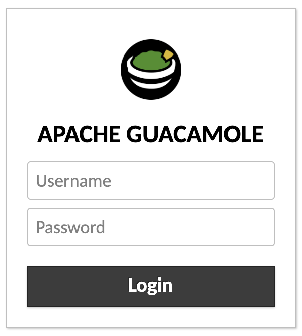
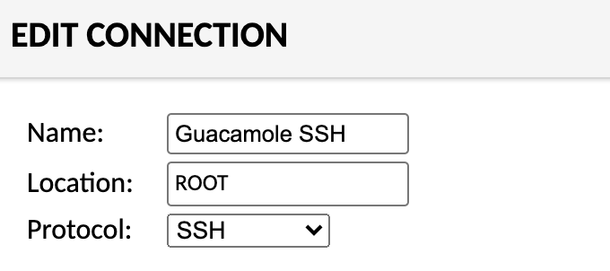
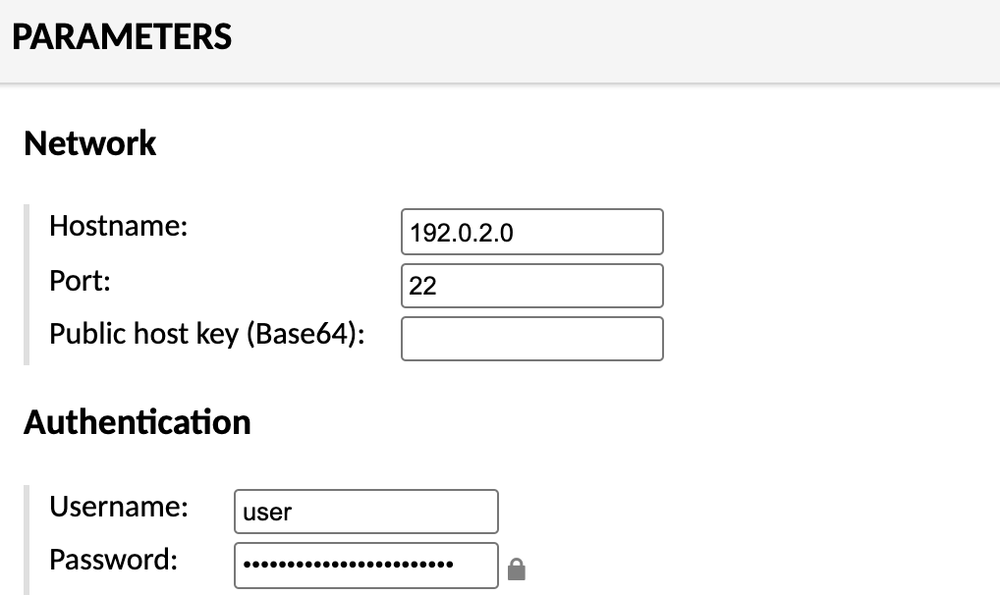

## Before You Begin

1.  If you have not already done so, create a Linode account and Compute Instance. See our [Getting Started with Linode](/docs/products/platform/get-started/) and [Creating a Compute Instance](/docs/products/compute/compute-instances/guides/create/) guides.

1.  Follow our [Setting Up and Securing a Compute Instance](/docs/products/compute/compute-instances/guides/set-up-and-secure/) guide to update your system. You may also wish to set the timezone, configure your hostname, create a limited user account, and harden SSH access.


This guide is written for a non-root user. Commands that require elevated privileges are prefixed with `sudo`. If you’re not familiar with the `sudo` command, you can check our [Users and Groups](/docs/guides/linux-users-and-groups/) guide.


## Install Guacamole Server

1.  Log in to the Compute Instance over [SSH](/docs/guides/connect-to-server-over-ssh/) or [Lish](/docs/products/compute/compute-instances/guides/lish/).

1.  Install all required dependencies. For Debian users, replace `libjpeg-turbo8-dev` with `libjpeg62-turbo-dev`.

        sudo apt install build-essential libcairo2-dev libjpeg-turbo8-dev \
            libpng-dev libtool-bin libossp-uuid-dev libvncserver-dev \
            freerdp2-dev libssh2-1-dev libtelnet-dev libwebsockets-dev \
            libpulse-dev libvorbis-dev libwebp-dev libssl-dev \
            libpango1.0-dev libswscale-dev libavcodec-dev libavutil-dev \
            libavformat-dev

1.  Download the Guacamole source code

        wget https://downloads.apache.org/guacamole/1.3.0/source/guacamole-server-1.3.0.tar.gz

1.  Extract the file and navigate to its directory.

        tar -xvf guacamole-server-1.3.0.tar.gz
        cd guacamole-server-1.3.0

1.  Build the Guacamole Server using the downloaded source files.

        sudo ./configure --with-init-dir=/etc/init.d --enable-allow-freerdp-snapshots
        sudo make
        sudo make install

1.  Update installed library cache and reload systemd

        sudo ldconfig
        sudo systemctl daemon-reload

1.  Start guacd

        sudo systemctl start guacd
        sudo systemctl enable guacd

1.  Create a directory to store Guacamole configuration files and extensions. These directories are used in later steps.

        sudo mkdir -p /etc/guacamole/{extensions,lib}

## Install Guacamole Web App

1.  Install Apache Tomcat

        sudo apt install tomcat9 tomcat9-admin tomcat9-common tomcat9-user

1.  Download the Guacamole Client

        wget https://downloads.apache.org/guacamole/1.3.0/binary/guacamole-1.3.0.war

1.  Move the client to the Tomcat web directory.

        sudo mv guacamole-1.3.0.war /var/lib/tomcat9/webapps/guacamole.war

1.  Restart both Apache Tomcat and Guacd.

        sudo systemctl restart tomcat9 guacd

## Setting up Database Authentication

While Apache Guacamole does support basic user authentication via a `user-mapping.xml` file, it should only be used for testing. For this guide, we will use production-ready database authentication through MySQL/MariaDB.

1.  Install either MySQL or MariaDB on your system.

        sudo apt install mariadb-server

1.  Run the following command to perform the initial security configuration:

        sudo mysql_secure_installation

1.  Before populating the database, install the MySQL Connector/J library and Guacamole JDBC authenticator plugin.

    1.  Download the [MySQL Connector/J](https://dev.mysql.com/downloads/connector/j/) (Java Connector). For this guide, download the platform independent archived file.

            wget https://dev.mysql.com/get/Downloads/Connector-J/mysql-connector-java-8.0.26.tar.gz

    1.  Extract the tar file and copy it to `/etc/guacamole/lib/`.

            tar -xf mysql-connector-java-8.0.26.tar.gz
            sudo cp mysql-connector-java-8.0.26/mysql-connector-java-8.0.26.jar /etc/guacamole/lib/

    1.  Download the JDBC auth plugin for Apache Guacamole. This file can be found on http://guacamole.apache.org/releases/ by selecting the release version and then locate the "jdbc" file.

            wget https://downloads.apache.org/guacamole/1.3.0/binary/guacamole-auth-jdbc-1.3.0.tar.gz

    1.  Extract the tar file and copy it to `/etc/guacamole/extensions/`.

            tar -xf guacamole-auth-jdbc-1.3.0.tar.gz
            sudo mv guacamole-auth-jdbc-1.3.0/mysql/guacamole-auth-jdbc-mysql-1.3.0.jar /etc/guacamole/extensions/

1.  Log in to mysql as the root user.

        mysql -u root -p

    The prompt should change again to `mysql>`.

1.  While in the mysql prompt, change the root password, create a database, and create a new user for that database. When running the below commands, replace any instance of *password* with a secure password string for the mysql root user and the new user for your database, respectively.

        ALTER USER 'root'@'localhost' IDENTIFIED BY 'password';
        CREATE DATABASE guacamole_db;
        CREATE USER 'guacamole_user'@'localhost' IDENTIFIED BY 'password';
        GRANT SELECT,INSERT,UPDATE,DELETE ON guacamole_db.* TO 'guacamole_user'@'localhost';
        FLUSH PRIVILEGES;

1.  Exit the MySQL prompt by typing `quit`.

1.  Locate the scheme files in the extracted directory for the JDBC plugin.

        cd guacamole-auth-jdbc-1.3.0/mysql/schema

1.  Import those sql schema files into the MySQL database.

        cat *.sql | mysql -u root -p guacamole_db

1.  Create the properties file for Guacamole.

        sudo nano /etc/guacamole/guacamole.properties

1.  Paste in the following configuration settings, replacing *[password]* with the password of the new `guacamole_user` that you created for the database.

        # MySQL properties
        mysql-hostname: 127.0.0.1
        mysql-port: 3306
        mysql-database: guacamole_db
        mysql-username: guacamole_user
        mysql-password: [password]

1.  Restart all related services.

        sudo systemctl restart tomcat9 guacd mysql

## Access Guacamole in a Browser

Apache Guacamole should now be accessible through a web browser.

1.  Open your preferred web browser on your local computer.

1.  Navigate to the URL: `[ip]:8080/guacamole`, replacing *[ip] with the IP address of your Linode. This will display the login prompt.

    

1.  Enter `guacadmin` as the username and `guacadmin` as the password. Then click **Login**.

## Create a New Admin User

Before continuing with configuring Guacamole, it's recommended that you create a new admin account and delete the original.

1.  Click the **guacadmin** user dropdown menu on the top right and select **Settings**.

1.  Navigate to the **Users** tab and click the **New User** button.

1.  Under the *Edit User* section, enter your preferred username and a secure password.

1.  Under the *Permissions* section, check all the permissions.

1.  Click **Save** to create the new user.

1.  Log out of the current user and log in as the newly created user.

1.  Click your username on the top left and select **Settings** from the dropdown menu.

1. Navigate to the **Users** tab and click the **guacadmin** user.

1. At the bottom of the **Edit User** screen, click **Delete** to remove the default user.

## Create an SSH Connection

To test Guacamole, let's create an new connection in Guacamole that opens up an SSH connection to the server.

1.  After logging in to Guacamole, click your username on the top left and select **Settings** from the dropdown menu.

1.  Navigate to the **Connections** tab and click **New Connection**.

1.  Under *Edit Connection*, enter a name for your new connection (such as "Guacamole SSH") and select *SSH* as the **Protocol**.

    

1.  Under *Parameters*, enter your IP address as the **Hostname**, *22* as the **Port**, your username as the **Username** and your user's password as the **Password**. Other parameters as available if you wish to edit the connection further.

    

1.  Click **Save** to create the new connection.

1.  Navigate back to your user's home screen by clicking your username on the top left and select **Home** from the dropdown menu.

1.  Click on the new connection under the **All Connections** list.

    

    This should open up a terminal in your browser and automatically log you in to the server with the settings that you specified.
