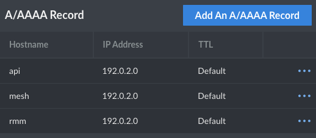
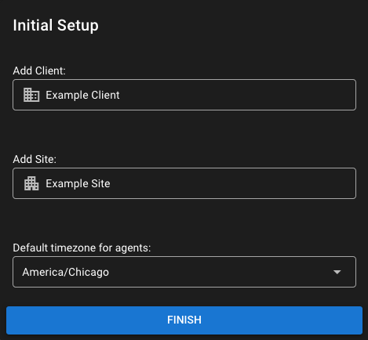
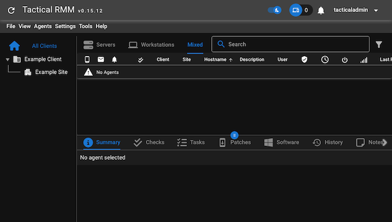
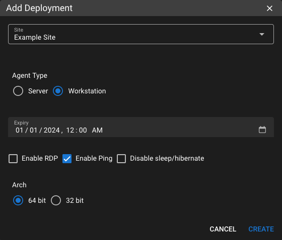
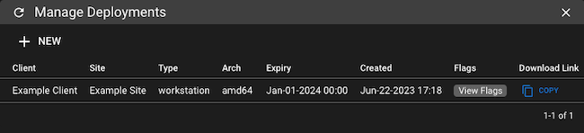
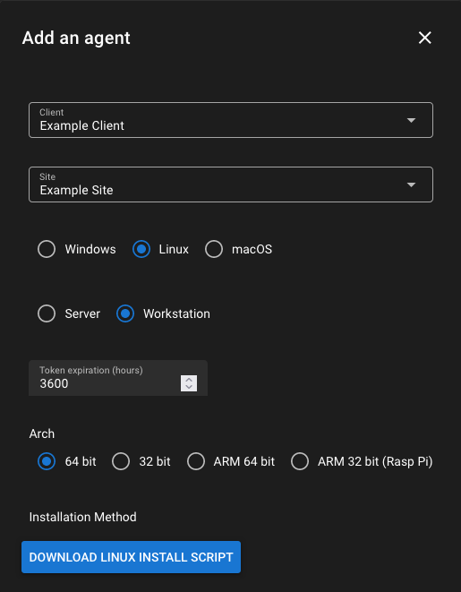
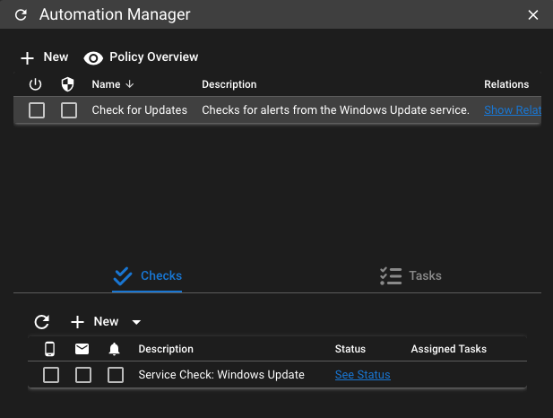
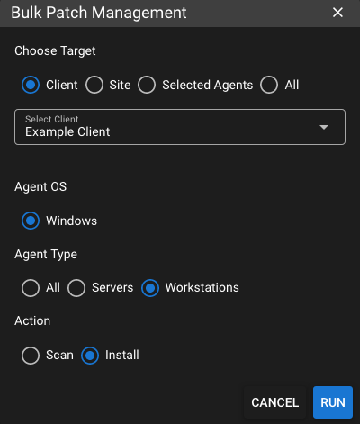

Tactical RMM offers an open-source solution for remote monitoring and management. Features like remote desktop, services management, remote scripting, event logging, and more make Tactical is a capable tool. And with a clear and modern web interface, working with Tactical is straightforward and efficient.

Learn more about Tactical RMM and its features in this tutorial. Follow along to install Tactical RMM on your own server, and see how to start deploying agents and get started monitoring and managing.

## Before You Begin

1.  If you have not already done so, create a Linode account and Compute Instance. See our [Getting Started with Linode](/docs/guides/getting-started/) and [Creating a Compute Instance](/docs/guides/creating-a-compute-instance/) guides.

    
    For this tutorial, you should have a fresh Linode Compute Instance, without additional software installed. The instance should be running Debian 11 or later or Ubuntu 20.04 or later. Additionally, the instance needs to have at least 4GB RAM.
    

1.  Follow our [Setting Up and Securing a Compute Instance](/docs/guides/set-up-and-secure/) guide to update your system. You may also wish to set the timezone, configure your hostname, create a limited user account, and harden SSH access.

1.  Have a domain name for your server. The tutorial covers how to create the necessary DNS records pointing that domain to your server, but you need to have secured the domain name already.

1.  Have a smartphone or another client device with an authenticator application such as [Google Authenticator](https://safety.google/authentication/) or [Authy](https://www.authy.com/). Many other options exist, and this guide should be compatible with nearly all of them.


This guide is written for a non-root user. Commands that require elevated privileges are prefixed with `sudo`. If you’re not familiar with the `sudo` command, see the [Users and Groups](/docs/guides/linux-users-and-groups/) guide.


## What Is Tactical RMM?

[Tactical RMM](https://github.com/amidaware/tacticalrmm) is an open-source remote monitoring and management (RMM) tool. Tactical uses a modern frontend interface built with Vue and Django, while its agents are written in Go for lightweight.

What is an RMM? An RMM provides remote access to client systems. Using an RMM, system administrators, technical support, and others can run remote desktops (like TeamViewer), remote file browsers, and even remote shells and scripts.

In this way, RMM tools like Tactical can make IT support and similar tasks significantly easier and more efficient. Tactical in particular brings in several additional features, like automated alerts, services management, and an event logger.

Tactical RMM also integrates with MeshCentral — and, in fact, the Tactical installation includes its own MeshCentral instance. You can learn more about that in our MeshCentral guide and our guide on integrating the two tools. Both of those are linked at the end of this tutorial.

For a full list of Tactical RMM's features, see the link above or the linked documentation at the end of this tutorial.

## How to Install Tactical RMM

Tactical RMM installs primarily as a server, running on a Debian or Ubuntu system. The Tactical server gives you access to its web RMM interface, where you can perform remote monitoring and management. The interface also provides access to Tactical agents, which you can download and install on client systems. (See [further on](/docs/guides/installing-tactical-rmm/#installing-tactical-rmm-agents) in this tutorial for details on that process.)

Tactical details two main methods for installing the server: traditional and Docker. However, its recommendation is to follow the traditional installation path, which is what this tutorial covers.

Follow along with the steps below to start running your Tactical RMM server.

### Setting Up the Prerequisites

Tactical requires a few steps taken to prepare your system for the RMM installation. Most of these are taken on the installation system. However, you also need to make some DNS changes, pointing the appropriate domains at your server.

1.  Add a user for Tactical, give that user the `sudo` group, and configure a password for the user.

    ```command
    sudo useradd -m -G sudo -s /bin/bash tactical
    sudo passwd tactical
    ```

1.  (Optional) Remove the password requirement for `sudo` commands on the `tactical` user. Though not required, Tactical recommends this for more convenience in managing Tactical commands.

    ```command
    echo "tactical ALL=(ALL:ALL) NOPASSWD:ALL" | sudo tee "/etc/sudoers.d/tactical"
    ```

1.  Configure the firewall rules for Tactical. It needs HTTPS for accessing the interface, and SSH should be maintained for administration.

    ```command
    sudo ufw default deny incoming
    sudo ufw default allow outgoing
    sudo ufw allow ssh
    sudo ufw allow https
    sudo ufw enable
    sudo ufw reload
    ```

1.  Create three DNS **A** records pointing your domain name at your server's IP. Each record is associated with a different subdomain: `api`, `mesh`, and `rmm`. There are two main approaches for accomplishing this.

    -   Use Linode as your DNS name server. Follow our [DNS Manager - Get Started](/docs/products/networking/dns-manager/get-started/) to set up Linode as your domain's name server. Then follow our [Manage DNS Records](/docs/products/networking/dns-manager/guides/manage-dns-records/) for instructions on adding DNS records via the Linode DNS Manager.

    -   Use the DNS manager from where you purchased the domain name. The steps for this vary depending on the DNS manager, but most should have clear options for adding **A** records with subdomains and pointing at specified IP addresses.

    Ultimately, you should have a set of DNS records resembling the following. Replace `example.com` with your actual domain name, and replace `192.0.2.0` with your server's actual IP address.

    ```output
    api.example.com        A        192.0.2.0
    mesh.example.com       A        192.0.2.0
    rmm.example.com        A        192.0.2.0
    ```

    And in the Linode DNS Manager the record entries should look like what you see here.

    

### Running the Installation Script

Now you are ready to start running the Tactical RMM installation script. Throughout the script's execution, you need to be available to respond to a few prompts. Additionally, midway through you need to create a DNS **TXT** record with a variable generated by the script before proceeding.

1.  Switch to the Tactical user created above.

    ```command
    su - tactical
    ```

1.  Download and run the installation script. The script needs to be given executable permissions before it can be run.

    ```command
    wget https://raw.githubusercontent.com/amidaware/tacticalrmm/master/install.sh
    chmod +x install.sh
    ./install.sh
    ```

    Respond to the prompts, entering each of the subdomains recorded above and the root domain. Replace `example.com` in the example responses below with your own root domain name.

    ```output
    Enter the subdomain for the backend (e.g. api.example.com): api.example.com
    Enter the subdomain for the frontend (e.g. rmm.example.com): rmm.example.com
    Enter the subdomain for meshcentral (e.g. mesh.example.com): mesh.example.com
    Enter the root domain (e.g. example.com or example.co.uk): example.com
    Enter a valid email address for django and meshcentral: admin@example.com
    ```

    
    Do not yet press <kbd>Enter</kbd> to continue when prompted about creating **TXT** record. Instead, first complete the next step to deploy the **TXT** record using your DNS manager.
    

1.  Create a DNS **TXT** record pointing to your domain name's `_acme-challenge` subdomain. The **TXT** record should have the output from the Tactical installation script, as shown here.

    ```output
    [...]
    Please deploy a DNS TXT record under the name
    _acme-challenge.example.com with the following value:

    BFdNF6RcjX5nG1Aq5ALoeeS5Z3rD3OtfJ7PJZ190VbM

    Before continuing, verify the record is deployed.
    [...]
    ```

1.  Wait for the **TXT** record to propagate. This may take several minutes. You can verify the **TXT** record's propagation with a dig command like the one here, but you need to run this from a different machine than the Tactical one.

    ```command
    dig -t txt _acme-challenge.example.com
    ```

    Keep checking until you get an answer section like the one below.

    ```output
    [...]

    ;; ANSWER SECTION:
    _acme-challenge.example.com. 86400 IN TXT "BFdNF6RcjX5nG1Aq5ALoeeS5Z3rD3OtfJ7PJZ190VbM"

    [...]
    ```

1.  Continue the Tactical installation script by pressing <kbd>Enter</kbd>, and, when prompted, create initial login credentials for the Tactical web interface.

    ```output
    Username: tacticaladmin
    Password:
    Password (again):
    ```

1.  Use your chosen authentication application to either scan the QR code or to enter the authentication setup key. Doing so is required to log into your Tactical instance's interface.

    ```output
    Scan the barcode above with your authenticator app
    If that doesn't work you may manually enter the setup key: CEA2KGXHHLQKE2P52UNTGT72ZRS2Z7FQ
    ```

After a few final tasks, the script should complete. You should get some output like the following. Be sure to save this information for later.

Particularly, the MeshCentral credentials are necessary if you want to use the MeshCentral instance installed with Tactical RMM. You can learn more about that in the MeshCentral guides linked at the end of this tutorial.

```output
********************************************************************************

Installation complete!

Access your rmm at: https://rmm.example.com

Django admin url (disabled by default): https://api.example.com/B9XAYep1LjXEhG3HYJ5VSZ3tbCWPRhisFuZUlcCn4UoJZyJkAKBWj8jNl4xrQAXJcQLukW/

MeshCentral username: manmkcbi
MeshCentral password: PwjzWWkVukFaLLiygMqYgammM

********************************************************************************
```

## How to Use Tactical RMM

Your Tactical RMM instance is up and running, and now you can start using it for remote monitoring and management.

Start by navigating to the instance's URL, as shown at the end of the installation script: `https://rmm.example.com`. The interface should prompt you to login — using the credentials you created during installation — and authenticate with your authentication application.

Follow along with the sections below to start working with your Tactical instance from there. The first of these sections walks you through the initial setup within the interface. From there, see some of the features Tactical's interface offers and how to beginning setting up your remote agents.

### Completing Initial Setup for Tactical RMM

On first logging into the Tactical interface, you are prompted to create a client and site. These designations allow you to effectively group entities for monitoring, management, and deployment of agents.

For this example, an initial client of `Example Client` and site of `Example Site` are used.



You should be directed to the Tactical RMM dashboard after you have created a client and site.

[](tactical-dashboard.png)

### Installing Tactical RMM Agents

Before exploring Tactical RMM's capabilities, you should deploy at least one agent. An agent allows you to actually run Tactical's monitoring and management features, so each option you try you can see the results.

Tactical mostly targets Windows systems for its agents. You have a few options for deploying these — all of which you can see in the [official documentation](https://docs.tacticalrmm.com/install_agent/#installing-a-windows-agent). Probably the most useful is a deployment link, which Tactical uses to generate agent executables on demand.

The steps that follow show you how to deploy a Tactical agent to a Windows machine using this approach.

Additionally, Tactical also has beta support for Linux agents. These agents are still in development, so they may not be as stable or full featured. But you can find information further below about how to deploy a Linux agent.

#### Deploying an Agent to Windows

1.  Access your Tactical RMM dashboard.

1.  From the top menu, select **Agents** -> **Manage Deployments**.

1.  Select **New**, and complete the form to generate a new *Deployment* entity.

    

    
    For a generic agent download link, Tactical recommends creating a "Default" site and a deployment with a long expiry. The link could be used to generate an installer at any time for any client or site.
    

1.  Observe the new deployment listing, and its *Download Link*.

    [](tactical-deployments.png)

1.  On the target machine, navigate in a web browser to the download link for the deployment. Run the executable once the download has finished.

#### Deploying an Agent to Linux (Beta)

Tactical's deployment links do not support Linux agents. Instead, a Linux agent should be deployed using a dynamically-generated executable.

1.  On the target machine, access your Tactical RMM dashboard.

1.  From the top menu, select **Agents** -> **Install Agent**.

1.  Complete the form, selecting the *Linux* option.

    

1.  Download the agent installation script, and run the following commands to execute it. These commands assume you are working in the same directory as the script, and you need to alter the script name to the actual name of your downloaded script.

    ```command
    chmod +x rmm-exampleclient-examplesite-type.sh
    sudo ./rmm-exampleclient-examplesite-type.sh
    ```

### Navigating the Tactical RMM Interface

From here, you can take a look around to familiarize yourself with the options. The three primary places to start are the **Settings** and **Tools** options from the top menu and the option you get by right-clicking an agent entry.

To give you an idea, as well as some useful tools to start off with, here are a set of options to try. Each one comes from one of the menus mentioned above, and pretty well represents the kinds of options present in each menu.

-   **Automation Manager**. Available from the **Settings** menu, this tool lets you set up policies for automated checks and tasks. The example in the image below checks for update notifications on the client. You could also define an automated task to apply patches when available.

    

-   **Bulk Command**. From the **Tools** menu, you can chose this and similar "bulk" actions, allowing you to execute commands, scripts, and patch updates to agent machines in bulk. The example shown here uses the *Bulk Patch Management* and seeks to apply patches to all *Workstation* type agents on a selected *Client*.

    

-   **Take Control**. By right-clicking on an agent, you can get this option along with a set of other agent-related actions. Taking control starts up a TeamViewer-like remote desktop on the target machine. This features uses MeshCentral, and so you can find more thorough coverage of it in the integration guide linked below.

## Conclusion

Everything with your Tactical RMM instance is now ready for to meet your remote monitoring and management needs. From here, you can configure automated alerts, remote desktops, bulk script executions, and more.

The Tactical RMM server includes an installation of MeshCentral, and Tactical RMM includes a set of features that integrate with MeshCentral. Since you have it installed already, you can start learning more about these features in our guide [How to Integrate Tactical RMM with MeshCentral](/docs/guides/integrating-tactical-rmm-with-meshcentral/).

To learn more about MeshCentral generally, take a look at our guide [How to Install and Use MeshCentral](/docs/guides/install-and-use-meshcentral/).
