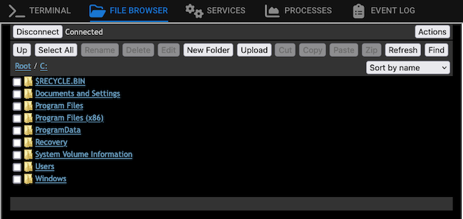

Tactical RMM and MeshCentral are each powerful open-source tools for remote monitoring and management. Each offers features that the other does not on its own, making the two even better as a team. By integrating the best features of each tool, you can get a truly outstanding remote monitoring and management solution.

This tutorial shows you how to do just that. Follow along to learn about MeshCentral and Tactical RMM, how each stands out, and what each offers that the other does not. Then see how the two tools can work together for a more full remote monitoring and management system.

## Before You Begin

Follow our [How to Install Tactical RMM](/docs/guides/installing-tactical-rmm/) guide to deploy a Tactical RMM instance. Completing the Tactical RMM installation as shown in that guide also automatically deploys a MeshCentral instance alongside the new Tactical RMM instance.

## What Is an RMM?

What is remote monitoring and management, or RMM? An RMM provides remote access to client systems. Typically, an RMM consists of two parts. First, a server that gives a central interface for accessing client systems. Second, one or more agents that allow the server to communicate with the client systems.

An RMM can be a valuable tool for system administrators, technical support, and others. RMM features like remote desktop let you troubleshoot remote client systems more directly, without relying on often cumbersome and obscure communications. Features like remote updates make it possible to ensure all client systems maintain the latest patches and security.

Between MeshCentral and Tactical RMM, you have more than just the above RMM features. You also have automated alerts, service management, remote file browsers, remote shells, and more.

### Tactical RMM vs MeshCentral: What Are the Differences?

If MeshCentral and Tactical RMM are both RMM tools, what distinguishes them? What sets MeshCentral apart from Tactical RMM, and which one makes more sense for your needs?

Each tool prioritizes a different set of RMM needs.

-   MeshCentral provides real-time features. This includes a remote desktop (like TeamViewer), a remote file browser, and a remote shell. All of these let you access a client system to view resources and perform tasks in real time.

-   Tactical RMM offers automated features. For instance, Tactical RMM has a set of bulk execution tools that let you easily run updates, scripts, or shell commands across a set of client systems. Tactical RMM also includes automated alerts.

But, as you can see in the rest of this tutorial, Tactical RMM manages to include all of the exceptional features of MeshCentral. By installing and integrating with its own MeshCentral instance, Tactical RMM gets the full suite of real-time access tools.

## How Tactical RMM Integrates with MeshCentral

Tactical RMM integrates with MeshCentral by default. Following the instructions in our [How to Install Tactical RMM](/docs/guides/installing-tactical-rmm/) guide, you get a MeshCentral instance installed alongside Tactical RMM. And immediately, the two tools are integrated, with features from MeshCentral available within Tactical RMM.

You can verify this by accessing the included MeshCentral interface. See our [How to Install and Use MeshCentral](/docs/guides/install-and-use-meshcentral/#accessing-meshcentral-with-tactical-rmm) guide for instructions on accessing the MeshCentral instance included with Tactical RMM.

Tactical automatically adds and maintains MeshCentral agents alongside its own agents, so you can see your Tactical RMM devices within the MeshCentral interface. An example is shown here.

Tactical RMM does all of this in order to leverage MeshCentral's embedding feature. With this, Tactical can integrate with the included MeshCentral instance to provide MeshCentral's robust real-time RMM tools.

## How to Use MeshCentral with Tactical RMM

One way to access MeshCentral features alongside Tactical RMM is by directly accessing the interface for the included MeshCentral instance. Doing so involves visiting the MeshCentral URL as shown in the guide linked above.

However, the greatest advantage of Tactical's integration with MeshCentral is the ability to access MeshCentral features directly within the Tactical RMM interface. Tactical provides numerous agent actions that use embedded MeshCentral features for real-time RMM.

To see these options, access your Tactical RMM interface and log in. Then, either select or right-click one of your listed client devices. From there, you have two options to start up real-time MeshCentral tools.

-   Choose **Take Control** to start a remote desktop on the client device. A new window opens, where Tactical RMM provides a custom frame for MeshCentral's remote desktop. Just as with MeshCentral, select **Connect** to start the session, and, when you are finished, select **Disconnect** to end it.

    

-   Choose **Remote Background** to see options for remote background actions on the client devices. A new window opens with a series of tabs, each corresponding to a category of action or information provided by MeshCentral. Several are devoted to current information about the client device, while the first two provide real-time RMM tools.

    -   **Terminal** accesses a remote terminal into the client device, where you can execute commands as root in real time.

    -   **File Browser** lets you browse the remote system's files, with standard features for manipulating files and directories as well as tools for uploading and downloading files.

    

## Conclusion

Tactical RMM and MeshCentral together provide a robust open-source solution for your remote monitoring and management needs. With the integrated toolset covered in this tutorial, you can better leverage each tool's strengths and understand how they work together.

To go further in getting the most out of MeshCentral and Tactical RMM, you should also refer to our guides covering each individually.

-   [How to Install Tactical RMM](/docs/guides/installing-tactical-rmm/) gets you started with Tactical RMM, covering the installation and navigation of the interface

-   [How to Install and Use MeshCentral](/docs/guides/install-and-use-meshcentral/) introduces MeshCentral with a full coverage of installation and usage.
