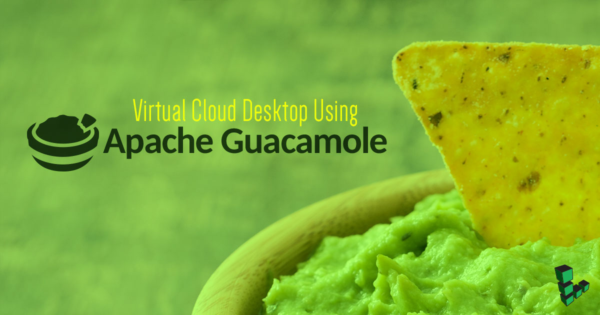
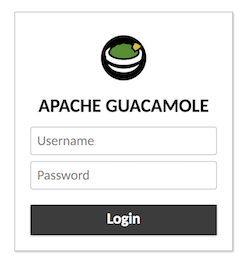
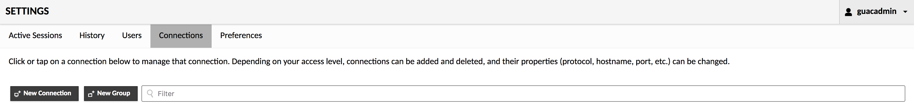
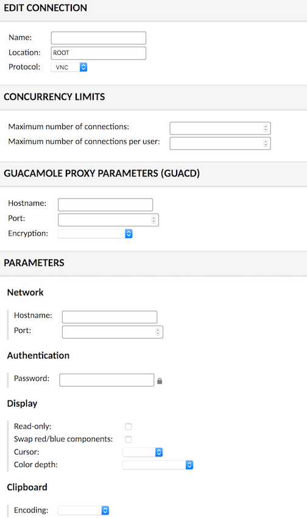
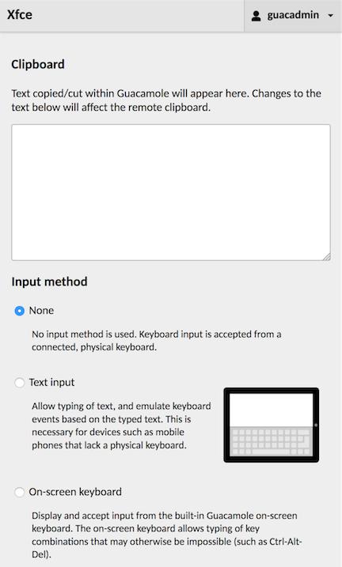
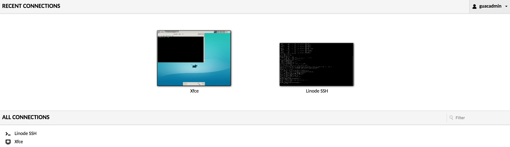

Apache Guacamole is an HTML5 application useful for accessing a remote desktop through RDP, VNC, and other protocols. You can create a virtual cloud desktop where applications can be accessed through a web browser. This guide will cover the installation of Apache Guacamole through Docker, then access a remote desktop environment hosted on a Linode.

## Install Apache Guacamole

Apache Guacamole can be installed and configured on a Linode Compute Instance using one of the following methods:

1.  **Linode Marketplace:** Deploy the [Apache Guacamole App](https://www.linode.com/marketplace/apps/linode/apache-guacamole/) through the Linode Marketplace to automatically install Guacamole, VNC software, and a desktop environment. This is the easiest method and enables you to quickly get up and running without needing to install and configure everything manually. Just note, when choosing this method you are limited to the Distribution Images supported by the Marketplace App.

1.  **Docker:** Alternatively, you can deploy Apache Guacamole's Docker images and manually configure the software yourself. This method strikes a balance between ease of installation and custom configuration. It may be more advanced, but provides you with greater control over your environment and configuration. See [Installing Apache Guacamole through Docker](/docs/guides/installing-apache-guacamole-through-docker/) for instructions.

1.  **Natively:** For maximum control over every step of the installation process, Apache Guacamole can be manually installed on your system from source. This is the most advanced method. If choosing this method, review [Installing Apache Guacamole on Ubuntu and Debian](/docs/guides/installing-apache-guacamole-on-ubuntu-and-debian/) and then return to this guide. You can also see [Installing Guacamole natively](https://guacamole.apache.org/doc/gug/installing-guacamole.html) on the official documentation for additional instructions.

## Setting Up VNC and a Desktop Environment

Before you're able to remotely connect to your server's desktop, a desktop environment and VNC server must be installed.

1.  **Install your preferred desktop environment**, such as Xfce, Gnome, KDE, or Unity. A desktop environment is the GUI used to interact with the system, typically through cascading windows (such as Windows and macOS). Most Linux server-based distributions (like those for deployment on Linode) do not come with one pre-installed. The installation and configuration for a desktop environment depends on the environment you chose and the distribution you are running. The following instructions should work on modern Ubuntu distributions:

    **Xfce:** This is a lightweight desktop environment that's a good choice for users of 1GB or 2GB Compute Instances.

        sudo apt install xfce4 xfce4-goodies

    **Unity:** The default feature-rich desktop environment for modern Ubuntu distributions. Unity is more resource intensive and requires a Compute Instance with 4GB of memory or more.

        sudo apt install --no-install-recommends ubuntu-desktop gnome-panel gnome-settings-daemon metacity nautilus gnome-terminal

1.  **Install a VNC server.** This guide uses tightvncserver but other options (such as tigervnc, x11vnc, and vino) should also work. See the "Which VNC Server?" section on the [Configuring Guacamole](https://guacamole.apache.org/doc/0.9.1/gug/configuring-guacamole.html) guide if you'd like to explore other software.

        sudo apt install tightvncserver

1.  Start the VNC server. This prompts you for a secure password that's no longer than 8 characters.

        vncserver

    For setups requiring more security, deploying Guacamole as a [reverse proxy with SSL encryption is highly recommended](https://guacamole.incubator.apache.org/doc/gug/proxying-guacamole.html).

1.  Ensure to start the desktop environment with `.vnc/xstartup` otherwise only a gray screen will be displayed.

        echo 'startxfce4 &' | tee -a .vnc/xstartup

    Alternate Unity configuration example:

    
#!/bin/sh

xrdb $HOME/.Xresources
xsetroot -solid grey
#x-terminal-emulator -geometry 80x24+10+10 -ls -title "$VNCDESKTOP Desktop" &
#x-window-manager &
# Fix to make GNOME work
export XKL_XMODMAP_DISABLE=1
/etc/X11/Xsession

gnome-panel &
gnome-settings-daemon &
metacity &
nautilus &


## Opening Guacamole in a Browser

1.  Before connecting to the VNC server, create an SSH tunnel replacing `user` and `example.com` with the Linode's user and public IP.

        ssh -L 5901:localhost:5901 -N -f -l user example.com

1.  Connect to the VNC server and if `example-guacamole`, `example-guacd`, and `example-mysql` are all running, navigate to `localhost:8080/guacamole/`. The default login credentials are `guacadmin` and password `guacadmin`. This should be changed as soon as possible.

    


After you connect to the VNC server if you are not able to open the default browser such as the `Debian Sensible Browser` and see `Failed to Execute Default Web Browser. Input/Output error`, then try installing a different browser such as `FireFox` or others.


## New Connection in Guacamole

VNC, RDP, SSH, and Telnet are supported. This section of the guide will show how to navigate the browser interface and add a new connection.

1.  In the Guacamole dashboard, click the top right drop down menu and select *Settings*. Under *Connections*, press the *New Connection* button.

    

1.  Under **Edit Connection**, choose a name. Under **Parameters**, the hostname is the public IP of the Linode. The port is 5900 plus the display number - in this case, port 5901. Enter the 8 character password.

    

    The [official documentation](https://guacamole.incubator.apache.org/doc/gug/configuring-guacamole.html#vnc) has detailed descriptions of all parameter names.

    
If you have multiple displays running on the same Linode, increment the port number for each display: 5902, 5903, etc. If your remote displays are hosted on different Linodes, each display should still use port 5901.


1.  From the top right drop down menu, click *Home*. The new connection is now available.

    **CTRL** + **ALT** + **SHIFT** - Opens menu for clipboard, keyboard/mouse settings, and the navigation menu.

    

1.  Press back on the browser to return to the *Home* menu.

1.  Additional connections can be made, and simultaneous connections can be made in new browser tabs.

    

This guide aimed to streamline the installation process and demonstrate remote desktop with Apache Guacamole as quickly as possible. There are many features such as screen recording, two factor authentication with Duo, file transfer via SFTP, and much more. As an Apache Incubator project, expect to see further developments in the near future.

## Is Apache Guacamole Secure?

There have been certain well-known security vulnerabilities associated with Apache Guacamole, though (at the time of this writing) they have been patched and updates have been released. Most notable is the one identified commonly by security researchers around Reverse RDP vulnerabilities. Any Guacamole version released before January 2020 is vulnerable to reverse RDP and multiple other vulnerabilities in FreeRDP.

**If you are using an old version of Apache Guacamole released before January 2020, consider upgrading your Apache Guacamole to a newer, stable, and secure version.**

With the newer versions, the following vulnerabilities have recently surfaced and patched by FreeRDP and Apache Foundation:

1. **Reverse attack to take control of gateway:** With this, any compromised system or machine inside of the network can exploit an incoming connection and compromise the gateway. This enables the compromised system or machine to take over the gateway.
2. **An internal attack to compromise the gateway:** When an attacker is an internal member of the organization(commonly an employee or a contractor with access to the network), they can use these exploits to gain full access to the gateway.
