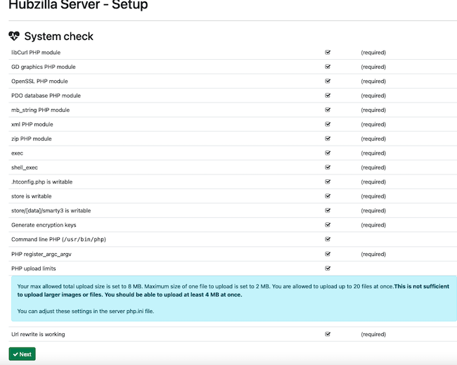
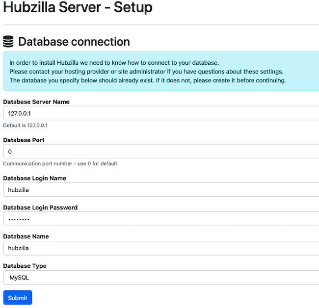
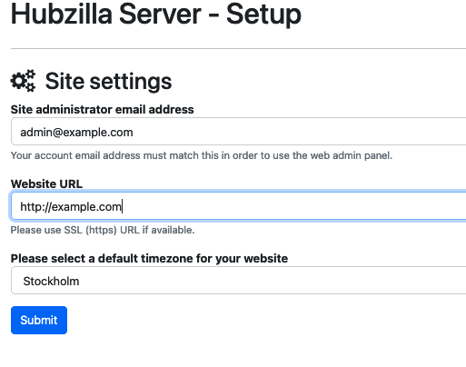
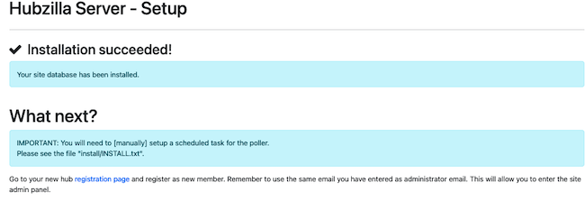
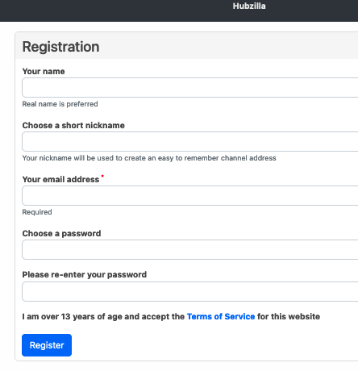
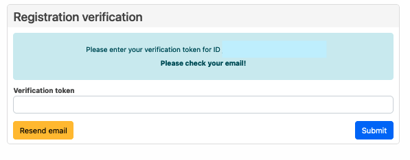

Recent developments have led to a renewed interest in federated web applications. Much of the interest centers around the Twitter alternative *Mastodon*. However, there are many other federated applications worthy of attention. For example, the federated [*Hubzilla*](https://hubzilla.org//page/hubzilla/hubzilla-project) application allows users to create interconnected websites and channels. This guide provides an introduction to the Hubzilla application and explains how to install and configure it.

## What is the Federated Web?

The *federated web* is also known as the *Fediverse*, which stands for "federated universe". It is a collection of servers that are independent, but can communicate and interact with one another. The Fediverse is commonly used to host web content, including websites, social networks, and blogs. Some examples of federated web applications include Hubzilla, *Friendica*, Mastodon, and *Pleroma*.

Communication protocols based on open standards allow the servers and users to communicate with each other across software boundaries. A user account or identity can potentially be used to create or access content on any server within the federation. In most cases, access control lists are used to control distribution and content creation rights.

## What is Hubzilla?

Hubzilla is a highly versatile, free, and open source application. It allows users to create connected websites and tools in a modular fashion. Some of the main Hubzilla features include websites, social media, file sharing, photo sharing, forums, chat rooms, and calendars.

In Hubzilla, all communications, content, permissions, and user identities are distributed across the federation. Hubzilla uses the *ZOT* web framework to enable these secure decentralized services. ZOT is a JSON-based communication framework designed with decentralization in mind. Hubzilla channels use the *Open Web Auth* (OWA) protocol to silently identify and authenticate themselves and access server resources. OWA is similar to OpenID but it is more efficient and does not require the *Domain Name System* (DNS). However, Hubzilla allows users to use OpenID to log in to off-grid sites.

Hubzilla requires common web server technologies to operate, including a Linux LAMP stack or equivalent. A typical LAMP stack includes the Apache web server, the MySQL or MariaDB *relational database management system* (RDBMS), and the PHP programming language.

Hubzilla uses a specific terminology to describe the relationship between servers and application users.
-   **Hub**: This is an individual server running Hubzilla. Each hub can host users and web content. Hubzilla allows anyone to run their own hub.
-   **Grid**: This is a decentralized network of hubs. A grid allows hubs, and therefore individual users, to connect with each other. Hubs communicate using the ZOT protocol and Hubzilla's messaging system. However, a hub can be used as a stand-alone system. Hubs are not required to connect to the wider grid.
-   **Channel**: This is a Hubzilla entity within the grid. A channel can be an application or user, but it can also be a web page, blog, or forum. A user interacts with the Hubzilla grid using their own personalized channel called the *me* channel. Each channel has its own stream and can also connect to other channels. For example, a person can subscribe to a forum, and blog updates can be funneled to a web page. A channel can be identified through its unique tag `channelname@hub.domain`. Every channel is cryptographically secured and has its own set of authentication rights.

Hubzilla follows the key federated principle of *nomadic identity*. This means a channel or account is not tied to a particular server and does not have a traditional server-based account. Channel authentication happens independently across the grid. This means users can move their identity from one hub to another, taking their data and connections with them. In addition, Hubzilla allows channels to *clone* themselves on multiple hubs. This enhances resiliency against external threats, including power failures and censorship.

Hubzilla includes a sophisticated access control mechanism. It allocates grid-wide user permissions on a granular level. The various content channels are identity-aware. This allows for a *single sign-on* (SSO) service across the various channels. This is a huge difference from traditional websites, which authenticate users independently. All channel content includes access control permissions, so it is possible for different users to see dramatically different channel feeds. It is also possible to set permissions for users on an entirely different hub.

Hubzilla is a complicated and multi-faceted application. It provides many features, including:

-   A wide variety of plug-ins for creating channel content and web applications. The Comanche description language provides a toolkit for building web pages, and users can apply customizable interface, themes, and widgets to their pages.
-   Built-in social network capabilities, including chat rooms. Hubzilla provides federation support to connect to Diaspora, GNU Social, Mastodon, and other applications. Hubzilla can also serve as a client application for Twitter, WordPress, and other applications, and distribute copies of a new update.
-   Cloud file storage functionality. Files can be shared or published using Hubzilla's access control mechanism.
-   The ability to create a Wiki page for each channel.
-   An *affinity slider* allows users to determine how close they are to another connection or channel. This allows users to select what content they want to see. Only channels within the range of the affinity slider are displayed.
-   Connection filtering based on user-defined criteria.
-   Single sign-on across the grid.
-   An access-controlled photo album feature.
-   A powerful calendar feature, allowing users to share events and coordinate attendance. Hubzilla supports most popular calendar formats.
-   A flexible API for third-party use to configure and access hubs and create content.

There are also a few drawbacks to using Hubzilla, including:

-   Some of the features and tools are not intuitive.
-   Documentation on Hubzilla is fragmented, disorganized, and incomplete.
-   Hubzilla lacks a solid mobile implementation.
-   It has a smaller user base than Mastodon or other federated applications.

For more information about Hubzilla and its features, see the [Hubzilla Documentation](https://hubzilla.org/help/en/about/about#Features).

## Before You Begin

1.  If you have not already done so, create a Linode account and Compute Instance. See our [Getting Started with Linode](/docs/products/platform/get-started/) and [Creating a Compute Instance](/docs/products/compute/compute-instances/guides/create/) guides.

1.  Follow our [Setting Up and Securing a Compute Instance](/docs/products/compute/compute-instances/guides/set-up-and-secure/) guide to update your system. You may also wish to set the timezone, configure your hostname, create a limited user account, and harden SSH access.

1.  Assign a domain name for the Hubzilla hub and point it to the IP address of the server. For information on domain names and pointing a domain name to a Linode, see the [Linode DNS Manager guide](/docs/products/networking/dns-manager/).

1.  Enable email on the Linode server to allow Hubzilla to send out registration emails containing verification codes. Hubzilla requires a working mail server to authenticate new users. For more information on setting up a mail server, see our [guides on email](/docs/guides/email).


This guide is written for a non-root user. Commands that require elevated privileges are prefixed with `sudo`. If you are not familiar with the `sudo` command, see the [Users and Groups](/docs/guides/linux-users-and-groups/) guide.


## How to Install Hubzilla

Before downloading and installing Hubzilla, Linux users must install and configure some form of LAMP stack. A virtual host for the Hubzilla site is also mandatory. The following instructions are designed for Ubuntu 22.04 LTS, but are generally applicable to most Linux distributions.

### Install the LAMP Stack

Hubzilla relies upon a LAMP stack consisting of the Apache web server, the MariaDB database, and the PHP programming language. The MySQL database can be substituted for MariaDB. Other substitutions are possible and might improve performance, but Hubzilla does not explicitly support them.

1.  Ensure the Ubuntu packages are up to date. Reboot the system if advised to do so.

    ```command
    sudo apt-get update -y && sudo apt-get upgrade -y
    ```

2.  Install the Apache web server and the MariaDB RDBMS.

    ```command
    sudo apt install apache2 mariadb-server -y
    ```

3.  Install PHP, including all required PHP libraries, along with some additional utilities.

    
    Hubzilla requires PHP release 8.0 or higher. The following command installs the current PHP release 8.1. To confirm the release of PHP in use, run the command `php -v`.
    

    ```command
    sudo apt install openssh-server git php php-fpm php-curl php-gd php-mbstring php-xml php-mysql php-zip php-json php-cli imagemagick fail2ban wget libapache2-mod-fcgid -y
    ```

4.  Use the `systemctl` command to ensure Apache and MariaDB are running and configured to start automatically at boot time.

    ```command
    sudo systemctl start apache2
    sudo systemctl enable apache2
    sudo systemctl start mysql
    sudo systemctl enable mysql
    ```

5.  Verify Apache is running using the `systemctl status` command.

    ```command
    sudo systemctl status apache2
    ```

    ```output
    apache2.service - The Apache HTTP Server
        Loaded: loaded (/lib/systemd/system/apache2.service; enabled; vendor preset: enabled)
        Active: active (running) since Wed 2022-11-16 13:38:25 UTC; 10min ago
    ```

6.  Configure the firewall to allow Apache connections. Ensure SSH connections are also allowed.

    
    If you intend to use SSL to secure the Hubzilla installation, use the `Apache Full` profile. Otherwise, enable the `Apache` profile. Hubzilla tests the well-known HTTPS port first, so this port must not be open unless HTTPS is used. HTTPS is highly recommended for enhanced security. For conciseness, this guide does not configure HTTPS. However, the basic Hubzilla installation process is the same in both cases.
    

    ```command
    sudo ufw allow OpenSSH
    sudo ufw allow in "Apache"
    sudo ufw enable
    ```

7.  Ensure the firewall is enabled.

    ```command
    sudo ufw status
    ```

    ```output
    Status: active

    To                         Action      From
    --                         ------      ----
    OpenSSH                    ALLOW       Anywhere
    Apache                     ALLOW       Anywhere
    OpenSSH (v6)               ALLOW       Anywhere (v6)
    Apache (v6)                ALLOW       Anywhere (v6)
    ```

8.  Visit the IP address or domain name of the server. The `Apache2 Default Page` should be displayed.

### Configure the LAMP Stack

1.  Enhance security for the MariaDB installation using the `mysql_secure_installation` utility. When prompted, answer the questions as follows:

    -   For `Enter current password for root (enter for none):` enter the database password for the `root` account. If there is no password, hit the `Enter` key.
    -   For `Switch to unix_socket authentication` and `Change the root password?`, enter `n`.
    -   For `Remove anonymous users?`, `Disallow root login remotely?`, `Remove test database and access to it?` and `Reload privilege tables now?`, enter `Y`.

        ```command
        sudo mysql_secure_installation
        ```

2.  Log in to MariaDB. Provide the root password if necessary.

    ```command
    sudo mysql
    ```

3.  Create a `hubzilla` database for the application to use.

    ```command
    CREATE DATABASE hubzilla;
    ```

4.  Create a user for the new database. Supply a unique password in place of `mypassword`.

    ```command
    CREATE USER 'hubzilla'@'localhost' IDENTIFIED BY 'mypassword';
    ```

5.  Grant all privileges for the `hubzilla` database to the new user. Flush the privileges and exit.

    ```command
    GRANT ALL PRIVILEGES ON hubzilla.* TO 'hubzilla'@'localhost';
    FLUSH PRIVILEGES;
    EXIT;
    ```

6.  Hubzilla requires the `mpm_event` module. To enable this module, first stop Apache and disable `php-8.1` and `mpm_prefork`.

    
    Disable the `php` module associated with the current PHP release. The format of the module name is `php-releasenumber`, where the release number is the major and minor release of PHP. Use the command `php -v` to find this release information.
    

    ```command
    sudo systemctl stop apache2
    sudo a2dismod php8.1
    sudo a2dismod mpm_prefork
    ```

7.  Enable the PHP `rewrite` and `mpm_event` modules.

    ```command
    sudo a2enmod rewrite
    sudo a2enmod mpm_event
    ```

8.  Connect Apache to the `fpm` mechanism. Enable the following modules and configurations.

    ```command
    sudo a2enconf php8.1-fpm
    sudo a2enmod proxy
    sudo a2enmod proxy_fcgi
    ```

9.  Restart Apache and verify it is `active`. If the restart fails, run the `sudo apachectl configtest` command. Review and correct any errors.

    ```command
    sudo systemctl restart apache2
    sudo systemctl status apache2
    ```

### Configure A Hubzilla Virtual Host

Hubzilla requires its own virtual host to function properly. Create a new `hubzilla.conf` file inside `etc/apache2/sites-available` and then enable it. To create the virtual host file, follow these steps.

1.  Change to the `/etc/apache2/sites-available/` directory and create the new `hubzilla.conf` file.

    ```command
    cd /etc/apache2/sites-available
    sudo nano hubzilla.conf
    ```

2.  Add the following information to the file. For the `ServerAdmin` and `ServerName` fields, replace `example.com` with the name of the Hubzilla domain. In the `ProxyPassMatch` variable, use the release number of the local instance of PHP in place of `8.1` for `php8.1-fpm`. Save and close the file.

    ```file {title="/etc/apache2/sites-available/hubzilla.conf" lang="aconf"}
    <VirtualHost *:80>
        ServerAdmin webmaster@example.com
        ServerName example.com
        DocumentRoot /var/www/html/hubzilla
        ProxyPassMatch ^/(.*\.php(/.*)?)$ unix:/run/php/php8.1-fpm.sock|fcgi://localhost/var/www/html/hubzilla
        <Directory /var/www/html/>
            Options Indexes FollowSymLinks
            AllowOverride All
            Order allow,deny
            allow from all
        </Directory>
        ErrorLog ${APACHE_LOG_DIR}/hubzilla_error.log
        LogLevel warn
        CustomLog ${APACHE_LOG_DIR}/hubzilla_access.log combined
    </VirtualHost>
    ```

3.  Enable the new site.

    ```command
    sudo a2ensite hubzilla
    ```

4.  **Optional** For extra security, disable the default Apache site.

    ```command
    sudo a2dissite 000-default.conf
    ```

5.  Restart Apache and verify its status.

    ```command
    sudo systemctl restart apache2
    sudo systemctl status apache2
    ```

## Installing and Configuring Hubzilla

The LAMP stack is now fully configured and ready for Hubzilla. Use `git` to download Hubzilla and install the add-ons. Before Hubzilla is ready for use, some permissions must also be changed. A cron job for proper Hubzilla maintenance must also be added.

1.  Change directory to `/var/www/html`.

    ```command
    cd /var/www/html
    ````

2.  Use `git` to clone the latest release of Hubzilla from the code base.

    ```command
    sudo git clone https://framagit.org/hubzilla/core.git hubzilla
    ```

3.  Change to the `hubzilla` directory and install the add-ons.

    ```command
    cd hubzilla
    sudo util/add_addon_repo https://framagit.org/hubzilla/addons addons-official
    ```

4.  Create the `store` directory and ensure it is writable.

    ```command
    sudo mkdir -p "store/[data]/smarty3"
    ```

5.  Change ownership and permissions for the `hubzilla` directory.

    ```command
    sudo chown -R www-data:www-data /var/www/html/hubzilla/
    sudo chmod -R 755 /var/www/html/hubzilla/
    ```

6.  **Optional** To access Hubzilla using HTTPS, which Hubzilla recommends, install `certbot` and use it to request and install a Let's Encrypt certificate. For further instructions, see the Linode guide on [How to Use Certbot to Enable HTTPS](https://www.linode.com/docs/guides/enabling-https-using-certbot-with-apache-on-ubuntu/).

6.  Add a `cron` task to update the site every 10 minutes. Run the `crontab -e` command to edit the list of `root` cron jobs.

    ```command
    sudo crontab -e
    ```

7.  Add the following line to the end of the cron file. `usr/bin/php` represents the path to the PHP installation. Before proceeding, confirm the location of PHP using the command `which php`.

    ```command
    */10 * * * *    cd /var/www/html/hubzilla; /usr/bin/php Zotlabs/Daemon/Master.php Cron > /dev/null 2>&1
    ```

## Configuring Hubzilla

To initialize Hubzilla and get it ready for deployment, use the simple web interface. Follow these steps to configure Hubzilla.

1.  Using a web browser, navigate to the domain name of the Hubzilla server. Use the `https` prefix if TLS is enabled, otherwise use `http`.

2.  The web server displays the `Hubzilla Server - Setup` page. Ensure all options are selected and click **Next**.

    

3.  Hubzilla displays the `Database Connection` page. Enter the login name, password, and database name for the MariaDB database. The login name and database name are both `hubzilla`. For the password, enter the password for the `hubzilla` user. Select the **Submit** button to proceed.

    

4.  Hubzilla proceeds to the `Site settings` page. Enter an email address for the site administrator and select the default time zone. The `Website URL` must be set to the domain name for the Hubzilla server. Click **Submit** to continue.

    
    The administration email must contain a valid email address. Hubzilla sends a verification email to the account to confirm the registration.
    

    

5.  Hubzilla confirms the installation is successful. This page also provides a link to the `registration page` to register as a new member. You must register for an account before you can use Hubzilla. Click the link to register now. To register later, visit the domain name of the Hubzilla server.

    

6.  On the `Registration` page, enter an account name, a short nickname to represent the channel on the site, a valid email address, and a password. If registering as an administrator, use the administrator email provided earlier in the Hubzilla site settings. Select the checkbox to agree to the terms of service and click **Register**.

    
    After selecting `Register`, Hubzilla must send an email to the email address of the account. The Linode must have email turned on to complete this process.

    For non-production Hubzilla testing, it is possible to remove the mail server requirements by editing a Hubzilla configuration file. To do so, open the `.htconfig.php` file located at `/var/www/html/hubzilla` and change the `1` in the following line:

    ```file {title="/var/www/html/hubzilla/.htconfig.php"}
    App::$config['system']['verify_email'] = 1;
    ```

    To instead be a `0`:

    ```file {title="/var/www/html/hubzilla/.htconfig.php"}
    App::$config['system']['verify_email'] = 0;
    ```

    This configuration change is not recommended on production installations.
    

    

7.  Hubzilla sends an email with a verification token to the account address. Enter the registration token on the next page to complete the registration.

    

For information on how to use Hubzilla's features, see the [Hubzilla user guide](https://hubzilla.org/help/en/member/member_guide#Overview).

## Conclusion

Hubzilla is a federated web site that allows users to create shared interconnected web pages, blogs, social media feeds, and other interactive material. Each Hubzilla hub is connected to other hubs to form a grid. Hubzilla is based around channels. A channel can represent either users or web entities. Hubzilla uses a nomadic identity that allows users to access different hubs through an independent account. A fine-grained access control system determines who can create or view channel content.

To use Hubzilla, first install and configure a LAMP stack, including Apache, MariaDB, and PHP. Then use `git` to install Hubzilla. Configure Hubzilla and create an administrator account using Hubzilla's online interface. For more information on Hubzilla, see the [Hubzilla website](https://hubzilla.org//page/hubzilla/hubzilla-project).