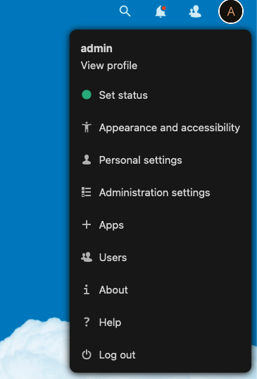
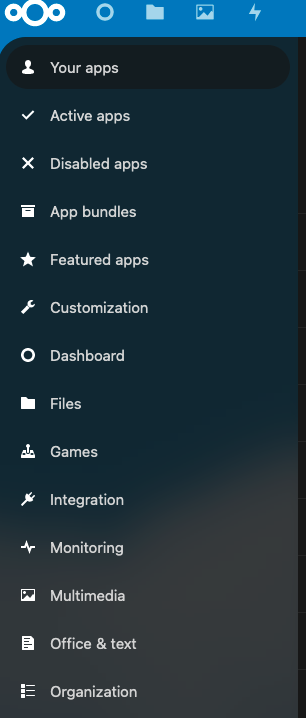
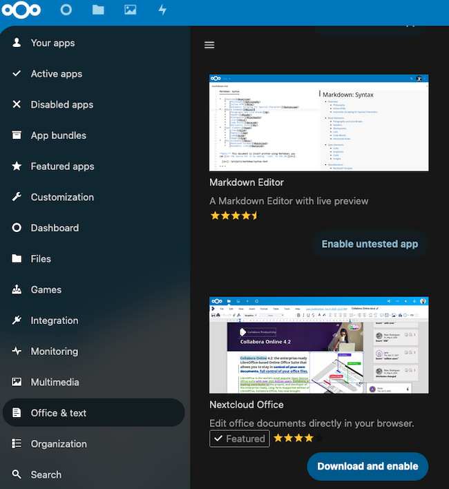
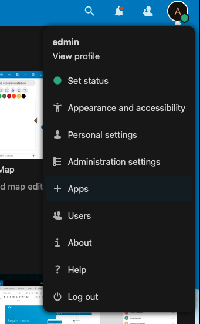
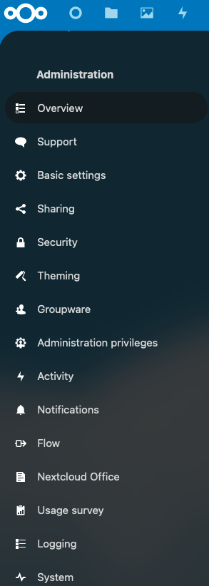
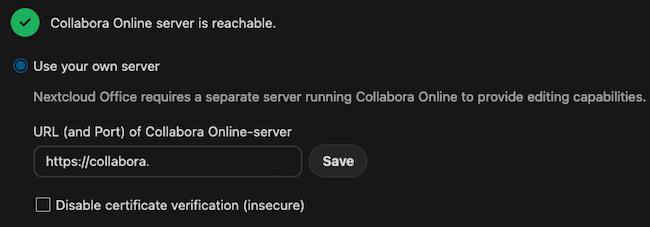
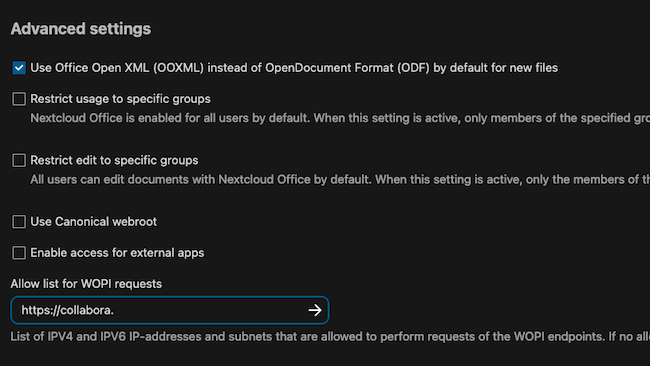
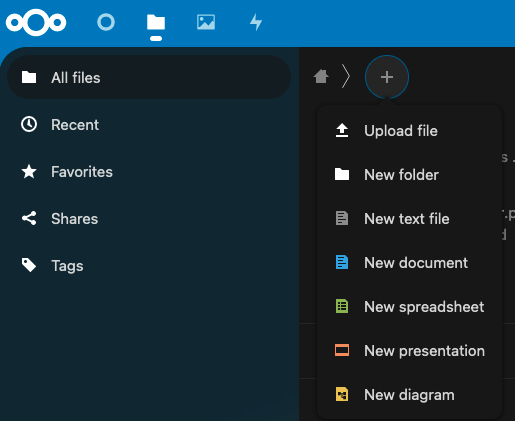
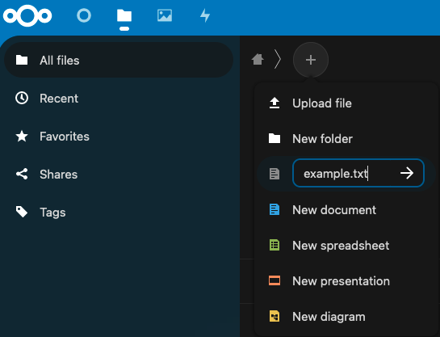

[Collabora](https://www.collaboraoffice.com/) is a fully-featured open source alternative to popular office suites such as Microsoft Office. The [*Collabora Online Development Edition*](https://www.collaboraoffice.com/code/) (CODE) edition is the online development version of Collabora. It is typically integrated into the front end of a file storage application such as [Nextcloud](https://nextcloud.com/). This guide explains how to download, install, and configure the CODE edition of Collabora. It also demonstrates how to connect Collabora and Nextcloud, both running on the same Linode, using the Nextcloud Hub.

## What is Collabora?

Collabora CODE is a free open source office productivity suite based on LibreOffice. It includes text editing, spreadsheet, presentation, and vector graphics software applications, along with a note taking utility. It can handle all major document formats, using WYSIWYG formatting to preserve the layout of each document. It includes a shared editing feature and allows users to import and view over one hundred different types of documents.

Collabora is available in desktop and online editions. Products include the commercial Collabora Online enterprise edition, and CODE, which is the free development stream. New CODE releases are distributed about once a month, but CODE is considered less stable than Collabora Online. It is suitable for students, home offices, and small businesses, but it is not recommended for high capacity production environments.

Collabora can be installed on a private server or hosted in the cloud. It requires either a helper application like Nextcloud or a custom wrapper. Nextcloud is an open source self-hosted file storage solution that places an emphasis on security and privacy. Nextcloud and Collabora have worked together to integrate the two applications. Within the Nextcloud application, Collabora CODE is known as *Nextcloud Office*.

To use Collabora from the Nextcloud interface, install both Collabora and Nextcloud and configure each application separately. Then integrate Collabora into Nextcloud using the Nextcloud administrative hub. This allows users to view and edit Collabora documents directly within Nextcloud. When accessed in this manner, Collabora features full editing capabilities and enhanced security, and is accessible from mobile devices.


Throughout the remainder of the installation instructions, Collabora CODE and Collabora are used interchangeably.



For those users who do not want to use Collabora with Nextcloud, integration and wrapper instructions are available in the [Collabora integration documentation](https://sdk.collaboraonline.com/docs/examples.html).


## Before You Begin

1.  If you have not already done so, create a Linode account and Compute Instance. See our [Getting Started with Linode](/docs/guides/getting-started/) and [Creating a Compute Instance](/docs/guides/creating-a-compute-instance/) guides.

1.  Follow our [Setting Up and Securing a Compute Instance](/docs/guides/set-up-and-secure/) guide to update your system. You may also wish to set the timezone, configure your hostname, create a limited user account, and harden SSH access.

1.  Create and configure a subdomain name and point it at the Linode. This subdomain name provides access to the Collabora instance. The subdomain is required in addition to the domain or subdomain name used to access the Nextcloud instance. For more information on domains and how to create a DNS record, see the [Linode DNS Manager guide](/docs/guides/dns-manager/).

1.  Collabora CODE requires a supporting storage application such as Nextcloud. For information on configuring Nextcloud, see the [Linode guide to installing Nextcloud on Ubuntu](/docs/guides/how-to-install-nextcloud-on-ubuntu-22-04/). This guide assumes Collabora is being installed on the same server as Nextcloud.


This guide is written for a non-root user. Commands that require elevated privileges are prefixed with `sudo`. If you are not familiar with the `sudo` command, see the [Users and Groups](/docs/tools-reference/linux-users-and-groups/) guide.


## How to Install and Configure Collabora CODE

Before installing Collabora CODE, ensure Nextcloud or an equivalent application is already installed, configured, and ready to use. Create an administrator account to access the Nextcloud dashboard.

Collabora requires its own domain name, but it functions as an embedded application within Nextcloud, not as a stand-alone website. Nextcloud transmits queries and requests to the Collabora domain, so users do not have to know anything about Collabora. Normally the Collabora server uses a subdomain of the main domain name. The Nextcloud server can either use the main domain name or the name of a second subdomain. For instance, the Collabora server might be named `collabora.example.com`, while Nextcloud is accessed through `nextcloud.example.com` or `example.com`.

These instructions are designed for the Ubuntu 22.04 LTS, but are similar for earlier releases. For instructions on how to install Collabora on other distributions, see the [Collabora Linux packages documentation](https://www.collaboraoffice.com/code/linux-packages/).

### How to Install Collabora

Collabora CODE is easier to install than Nextcloud. The Collabora prerequisites were all installed when Nextcloud was installed. To install Collabora CODE, follow these steps.

1.  Import the Collabora CODE signing key.

        cd /usr/share/keyrings
        sudo wget https://collaboraoffice.com/downloads/gpg/collaboraonline-release-keyring.gpg

2.  Create a source file for the Collabora CODE package repository.

        sudo vi /etc/apt/sources.list.d/collaboraonline.sources

3.  Add the following information to the file and save it.

    
Types: deb
URIs: https://www.collaboraoffice.com/repos/CollaboraOnline/CODE-ubuntu2204
Suites: ./
Signed-By: /usr/share/keyrings/collaboraonline-release-keyring.gpg
    

4.  Update the repository.

        sudo apt update -y

5.  Install Collabora CODE using `apt`.

        sudo apt install coolwsd code-brand -y

### How to Configure Collabora

Collabora configuration depends on an XML file at `/etc/coolwsd/coolwsd.xml`. Although this file can be edited directly, it is faster to use the `coolconfig` tool to make configuration changes. To configure Collabora, follow these steps.

1.  With the current configuration, the `coolwsd` service continues to fail and restart. This happens because Collabora cannot establish a HTTPS connection with the local host. Use the `coolconfig` tool to disable HTTPS on the connection.

        sudo coolconfig set ssl.enable false
        sudo coolconfig set ssl.termination true

2.  Only specifically designated hosts are allowed to access the Collabora server. To designate Nextcloud as a trusted client, set `storage.wopi.host` to the Nextcloud domain, for example, `nextcloud.example.com`. In the following command, substitute the real domain name in place of `example.com`.

        sudo coolconfig set storage.wopi.host nextcloud.example.com

3.  Create an administration account and provide a password for the account. When prompted, enter the `admin username`. Then enter the `admin password` twice.

        sudo coolconfig set-admin-password

4.  Restart the `coolwsd` service and verify the service status.

        sudo systemctl restart coolwsd
        sudo systemctl status coolwsd

    
coolwsd.service - Collabora Online WebSocket Daemon
    Loaded: loaded (/lib/systemd/system/coolwsd.service; enabled; vendor preset: enabled)
    Active: active (running) since Tue 2022-12-13 14:42:09 UTC; 7s ago
    

### How to Configure the Collabora Virtual Host

NGINX requires a Collabora virtual host to serve the files. This guide uses NGINX, but Collabora can also use the Apache web server. To configure an NGINX virtual host, follow these steps.


For details on how to configure the Apache virtual host, see the [Collabora Apache Proxy Settings](https://sdk.collaboraonline.com/docs/installation/Proxy_settings.html#reverse-proxy-with-apache-2-webserver). Enable the `proxy`, `proxy_http`, `proxy_connect`, and `proxy_wstunnel` modules using the `a2enmod` command.


1.  Create a `collabora` NGINX virtual host file.

        sudo vi /etc/nginx/sites-available/collabora

2.  Add the following configuration to the file. Change the value of `server_name` from `collabora.example.com` to the name of the Collabora subdomain.

    
server {
    listen 80;
    listen [::]:80;
    server_name  collabora.example.com;

    error_log /var/log/nginx/collabora.error;

    # static files
    location ^~ /browser {
      proxy_pass http://127.0.0.1:9980;
      proxy_set_header Host $http_host;
    }

    # WOPI discovery URL
    location ^~ /hosting/discovery {
      proxy_pass http://127.0.0.1:9980;
      proxy_set_header Host $http_host;
    }

    # Capabilities
    location ^~ /hosting/capabilities {
      proxy_pass http://127.0.0.1:9980;
      proxy_set_header Host $http_host;
    }

    # main websocket
    location ~ ^/cool/(.*)/ws$ {
      proxy_pass http://127.0.0.1:9980;
      proxy_set_header Upgrade $http_upgrade;
      proxy_set_header Connection "Upgrade";
      proxy_set_header Host $http_host;
      proxy_read_timeout 36000s;
    }

    # download, presentation and image upload
    location ~ ^/(c|l)ool {
      proxy_pass http://127.0.0.1:9980;
      proxy_set_header Host $http_host;
    }

    # Admin Console websocket
    location ^~ /cool/adminws {
      proxy_pass http://127.0.0.1:9980;
      proxy_set_header Upgrade $http_upgrade;
      proxy_set_header Connection "Upgrade";
      proxy_set_header Host $http_host;
      proxy_read_timeout 36000s;
    }
}
    

3.  Enable the site on the server.

        sudo ln -s /etc/nginx/sites-available/collabora /etc/nginx/sites-enabled/collabora

4.  Test the file syntax to ensure it does not contain any errors.

        sudo nginx -t

5.  Restart NGINX and verify its status.

        sudo systemctl reload nginx
        sudo systemctl status nginx

### How to Enable HTTPS for the Collabora Domain

This section explains how to use [Certbot](https://certbot.eff.org/) to request a Let's Encrypt certificate and enable HTTPS support. The `snap` package manager can be used to install Certbot. For additional information about Certbot, Let's Encrypt certificates, and HTTPS, consult the [Linode guide to Using Certbot on NGINX](/docs/guides/enabling-https-using-certbot-with-nginx-on-ubuntu/).

1.  Install the `snap` package manager.

        sudo apt install snapd
        sudo snap install core

2.  Remove the old `certbot` package and use `snap` to install the `certbot` Snap. Create a symbolic link to the new directory.

        sudo apt remove certbot
        sudo snap install --classic certbot
        sudo ln -s /snap/bin/certbot /usr/bin/certbot

3.  Run the `certbot` command to request and install a Let's Encrypt certificate. The `--nginx` option allows Certbot to modify the NGINX virtual host file for the domain.

    During the certificate granting process, `certbot` prompts for more information. Some of these questions might not appear if you have used Certbot on this particular Linode before. To request a certificate, follow these guidelines.

    -   Enter the administrator's email address when requested to do so. Let's Encrypt sends renewal notices and other relevant updates to this address.
    -   Enter `Y` to agree to the Terms of Service. Enter `N` to end the program.
    -   Certbot asks for permission to register the address with the Electronic Frontier Foundation. Enter either `Y` or `N`. This does not affect the rest of the installation.
    -   Enter the Collabora domain name, for example, `collabora.example.com`, or choose the correct name from a list. If `certbot` displays a list, select the number corresponding to the Collabora domain.

    The `certbot` program confirms the results of the certificate request and displays any error messages. `certbot` automatically schedules the certificate for auto renewal.

        sudo certbot --nginx

    
Requesting a certificate for collabora.example.com

Successfully received certificate.
Certificate is saved at: /etc/letsencrypt/live/collabora.example.com/fullchain.pem
Key is saved at:         /etc/letsencrypt/live/collabora.example.com/privkey.pem
This certificate expires on 2023-03-14.
These files will be updated when the certificate renews.
Certbot has set up a scheduled task to automatically renew this certificate in the background.

Deploying certificate
Successfully deployed certificate for collabora.example.com to /etc/nginx/sites-enabled/collabora
Congratulations! You have successfully enabled HTTPS on https://collabora.example.com
    

4.  Reload NGINX to incorporate the changes.

        sudo systemctl reload nginx

## How to Connect Collabora to Nextcloud

To use Collabora as a Nextcloud application, connect the Collabora server to Nextcloud via the Nextcloud Hub. Within the Nextcloud context, Collabora CODE is named "Nextcloud Office". To attach Collabora to Nextcloud, follow these steps.

1.  Navigate to the address of the Nextcloud domain. Enter the administrative login credentials to access the Nextcloud web interface.

2.  Click on the administrator profile, represented by a circle in the upper right hand corner of the window. This reveals a list of options. Click on the link labeled **+ Apps** to view the applications panel.

    

3.  On the applications panel, locate and click the link for **Office & Text** on the left hand side navigation panel.

    

4.  The subsequent page displays all the office and document management applications. Scroll through the list or use the search function to find the `Nextcloud Office` application. Click the **Download and Enable** button beside the application.

    

5.  Click on the administrator profile. This is the circle on the upper right of the screen. Select the **Administration Settings** link.

    

6.  On the left hand side navigation panel, scroll down until the **Nextcloud Office** setting appears and click the label.

    

7.  Nextcloud displays the `Nextcloud Office` settings. Enable the `Use your own server` setting by clicking the radio button. This reveals a text box for entering the `URL (and Port) of Collabora Online-server`. Enter the Collabora subdomain here, for example `https://collabora.example.com` and click **Save**. If the connection is successful, Nextcloud confirms the `Collabora Online server is reachable`.

    
If Nextcloud states the Collabora is unreachable, consult the [Nextcloud Office Troubleshooting guide](https://docs.nextcloud.com/server/latest/admin_manual/office/troubleshooting.html).
    

    

8.  Locate the `Advanced Settings` section lower down on the panel. Click the box to enable the `Use Office Open XML (OOXML) instead of OpenDocument Format by default for next files` setting. This ensures all files are compatible with Microsoft Office. For added security, enter the name of the Collabora domain name beside `Allow list for WOPI requests`.

    

9.  To create a new file, click the file folder symbol on the top menu bar. This presents the `All Files` screen. Click on the **+** symbol to the right of the home button and the `>` symbol. A list of the potential file options appears.

    

10. Provide a name for the file and click the **-->** symbol to create it. Base the file on a template or start with a blank file. Enter the contents of the new file. Nextcloud auto-saves the file whenever it changes. Close the file using the **X** button on the top right when done.

    

Additional information on how to use Nextcloud Office is available in the [Nextcloud web interface documentation](https://docs.nextcloud.com/server/stable/user_manual/en/webinterface.html).

## Conclusion

Collabora is a free open source office suite application that is an alternative to Microsoft Office. It is typically embedded as an application within Nextcloud, but other configuration options are available. Add the Linux package and use `apt` to install Collabora. Use the `coolconfig` utility to configure Collabora and then add a virtual host for the application. To integrate Collabora into Nextcloud, connect it using the Nextcloud Hub. For more information on Collabora, see the [introduction to Collabora CODE](https://www.collaboraoffice.com/code/).