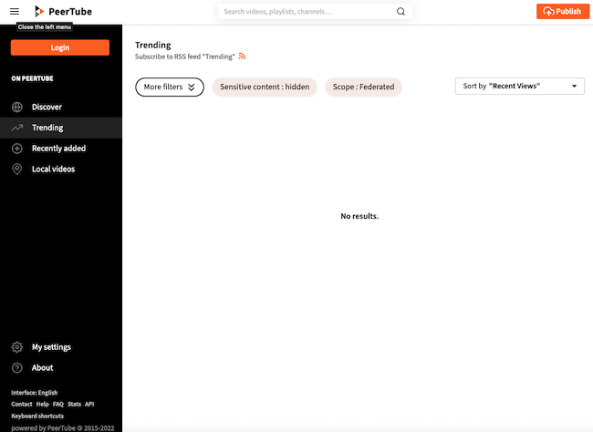
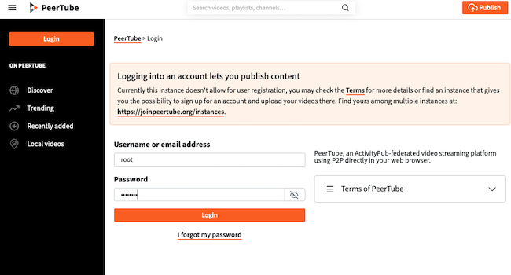
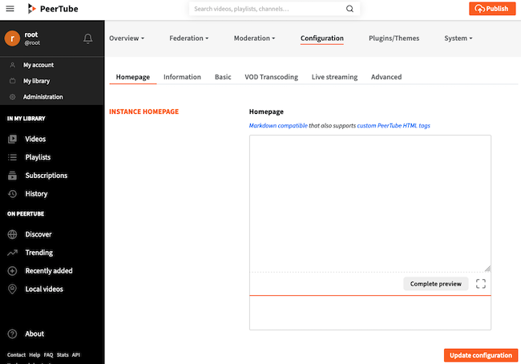

There is now increased interest in federated web applications as alternatives to the major social media sites. Federated servers operate independently in an interconnected manner. [PeerTube](https://joinpeertube.org/) is a distributed open source variation on YouTube. It allows users to share and enjoy videos without corporate interference or manipulative algorithms. This guide explains how to download, install, and configure a PeerTube instance on a Linode server.

## What is a Federated Web Application?

PeerTube is one of the applications comprising the *federated web*, also known as the *Fediverse*. The Fediverse is a collection of independent yet interconnected servers. Applications in the Fediverse are decentralized by design. There is no central server or administrative hierarchy. Mastodon is probably the best-known federated web application.

Each server is typically self-hosted, and users can join any public server. In most cases, users can access or post content on multiple servers. The Fediverse is frequently used to host web content, most typically websites, social networks, videos, music, and blogs.

## What is PeerTube?

PeerTube is a federated application for decentralized video sharing produced by a French non-profit as a free and open source application. It operates in a distributed manner and allows administrators to create their own video platform. PeerTube does not have any recommendation algorithms or attempt to influence the audience. PeerTube instances can connect to one another to form larger networks, but each owner operates, manages, and moderates their own instance autonomously. Because PeerTube is an open source product, users can suggest modifications to the source code or develop new features themselves.

Some of the main features and advantages of PeerTube are as follows:

-   Features allowing content creators to upload and import videos and manage metadata, subtitles, comments, downloads, and privacy settings. Creators can personalize their channels and create public playlists. They retain full extended copyright to their works.
-   Live streaming capabilities, allowing creators to publish live videos.
-   The ability to post or view videos on different PeerTube servers.
-   Integration with ActivityPub to allow users and creators to connect to Mastodon and other federated sites.
-   Server bandwidth management for viral videos.
-   *Peer-to-peer* (P2P) functionality, which can be disabled on a per-user basis.
-   A customizable user interface and themes.
-   NSFW policies.
-   A built-in playlist feature. Users can share and interact with videos and playlists.
-   The ability to subscribe to channels.
-   Advanced search capabilities.

For more information about PeerTube, see the [PeerTube FAQ](https://joinpeertube.org/faq).

## Before You Begin

1.  If you have not already done so, create a Linode account and Compute Instance. See our [Getting Started with Linode](/docs/products/platform/get-started/) and [Creating a Compute Instance](/docs/products/compute/compute-instances/guides/create/) guides.

1.  Follow our [Setting Up and Securing a Compute Instance](/docs/products/compute/compute-instances/guides/set-up-and-secure/) guide to update your system. You may also wish to set the timezone, configure your hostname, create a limited user account, and harden SSH access.

1.  Create and configure a domain name to point at the Linode. This domain name provides access to the PeerTube instance. For more information on domains and how to create a DNS record, see the [Linode DNS Manager guide](/docs/products/networking/dns-manager/).


This guide is written for a non-root user. Commands that require elevated privileges are prefixed with `sudo`. If you are not familiar with the `sudo` command, see the [Users and Groups](/docs/guides/linux-users-and-groups/) guide.


## How to Install PeerTube

PeerTube must be used with the NGINX web server. It does not support Apache. PeerTube recommends PostgreSQL for the database. It is possible to use another database system, but this guide only provides instructions for PostgreSQL.

This guide is recommended for Ubuntu 22.04 LTS users, but is generally applicable for most Linux distributions. For a full list of dependencies and instructions for other systems, see the [PeerTube dependencies list](https://docs.joinpeertube.org/dependencies).

The PeerTube installation process is subdivided into several sections. To install and configure PeerTube on a Linode, follow these steps:

1.  Install the PeerTube prerequisites.
2.  Add directories and configure the database.
3.  Download and install PeerTube.
4.  Configure PeerTube.
5.  Configure the virtual host file and enable HTTPS.
6.  Tune PeerTube and activate the PeerTube system service.

### How to Install the PeerTube Prerequisites

The following section explains how to install the NGINX web server, PostgreSQL database, and supporting software utilities. To configure all PeerTube prerequisites, follow these steps.

1.  Ensure all packages are updated and install some basic utilities. Some of these packages might already be installed on the system.

    ```command
    sudo apt-get update -y && sudo apt-get upgrade -y
    sudo apt-get install build-essential gnupg curl unzip
    ```

2.  Download Node.js using `curl` and install it.

    ```command
    sudo curl -fsSL https://deb.nodesource.com/setup_16.x | sudo -E bash -
    sudo apt-get install nodejs -y
    ```

3.  Use `npm` to install the `yarn` package manager.

    ```command
    sudo npm install -g yarn
    ```

4.  The Python programming language should already be installed on Ubuntu. However, additional Python development packages must also be installed. The `python-is-python3` package aliases the `python` command to `python3`.

    ```command
    sudo apt install python3-dev python-is-python3
    ```

5.  Install the NGINX web server.

    ```command
    sudo apt install nginx
    ```

6.  Ensure the web server is running.

    ```command
    sudo systemctl status nginx
    ```

    ```output
    nginx.service - A high performance web server and a reverse proxy server
        Loaded: loaded (/lib/systemd/system/nginx.service; enabled; vendor preset: enabled)
        Active: active (running) since Tue 2022-12-06 14:35:39 UTC; 15min ago
    ```

    You may need to press the **Q** key to exit the output.

7.  Allow web server access through the firewall and enable the firewall. Add permission for the `Nginx Full` profile to ensure both HTTP and HTTPS are allowed. Run the `ufw status` to ensure `ufw` is configured properly.

    ```command
    sudo ufw allow OpenSSH
    sudo ufw allow in "Nginx Full"
    sudo ufw enable
    sudo ufw status
    ```

    ```output
    Status: active

    To                         Action      From
    --                         ------      ----
    OpenSSH                    ALLOW       Anywhere
    Nginx Full                 ALLOW       Anywhere
    OpenSSH (v6)               ALLOW       Anywhere (v6)
    Nginx Full (v6)            ALLOW       Anywhere (v6)
    ```

8.  Visit the domain URL to ensure the web server is working. The browser should display the NGINX landing page stating "Welcome to nginx".

9.  Install the remaining prerequisites, including the PostgreSQL database and Redis.

    ```command
    sudo apt install git ffmpeg postgresql postgresql-contrib g++ redis-server -y
    ```

10. Start the `redis` and `postgresql` services and ensure all mandatory services are configured to start upon reboot.

    ```command
    sudo systemctl start redis postgresql
    sudo systemctl enable --now nginx postgresql redis-server
    ```

### How to Create the Required Directories and Database

For the next section of the installation process, create a dedicated PeerTube user and add a PostgreSQL database for the application to use. Follow these steps to create these components.

1.  Create a new `peertube` user on the Linode and a home directory for them to use.

    ```command
    sudo useradd -m -d /var/www/peertube -s /bin/bash -p peertube peertube
    ```

2.  Assign a secure unique password for the `peertube` user.

    ```command
    sudo passwd peertube
    ```

3.  Verify the directory permissions for the new user directory. Everyone must have read and execute authority, but only the user should be able to write to the directory. The permissions string must be `drwxr-xr-x`.

    
If execute and read permissions are not set for all users, add them using the command `sudo chmod +rx /var/www/peertube`.
    

    ```command
    ls -ld /var/www/peertube
    ```

    ```output
    drwxr-xr-x 2 peertube peertube 4096 Dec  7 11:07 /var/www/peertube
    ```

4.  Switch to the new directory and create a PostgreSQL user. Enter a password for the new `peertube` user when prompted.

    ```command
    cd /var/www/peertube
    sudo -u postgres createuser -P peertube
    ```

5.  Create a PostgreSQL database for PeerTube to use.

    ```command
    sudo -u postgres createdb -O peertube -E UTF8 -T template0 peertube_prod
    ```

6.  Enable two PostgreSQL extensions.

    ```command
    sudo -u postgres psql -c "CREATE EXTENSION pg_trgm;" peertube_prod
    sudo -u postgres psql -c "CREATE EXTENSION unaccent;" peertube_prod
    ```

    ```output
    CREATE EXTENSION
    CREATE EXTENSION
    ```

### How to Download and Install PeerTube

After all prerequisites are configured, use `wget` to download PeerTube and `yarn` to install it.

1.  Query the PeerTube API for details about the current release of PeerTube.

    
The result of the query is assigned to the temporary `VERSION` variable. You must complete this section and install PeerTube before closing the terminal.
    

    ```command
    VERSION=$(curl -s https://api.github.com/repos/chocobozzz/peertube/releases/latest | grep tag_name | cut -d '"' -f 4) && echo "Latest PeerTube version is $VERSION"
    ```

    ```output
    Latest PeerTube version is v5.0.0
    ```

2.  Change to the `peertube` directory. As the `peertube` user, create and modify some directories.

    ```command
    cd /var/www/peertube
    sudo -u peertube mkdir config storage versions
    sudo -u peertube chmod 750 config/
    ```

3.  Change to the `versions` directory and download the PeerTube `.zip` file.

    ```command
    cd versions
    sudo -u peertube wget -q "https://github.com/Chocobozzz/PeerTube/releases/download/${VERSION}/peertube-${VERSION}.zip"
    ```

4.  Unzip the downloaded file and delete the `.zip` file.

    ```command
    sudo -u peertube unzip -q peertube-${VERSION}.zip && sudo -u peertube rm peertube-${VERSION}.zip
    ```

5.  Return to the `peertube` directory and create a symbolic link to the file.

    ```command
    cd /var/www/peertube
    sudo -u peertube ln -s versions/peertube-${VERSION} ./peertube-latest
    ```

6.  Change to the `peertube-latest` directory. Use `yarn` to install PeerTube.

    ```command
    cd ./peertube-latest
    sudo -H -u peertube yarn install --production --pure-lockfile
    ```

### How to Configure PeerTube

PeerTube uses two `.yaml` files to control its internal configuration. To configure these files, follow these steps.

1.  Change to the `peertube` directory.

    ```command
    cd /var/www/peertube
    ```

2.  Copy the `default.yaml` configuration to the `config` directory. Do not edit this file.

    ```command
    sudo -u peertube cp peertube-latest/config/default.yaml config/default.yaml
    ```

3.  From the same directory, copy `production.yaml` to a new location.

    ```command
    sudo -u peertube cp peertube-latest/config/production.yaml.example config/production.yaml
    ```

4.  Create a secrets key and save it for the next step.

    ```command
    openssl rand -hex 32
    ```

5.  Edit the `production.yaml` file.

    ```command
    sudo -u peertube nano config/production.yaml
    ```

6.  `production.yaml` is a large file with many settings. Many of these can either be changed at a later time or adjusted using the web interface. For now, change the following values.

    -   Under the `webserver` section, change `hostname` to the domain name. This is the URL for the PeerTube instance. In the following example, change `example.com` to the actual domain name.
    -   Under the `secrets` section, add the secret key you created in the previous step to the `peertube` entry.
    -   In the `database` section, change the `password` to the password for the `peertube` database user.
    -   In the `admin` section, change the `email` attribute to the administrative email account.

    The three sections should resemble the following example. Due to the length of the file, most of the contents are not shown.

    
To enable PeerTube to send emails, fill in the mail server details under the `smtp` section. Email must be enabled on the Linode before PeerTube can send emails.
    

    ```file {title="/var/www/peertube/config/production.yaml" lang="aconf"}
    ...
    webserver:
      https: true
      hostname: 'example.com'
      port: 443
    ...
    secrets:
      # Generate one using `openssl rand -hex 32`
      peertube: 'your_secret_key'
    ...
    database:
      hostname: 'localhost'
      port: 5432
      ssl: false
      suffix: '_prod'
      username: 'peertube'
      password: 'your_password'
      pool:
        max: 5
    ...
    admin:
      email: 'admin@example.com'
    ...
    ```

### How to Configure the PeerTube Virtual Host File and Enable HTTPS

NGINX requires a PeerTube virtual host to properly serve the files. Copy the sample `peertube` virtual host file to the correct location in `/etc/nginx/sites-available` and edit it. Most of the file is pre-filled, so only a few changes are required.

Use [Certbot](https://certbot.eff.org/) to install a Let's Encrypt certificate and enable HTTPS support. For more background on Certbot, Let's Encrypt certificates, and HTTPS, review the [Linode guide to Using Certbot on NGINX](/docs/guides/enabling-https-using-certbot-with-nginx-on-ubuntu/).

To configure the NGINX virtual host for HTTP and HTTPS, follow these steps.

1.  Copy the sample NGINX configuration file for PeerTube to the `sites-available` directory.

    ```command
    sudo cp /var/www/peertube/peertube-latest/support/nginx/peertube /etc/nginx/sites-available/peertube
    ```

2.  Replace the `WEBSERVER_HOST` and `PEERTUBE_HOST` variables with the name of the domain and the local port for PeerTube. In the first command, replace `example.com` with the actual name of the domain.

    ```command
    sudo sed -i 's/${WEBSERVER_HOST}/example.com/g' /etc/nginx/sites-available/peertube
    sudo sed -i 's/${PEERTUBE_HOST}/127.0.0.1:9000/g' /etc/nginx/sites-available/peertube
    ```

3.  Enable the `peertube` site.

    ```command
    sudo ln -s /etc/nginx/sites-available/peertube /etc/nginx/sites-enabled/peertube
    ```

4.  Install the `snap` package manager. Snap is used to install Certbot.

    ```command
    sudo apt install snapd
    sudo snap install core
    ```

5.  Remove any old `certbot` packages and use `snap` to install a new one. Create a symbolic link to the directory.

    ```command
    sudo apt remove certbot
    sudo snap install --classic certbot
    sudo ln -s /snap/bin/certbot /usr/bin/certbot
    ```

6.  Shut down NGINX and use the `certbot` command to request and install a Let's Encrypt certificate. Because the HTTPS configuration is already part of the `peertube` virtual host file, use the `certonly` option. Otherwise `certbot` overwrites much of the existing content. The `--standalone` option tells certbot to use its own internal webserver. Reload NGINX after the certificate is installed.

    During the certificate granting process, `certbot` prompts for some information. To complete the certification, follow these guidelines:

    -   Enter an email address for the administrator when requested to do so. Let's Encrypt sends renewal notices and other relevant information to this address.
    -   Enter `Y` to agree to the Terms of Service. Certbot terminates the request if `N` is entered.
    -   Enter either `Y` or `N` when asked whether to register with the Electronic Frontier Foundation. This answer does not affect the installation in any way.
    -   Enter the domain name for the PeerTube server.

    After completion, `certbot` confirms the certificate is installed. It automatically schedules a task to renew the certificate when it is about to expire.

    
Because the virtual host file is pre-filled, NGINX must be shut down first. The `certbot` request fails if it is operational.
    

    ```command
    sudo systemctl stop nginx
    sudo certbot certonly --standalone --post-hook "systemctl restart nginx"
    sudo systemctl reload nginx
    ```

    ```output
    Successfully received certificate.
    Certificate is saved at: /etc/letsencrypt/live/example.com/fullchain.pem
    Key is saved at:         /etc/letsencrypt/live/example.com/privkey.pem
    This certificate expires on 2023-03-07.
    These files will be updated when the certificate renews.
    Certbot has set up a scheduled task to automatically renew this certificate in the background.
    ```

### How to Tune PeerTube and Activate the PeerTube Service

A few more steps are required before PeerTube is finally ready to use. PeerTube requires different *Transfer Control Protocol* (TCP) settings than most applications. PeerTube must also be registered as a system service. This allows users to control it using `systemctl`. To finalize the PeerTube configuration, complete these steps.

1.  Copy the PeerTube TCP file to the system settings.

    ```command
    sudo cp /var/www/peertube/peertube-latest/support/sysctl.d/30-peertube-tcp.conf /etc/sysctl.d/
    ```

2.  Enable the PeerTube TCP settings.

    ```command
    sudo sysctl -p /etc/sysctl.d/30-peertube-tcp.conf
    ```

    ```output
    net.core.default_qdisc = fq_codel
    net.ipv4.tcp_congestion_control = bbr
    ```

3.  Enable the PeerTube service. Copy the default service file to the `/etc/systemd/system/` directory.

    
The default configuration should suffice for most instances. To confirm the service settings, review the `/etc/systemd/system/peertube.service` file.
    

    ```command
    sudo cp /var/www/peertube/peertube-latest/support/systemd/peertube.service /etc/systemd/system/
    ```

4.  Reload the `systemctl` daemon.

    ```command
    sudo systemctl daemon-reload
    ```

5.  Register the `peertube` service to start automatically upon system boot.

    ```command
    sudo systemctl enable peertube
    ```

6.  Start the `peertube` service.

    ```command
    sudo systemctl start peertube
    ```

7.  Verify the status of the `peertube` service and ensure it is `active`.

    
If the service is not running, review the service logs using the command `sudo journalctl -feu peertube`.
    

    ```command
    sudo systemctl status peertube
    ```

    ```output
    peertube.service - PeerTube daemon
        Loaded: loaded (/etc/systemd/system/peertube.service; enabled; vendor preset: enabled)
        Active: active (running) since Thu 2022-12-08 10:14:28 UTC; 17s ago
    ```

    You may need to press the **Q** key to exit the output.

8.  The default administrative account for PeerTube is named `root`. Although the password can be found in the logs defined in the `production.yaml` file, it is easier to reset the password. Switch to the `peertube-latest` directory and use the following command to set a unique secure password for the PeerTube `root` account. Supply the new password when prompted to do so.

    ```command
    cd /var/www/peertube/peertube-latest
    sudo -u peertube NODE_CONFIG_DIR=/var/www/peertube/config NODE_ENV=production npm run reset-password -- -u root
    ```

    ```output
    New password?
    User password updated.
    ```

## How to Use and Administer PeerTube

Although the various PeerTube configuration files can be edited to change the site behavior, most changes can be made through the administration panel. To access the panel, follow these steps.

1.  Navigate to the PeerTube domain. The web browser displays the default welcome page for PeerTube. Click the **Login** button on the upper-left-hand side to access the login page.

    

2.  To log in as an administrator, use `root` as the user name. Enter the administrator password configured in the previous section. Click the **Login** bar to continue.

    

3.  PeerTube now displays the main user and administration page. From here, the administrator can post or watch videos and manage the PeerTube instance. For more information on how to use and administer PeerTube, see the [PeerTube documentation](https://docs.joinpeertube.org/).

    

## Conclusion

PeerTube is a federated application that allows users to watch or post videos on a distributed network of servers. It includes a wide range of features for both creators and audiences. To install PeerTube, first download and configure the NGINX web server, PostgreSQL database, and other supporting packages. Download PeerTube using `wget` and install it using `yarn`. To complete the PeerTube installation, configure an NGINX virtual host, two PeerTube `.yaml` files, and the TCP settings. For more information about PeerTube, visit the [PeerTube website](https://joinpeertube.org/).