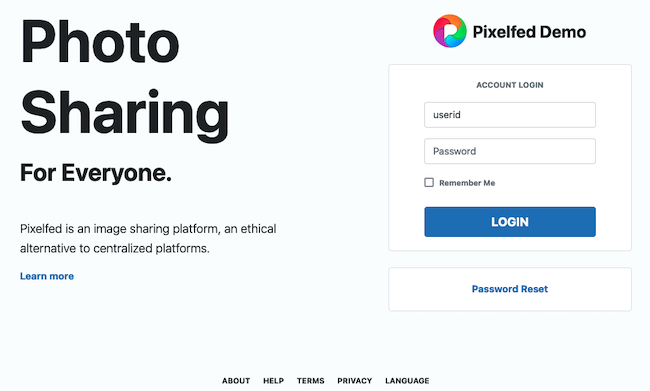
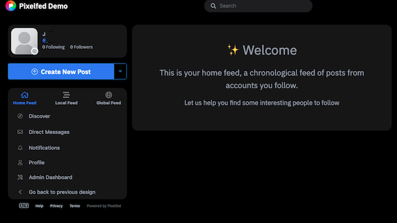
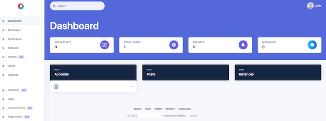

[Pixelfed](https://pixelfed.org/) is a decentralized federated application that allows users to share photos, art, and videos. This guide explains how to install and configure Pixelfed and provides details about all prerequisites.

## What is the Federated Web?

Mastodon, Pixelfed, and other applications make up the *federated web*, also known as the *Fediverse*. The Fediverse is a collection of independent yet interconnected servers. Federated applications are said to be decentralized because there is no central server or administrative hierarchy. Each server is typically self-hosted, but users can join any server. In many cases, a user account can cross server boundaries and access or post content to multiple servers. The Fediverse is frequently used to host web content, including websites, social networks, and blogs.

## What is Pixelfed?

Pixelfed is a decentralized and open-source alternative to corporate photo-sharing sites such as Instagram. Users can self-host their own Pixelfed account or join one of many community servers. Pixelfed is free to download and use and does not have any ads. Pixelfed maintains privacy-friendly policies and does not store or sell user data.

Some of the main features of Pixelfed are as follows:

-   Chronological feeds that are free from algorithmic intrusion
-   Support for the ActivityPub Protocol to allow users to follow and interact with Mastodon posts from their Pixelfed account
-   Mobile support
-   Photos can be grouped into albums
-   A wide selection of filters
-   Support for comments, direct messages, and likes
-   The "Stories" feature for time-limited sharing
-   A wide range of privacy and safety-oriented features. Users can manually approve followers, add follower-only posts, mute/block accounts, report accounts, and disable comments.

For a more complete list of Pixelfed features, see the [Pixelfed features page](https://pixelfed.org/features).

## Before You Begin

1.  If you have not already done so, create a Linode account and Compute Instance. See our [Getting Started with Linode](/docs/products/platform/get-started/) and [Creating a Compute Instance](/docs/products/compute/compute-instances/guides/create/) guides.

1.  Follow our [Setting Up and Securing a Compute Instance](/docs/products/compute/compute-instances/guides/set-up-and-secure/) guide to update your system. You may also wish to set the timezone, configure your hostname, create a limited user account, and harden SSH access.

1.  Assign a domain name for the Pixelfed server and point it at the IP address of the server. For information on domain names and pointing a domain name to a Linode, see the [Linode DNS Manager guide](/docs/products/networking/dns-manager/).

1.  (**Optional**) To allow Pixelfed to send emails, enable email on the Linode server.


The steps in this guide are written for non-root users. Commands that require elevated privileges are prefixed with `sudo`. If you are not familiar with the `sudo` command, see the [Linux Users and Groups](/docs/guides/linux-users-and-groups/) guide.


## How to Configure the Server to Support Pixelfed

Pixelfed requires a large number of supporting applications, including a full LAMP or LEMP stack. It also requires the extensive use of `composer` and `artisan` installation scripts.

The following instructions explain how to install Pixelfed on Ubuntu 22.04, but are generally applicable for most Linux distributions.


The Pixelfed application is still in Beta mode and users might run into defects. Therefore, sites requiring high availability should consider another option.


### Install the LEMP Stack and Other Prerequisites

Pixelfed requires a web server, database, and the PHP programming language to operate. The Linux stack can use either Apache or NGINX for the web server. This guide provides instructions for NGINX, which integrates more easily with Pixelfed. This guide points out the sections where the Apache installation method differs, but does not provide detailed Apache instructions. For the database, either MariaDB or MySQL can be used. In both cases, the database configuration is the same. To install a LEMP stack for Pixelfed, follow the steps below:

1.  Install the NGINX web server.

        sudo apt install nginx

1.  Use `systemctl` to confirm NGINX is `active`.

    ```command
    sudo systemctl status nginx
    ```

    ```output
    nginx.service - A high performance web server and a reverse proxy server
        Loaded: loaded (/lib/systemd/system/nginx.service; enabled; vendor preset: enabled)
        Active: active (running) since Tue 2022-11-29 13:01:56 UTC; 15s ago
    ```

1.  Install the MariaDB database.

    ```command
    sudo apt install mariadb-server
    ```

1.  Configure the `ufw `firewall to accept NGINX connections. Allow the `Nginx Full` profile to permit both HTTP and HTTPS connections. This profile is mandatory because Pixelfed requires HTTPS for uploads.

    ```command
    sudo ufw allow OpenSSH
    sudo ufw allow in "Nginx Full"
    sudo ufw enable
    ```

    
After installing Pixelfed and enabling HTTPS, consider changing the `ufw` profile to `Nginx HTTPS`. This setting limits firewall access to HTTPS traffic only.
    

1.  Verify the firewall settings using the `ufw status` command.

    ```command
    sudo ufw status
    ```

    ```output
    Status: active

    To                         Action      From
    --                         ------      ----
    OpenSSH                    ALLOW       Anywhere
    Nginx Full                 ALLOW       Anywhere
    OpenSSH (v6)               ALLOW       Anywhere (v6)
    Nginx Full (v6)            ALLOW       Anywhere (v6)
    ```

1.  Visit the IP address of the webserver to ensure web access is operational. The browser should display the default NGINX welcome page, including the message “Welcome to nginx!”.

    
    Use the Linode Dashboard to determine the address of the Linode.
    

1.  Run the `mysql_secure_installation` tool to increase the security of the database.

    ```command
    sudo mysql_secure_installation
    ```

1.  The script prompts several responses. It is not necessary to switch over to Unix socket authentication or change the root password. Answer `Y` to the remaining questions.

    - `Remove anonymous users?`
    - `Disallow root login remotely?`
    - `Remove test database and access to it?`
    - `Reload privilege tables now?`

1.  Install PHP including all supporting packages.

    ```command
    sudo apt install -y php-gd php-bcmath php-ctype php-curl php-exif php-iconv php-intl php-json  php-imagick php-services-json php-mbstring php-tokenizer php-xml php-zip php-mysql php-fpm
    ```

1. Pixelfed requires some additional packages, including image processing utilities. The following command installs the Redis database and its PHP package, supporting utilities such as `git` and `composer`, and image processing packages including `jpegoptim`.

    
    Some utilities might already be installed on the server.
    

    ```command
    sudo apt install -y php-redis ffmpeg redis git libgl-dev gcc libc6-dev libjpeg-dev  make jpegoptim optipng pngquant graphicsmagick gifsicle composer zip unzip
    ```


For enhanced security, especially in a multi-user server, consider creating a dedicated `pixelfed` user to run Pixelfed. Remember to switch to this user when installing and configuring the application. See the [Pixelfed Prerequisites information](https://docs.pixelfed.org/running-pixelfed/prerequisites/#creating-a-dedicated-app-user-and-using-unix-sockets-optional) for more information.


### Configure the Database and PHP

After installing the LAMP/LEMP stack and the other mandatory packages, more configuration is still required. The steps in this section explain how to configure the database and virtual host to support Pixelfed.

1.  Log in to the database as `root`.

    ```command
    sudo mysql -u root -p
    ```

1.  Create the `pixelfed` database and the `pixelfed` database user. Flush the privileges and exit the database. Replace `PASSWORD` with a unique secure password.

    ```command
    CREATE DATABASE pixelfed;
    CREATE USER 'pixelfed'@'localhost' IDENTIFIED BY 'PASSWORD';
    GRANT ALL PRIVILEGES ON pixelfed.* TO 'pixelfed'@'localhost';
    FLUSH PRIVILEGES;
    EXIT
    ```

1.  Update the `php.ini` file with new settings for Pixelfed. This file can be found at `/etc/php/<php_version>/fpm/php.ini`, where `php_version` is the release of PHP used on the server. For instance, if PHP `8.1` is installed, the file, `php.ini` can be found at `/etc/php/8.1/fpm/php.ini`. To check which version of PHP is installed, you can use the command `php -v`. Make the following changes to the file:

    - Set `post_max_size` to the maximum size for any submission. The default is `8M`, but this might not be large enough for high-quality photos or animation.
    - Ensure `file_uploads` is set to `On`.
    - The value of `upload_max_filesize` must be `<=` the value of `post_max_size`.
    - Set `max_file_uploads` to the maximum number of attachments for any upload. The default is `20`.
    - Increase `max_execution_time` to 600.

    
These settings are found in different sections of the file. In the `vi` editor, use the `/` key to search for the name of the setting.
    

    ```file {title="/etc/php/8.1/fpm/php.ini" lang="aconf"}
    max_execution_time = 600
    post_max_size = 8M
    file_uploads = On
    upload_max_filesize = 6M
    max_file_uploads = 20
    ```

### Configure a Virtual Host and HTTPS Support

The next step is to create a virtual host file for the Pixelfed domain. A virtual host allows for the configuration of domain-specific settings. Pixelfed requires HTTPS support, which can be enabled using the [Certbot](https://certbot.eff.org/) application. This guide covers the main steps required to install and use Certbot. For more detailed information about Certbot, Let's Encrypt certificates, and HTTPS, see the [Linode guide to Using Certbot on NGINX](/docs/guides/enabling-https-using-certbot-with-nginx-on-ubuntu/).

1.  Create a `/var/www/html/domain_name` directory for the Pixelfed site. In the following command, replace `example.com` with the actual name of the domain.

    ```command
    sudo mkdir -p /var/www/html/example.com
    ```

1.  Copy the default site configuration file to the `sites-enabled` directory. This ensures the formatting is correct and all essential fields are included. Use the domain name in place of `example.com`.

    ```command
    sudo cp /etc/nginx/sites-enabled/default /etc/nginx/sites-available/example.com.conf
    ```

1.  Edit the site's `.conf` file. Delete the existing server configuration all the way to the line `Virtual Host configuration for example.com` and uncomment the remaining lines. All further changes must be made inside the code block beginning with the `server`. Change the `server_name` and `root` fields inside the `server` block to reference the Pixelfed domain. In the following example, replace `example.com` with the actual domain name. The remaining changes can be made after HTTPS is enabled.

    
    When Pixelfed is installed inside the `/var/www/html/domain_name` directory, it creates a new `public` subdirectory. The `root` variable must point to this directory. For Apache, add this configuration to `/etc/apache2/sites-available/example.com.conf` instead. The directive names are `ServerName` and `DocumentRoot` on Apache.
    

    ```file {title="/etc/nginx/sites-available/example.com.conf" lang="nginx"}
    server_name example.com www.example.com;
    root /var/www/html/example.com/public;
    ```

1.  Create a symbolic link to the `sites-enabled` directory to enable the site.

    ```command
    sudo ln -s /etc/nginx/sites-available/example.com.conf /etc/nginx/sites-enabled/
    ```

1.  Certbot is now a Snap package. To use Snap, install the `snapd` package and initialize it.

    ```command
    sudo apt install snapd
    sudo snap install core
    ```

1.  Remove any old `certbot` Ubuntu packages to avoid conflicts. Use `snap` to install a new `certbot` package. Create a symbolic link to the `certbot` directory.

    ```command
    sudo apt remove certbot
    sudo snap install --classic certbot
    sudo ln -s /snap/bin/certbot /usr/bin/certbot
    ```

1.  Use `certbot` to install a certificate for the domain. Add the `--nginx` option to use the NGINX plugin. This option also edits the virtual host file to simplify the configuration process.

    
    To request a certificate without changing the virtual host settings, use the `certonly` option, for example, `sudo certbot certonly --nginx`. To configure Apache, run the command `sudo certbot --apache` instead.
    

    ```command
    sudo certbot --nginx
    ```

1.  During the installation process, Certbot prompts for extra information including a email address and domain name. The following instructions apply to the configuration process.

    -   **Enter an email address**: Certbot requests an email address where it can send urgent notices about the domain or registration.
    -   **Accept the terms of service**: To agree to the terms, enter `Y.` Enter `N` to terminate the certificate request. Use the link in the output to download the PDF file and review the terms.
    -   **Optionally subscribe to mailing list**: Answer either `Y` or `N` when asked whether to subscribe to the EFF mailing list. This setting does not affect the rest of the installation.
    -   **Enter the domain name(s)**: Certbot requests one or more domain names for the certificate. Certbot displays the names of any eligible domains based on the contents of the virtual host files. Select the numbers corresponding to the relevant domains, including a space between each number. If the domain name does not appear, enter the domain name without the `http` or `https` prefix, for example, `example.com`. If there is more than one domain to certify, separate the names using either a space or a comma. Remember to request separate certificates with and without the `www` prefix for each domain.

    Certbot contacts Let’s Encrypt to request the certificate(s) and perform any necessary challenges. In most cases, ownership can be proven through an HTTP challenge. If the operation is successful, Certbot confirms the successful grant request. It also displays some information about the certificates and key chains, along with the expiration date. Certificates typically expire in 90 days.

    ```output
    Requesting a certificate for example.com and www.example.com

    Successfully received certificate.
    Certificate is saved at: /etc/letsencrypt/live/example.com/fullchain.pem
    Key is saved at:         /etc/letsencrypt/live/example.com/privkey.pem
    This certificate expires on 2023-02-28.
    These files will be updated when the certificate renews.
    Certbot has set up a scheduled task to automatically renew this certificate in the background.

    Deploying certificate
    Successfully deployed certificate for example.com to /etc/nginx/sites-enabled/example.com.conf
    Successfully deployed certificate for www.example.com to /etc/nginx/sites-enabled/example.com.conf
    Congratulations! You have successfully enabled HTTPS on https://example.com and https://www.example.com
    ```

1.  Edit the site configuration file at `/etc/nginx/sites-available/example.com.conf`, using the sample file as a template. Make the following changes to the file:
    -   Add the three `add_header` directives to the top of the file.
    -   Add the string `index.htm index.php` to the `index` directive.
    -   Add `/index.php?$query_string` to the `try_files` directive inside the `location /` block.
    -   Add `location` directives for `/favicon.ico` and `/robots.txt`.
    -   Add the `error_page`, `charset`, and `client_max_body_size` directives.
    -   Add the `location ~ \.php$` block. For the `fastcgi_pass` directive, change the filename `php8.1-fpm.sock` to reflect the PHP release. For example, if PHP release `7.4` is installed, the name of the file is `php7.4-fpm.sock`. To confirm the PHP release, use the `php -v` command.
    -   Do not change any of the lines added by Certbot. This section begins with the line `listen [::]:443`.

    
    For the Apache web server, add the configuration above to the `/etc/apache2/sites-available/example.com.conf` file. Many directive names are slightly different on Apache. See the [Pixelfed Apache instructions](https://docs.pixelfed.org/running-pixelfed/installation/#handling-web-requests) or consult the Apache documentation for more information.
    
"
    ```file {title="/etc/nginx/sites-available/example.com.conf" lang="nginx"}
    server {
        add_header X-Frame-Options "SAMEORIGIN";
        add_header X-XSS-Protection "1; mode=block";
        add_header X-Content-Type-Options "nosniff";

        server_name example.com example.com;

        root  /var/www/html/example.com/public;
        index index.html index.htm index.php;

        location / {
            try_files $uri $uri/ /index.php?$query_string;
        }

        location = /favicon.ico { access_log off; log_not_found off; }
        location = /robots.txt  { access_log off; log_not_found off; }

        charset utf-8;
        client_max_body_size 15M;   # or your desired limit
        error_page 404 /index.php;

        # pass PHP scripts to FastCGI server
        #
        location ~ \.php$ {
            include snippets/fastcgi-php.conf;
            # With php-fpm (or other unix sockets):
            fastcgi_pass unix:/var/run/php/php8.1-fpm.sock;
        }
        listen [::]:443 ssl ipv6only=on; # managed by Certbot
        listen 443 ssl; # managed by Certbot
        ssl_certificate /etc/letsencrypt/live/example.com/fullchain.pem; # managed by Certbot
        ssl_certificate_key /etc/letsencrypt/live/example.com/privkey.pem; # managed by Certbot
        include /etc/letsencrypt/options-ssl-nginx.conf; # managed by Certbot
        ssl_dhparam /etc/letsencrypt/ssl-dhparams.pem; # managed by Certbot
    }

    server {
        if ($host = www.example.com) {
            return 301 https://$host$request_uri;
        } # managed by Certbot

        if ($host = example.com) {
            return 301 https://$host$request_uri;
        } # managed by Certbot

        listen 80;
        listen [::]:80;

        server_name example.com www.example.com;
        return 404; # managed by Certbot
    }
    ```

1. Test the NGINX configuration. If no errors are found, reload NGINX.

    ```command
    sudo nginx -t
    sudo systemctl reload nginx
    ```

## Install and Configure Pixelfed

### Install Pixelfed

The LEMP/LAMP stack and all settings are now ready to support Pixelfed. Clone and download Pixelfed using `git`.

1.  Change to the `root` directory for the domain at `/var/www/html/example.com`. Substitute the actual domain name for `example.com`.

    ```command
    cd /var/www/html/example.com/
    ```

1.  Use `git` to `clone` the Pixelfed files.

    ```command
    git clone -b dev https://github.com/pixelfed/pixelfed.git .
    ```

1.  Recursively set the owner and permissions for the new directories.

    ```command
    sudo chown -R www-data:www-data .
    sudo find . -type d -exec chmod 755 {} \;
    sudo find . -type f -exec chmod 644 {} \;
    ```

### Configure Pixelfed

Use the `composer` tool to initialize and configure PHP. Additionally, changes must be made to the `.env` file. For more in-depth information about the Pixelfed configuration, see the [Pixelfed Documentation](https://docs.pixelfed.org/).

1.  From the same directory, use `composer` to initialize the PHP settings for Pixelfed.

    ```command
    sudo composer install --no-ansi --no-interaction --optimize-autoloader
    ```

1.  Create a new copy of the sample `.env` file.

    ```command
    sudo cp .env.example .env
    ```

1.  Edit the `.env` file and edit the following server variables. Leave the other variables set to their current values.

    -   **APP_NAME**: This is the title to display in the header bar and elsewhere throughout the application.
    -   **APP_ENV**: This should be set to `debug` for a test environment and `production` otherwise.
    -   **APP_DEBUG**: This should be set to `true` for debugging and `false` otherwise.
    -   **APP_URL**: This field contains the HTTP URL for the Pixelfed domain, for example, `https://example.com`.
    -   **APP_DOMAIN**: Set this to the domain name without the HTTPS prefix. For the URL above, this is `example.com`.
    -   **ADMIN_DOMAIN**: Set this to the domain name.
    -   **SESSION_DOMAIN**: Set this to the domain name.
    -   **DB_CONNECTION**: For MySQL and MariaDB databases set this to `mysql`.
    -   **DB_HOST**: Set this to `127.0.0.1`.
    -   **DB_PORT**: This is `3306` for MySQL and MariaDB installations.
    -   **DB_DATABASE**: Set this to `pixelfed`.
    -   **DB_USERNAME**: Set this to `pixelfed`.
    -   **DB_PASSWORD**: Specify the password provided when creating the `pixelfed` user.

        ```command
        vi .env
        ```

    ```file {title="/var/www/html/example.com/.env" lang="env"}
    APP_NAME="Pixelfed Demo"
    APP_ENV=production

    APP_URL=https://example.com
    APP_DOMAIN="example.com"
    ADMIN_DOMAIN="example.com"
    SESSION_DOMAIN="example.com"
    TRUST_PROXIES="*"

    DB_CONNECTION=mysql
    DB_HOST=127.0.0.1
    DB_PORT=3306
    DB_DATABASE=pixelfed
    DB_USERNAME=pixelfed
    DB_PASSWORD=<Database_Password>
    ```

1.  (**Optional**) By default, Pixelfed does not send emails. To allow Pixelfed to send emails, change the `MAIL_` variables in `.env` to the correct mail server settings. See the [Pixelfed Email Settings example](https://docs.pixelfed.org/running-pixelfed/installation/#email-variables) for instructions.

### Run the Pixelfed Installation Scripts

Pixelfed does not use a single set-up script. It is necessary to run a large number of `php artisan` commands to configure the different parts of the system. To run the install scripts, follow the steps below:

1.  Change to the domain root directory and generate the secret key. In the following example, change `example.com` to the name of the domain.

    ```command
    cd /var/www/html/example.com
    sudo php artisan key:generate
    ```

    ```output
    INFO  Application key set successfully.
    ```

1.  Link the application storage directory.

    ```command
    sudo php artisan storage:link
    ```

    ```output
    INFO  The [public/storage] link has been connected to [storage/app/public].
    ```

1.  Migrate the database.

    ```command
    sudo php artisan migrate --force
    ```

1.  Import the city data set to enable support for location data.

    ```command
    sudo php artisan import:cities
    ```

    ```output
    Successfully imported 128769 entries!
    ```

1.  Cache the Pixelfed routes and views to allow for better performance.

    ```command
    php artisan route:cache
    php artisan view:cache
    ```

    ```output
    INFO  Routes cached successfully.
    INFO  Blade templates cached successfully.
    ```

1.  Cache the Pixelfed configuration.

    
    Run this command each time the `.env` file changes.
    

    ```command
    sudo php artisan config:cache
    ```

    ```output
    INFO  Configuration cached successfully.
    ```

1.  Enable the Horizon dashboard and job queueing.

    
    Pixelfed supports other queueing methods, but `horizon` is the most straightforward. Consult the [Pixelfed documentation](https://docs.pixelfed.org/running-pixelfed/) for more details.
    

    ```command
    sudo php artisan horizon:install
    sudo php artisan horizon:publish
    ```

    ```output
    Horizon scaffolding installed successfully.
    INFO  Publishing [horizon-assets] assets
    ```

1.  Add a cron job to regularly schedule the clean-up task. Open the root `crontab` file.

    ```command
    sudo crontab -e
    ```

1.  Add the following crontab entry to the bottom of the file.

    ```code
    * * * * * /usr/bin/php /usr/share/webapps/pixelfed/artisan schedule:run >> /dev/null 2>&1
    ```

### Enable the Pixelfed Service in Systemctl

The easiest way to start and stop Pixelfed is to run it as a `systemctl` service. To add Pixelfed to the system daemon, follow the steps below:

1.  Create a service entry file named `pixelfed.service` in `/etc/systemd/system`.

    ```command
    sudo vi /etc/systemd/system/pixelfed.service
    ```

1.  Add the following service description. For the `ExecStart` parameter, replace `example.com` with the actual name of the domain.

    
    Apache users should change `requires=nginx` to `requires=apache`.
    

    ```file {title="/etc/systemd/system/pixelfed.service" lang="systemd"}
    [Unit]
    Description=Pixelfed task queueing via Laravel Horizon
    After=network.target
    Requires=mariadb
    Requires=php-fpm
    Requires=redis
    Requires=nginx

    [Service]
    Type=simple
    ExecStart=/usr/bin/php /var/www/html/example.com/artisan horizon
    Restart=on-failure

    [Install]
    WantedBy=multi-user.target
    ```

1.  Enable the service using `systemctl enable`.

    ```command
    sudo systemctl enable --now pixelfed
    ```

1.  Restart the service and verify it is active.

    ```command
    sudo systemctl restart pixelfed.service
    sudo systemctl status  pixelfed.service
    ```

    ```output
    pixelfed.service - Pixelfed task queueing via Laravel Horizon
        Loaded: loaded (/etc/systemd/system/pixelfed.service; enabled; vendor preset: enabled)
        Active: active (running) since Thu 2022-12-01 10:24:42 UTC; 3s ago
    ```

### Create a Pixelfed Administrator and Use the Pixelfed Web Interface

To access the Pixelfed administration dashboard, first create an administrative account using the `php artisan user:create` command. Additional user accounts can be created using the Pixelfed web interface. Follow the steps below to create an administrator account.

1.  Change to the root directory of the Pixelfed domain. Run the `artisan` account creation script. In the following example, replace `example.com` with the name of the domain.

    ```command
    cd /var/www/html/example.com
    sudo php artisan user:create
    ```

1.  When prompted, provide the following information.

    - **Name**: This is the public-facing name for the account.
    - **Username**: This is the internal name of the account.
    - **Email**: This is the email address for the account.
    - **Password/Confirm Password**: Provide a secure password for the account.
    - **Make this user an admin? (yes/no)**: Answer `yes` to create an administrative account.
    - **Manually verify email address? (yes/no)**: It is safe to answer `no` in this case because the account is being created internally. To answer `yes`, email must be enabled on both Pixelfed and Linode.
    - **Are you sure you want to create this user? (yes/no)**: Answer `yes` to create the user of the account.

    ```output
    Created new user!
    ```

1.  Using a web browser, navigate to the site domain name. The browser should display the Pixelfed login page. Enter the administrator email address and password.

    

1.  Pixelfed displays the home page for the account.

    

1.  To access the administration dashboard, click **Admin Dashboard** on the left-hand menu. When prompted, enter the account password. Pixelfed displays the dashboard.

    

For more information on using or administering Pixelfed, consult the [Pixelfed documentation](https://docs.pixelfed.org/).

## Conclusion

Pixelfed is a federated open-source application for sharing photos, art, and videos. Each Pixelfed server is operated independently as part of a distributed network with no central authority. Pixelfed is free to use and can be downloaded using `git`. Pixelfed requires a LAMP or LEMP stack, along with several other helper applications. To install and configure Pixelfed, use the `composer` and `artisan` scripts. Administrator accounts must also be created beforehand using a console. The Pixelfed web portal allows other users to create accounts, while administrators can manage the site using the Pixelfed Dashboard. For more information on administering a Pixelfed server, see the [Pixelfed documentation](https://docs.pixelfed.org/).
