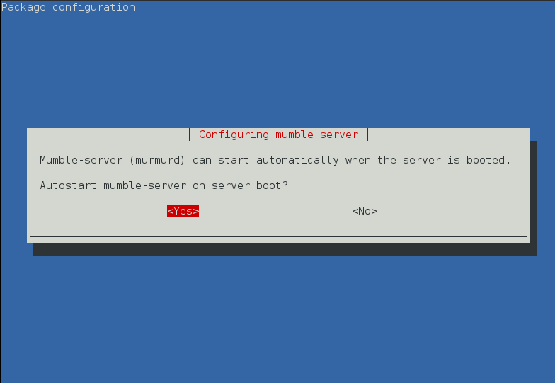
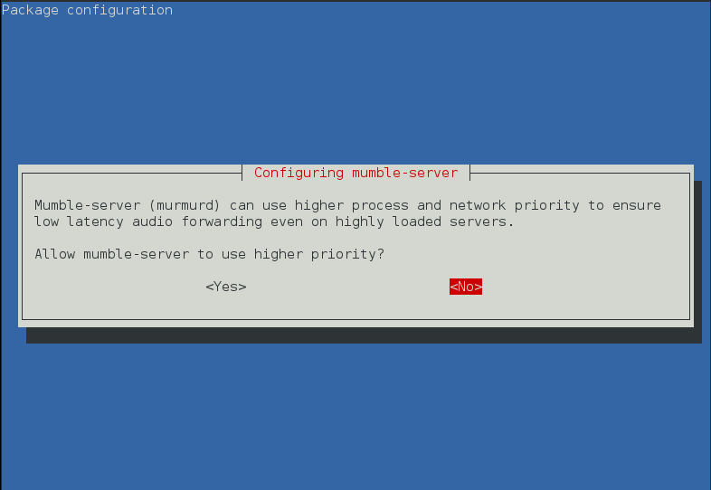
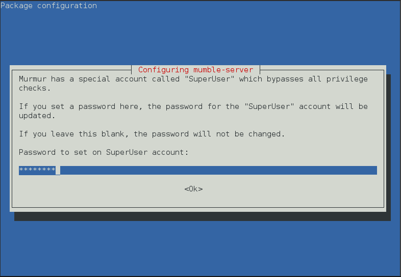
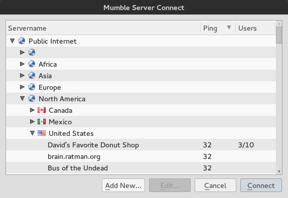
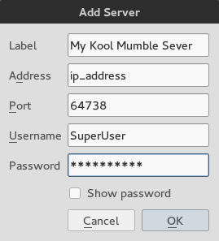
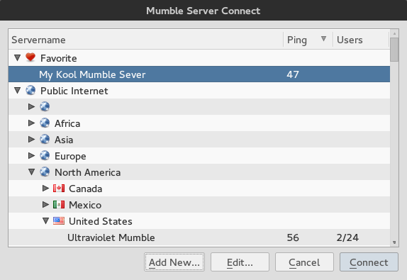
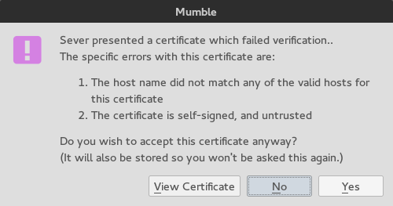
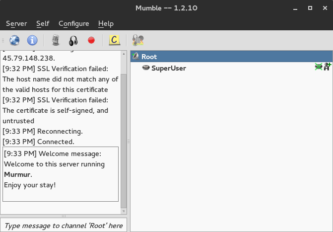
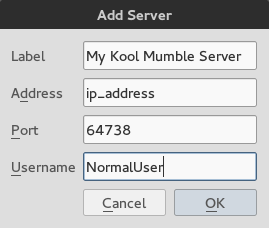
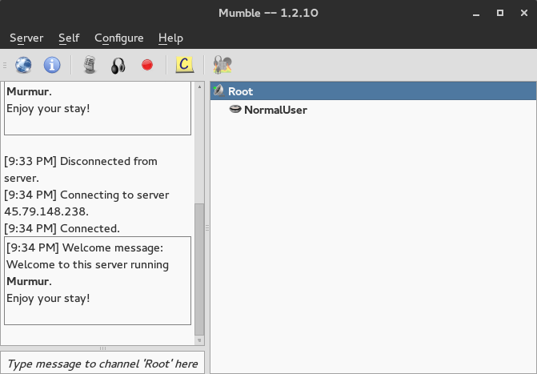

[Mumble](http://wiki.mumble.info/wiki/Main_Page) is an open-source VoIP client, designed for gamers, that requires a server for all clients to connect to. This guide instructs how to install and configure the Mumble server (also called Murmur) on Debian.

## Before You Begin

1.  Familiarize yourself with our [Getting Started](/docs/products/platform/get-started/) guide and complete the steps for setting your Linode's hostname and timezone.

2.  Complete the sections of our [Securing Your Server](/docs/products/compute/compute-instances/guides/set-up-and-secure/) guide to create a standard user account, harden SSH access and remove unnecessary network services.

3.  Update your system.

        sudo apt-get update && sudo apt-get upgrade

    
This guide is written for non-root users. Commands that require elevated privileges are prefixed with sudo. If you are not familiar with the sudo command, you can check out our [Users and Groups](/docs/guides/linux-users-and-groups/) guide.


## Mumble Server

### Install Mumble

1.  Since Murmur is in the official Debian repositories, you can use *apt-get* to install it.  Be careful though, the package is `mumble-server` and *not* `murmur`.

        sudo apt-get install mumble-server

2.  After installation, run the initial configuration:

        sudo dpkg-reconfigure mumble-server

3.  The first question asked is if you want the server to run at boot. Select `Yes` unless you would prefer to manually start Mumble after a server reboot.

    

    
If you wish to disable the server starting at boot, you can use your init system to disable it.

For Debian 8:

`sudo systemctl disable mumble-server`

For Debian 7 or earlier:

`sudo service mumble-server disable`


4.  Mumble will then ask if you want to reduce latency by setting a higher CPU and network priority.

    

    If you want Murmur to have priority over other applications on the server, you can answer **Yes** to this question.

5.  Next, you will be asked to set a *SuperUser* password. Murmur has a SuperUser account that lets you change server settings from the Mumble client. You may set it to whatever password you want.

    

    You now have a working Mumble server.  It's time to configure it further.

### Configure Server Settings

1.  If you need to address more exact configuration specifics, such as assigning port numbers and/or maximum users, Murmur has a settings file at `/etc/mumble-server.ini`. Below is a partial list of settings included; more settings exist and are further explained in the file.

    | Setting               | Description
    |:----------------------|:----------------------------------------------------------------------------------------|
    | autobanAttempts   | Set how many times someone can fail to connect to the server within a given timeframe.  |
    | autobanTimeframe  | Set the given timeframe for attempts to login to the server.                            |
    | autobanTime       | Set the amount of time that the login ban lasts.                                        |
    | logfile           | Set the location of the log file, if you want it to reside in a different location.     |
    | welcometext       | Set the text that shows in the text chat log when you login.                            |
    | port              | Set the port you wish to bind to and have your users connect to.                        |
    | serverpassword    | Set a password that users will have to use to login.  This is not the same as the SuperUser password and therefore, should be different. |
    | bandwidth         | Set the maximum bandwidth (in bits per second) each user can use.                        |
    | users             | Set the maximum number of users that can connect to the server at once.                 |

2.  Once you are done, save and restart Murmur.

    For Debian 8:

        sudo systemctl restart mumble-server

    For Debian 7 or earlier:

        sudo service mumble-server restart

## Mumble Client

### Installation

**OS X or Windows**

Installer available at [Mumble's Wiki](http://wiki.mumble.info/wiki/Main_Page).

**Linux**

The package `mumble` is available in most distribution's repositories. See [Mumble's Wiki](http://wiki.mumble.info/wiki/Installing_Mumble) for more distro-specific information.

### Connecting As SuperUser

After installing the client and server, if you want to grant permissions to other users or make changes to the server, you must connect as SuperUser. Be aware! SuperUser cannot be used to speak on the server, only to make changes.

1.  To connect, open the client, then click **Server**, then **Connect**.  This opens the Mumble Server Connect dialog.

    

    Next, click **Add New** at the bottom and enter the following.

    - **Label** - Name this anything you want.
    - **Address** - Enter the IP address or domain name of the server.
    - **Port** - Leave this as default (64738), unless you changed it in the server's configuration.
    - **Username** - Identify the SuperUser username.
    - **Password** - Set this to whatever you set the SuperUser password to in the server's setup.

    

2.  Once these additions have been made to your server list, select it and click **Connect**.

    

3.  Mumble may then ask you if you want to accept a self-signed certificate.  Since we never set up an SSL certificate, select **Yes**.

    

4.  You should now be connected as SuperUser. You can make changes to the server by right-clicking the *Root* channel and selecting **Edit**. Please refer to the [Mumble Wiki](http://wiki.mumble.info/wiki/Main_Page) for more information on how to configure channels.

    

### Connecting As Normal User

When a normal user connects, you follow the same relative process as you did to connect as the SuperUser. However, a password is not necessary (unless you set one, with which you can then use to communicate).

1.  To open the Mumble Server Connect dialog, first open the client, then click **Server**, and then **Connect**. The following appears on your screen:

    

2.  At page bottom, click **Add New**, then enter the following:

    - **Label** - Name this anything you want.
    - **Address** - Enter the IP address or domain name of the server.
    - **Port** - Leave this as default (64738), unless you changed it in the server's configuration.
    - **Username** - Your identifier on the server, name this anything you want.

    

    You should now be logged in as a normal user and can use the server as a user with limited privileges.

    
