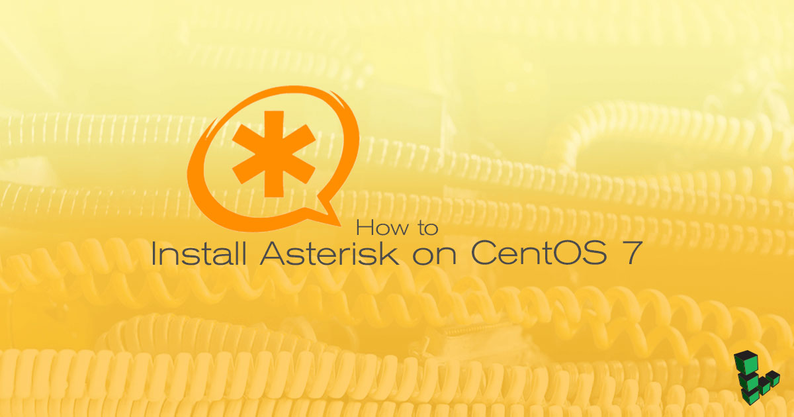

## What is Asterisk?

Asterisk is an open source *private branch exchange* (PBX) server that uses *Session Initiation Protocol* (SIP) to route and manage telephone calls. Notable features include customer service queues, music on hold, conference calling, and call recording, among others.

This guide covers the steps necessary to provision a new CentOS 7 Linode as a dedicated Asterisk server for your home or office.


This guide is written for a non-root user. Commands that require elevated privileges are prefixed with `sudo`. If you're not familiar with the `sudo` command, you can check our [Users and Groups](/docs/guides/linux-users-and-groups/) guide.


## Before You Begin

1.  Create a CentOS 7 Linode in your closest data center. A 2GB Linode is enough to handle 10-20 concurrent calls using a non-compressed codec, depending on the processing required on each channel.

1.  Ensure you have followed the [Getting Started](/docs/products/platform/get-started/) and [Setting Up and Securing a Compute Instance](/docs/products/compute/compute-instances/guides/set-up-and-secure/) guides to prepare your Linode. **Do not** complete the steps to set up a firewall.

1.  Update your system:

        sudo yum update

1.  Disable SELinux and reboot your Linode. If you have [Lassie](/docs/products/compute/compute-instances/guides/monitor-and-maintain/#configure-shutdown-watchdog) enabled, your Linode is back up and running in a few minutes.

        sed -i 's/SELINUX=enforcing/SELINUX=disabled/g' /etc/selinux/config

        sudo systemctl reboot

## Configure firewalld

1.  CentOS 7 enables firewalld's `public` zone for the default interface (`eth0`). SSH and DHCPv6 services are also enabled by default. To verify your current firewalld zone:

        sudo firewall-cmd --get-active-zones
        sudo firewall-cmd --permanent --list-services

    That should return:

    
[user@asterisk ~]$ sudo firewall-cmd --get-active-zones
public
  interfaces: eth0


    And:

    
[user@asterisk ~]$ sudo firewall-cmd --permanent --list-services
ssh dhcpv6-client


1.  Add the SIP services.

    
All the following firewalld rules contain the `--permanent` flag to ensure the rules persist after a system reboot.


        sudo firewall-cmd --zone=public --permanent --add-service={sip,sips}

1.  Depending on your needs, you may want to add other related ports:

    - MGCP - If you use media gateway control protocol in your configuration.

            sudo firewall-cmd --zone=public --permanent --add-port=2727/udp

    - RTP - The media stream - you can change this in `/etc/asterisk/rtp.conf`.

            sudo firewall-cmd --zone=public --permanent --add-port=10000-20000/udp

    - If you plan to use FreePBX to manage Asterisk, add the following rule:

            sudo firewall-cmd --zone=public --permanent --add-service={http,https}

    - IAX - If you need IAX, add the following rule. IAX is "Inter-Asterisk Exchange" and was meant to allow multiple Asterisk servers to communicate with one another. Some VOIP trunking providers use this, but most use SIP. Unless your VOIP provider requires it or you are running multiple Asterisk servers, you probably don't need IAX or IAX2.

            sudo firewall-cmd --zone=public --permanent --add-port=4569/udp

1.  Verify your new configuration with:

        sudo firewall-cmd --permanent --list-services
        sudo firewall-cmd --permanent --list-ports

    You should see the services and ports you just added in addition to default SSH and DCHPv6 services:

    
[user@asterisk ~]$ sudo firewall-cmd --list-ports
2727/udp 10000-20000/udp 4569/udp


    
[user@asterisk ~]$ sudo firewall-cmd --permanent --list-services
ssh dhcpv6-client sip sips http https


## Install PJPROJECT

PJPROJECT is Asterisk's SIP channel driver. It should improve call clarity and performance over older drivers.

1.  Install build dependencies:

        sudo yum install epel-release gcc-c++ ncurses-devel libxml2-devel wget openssl-devel newt-devel kernel-devel-`uname -r` sqlite-devel libuuid-devel gtk2-devel jansson-devel binutils-devel bzip2 patch libedit libedit-devel

1.  As **a non-root user**, create a working directory for the build:

        mkdir ~/build-asterisk

1.  Change to that directory:

        cd ~/build-asterisk

1.  Use `wget` to download the PJSIP driver source code:

        wget https://www.pjsip.org/release/2.8/pjproject-2.8.tar.bz2

1.  Extract it:

        tar -jxvf pjproject-2.8.tar.bz2

1.  Change to the newly created directory:

        cd pjproject-2.8

1.  Specify the compiling flags and options:

        ./configure CFLAGS="-DNDEBUG -DPJ_HAS_IPV6=1" --prefix=/usr --libdir=/usr/lib64 --enable-shared --disable-video --disable-sound --disable-opencore-amr

1.  Ensure that all dependencies are in place:

        make dep

1.  If `make dep` completes successfully, then build the plugin. It should only take a few minutes.

        make

1.  Install the packages:

        sudo make install
        sudo ldconfig

1.  Ensure the libraries have been properly installed:

        sudo ldconfig -p | grep pj

    You should see:

        
    libpjsua2.so.2 (libc6,x86-64) => /lib64/libpjsua2.so.2
    libpjsua2.so (libc6,x86-64) => /lib64/libpjsua2.so
    libpjsua.so.2 (libc6,x86-64) => /lib64/libpjsua.so.2
    libpjsua.so (libc6,x86-64) => /lib64/libpjsua.so
    libpjsip.so.2 (libc6,x86-64) => /lib64/libpjsip.so.2
    libpjsip.so (libc6,x86-64) => /lib64/libpjsip.so
    libpjsip-ua.so.2 (libc6,x86-64) => /lib64/libpjsip-ua.so.2
    libpjsip-ua.so (libc6,x86-64) => /lib64/libpjsip-ua.so
    libpjsip-simple.so.2 (libc6,x86-64) => /lib64/libpjsip-simple.so.2
    libpjsip-simple.so (libc6,x86-64) => /lib64/libpjsip-simple.so
    libpjnath.so.2 (libc6,x86-64) => /lib64/libpjnath.so.2
    libpjnath.so (libc6,x86-64) => /lib64/libpjnath.so
    libpjmedia.so.2 (libc6,x86-64) => /lib64/libpjmedia.so.2
    libpjmedia.so (libc6,x86-64) => /lib64/libpjmedia.so
    libpjmedia-videodev.so.2 (libc6,x86-64) => /lib64/libpjmedia-videodev.so.2
    libpjmedia-videodev.so (libc6,x86-64) => /lib64/libpjmedia-videodev.so
    libpjmedia-codec.so.2 (libc6,x86-64) => /lib64/libpjmedia-codec.so.2
    libpjmedia-codec.so (libc6,x86-64) => /lib64/libpjmedia-codec.so
    libpjmedia-audiodev.so.2 (libc6,x86-64) => /lib64/libpjmedia-audiodev.so.2
    libpjmedia-audiodev.so (libc6,x86-64) => /lib64/libpjmedia-audiodev.so
    libpjlib-util.so.2 (libc6,x86-64) => /lib64/libpjlib-util.so.2
    libpjlib-util.so (libc6,x86-64) => /lib64/libpjlib-util.so
    libpj.so.2 (libc6,x86-64) => /lib64/libpj.so.2
    libpj.so (libc6,x86-64) => /lib64/libpj.so


<!--
## Install DAHDI (Optional)

DAHDI, or *Digium/Asterisk Hardware Device Interface*, is the kernel module that controls telephone interface cards. This type of card is usually used when adding Asterisk to an existing call center that uses older technology.

Since it's not possible to add physical cards to a virtual machine you probably won't need the DAHDI driver installed. There is one exception: if you plan to host conference calls on your Asterisk box where more than one person can join a conference room. DAHDI provides the required timing source for this feature to work.

#### Build DAHDI

1.  Be sure you're in your build directory. You don't want to build DAHDI from the `pjproject-*` directory you changed into earlier.

        cd ~/build-asterisk

1.  Download the latest version of DAHDI (version 3.0.0 at the time of this writing):

        wget http://downloads.asterisk.org/pub/telephony/dahdi-linux-complete/dahdi-linux-complete-current.tar.gz

1.  Untar the file:

        tar -zxvf dahdi-linux-complete-current.tar.gz

1.  Change to the new directory:

        cd dahdi-linux-complete-3.0.0+3.0.0/

    If the directory cannot be found, run the `ls` command and take note of the folder name and `cd` into that directory instead.

1.  Build DAHDI:

        make

1.  Install DAHDI:

        sudo make install
        sudo make config
-->

## Install Asterisk

1.  Return to your build directory:

        cd ~/build-asterisk

1.  Download the latest version of Asterisk 16:

        wget http://downloads.asterisk.org/pub/telephony/asterisk/asterisk-16-current.tar.gz

1.  Untar the file:

        tar -zxvf asterisk-16-current.tar.gz

1.  Switch to the new Asterisk directory, replacing `16.1.1` if needed:

        cd asterisk-16.1.1

### Enable MP3 Support

1.  To use MP3 files for Music on Hold, install Subversion:

        sudo yum install svn

1.  Run the configuration script:

        contrib/scripts/get_mp3_source.sh

### Configure and Build Asterisk

1.  In your build directory for Asterisk, run the `configure` script to prepare the Asterisk source code for compiling:

        ./configure --libdir=/usr/lib64 --with-jansson-bundled

1.  Start the build process. After a short while, you should see a menu on screen allowing you to configure the features you want to build. This also produces generic binaries instead of native architecture optimized binaries.

        make menuselect --disable BUILD_NATIVE menuselect.makeopts

1.  If you want to use the MP3 format with Music on Hold, you should select `Add-Ons`, then use the right arrow to move to the right-hand list. Navigate to `format_mp3` and press **Enter** to select it.

1.  Select additional core sound packages and Music on Hold packages in the left menu, and enable `.wav` format for your desired language (ie. use the `EN` package for English.).

1.  Press **F12** to save and exit.

1.  Compile Asterisk. When finished, you should see a message which says Asterisk has successfully been built.

        sudo make

1.  Install Asterisk:

        sudo make install

1.  Install sample configuration files:

        sudo make samples

1. Configure Asterisk to start itself automatically on boot:

        sudo make config

### Test Connection

You now have a working Asterisk phone server. Fire up Asterisk and make sure it runs.

1.  Start Asterisk:

        sudo systemctl start asterisk

1. To ensure that asterisk service starts even after a reboot, enable the service:

        sudo systemctl enable asterisk

1.  Connect to Asterisk:

        sudo asterisk -rvv

    You should see an output similar to the following:

    
Asterisk 16.0.0, Copyright (C) 1999 - 2018, Digium, Inc. and others.
Created by Mark Spencer <markster@digium.com>
Asterisk comes with ABSOLUTELY NO WARRANTY; type 'core show warranty' for details.
This is free software, with components licensed under the GNU General Public
License version 2 and other licenses; you are welcome to redistribute it under
certain conditions. Type 'core show license' for details.
=========================================================================
Connected to Asterisk 16.0.0 currently running on li73-122 (pid = 980)


1.  To see a list of possible commands:

        core show help

1.  To disconnect type:

        exit

    Once disconnected, Asterisk continues to run in the background.

## Next Steps

Now that you have an Asterisk server running on your Linode, it's time to connect some phones, add extensions, and configure the various options that are available with Asterisk. For detailed instructions, check out the Asterisk Project's guide to [Configuring Asterisk](https://wiki.asterisk.org/wiki/display/AST/Basic+PBX+Functionality).


When running a phone system on a remote server such as a Linode, it's always good practice to secure the signaling data with TLS and the audio portion of calls using SRTP to prevent eavesdropping. Once you have a working dial-plan, be sure to follow the [Secure Calling Guide](https://wiki.asterisk.org/wiki/display/AST/Secure+Calling) to encrypt your communications.

