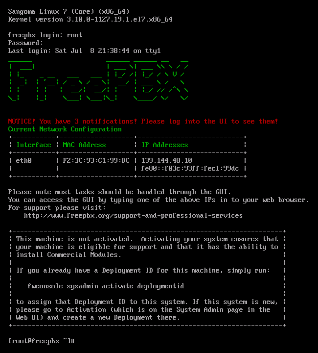
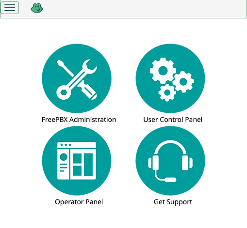
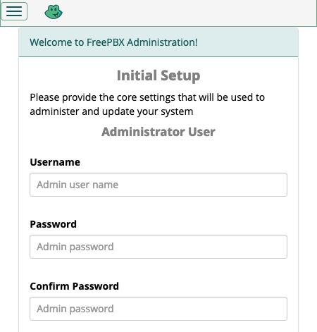
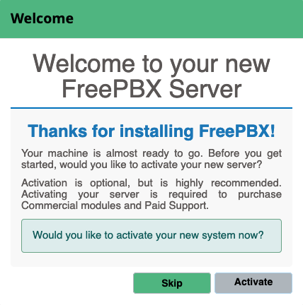
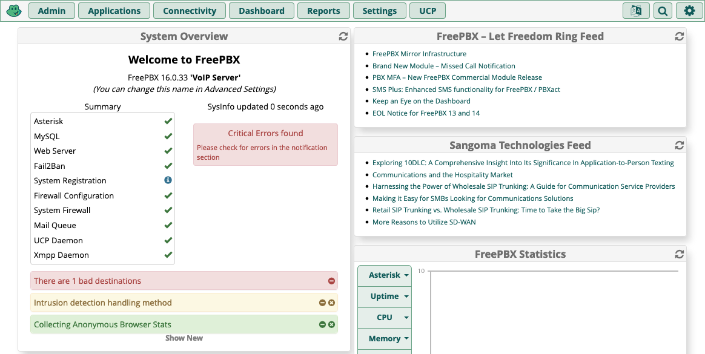

https://www.forbes.com/advisor/business/what-is-pbx/

https://www.linode.com/docs/products/compute/compute-instances/guides/install-a-custom-distribution/

https://www.linode.com/docs/products/tools/images/guides/upload-an-image/


FreePBX provides an open-source solution for managing calls and phone networking within your organization. Built on the powerful Asterisk VoIP server, FreePBX uses a convenient web-based graphical interface to manage virtually everything your phone system needs.

The main path for deploying FreePBX is using its custom Linux distribution, saving you from manual set up of the web and VoIP servers.

In this tutorial, find out more about FreePBX and see how you can deploy your own FreePBX distribution to Akamai Cloud.

## What Is FreePBX?

The [FreePBX](https://www.freepbx.org/) Linux distribution bundles together a full phone system solution, with VoIP server and a graphical interface to manage it conveniently.

But what is a PBX, and what sets FreePBX apart from other PBX systems? Find out here.

### What Is a PBX?

A Private Branch Exchange, or PBX, provides a private telephone network. Usually such a network provides internal phone communications within an organization. They are especially useful for dispersed teams or organizations spread over multiple locations.

PBX systems like FreePBX operate on an Internet rather than an analog network. Typically, such PBX systems use a VoIP (voice-over-Internet-protocol) server for phone communications. The VoIP server connects the internal phone network and manages outgoing and incoming calls beyond the private network.

With a VoIP PBX (also known as an IP PBX), a private telephone network can be made much more adaptable. Adding, removing, and modifying internal lines can be done without difficult and costly hardware changes, and often without any additional fees.

### Introducing FreePBX

FreePBX is a custom Linux distribution running an IP PBX and a web interface. The FreePBX system offers the robustness of the open-source Asterisk VoIP server, an accessible interface, and an engaged and supportive open-source community.

As such, FreePBX actually offers more than just an IP PBX solution. To break it down, a FreePBX system includes the following:

-   A custom Linux distribution (based on CentOS)

-   An Asterisk VoIP server

-   The FreePBX web interface

[Asterisk](https://www.asterisk.org/) is itself an open-source IP PBX server, notable for its community support and additional call features. You can learn more about Asterisk in our guide [How to Install Asterisk on CentOS 7](/docs/guides/install-asterisk-on-centos-7/).

The FreePBX distribution runs an Asterisk server out of the box. And alongside the Asterisk server, FreePBX runs a web server hosting its own custom PBX interface. Such a web-based interface makes it easier to access and manage your PBX setup.

Having these servers bundled together in a custom Linux distribution can make FreePBX an excellent PBX solution. It eliminates the need to install a server, or multiple servers and fiddle with low-level configurations. Start running the distribution, and all of your PBX needs can be managed from a convenient web interface.

## How to Install FreePBX on a Compute Instance

Running FreePBX on Akamai Cloud provides a convenient setup. Doing so gives your organization the benefits of a full VoIP phone network alongside the benefits of cloud hosting. The server remains entirely in your control while the underlying infrastructure can be managed by Akamai.

But while many Linux distributions can be deployed to Akamai Cloud using the image upload feature, that is not the case with the FreePBX distribution. Instead, FreePBX requires deployment of a custom image using a local virtual machine.

The process for doing that is fully detailed in our guide [Deploying a Custom Image to Akamai Cloud](/docs/guides/deploying-custom-images/). While that guide does not specifically address FreePBX, the same steps apply, so you can follow along without trouble.

To make the process easier to get started on and help you see how FreePBX fits in, what follows is an overview. The steps here correspond to steps given in detail in the guide linked above, so refer back to that for precise implementation.

1.  Download the FreePBX image from the [official website](https://www.freepbx.org/downloads/), and set up FreePBX as virtual machine on your local system.

1.  Create an Akamai Compute Instance, replace the default main disk with an empty disk, and use the custom configuration profile detailed in the custom image deployment guide linked above.

1.  Boot the Compute Instance into rescue mode. There, create a temporary password and temporarily start up the SSH service.

1.  Download the Finnix distribution locally, mount its image to the virtual machine, and boot the virtual machine into a live Finnix system.

1.  In the local virtual machine's Finnix shell, run the command provided in the custom image deployment guide to begin transferring the FreePBX virtual machine to the Compute Instance's empty disk.

After following the details of those steps as given in the guide linked above, your Compute Instance should be running the FreePBX distribution.

To verify that, open the Akamai Cloud Manager, navigate to the page for the Compute Instance, and select **Launch LISH Console**. Select the **Glish** tab, and you should see output for the FreePBX system.



But this is not how you access FreePBX normally. Everything can, instead, be handled from FreePBX's own web interface. Follow along in the next section for everything you need to know to access and use that interface.

### Prepare the FreePBX Image

https://www.linode.com/community/questions/19257/how-to-upload-an-iso-using-virtual-box-to-a-linode

1.  Download the latest FreePBX image from the [official website](https://www.freepbx.org/downloads/).

1.  Open VirtualBox, and select **Machine** -> **New** from the top menu.

1.  Enter a name for the virtual machine, select the downloaded FreePBX image as the ISO image, and continue.

1.  Use the default options, which should have at least 2GB RAM and a 20GB virtual hard drive.

1.  Start up the new virtual machine, and follow the prompts to install the FreePBX distribution. You can use the recommended version option and the **Graphical Installation — Output to VGA** option.

1.  Once the installation is finished, shut down the virtual machine, and use VirtualBox's **Settings** option to unmount the ISO.

1.  Download [Finnix](https://www.finnix.org/Download), a live Linux distribution used as a tool for transferring Linux system images.


1.  Create a Linode 8GB Compute Instance

1.  Power it down, delete the main disk, and add a blank disk.

1.  Alter the configuration for the instance.

1.  Boot the instance into rescue mode, using the disk for `/dev/sda`, and access the instance using Lish console. Do the following there.

    1.  Set a temporary password with `passwd`

    1.  Start up the SSH service, `service ssh start`

1.  Mount the Finnix image to your FreePBX virtual machine, using an optical drive

1.  Start up the virtual machine, and select **Live Image** to start up Finnix

1.  Run the following command, replacing `192.0.2.0` with your instance's public IP address

    ```command
    dd if=/dev/sda | pv | gzip -9 | ssh root@192.0.2.0 "gzip -d | dd of=/dev/sda"
    ```

1.  Wait for the transfer to complete, at which point you should see that 20GB were transferred

1.  Power down your instance, then start it up again

1.  After a short while, when the instance has fully started up, navigate to the GLish console to log in with the root credentials you created for the original FreePBX virtual machine

    Verify that this works

## Getting Started with FreePBX

With a FreePBX distribution up and running, you are ready to start setting up your PBX and VoIP server. FreePBX comes with a wide range of configuration options and modules for your PBX system. All of these allow you to set up the phone network to your particular needs.

The next steps show you how to complete your FreePBX instance's initial set up and start navigating the FreePBX interface.

### Accessing FreePBX

To access your FreePBX instance's web interface, navigate to the instance's public IP address in your web browser. You may receive a warning about self-signed certificates. Bypass that, and you are in.

### Initial Setup for FreePBX

Your FreePBX instance needs a few more settings to establish its basic setup. So, when you first access the FreePBX interface, you are taken through a setup wizard that can complete your instance with minimal input.

1.  When first visiting the instance, a main menu appears, giving you options for administration, user control, and an operator panel. Select **FreePBX Administration**.

    

1.  A form has you create an administrator user for the FreePBX interface. Complete the form, and keep track of the credentials you give this user. This user is your primary way of interacting with the FreePBX administrator options.

    

1.  A prompt gives you the option of activating your instance. While optional, completing activation is recommended. Several features within the FreePBX interface are disabled until you activate.

    

1.  A series of prompts suggest additional features for your FreePBX instance. The features range from configurations, like the firewall, to modules, like SIP. Complete these as meets your needs.

    
    The automatic firewall set up may interfere with your ability to connect to the FreePBX interface. If so, try restarting the instance or accessing the GLish console and executing the command below to turn off the firewall temporarily.

    ```command
    fwconsole firewall stop
    ```

    Continuing the set-up steps in the interface should turn the firewall back on automatically.
    

### Navigating FreePBX

Completing the initial setup above takes you to the administrator dashboard. From here you can manage your FreePBX instance's configuration and modules. That includes everything from firewall and server networking features to SSL certificate management to modules like caller ID.



The features available within FreePBX are too numerous to cover completely here. For a more comprehensive coverage, look to the FreePBX Wiki linked at the end of this tutorial.

Additionally, you should refer to FreePBX's guide on [Configuring Your PBX](https://wiki.freepbx.org/display/FPG/Configuring+Your+PBX). Their guide covers a wide range of settings and features useful for starting out with your PBX solution.

To supplement that resource, here are a few key places to get started when looking around the FreePBX interface.

-   **Asterisk SIP Settings**. Found in the **Settings** menu, this option gives you control over configurations used for SIP calls, the primary method for VoIP calls. As such, you should start here to get your calls operating as desired.

-   **System Admin**. This module, located in the **Admin** menu, controls a range of features. Go here to set up everything from an e-mail to your instance's time zone to IP address and DNS settings.

-  **Applications**. A menu rather than an option in itself, but, once everything else is ready, this is where you can find a wide array of call-related features. Setting up extensions, callbacks, call parking, and much more are all handled here.

## Conclusion
