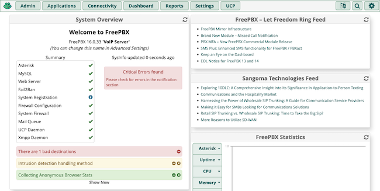

FreePBX provides an open-source solution for managing calls and phone networking within your organization. Built on the powerful Asterisk VoIP server, FreePBX uses a convenient web-based graphical interface to manage virtually everything your phone system needs.

The main deployment path for FreePBX uses a ready-made Linux distribution. That saves you the hassle of manually setting up and coordinating the necessary web and VoIP servers.

In this tutorial, find out more about FreePBX and see how you can deploy your own FreePBX distribution to Akamai Cloud.

## What Is FreePBX?

The [FreePBX](https://www.freepbx.org/) Linux distribution bundles together a full phone system solution, with VoIP server and a graphical interface to manage it conveniently. Once you have prepared the image, you can deploy it right to Akamai Cloud, where you can begin managing your full phone system.

But you may be wondering: What is a PBX, and what sets FreePBX apart from other PBX systems? Find out here, with a breakdown of what PBX systems offer and why FreePBX stands out among its peers.

### What Is a PBX?

A Private Branch Exchange, or PBX, provides a private telephone network. Usually such a network provides internal phone communications within an organization. They are especially useful for dispersed teams or organizations spread over multiple locations.

PBX systems like FreePBX operate on an Internet rather than an analog network. Typically, such PBX systems use a VoIP (voice-over-Internet-protocol) server for phone communications. The VoIP server connects the internal phone network and manages outgoing and incoming calls beyond the private network.

With a VoIP PBX (also known as an IP PBX), a private telephone network can be made much more adaptable. Adding, removing, and modifying internal lines can be done without difficult and costly hardware changes, and often without any additional fees.

### Introducing FreePBX

FreePBX is a custom Linux distribution running an IP PBX and a web interface. The FreePBX system offers the robustness of the open-source Asterisk VoIP server, an accessible interface, and an engaged and supportive open-source community.

As such, FreePBX actually offers more than just an IP PBX solution. To break it down, a FreePBX system includes:

-   A custom Linux distribution (based on CentOS)

-   An Asterisk VoIP server

-   The FreePBX web interface

[Asterisk](https://www.asterisk.org/) is itself an open-source IP PBX server, notable for its community support and additional call features. You can learn more about Asterisk in our guide [How to Install Asterisk on CentOS 7](/docs/guides/install-asterisk-on-centos-7/).

The FreePBX distribution runs an Asterisk server out of the box. And alongside the Asterisk server, FreePBX runs a web server hosting its own custom PBX interface. That web-based interface makes it easier to access and manage your PBX setup.

With FreePBX, everything from managing lines and advanced features like callbacks to system networking and firewalls can be handled within the web-based interface.

Having the web and VoIP servers bundled together in a custom Linux distribution eliminates the need to fiddle with much of the set up. You can more quickly get focused on what is important — implementing the best phone system for your organization's needs.

## How to Install FreePBX on a Compute Instance

Running FreePBX on Akamai Cloud provides a convenient setup. Doing so gives your organization the benefits of a full VoIP phone network alongside the benefits of cloud hosting. The server remains entirely in your control while the underlying infrastructure can be managed by Akamai.

Many Linux distributions can be deployed directly to Akamai Cloud using the image upload feature, but that is not the case with the FreePBX distribution. Instead, FreePBX requires deployment of a custom image using a local virtual machine.

The process for doing that is fully detailed in our guide [Deploying a Custom Image to Akamai Cloud](/docs/guides/deploying-custom-images/). While that guide does not specifically address FreePBX, the same steps apply, so you should be able to follow along without trouble.

To make the process of getting started easier and to help you see how FreePBX fits in, you can follow the overview below. The steps here correspond to steps given in detail in the guide linked above, so refer back to that for precise implementation.

1.  Download the FreePBX image from the [official website](https://www.freepbx.org/downloads/), and set up FreePBX as a virtual machine on your local system.

    You need to run through the full operating system installation process using the virtual machine. Once you start up the virtual machine, follow along with the prompts to create a root user and basic configuration for your FreePBX instance.

    [](vm-freepbx-install.png)

1.  Create an Akamai Compute Instance, replace the default main disk with an empty disk, and use the custom configuration profile detailed in the custom image deployment guide linked above.

1.  Boot the Compute Instance into rescue mode. There, create a temporary password and temporarily start up the SSH service.

1.  Download the Finnix distribution locally, mount its image to the virtual machine, and boot the virtual machine into a live Finnix system.

1.  In the local virtual machine's Finnix shell, run the command provided in the custom image deployment guide to begin transferring the FreePBX virtual machine to the Compute Instance's empty disk.

After following the details of those steps as given in the guide linked above, your Compute Instance should be running the FreePBX distribution.

To verify that, open the Akamai Cloud Manager, navigate to the page for the Compute Instance, and select **Launch LISH Console**. Select the **Glish** tab, and you should see output for the FreePBX system.


But this is not how you access FreePBX normally. Everything can, instead, be handled from FreePBX's own web interface. Follow along in the next section for everything you need to know to access and use that interface.

## Getting Started with FreePBX

With a FreePBX distribution up and running, you are ready to start setting up your PBX and VoIP server. FreePBX comes with a wide range of configuration options and modules for your PBX system. All of these allow you to fine-tune the phone network to your particular needs.

The upcoming sections show you how to complete your FreePBX instance's initial set up and start navigating the FreePBX interface. From there, you can follow suggestions for getting started building your phone system.

### Accessing FreePBX

To access your FreePBX instance's web interface, you just navigate to the instance's public IP address in your web browser. So, for instance, if your instance's IP address is `192.0.2.0`, you would navigate to `https://192.0.2.0`.

You may receive a warning about self-signed certificates. Bypass that, and you are in. Further below, in the [Navigating FreePBX](/docs/guides/installing-freepbx-distro/#adding-a-lets-encrypt-certificate), you can see where to go to adjust your instance's certificates.

### Initial Setup for FreePBX

FreePBX needs a few more settings in place to get running properly. So, when you first access the FreePBX interface, you are taken through a setup wizard to make some necessary and helpful configurations.

These steps walk you through the interface to get these settings entered and start using FreePBX's administrator tools.

1.  When first visiting the instance, a main menu appears, giving you options for administration, user control, and an operator panel. Select **FreePBX Administration**.

    

1.  A form has you create an administrator user for the FreePBX interface. Complete the form, and keep track of the credentials you give this user. This user is your primary way of interacting with the FreePBX administrator options.

    

1.  A prompt gives you the option of activating your instance. While optional, completing activation is recommended. Several features within the FreePBX interface are disabled until you activate the instance.

    

1.  A series of prompts suggest additional features for your FreePBX instance. The features range from firewall configurations to modules like SIP. Complete these as meets your needs.

    
    The automatic firewall set up may interfere with your ability to connect to the FreePBX interface. If so, try restarting the Compute Instance or accessing the Glish console and executing the command below to turn off the firewall temporarily.

    ```command
    fwconsole firewall stop
    ```

    Continuing the set-up steps in the interface should turn the firewall back on automatically. Otherwise, you can use another command like above, but `start` instead of `stop`.
    

### Navigating FreePBX

Completing the initial setup above takes you to the administrator dashboard. From here you can manage your FreePBX instance's configuration and modules. That includes everything from firewall and server networking features to SSL certificate management to modules like caller ID.

[](freepbx-dashboard.png)

This is where you start building the phone network that meets your particular needs.

The features available within FreePBX are too numerous to cover completely here. For a more comprehensive coverage, look to the FreePBX Wiki linked at the end of this tutorial.

In addition to that, you should also refer to FreePBX's guide on [Configuring Your PBX](https://wiki.freepbx.org/display/FPG/Configuring+Your+PBX). Their guide covers a wide range of settings and features useful for starting out with your PBX solution.

To supplement that resource, here are a few key places to get started when looking around the FreePBX interface. Being familiar with these can make it easier to follow FreePBX's recommendations for configuring your instance.

-   **Asterisk SIP Settings**. Found in the **Settings** menu, this option gives you control over configurations used for SIP calls, the primary method for VoIP calls. As such, you should start here to get your calls operating as desired.

-   **System Admin**. This module, located in the **Admin** menu, controls a range of features. Go here to set up everything from an email to your instance's time zone to IP address and DNS settings.

-  **Applications**. A menu rather than an option in itself, but, once everything else is ready, this is where you can find an array of call-related features. Setting up extensions, callbacks, call parking, and much more are all handled here.

#### Adding a Let's Encrypt Certificate

If using a full domain name for your FreePBX instance, you can use the FreePBX interface to add SSL certificates signed by Let's Encrypt. To do that, follow these steps within the FreePBX interface.

1.  From the **Admin** menu, select the **Certificate Management** option.

1.  Select **New Certificate**, and beneath that select the **Generate Let's Encrypt Certificate** option.

1.  Complete the form. For the **Certificate Host Name**, give the domain for your instance — `pbx.example.com` for instance. Let's Encrypt uses the email address you provide to update you reminders for certificate renewals.

1.  After a successful provisioning on the certificate, you can return to the **Certificate Management** page to set the new certificate as default and remove the self-signed certificate.

## Conclusion

This covers deploying, configuring, and starting to run your FreePBX system. FreePBX offers the balance of an incredible range of features with an accessible, manageable interface. From here you should be able to put together everything you need for your organization's phone system.

To help with that, take a look at the FreePBX links below. All of the "getting started" groundwork has been covered in this tutorial. For all your particular needs beyond that, the thorough and community-engaged Wiki documentation provides a wealth of information and guidance.
