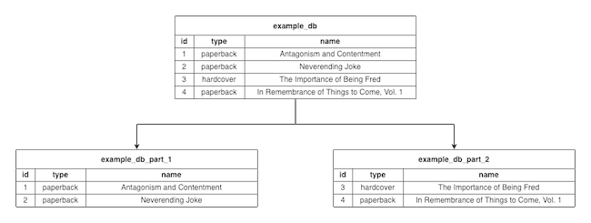
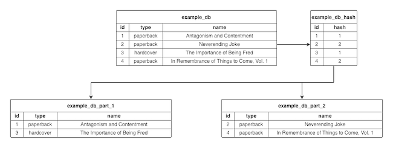
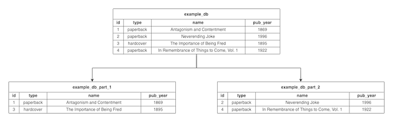
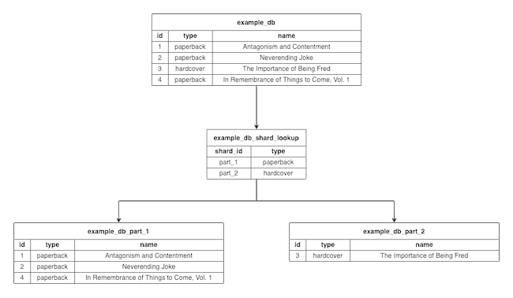

With growth comes new challenges, and the need to choose an infrastructure to meet those challenges. Part of doing that is finding the right database architecture to support growing application size and traffic.

Database sharding is an architecture designed to help applications meet scaling needs through horizontal expansion. It affords the ability to accommodate additional storage needs and more efficiently handle requests.

This tutorial explains what database sharding is and walks through its pros and cons. The guide provides examples of sharding approaches to consider, as well as alternatives.

## What Is Database Sharding?

Database sharding allows you to distribute a single data set across multiple databases. It is a *horizontal partitioning* database architecture, where databases share a schema, but each holds different rows of data. Think less of sharding as a particular kind of partitioning, contrasted to vertical partitioning.

This allows additional server nodes to share in the request load. This distribution of the load simultaneously increases storage capabilities as well as the number of requests that servers can handle.

The diagram below shows what sharding can generally look like:

Here, the initial database (`example_db`) gets partitioned into two databases (`example_db_part_1` and `example_db_part_2`). Each partition, or "shard", gets some rows from the initial database.

## Pros and Cons of Database Sharding

Database sharding can accommodate application growth, which expands storage potential and makes requests more efficient. However, it is not right for all situations and can have drawbacks.

The next two sections cover reasons to consider sharding for your application, along with reasons to look for alternatives.

### Reasons to Shard

Sharding fits into horizontal scaling models, also called *scaling out* models. These models increase the number of nodes in order to increase the servers' abilities to handle increasing traffic and storage needs.

Consistent with these horizontal scaling models, database sharding offers performance benefits for growing applications, such as:

-   **Increased Storage Capabilities**: Single machines have practical storage limits, but horizontal scaling through sharding helps avoid these limits by increasing the number of machines.

-   **Improved Response Time**: Sharded databases often read and write on smaller database instances, which can reduce the time needed to locate data and provide responses.

-   **Reinforced Reliability**: Because data in sharded databases are distributed, data services are not wiped out as easily. Outages affecting single shards do not automatically take down the entire database.

### Reasons not to Shard

Database sharding fits particular needs, scaling out to improve storage capabilities and performance. However, it is not a proper solution for all databases. Sharding comes with its own drawbacks that must be considered.

Keep these potential reasons not to shard your database in mind when weighing the benefits of sharding:

-   **Added Complexity**: By nature, sharding expands the number of nodes needed to support a database server. With the increase in nodes comes an increase in administration and maintenance efforts. Not only that, but the cost of the additional infrastructure itself has to be considered.

-   **Increased Load Per Request**: A sharded database needs to be managed by a router, which directs requests to the appropriate shards. That alone adds some overhead to requests. Any requests that require collation of data from multiple shards increase that burden, with routers having to query each implicated shard to fulfill these requests.

## Approaches to Database Sharding

Several options are available for structuring database shards. These determine where and how to divide data between the shards. Dividing data consistently is necessary to make a sharded database effective.

These are three of the most commonly used sharding architectures:

-   **Key-Based Sharding**: Also known as *hash-based sharding*. This method takes one column, runs its values through a hash function, and sorts data into shards based on the results. The column used for hashing can be called the hash key, and its values can be used like primary keys for shards.

    This diagram shows a database where the `id` column gets hashed, represented by the `example_db_hash` table. The database then gets sharded based on the hash values:

    

    In actuality, the hashes are not stored in their own table. They are derived from a function used to add data to shards. The function is simply displayed as a table here to help visualize the example.

-   **Range-Based Sharding**: This method divides shards based on value ranges in a specific column. For instance, a database sharded on a `date` column might place all data where `date < 2010-01-01` in one shard and all data where `date >= 2010-01-01` in another shard.

    Adding a `pub_year` column to the example used above works well for this. Here, the database gets sharded with `pub_year < 1900` in one shard and `pub_year >= 1900` in the other:

    

-   **Directory-based sharding**: This approach employs a sharding lookup table to relate data to particular shards based on categories. Categories can be tracked in a particular column, and the sharding process can relate different possible values for that column to particular shards.

    In this example, the directory sharding is based on the `type` column, which has two possible values, `paperback` and `hardcover`. The lookup table is used to assign entries with these types to the appropriate shards:

    

## Alternatives to Database Sharding

Taking into account both the pros and cons of sharding, you may decide that it's not the best option for your application. Perhaps you want to know what some alternative solutions are.

To help, here are a few options to consider against database sharding. Each provides varying features that can accommodate different scaling needs:

-   **Making Use Of Vertical Scaling**: Sharding and other horizontal scaling solutions are best when vertically expanding your infrastructure is not feasible. Therefore, it's a good idea to first look into vertical scaling. This includes things like directly expanding the storage capacity of your database server.

-  **Employing Specialized Services**: For example, if your database currently stores binary file data, move the storage of that data to a cloud-storage provider. These kinds of measures ensure that you use the most efficient services for storing each kind of data.

-   **Implementing Database Replication**: This option works for databases that expect plenty of read requests but not so many write requests. Replication creates copies of a database for read requests, and performance can be enhanced through things like load balancing.

## Conclusion

You should now have an understanding of the concept of database sharding, and why it may or may not be right for your application. With examples of different sharding methods, along with some alternatives, you're now prepared to decide on the best solution for your application's needs.