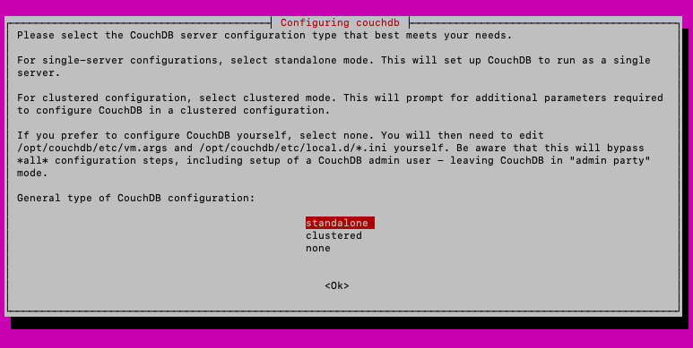
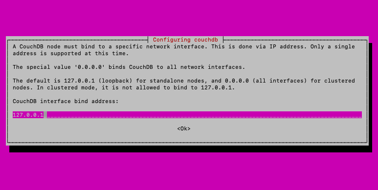
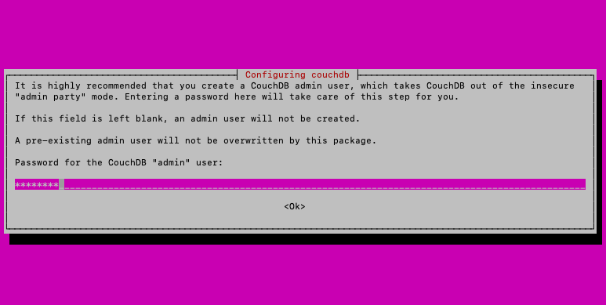

*CouchDB* is a non-relational, or "NoSQL" database designed with scalability and a more trouble-free experience in mind. CouchDB is programmed in Erlang, which boasts a highly scalable concurrency model and fault tolerance. CouchDB capitalizes on both of these features to ensure production databases run with fewer interruptions, regardless of changes in request volumes and inevitable performance potholes.

CouchDB uses HTTP APIs and JSON documents which are intended to be more intuitive and to integrate more simply into web and mobile applications. Its use of JSON documents makes it highly flexible and able to accommodate a wide variety of needs.

This guide shows you how to install CouchDB on Ubuntu 20.04. At the end of this guide, there is a link to a subsequent guide for getting started using CouchDB and understanding its concepts.

## Before You Begin

1.  If you have not already done so, create a Linode account and Compute Instance. See our [Getting Started with Linode](/docs/products/platform/get-started/) and [Creating a Compute Instance](/docs/products/compute/compute-instances/guides/create/) guides.

1.  Follow our [Setting Up and Securing a Compute Instance](/docs/products/compute/compute-instances/guides/set-up-and-secure/) guide to update your system. You may also wish to set the timezone, configure your hostname, create a limited user account, and harden SSH access.


This guide is written for a non-root user. Commands that require elevated privileges are prefixed with `sudo`. If you are not familiar with the `sudo` command, see the [Linux Users and Groups](/docs/guides/linux-users-and-groups/) guide.


## Set Up the Apache CouchDB Repository

1. Install the prerequisites for using the Apache CouchDB repository using the following commands:

        sudo apt update && sudo apt install -y curl apt-transport-https gnupg

        curl https://couchdb.apache.org/repo/keys.asc | gpg --dearmor | sudo tee /usr/share/keyrings/couchdb-archive-keyring.gpg >/dev/null 2>&1

        source /etc/os-release

1. Add the CouchDB repository to the `apt` repository list.

        echo "deb [signed-by=/usr/share/keyrings/couchdb-archive-keyring.gpg] https://apache.jfrog.io/artifactory/couchdb-deb/ ${VERSION_CODENAME} main" | sudo tee /etc/apt/sources.list.d/couchdb.list >/dev/null

1. Install the CouchDB repository key.

        sudo apt-key adv --keyserver keyserver.ubuntu.com --recv-keys 8756C4F765C9AC3CB6B85D62379CE192D401AB61

## Install CouchDB


The steps below are for installing a standalone CouchDB server. If you intend to use CouchDB in a cluster, choose **clustered** instead of **standalone** and enter `0.0.0.0` as the interface bind-address in the steps that follow.

See CouchDB's [Cluster Set Up](https://docs.couchdb.org/en/latest/setup/cluster.html) guide for the additional steps needed to set up a CouchDB cluster once you have completed the installation.


1. Update the package manager.

        sudo apt update

1. Install CouchDB.

        sudo apt install -y couchdb

    - Choose **standalone** when prompted for a configuration type.

        

    - Enter the default value — `127.0.0.1` — for the interface bind address.

        

    - Since *CouchDB 3.0.0*, CouchDB does not run without an administrator user being configured. When prompted, create an administrator user by entering a password. Re-enter the password on the subsequent screen.

        

1. You can verify that CouchDB is installed by running the following command.
   - Replace `admin` and `password` with the username and password, respectively, for a valid CouchDB user.
   - To use the administrator user you created during the installation process, enter the username, which is `admin` by default, and the password you set up.

         curl admin:password@127.0.0.1:5984

## Get Started with CouchDB

You have now successfully installed CouchDB! To get started, head over to the guide for [Using CouchDB on Ubuntu 20.04](/docs/guides/use-couchdb-2-0-on-ubuntu-20-04/).
